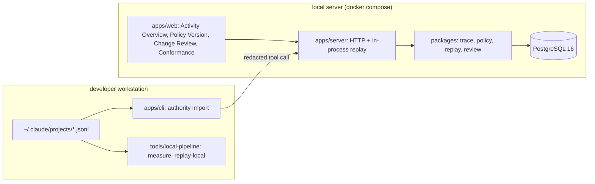
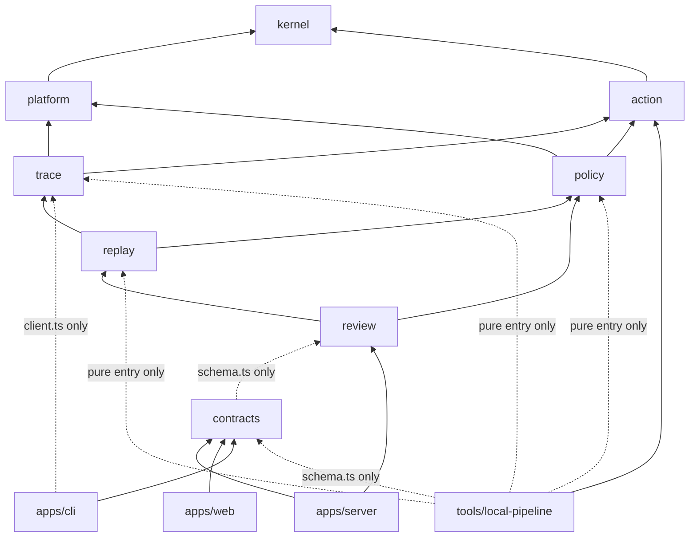
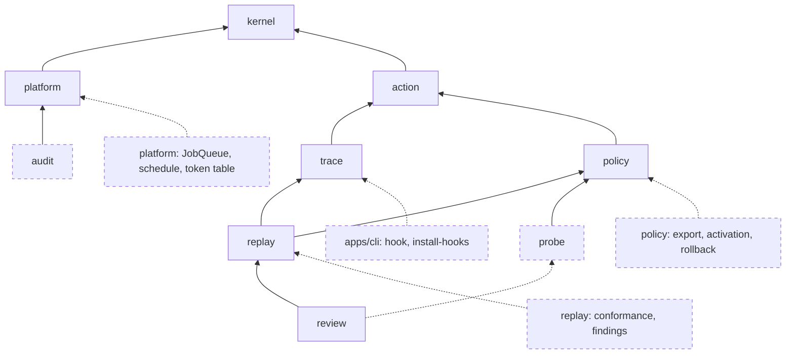

Sprint working document; internal labels in this file are kept as-is.

# Authority Diff revision memo: V1 cutline and implementation prep

- Target: `docs/design.md` (Authority Diff design, 2026-09-21).
  Below, "the design".
- Status: the design remains Target Architecture.
  This memo sets the scope, order, and contracts of the first 7-day implementation (V1), and when the two differ, V1 follows this memo.
- Readers: the person who integrates and judges, and the person or tool that implements one module at a time.
- Purpose: define the first implementation scope and contracts.
- Repo location: `docs/cutline.md`.

## 1. Final judgement

The Authority Diff direction stands.
What changes is the 7-day scope.

The 12 Must-ship items in design 10.3 contained 4 different verification loops.
Whether shell classification is usable on real records, whether a person can review a replay diff, whether a provider's judgement distribution can be trusted, whether runtime observation matches the spec.
What implementation tools shorten is time spent writing code; time spent looking at real records, fixing classification errors, and re-bundling the diff does not shrink.
The loops that can be run to the end in 7 days are the first two.

V1 proves only this one line.

> If this Authority Policy change is applied, which actions in recent real Agent work records receive a different effect.

V1 completes with 0 model calls.
Whether to continue is judged at the core-journey verification point with this question.

> Can one realistic policy change show how effects on real past actions would differ, at a reviewable size, and can an engineering lead understand that meaning without knowing shell parsing or Claude Code internals. Finding an action that widened beyond intent in the real record is a bonus; if none, that fact is reported as-is.

While shrinking scope, two defects in the design and one wording issue are fixed together.

| no | where | what |
| --- | --- | --- |
| R1 | Design 16.1 Diff Group signature and severity | It held only one Zone. On a change that edits the Environment Profile, the same action's Zone differs between baseline and candidate. In the demo's core scene (`trustedRemotes = github.com/**`) the candidate Zone becomes `trusted_remote` and severity drops to `normal`. Put `fromZone` and `toZone` on the signature, and judge severity from the baseline Zone and Reversibility |
| R2 | Design 13.3 Zone judgement order | It checked `trusted_remote` before `public_remote`. A place the organization declared public must be `public_remote` even when a wide trusted pattern also matches. Check `public_remote` first |
| R3 | Wording of replay results in general | Do not write "newly auto-allowed" or "runs automatically". Replay speaks only as far as "under this Authority Policy, this past action's effect differs". How Claude Code will actually behave can be said only after conformance is measured, and conformance is not in V1 |

## 2. Design to keep

Product:

- The decision to drop the control plane and runtime gateway and narrow to a review tool (design chapters 1, 7, 8, ADR-0001).
- Product boundary (design chapter 9): no blocking, no real-time judgement, no replacing Auto Mode and sandbox, no general security platform, no general observability, no cross-runtime compiler.
- What the product owns: normalized Actions, the permission spec, historical replay, authority diff, decision evidence, a person's review.
- Persona (design chapter 4): the operator is a Staff/Platform engineer; the decision-maker is the engineering lead.
- Writing falsification criteria in advance (design chapter 40).

architecture:

- modular monolith, package-unit ownership, entry-point boundary, enforced by dependency-cruiser (design chapters 19, 21).
- `AgentAction -> Operation`, `analyzability` as a 1st-class result, unrecognized input is not classified toward the safe side (ADR-0003).
- An intent-level spec is canonical; runtime matchers are not emulated (ADR-0002).
- Order-independent evaluation, `deny > ask > allow`, default Effect `ask` (ADR-0004).
- A Policy Version is immutable, identified by `contentHash`.
  Replay is reproduced with `inputsHash` and `resultHash` (ADR-0007).
- A meaning-judgement provider is offline only, real traces are not sent, provider abstraction (ADR-0005).
- Naming rules (design chapter 22), TypeScript rules (23), error shape (28), agent change rule (33.3).

## 4. Tier 1 / Tier 2 / Tier 3 scope table

Judgement: if the demo still answers "if we apply this policy, which permissions change" after dropping it, it is not Tier 1.

| feature | Tier | why |
| --- | --- | --- |
| Claude Code transcript parse and redaction (`trace/client.ts`) | 1 | The thesis cannot be tested without real records |
| classifier (tree-sitter, Operation, `analyzability`) | 1 | The product's largest risk. The object of classifier measurement |
| local pipeline tools (`measure`, `replay-local`). Run in memory with no DB and no server | 1 (new) | Run measurement and diff verification with no plumbing. Direct gain of a pure-function design |
| Policy document, immutable version, `contentHash`, validation, default template | 1 | Replay input |
| `evaluateAction`, Zone (R2 applied), Reversibility | 1 | Core |
| `version_diff` replay, `inputsHash`, `resultHash`, async execution inside the process | 1 | Core |
| Diff Group: signature (R1), severity, target summary, one plain-language sentence | 1 | The device that shrinks review load. The object of diff-review verification |
| Change Review: Verdict, gate, accept and reject | 1 | Required journey step 7 |
| Evidence report (Markdown) and immutable decision record (including hash) | 1 | Required journey step 8. The artifact an engineering lead reads |
| 3 screens: Activity Shape, Policy Version (JSON edit + read-only rule table), Change Review | 1 | The minimum the journey needs |
| PostgreSQL store, ingest API, `authority import`, reclassify command | 1 | The review record must remain. The classifier changes all this week |
| label corpus C1 100 entries, risk corpus C2 60 entries, laundering rate CI check | 1 (reduced) | Proves "unknown is not classified as safe" |
| invariant tests I1–I8, I12, I13. 1 E2E | 1 (reduced) | See chapter 15 |
| Collect whether a person rejected from transcript `tool_result` (`observedOutcome`) | 1 (collect only) | A value the parser already reads. Filling it later needs a reimport. Drop if transcript format is not confirmed |
| Display "an action a person had rejected becomes allow" | 2 | A strong signal but not the answer to the core question |
| Show the preceding Mandate sentence on a sample (`mandates` table) | 2 | Helps judgement. Redaction load of free-form sentences |
| rule-table form editor | 2 | The journey holds with JSON editing |
| Exploratory semantic probe (Jev, 30–50 Scenarios, rank display only, not tied to the gate) | 2 | See chapter 12 |
| Replay-performance measurement on 10× replicated data | 2 | Measurement of the design chapter 17 estimate |
| hook, `runtime_observations`, Disposition, conformance replay, finding, screen | 3 | Downstream of the core. Correct wording with R3 |
| audit hash chain, `EventSink`, domain event, verify command | 3 | Replaced by the immutable decision record |
| Claude Code settings export | 3 | Compiler direction. Unverified vendor semantics |
| Activation, rollback, `policy_activations`, `stale` | 3 | So accept is not read as deploy |
| All of calibration (golden set 200, Wilson threshold, ECE, Brier, provider state, weekly schedule), LLM baseline adapter | 3 | A model-evaluation task |
| Scenario and Precedent screens, `precedent_conflict` blocker | 3 | After probe has shown value |
| pg-boss, `JobQueue`, `api_tokens` and role, `idempotency_keys`, OpenAPI generation, Prometheus metric | 3 | No invariant they protect |
| Synthetic org S1, 3 workloads, RAR, fidelity | 3 | Synthetic figures without real use |
| Codex adapter, runtime port | 3 | One adapter is not a seam |

## 5. MVP user journey

The journey order is "import → grasp activity → first Policy (draft) → adoption preview → review·adopt → [outside Authority Diff] apply managed settings → change review → conformance".
The basis of first-adoption review is ADR-0010; measurement is `docs/evidence/adoption-preview.md`.

1. Run `authority import ~/.claude/projects`.
   The CLI parses the transcript, substitutes secret literals, and sends to the local server.
   The server classifies and stores.
2. On the Activity Overview screen (`/`) see imported Action count, Session count, Capability distribution, Target Kind distribution, `full` / `partial` / `none` share, and top programs, with no Policy.
   Effect and Zone are absent here because they need a policy to compute.
   There is no trend chart and no per-person stats.
3. With <!-- ko-product-output -->"첫 조직 정책 만들기" make draft version 1 from the default template, edit the JSON (Rules and Environment Profile), save, and validate.
   There is no accepted version yet.
   The organization has one Policy and creating a second Policy is rejected.
4. From the draft, press <!-- ko-product-output -->"최초 도입 검토 만들기".
   The server sees there is no accepted version and creates a Change Review of kind `adoption` and an `adoption` Replay Run with no baseline.
   At the top of the screen see evaluated Action count and allow / needs-confirmation / deny counts and shares (<!-- ko-product-output -->허용 / 확인 필요 / 차단).
   These figures apply the policy to past behavior and do not recover whether the past runtime approved.
5. See the needs-confirmation group table and the deny group table.
   Each group shows one plain-language sentence, program makeup (Program Summary), top targets, and counts.
   An Adoption Group is in `[effect, capability, zone]` units so it equals one judgement the Policy made, and there is no severity.
6. Record `expected` (intended restriction), `investigate` (hold), `unexpected` (policy needs a fix) per group.
   Every ask and deny group is in scope, and if any is not `expected` the adopt button stays locked.
7. When all are `expected`, press <!-- ko-product-output -->"최초 정책 채택".
   Version 1 becomes `accepted` and a Decision Record with a null baseline hash remains.
   The Evidence report includes the policy `contentHash`, the window, analysis scale, allow / needs-confirmation / deny counts and shares, the group tables and Verdicts, the Decision Record sequence and hash, and the fixed wording below.
8. [Outside Authority Diff] apply managed settings.
   `accepted` is a review record, not deploy or enforcement.
   Applying it to runtime settings happens outside Authority Diff, and Authority Diff does not store whether it was applied.
9. From accepted version 1 make draft version 2 and edit the JSON.
   Example: `push` + `trusted_remote` from `ask` to `allow`, add an organization-repository pattern to `trustedRemotes`.
10. Press <!-- ko-product-output -->"변경 검토 만들기".
    The server sees an accepted version exists and creates a Change Review of kind `change` and a `version_diff` Replay Run.
    The draft is frozen and both versions are applied to the same Action set.
11. At the top of the screen see a summary such as "47 changed Actions, 6 Widening groups, 1 critical".
    Each group shows one plain-language sentence, top targets, and counts.
12. Open a critical group.
    Confirm that, by the mistake `trustedRemotes = github.com/**`, a real past fetch to a repository outside the organization moved from `ask` to `allow`, with the repository name.
    The screen and the Evidence report show whether that scene's Actions are from the real record or a `synthetic` fixture.
    The result grade is not a product field; it is written in the evidence documents and the README.
13. Record `expected`, `investigate`, `unexpected` on every Widening group.
    If a Widening group remains unjudged or is `investigate` or `unexpected`, the accept button stays locked.
14. `unexpected` appeared, so reject, edit the draft, make a new review, and after all are `expected` press <!-- ko-product-output -->"정책 변경 수락".
15. Download the Evidence report.
    It includes both versions' `contentHash`, the window, analyzed Action count and `none` share, the transition table, the operation-level widening table for when Action Effect is unchanged, groups and Verdicts, reviewer and time, the Decision Record audit chain sequence and hash, the audit chain tail sequence and hash at report generation, and the fixed wording below.
    Separately the report includes Action·finding aggregates by permission mode from the most recently completed conformance run, with that run's id, Policy Version, window, and the Action total of modes that can run without a guard, and if there is no completed conformance run it writes that fact.
    This aggregate is the observed permission-mode distribution, not a judgement of whether the runtime follows the candidate; that judgement remains the `/conformance` screen's job.
16. When hook observations (`install-hooks`, `spool-flush`) accumulate, on the conformance screen (`/conformance`) see findings where Disposition disagrees with the accepted version's Effect.
    This screen alone speaks to how the runtime actually behaved.

> This record leaves the fact that the policy change was reviewed against the past records above.
> Authority Diff did not deploy or enforce the policy, and did not measure whether the runtime behaves according to this policy.

Terms are "Accept Policy Change" and "Reject Policy Change", and in first-adoption review "adopt first policy" and "reject first policy".
"Approve Review" reads as approving the review itself, and "Mark Reviewed" does not distinguish accept from reject.
Policy Version status is `draft -> in_review -> accepted | rejected`; withdrawal is `in_review -> draft`.
The first version also starts as `draft`, and `accepted` arises only from a review decision.
The Policy baseline is the most recent `accepted` version; if there is none, a first-adoption review is created instead of a Change Review.
Do not use `accepted` as active, applied, or enforced.

## 6. MVP architecture

Only what V1 implements is drawn.





Changes to foundation decisions versus the design:

| item | design | V1 | why |
| --- | --- | --- | --- |
| replay execution | pg-boss job | Async function in the same process. Status is `replay_runs.status`. On restart a run that has been `running` for more than 60 s is set to `failed` and requested again with the same `inputsHash` | 1.2 s on 1 ten-thousand 2 thousand Actions |
| pure entry points | `trace/client.ts` alone | `action/index.ts`, `trace/client.ts`, `policy/evaluate.ts`, `replay/diff.ts` | A local pipeline that runs the full computation with no DB is the tool for measurement and diff verification |
| Action identifier | `act_` ULID + `actionKey` | `actionKey` (sha256) is the primary key | The same identifier must appear on reimport and on both local/server so `resultHash` can be compared |
| auth | token table, 2 roles | 1 token in an environment variable. Reviewer name is entered at decision time | Single user |
| HTTP | `@hono/zod-openapi` | Hono + Zod schema validation from `contracts` | One fewer generated artifact |
| integration test DB | Testcontainers | A test-only database on docker compose PostgreSQL; global setup migrates once per run | One dependency removed |
| observation | metric endpoint, audit | structured log only | No invariant V1 protects |
| first Policy Version | the first version is immediately the comparison baseline (active version) | the first version is `draft`. If there is no accepted version, it becomes `accepted` through a first-adoption review of kind `adoption`. `accepted` is not a deploy or enforcement status | A transcript alone cannot tell whether the past runtime approved, so a baseline is not inferred (ADR-0010) |
| Policy count | several Policies in the organization | one organization Policy. A second create is rejected with `policy.organization_policy_exists`, and even if several exist one is not picked | Single user; remove the ambiguity automatic picking creates |

Contract changes (versus design chapters 24, 25):

- `AgentAction`: drop `id`, `mandateId`, `toolInputHash`. The identifier is `actionKey` (ADR-0008).
  `toolInputHash` was used only to join hook observations, so V1 does not use it.
- `Target.vcs_remote`: use `remoteKey` the classifier normalized to lowercase `host/owner/repo`
  instead of the original `remoteUrl`. An I/O-capable caller fills original `repoRemotes` URLs and the classifier normalizes in one place.
- `ResolveZone`: receive the whole Operation, not Target and Capability separately.
  Environment Profile patterns are a fixed glob grammar that must match the whole string, and only the production marker is a flag-less regex.
- `ParseTranscript`: the caller passes `sessionExternalId`, the stem of the transcript file name, together with the line list.
  A session id inside the line is not used.
- `Decision`: drop `policyVersionId`. The pure evaluation function receives the document only.
- `DiffGroup`: `groupKey` instead of `id`. `fromZone`, `toZone` instead of `zone`.
  Drop `principalCount`, `mandateDependentCount`, `decidingRuleId`.
- `ReplayRun`: drop the `DecisionSource` union. `kind` is a discriminated union of `version_diff`, `conformance`, `adoption` (ADR-0010); `adoption` has null `baselineVersionId` and stats `AdoptionStats` (totalActions, evaluatedActions, excludedActions, effectCounts, analyzability, cells).
  The store contract is owned by `replay/schema.ts`: `ReplayRun`, `StoredDiffGroup` (`DiffGroup` + `replayRunId`), `StoredChangedAction` (`replayRunId`, `actionKey`, `groupKey`, `fromEffect`, `toEffect`), `StoredAdoptionGroup`, `StoredAdoptionAssignment` (`replayRunId`, `actionKey`, `groupKey`, `effect`).
- `AdoptionGroup` (ADR-0010): signature `[effect, capability, zone]`, `groupKey` is that signature's sha256. `program` is always null and `programSummary` (top 10) and `distinctProgramCount` are evidence inside the group. No severity. `allow` Actions have no group. Sort is deny → ask → `actionCount` descending → `sessionCount` descending → `groupKey`.
  Headline template is <!-- ko-product-output -->`<zone>에서의 <capability> N건이 이 정책에서 '확인 필요' 대상이 됩니다.` / `… '차단' 대상이 됩니다.`
- `ActivityOverview` (`GET /activity-overview?windowDays`, trace module): `sessionCount`, `actionCount` (deduped), `evaluableActionCount`, `capabilityCounts` and `targetKindCounts` (Operation basis), `analyzability` (Action basis), `topPrograms`, `topRemoteKeys` (web shows host only). No Effect or Zone.
- `PolicyVersionStatus`: `draft`, `in_review`, `accepted`, `rejected`. `createPolicy` makes version 1 as `draft` and `getBaseline` is `policy.no_accepted_version` when there is no accepted. `POST /policies` returns `201 CreatePolicyResponse { policy, initialVersion }`.
- `PolicyRule.mandateException`: removed from schemaVersion 1.
  A V1 document holds only concepts V1 evaluates.
  When a natural-language Mandate condition is needed, add it with an explicit schemaVersion 2 migration.
- Drop `OperationDecision.isMandateDependent`, `Decision.isMandateDependent` (design 24.4).
  `decidingRule` selection uses ruleId lexicographic order only (the design 13.5 clause "prefer a rule with no Mandate Exception" is removed).
- `ChangeReview.status`: `computing`, `ready`, `accepted`, `rejected`, `failed`, `withdrawn`.
  `withdrawn` is the state after a person withdrew a `computing` or `ready` review (`POST /change-reviews/{id}/withdrawals`); the candidate becomes `draft` in the same transaction via the withdrawal transition.
  Drop probe and stale related fields.
- `ChangeReview.kind`: `change` | `adoption`. The request does not receive kind; the server sets it from whether an accepted version exists. `baselineVersionId` is null only for `adoption` (migration 0009 CHECK). 1 open review per Policy regardless of kind.
- New `review_decisions` (insert and select only; a trigger blocks UPDATE, DELETE, TRUNCATE): `changeReviewId`, `decision`, `note`, `reviewerName`, `decidedAt`, `baselineContentHash` (null when kind is `adoption`), `candidateContentHash`, `replayInputsHash`, `replayResultHash`, `classifierVersion`, `verdictSnapshot`, plus audit hash chain columns `sequence`, `prevHash`, `hash` (contract is `docs/acr/0006-review-decision-hash-chain.md`).
- Gate blockers: the five `replay_incomplete`, `replay_failed`, `widening_unreviewed`, `widening_investigate`, `widening_unexpected`. First-adoption review (kind `adoption`, ADR-0010) closes with `adoption_unreviewed`, `adoption_investigate`, `adoption_unexpected` instead of `widening_*`.
- `kernel` ports: only `Clock`, `IdGenerator`, `Logger`, `TransactionRunner` remain.

R1 severity rule:

```text
critical = widening and one of
  - fromZone is one of credentials, agent_config, protected, public_remote, unknown_remote
  - reversibility on the baseline is irreversible
  - analyzability of the deciding Operation is none
headline example:
  <!-- ko-product-output -->"github.com/acme-oss/toolkit 등 2곳으로의 push 15건이 '확인 필요'에서 '허용'으로 바뀝니다.
   기준 정책에서는 신뢰하지 않는 원격이었고 변경안에서는 신뢰하는 원격으로 분류됩니다."
```

`headline` is made from a fixed template on (Capability, Zone change, Effect change, target summary).
No model is used.

The two contracts can be adjusted before the diff-review verdict. They are the per-Target-kind `targetSummary.key` generation rule and
whether to put `program` on the Diff Group signature. Those two do not need an ACR for a pre-verdict change, but
the PR body must record group counts before and after and the reason. After the verdict passes they are ACR subjects like other `schema.ts` contracts.
The Adoption Group signature was confirmed not to include `program` (ADR-0010, `docs/evidence/adoption-preview.md`).
The Diff Group signature still includes `program`; the condition for unifying the two groupings is in ADR-0010's reversal trigger.

## 7. Target architecture

Dashed lines are the parts V1 does not build.



| deferred feature | later attachment point | change core needs |
| --- | --- | --- |
| conformance | `runtime_observations` on `trace`, Decision Source `observed_runtime` on `replay` | add a `kind` column on `replay_runs` (default `version_diff`). The diff function takes only Effect pairs, so it stays |
| semantic probe | new package `probe`, `policy/prose.ts` entry, add a blocker on the `review` gate | PolicyDocument schemaVersion 2 migration (add `mandateException`, restore `Decision.isMandateDependent`) |
| audit chain | new package `audit`, `EventSink` port on `kernel` | one use case is one transaction, so there is one place per use case to put the record call |
| activation, rollback | `policy_activations` on `policy`, add a status value | append a status after `accepted`. Existing transitions stay |
| settings export | `policy/export-claude-code.ts` entry | none |
| job queue | `JobQueue` on `platform`, wrap the replay-run function as a handler | keep the `runReplay(runId)` signature |
| multi-person org | `principal_id` column already exists | add a count to group aggregation |
| Codex adapter | add a parser on `trace/client.ts` | introduce a port when adapters become 2 |

Do not create empty packages for deferred modules.
ADRs and this table reserve the seats.

## 8. Module changes

| module | V1 | change versus the design | invariant kept apart |
| --- | --- | --- | --- |
| `kernel` | implement | drop `EventSink`, `JobQueue` ports | shared types do not refer to a business package |
| `platform` | implement (reduced) | config, db, logger, clock, id only. no pg-boss, http client, token table, idempotency key | `process.env` and the DB driver are touched in one place |
| `contracts` | implement (reduced) | ingest, policy, replay, review endpoints only | the three clients server, web, CLI share the same contract at compile time |
| `action` | implement (all) | none | the classifier is a pure function. Verifiable with corpus and property tests |
| `trace` | implement (reduced) | no observation, hook, `mandates`. add reclassify | a string before redaction does not leave the workstation |
| `policy` | implement (reduced) | no activation, rollback, export, prose. add pure entry `evaluate.ts` | a document that is not `draft` is immutable |
| `replay` | implement (reduced) | `version_diff` only. add pure entry `diff.ts`. apply R1. a no-baseline `adoption` run kind was added by ADR-0010 | a replay result is written once and not changed. It does not know a person's verdict |
| `review` | implement (reduced) | no probe blocker, no stale. add report generation and `review_decisions` | changing state (Verdict, decision) is not mixed with the replay result |
| `probe` | minimum implement when Tier 2 is reached. otherwise do not build | no calibration, provider state, LLM baseline | n/a |
| `audit` | do not build | replaced by `review_decisions` | n/a |
| `tools/local-pipeline` | implement (new) | extend the design's `tests/eval/corpus-shape.eval.ts` | the no-DB path and the server path emit the same `resultHash` |

Merging `review` into `replay` was considered and is not done.
Replay tables are written once and not changed; review tables change until the decision.
Mixing them would make I6 (same input, same result) impossible to state at package grain.

## 11. Measurement criteria

### classifier measurement criteria

Values `measure` must print:

```text
sessions, actions, tool distribution, Bash share
analyzability full / partial / none: all Actions, Bash only, Operations
  (an Action's analyzability = the worst value among its Operations)
top 30 programs, compound-command share (2 or more Operations), inline-program share
parse_error share, share of transcript lines that could not be parsed
redaction counts (by kind), tool_result count that looks like a person's rejection
classify throughput (Actions/s), top 20 none signals
```

| condition | judgement |
| --- | --- |
| fewer than 2,000 Actions or fewer than 500 Bash Actions | Hold. Gather more workstations and past records. If it cannot be tested on real records, V1's claim does not hold |
| 5% or more lines that could not be parsed | Not a thesis problem. Fix the parser and measure again the same day |
| `none` (all Actions) 25% or under, and the sample check below passes | GO |
| `none` over 25% and 40% or under | Conditional GO. After 1 classifier hardening (4 hours, only the top 5 `none` signals) measure again together with the diff review |
| `none` over 40% | Harden up to 2 times. If it still exceeds 40%, NO-GO. The alternative is to narrow replay to non-Bash tools and recognized `git`, network, package programs and shrink the product claim to "git and network permission diff", or stop |
| sample check: a person confirms 50 Bash classified `full`. 45 or more accurate | Pass |
| in the same sample, a case that classified write, send, push, delete, or execute as read only | If even 1 appears, fix, add to C2, then continue. If 3 or more, NO-GO until fixed |

Reference expectation: public measurement had 25.9% of Bash inputs containing a program in another language, so looking at Bash only, `none` is likely around 26%.
25% and 40% are values that fix in advance the judgement "if most of the diff is filled with unknown, it is not evidence".
Do not change the criteria after measurement.

### diff-review criteria

Inputs:

- Policy A: default template + Environment Profile of this environment.
- Policy B: a change that turns the `ask` combination with the most Actions among `push`, `install`, `fetch`, `send` in `measure` into `allow`.
- Policy B′: B with `trustedRemotes` written widely, such as `github.com/**`.
- Expected list: `replay-predictions.md` written before replay.

| measurement | pass criterion |
| --- | --- |
| Actions whose Effect changed in B | 10 or more. If under, try one more realistic change. If both times under 10, the past record does not touch a permission boundary, so revisit the thesis |
| Widening group count | 25 or under |
| compression | the top 10 groups cover 80% or more of changed Actions |
| review time | reading only `headline`, target summary, and 3 or fewer samples per group, judge every Widening group inside 10 minutes |
| understandability | for each group, "what, to where, how it changes" can be said without raw commands. Fail if 3 or more groups cannot be said |
| determinism | `resultHash` of two runs is the same |

Bonus observation (not a pass criterion): record whether in B′ a real past Action that went to a repository or host outside the organization appears as critical Widening, and whether B has a group not on the expected list.
If there is no push record, look at `fetch`, `install` records such as `git clone`, `pnpm add github:...` with the same B′.
If it does not appear, write "no unexpected widening in the real record" as-is in `replay-diff.md`.
Do not manipulate the policy to obtain this observation.

On failure, redesign the signature once (half a day).
The adjustment targets are dropping `program` from the signature and putting an organization unit of the target, two things.
If it still fails after that, do not start server and durable-store implementation; fix or fold the thesis.

### core-journey verification criteria

1. A scene (Widening group) where Effect of a real past Action, not synthetic, differs because of a policy change appears on screen. Whether it is wider than intent is judged by a person as Verdict, and the screen and report state whether unexpected widening existed in the real record.
2. The first screen of the report has no raw command, unlabeled `ruleId`, or regex.
   Terms such as `analyzability` have a plain-language explanation attached.
3. Reading only the `headline` of a critical Widening group (or a fixture group labeled `synthetic` if the real record has none) shows what (plain-language Capability), to where (repository and host names), how (Effect change), and why (Zone reclassification or Rule change) it changes.
4. If possible, show the first screen to 1 person who does not know shell for 2 minutes and have them say "what changes and why it is a problem".
5. Complete the journey with no `curl` and no DB manipulation.

Result grade (not a pass criterion):

| grade | condition |
| --- | --- |
| strong | unexpected Widening not on the expected list was found in the real record |
| medium | Widening in the real record could be reviewed but all was in the expected range |
| weak | the critical Widening scene is demonstrated only with a synthetic fixture |

Evidence documents and the README write only the matching grade above, and do not use wording stronger than the grade.
Do not assert a grade before measurement; write only this table.

On failure, do not add features.
Spend one day only on `headline`, group bundling, and report edits, and if it still fails, fix or fold the thesis.

## 12. Jev cutline

### Minimum implementation worth adding

- `packages/probe`: `DecisionProvider` port (design 14.3), `decision-provider.jev.ts`, `decision-provider.fixture.ts`.
  2 adapters, so the seam holds.
- `policy/prose.ts`: a pure function that turns a policy document into prose.
- Scenarios are one file, `tests/corpus/scenarios.json`.
  A person writes 30–50 and attaches `expectedEffect` and `targetRuleId`.
  No table, CRUD, or screen.
- CLI `authority probe --policy-version <id>`: run every Scenario and make `docs/evidence/probe-<contentHash>.md`.
  A table in margin ascending order, items that differ from expected Effect marked, and the bottom 5 carry the Rule sentence, Scenario sentence, `allow` / `ask` / `deny` distribution, and `mandate_reading` distribution together.
  The artifact is a human-readable explanation such as "read as allow 0.41, ask 0.59 depending on the reader".
- The Evidence report attaches a "note: policy-sentence reading check" section only when a probe result for the same `contentHash` exists.
  It is not a gate blocker.
- No threshold, calibration, provider state, LLM baseline, or schedule.
  Show rank only; do not set a cut criterion.
- The first line of the artifact writes "exploratory semantic-policy evaluation, n=<N>. This sample size cannot claim 95% agreement (Wilson lower bound 0.887 even at 30/30)".
- test: an adapter contract test that runs recorded responses, and a test that the probe input type has no trace type.

### Conditions for dropping it entirely from V1

Drop it if any of the following holds.
Do not replace it with an LLM baseline.

1. Core-journey verification does not pass.
2. Reliability criteria (laundering rate 0, E2E pass) are not met.
3. No Jev API access at the Tier 2 review point.
4. The demo policy has no natural-language clause to test (V1 document natural language is rationale only, and that sentence reads one way).

Even if dropped, narrative 7 still holds.
It becomes "meaning-judgement AI was limited to an offline probe and the core completed without a model, so it was dropped from V1".

### Evidence that would later justify expansion

- 3 or more cases where the author actually edited a policy sentence because of low margin or mismatch with expectation in an exploratory run, and after a full re-run the distribution of that item moved as intended and neighboring items did not worsen.
- After schemaVersion 2, 2 or more Mandate Exceptions are used in a real policy.
- On 1 or more Scenarios the probe displayed, a second person's reading actually differed from the author's.

When these three are confirmed, implement design chapters 14–15 (DB-based Scenario and Precedent, golden set of 200, Wilson threshold, provider state).

## 13. Removed implementation work

Code V1 does not write.
If an agent starts making code on this list, stop it.

- [ ] `hook`, `install-hooks`, spool in `apps/cli`.
- [ ] `runtime_observations` table, `POST /runtime-observations`, Disposition derivation.
- [ ] conformance replay, `conformance_findings`, `/conformance` screen. Reduced conformance (`observed_runtime` Decision Source, Disposition derivation, 3 finding kinds, list-only screen) was implemented in ACR-0007 (chapter 17).
- [ ] `packages/audit`, `audit_events` table, `/audit` screen. Audit hash chain, trigger, `verify-audit` command were implemented on `review_decisions` (chapter 17).
- [ ] `EventSink` port, event envelope, `events.ts` entry point, event name system.
- [ ] `exportClaudeCodeSettings`, `GET /policy-versions/{id}/exports/claude-code`.
- [ ] `policy_activations`, `POST /policy-versions/{id}/activations`, rollback, `superseded`, `stale`. The append-only `policy_activations` table and `POST /policy-versions/{id}/activations` were implemented in reduced, declaration-only form (recorded in ACR-0014): an accepted version records that an operator applied it outside Authority Diff, changing no status. rollback, `superseded`, and `stale` are still not built.
- [ ] pg-boss, `JobQueue` port, in-memory queue adapter, periodic jobs.
- [ ] `api_tokens` table and role, `idempotency_keys` and `Idempotency-Key` handling.
- [ ] `@hono/zod-openapi`, `openapi.json` generation, `GET /metrics`, Prometheus metric.
- [ ] Testcontainers.
- [ ] `scenarios`, `probe_runs`, `probe_results`, `provider_calibrations` tables and API, `/scenarios` screen.
- [ ] calibration math (Wilson threshold production, ECE, Brier, bin), provider-state machine, `decision-provider.llm-baseline.ts`.
- [ ] `DecisionSource` union, `replay_runs.kind`. `replay_runs.kind` (default `version_diff`) was implemented in reduced form and the `DecisionSource` union was not built (ACR-0007, chapter 17). A later no-baseline `adoption` kind was added by ADR-0010.
- [ ] Synthetic-org trace generator (S1), 3 workloads, RAR and fidelity math.
- [ ] rule-table form editor (until Tier 2), `/trace-imports` screen, Overview window picker and cell drill-down.
- [ ] Codex parser, `TraceSource` port.
- [ ] Retention-period delete job.
- [ ] Per-Principal aggregation and screen display.

## 14. Definition of Done - revised

Done is the state in which one product runs end to end.
It is not completion of Target Architecture.

1. From a clean environment, `docker compose up` and `authority import` store one's own real transcript.
   The canary secret test passes.
2. The Activity Shape screen shows Action count, Capability and Zone distributions, `full` / `partial` / `none` share.
3. A draft is edited as JSON and validated.
   A version that is not `draft` does not change (I13).
4. Change Review applies two versions to the same Action set and makes Diff Groups.
   The same input yields the same `resultHash` (I6), also equal to the `replay-local` value.
5. Each Widening group has `headline`, target summary, samples, and a Verdict can be recorded.
6. It is not accepted while a Widening group remains unjudged (I7).
7. Accept or reject remains on `review_decisions` with a hash, and the Evidence report contains chapter 5's fixed wording.
8. The demo shows the critical Widening scene of the `github.com/**` mistake. If it appears in the real record, use that; if not, demonstrate with a separate danger fixture labeled `synthetic` and do not mix it into the same review as the real record. The screen and Evidence report show that scene's provenance (real record or `synthetic`). Whether unexpected widening existed in the real record, and the result grade (strong/medium/weak, chapter 11 core-journey verification criteria), are not product fields; they are written in the evidence documents (`docs/evidence/v1-metrics.md`) and the README, and wording stronger than the grade is not used.
9. `pnpm check` (typecheck, lint, boundary rules, unit and property tests, laundering rate 0) and `pnpm test:e2e` pass in CI.
10. `docs/evidence` has real-record measurement, the diff and expected list, the classifier benchmark (C1 100 entries), and the verification-metrics table.
11. The README states limits.
    One person's record, a single runtime, approximate remote resolution, that match with runtime behavior was not measured, whether the demo used a synthetic fixture, whether unexpected widening existed in the real record, the result grade (strong/medium/weak, chapter 11 core-journey verification criteria), and chapter 13's list.

V1 verification metrics (instead of a North Star):

| metric | source of the value |
| --- | --- |
| analyzable Action share (`full` + `partial`) | initial measurement and remeasurement after hardening |
| laundering rate | C2, CI |
| replay determinism | two runs, local vs server comparison |
| compression: changed Action count / Diff Group count | demo change |
| review time (minutes) | replay-review stopwatch, remeasured at journey verification |
| unexpected Widening count | difference from the expected list |
| classifier accuracy | C1 100 entries, precision and recall per Capability |

The product-outcome hypothesis is "a permission-policy change can be reviewed on past behavior records as evidence, instead of reading only the policy grammar".
RAR remains a future metric of the design.

Not DoD: all of Tier 2, all of Tier 3, any provider-related result.

## 15. Architecture rules that must still be enforced

Only the rules that actually reduce agent drift in V1 remain.

dependency-cruiser (all `error`):

| rule | what |
| --- | --- |
| `entrypoint-boundary-from-app` | `apps/*`, `tools/*` import only a package's root files |
| `entrypoint-boundary-across-packages` | a package imports only another package's root files |
| `tests-through-entrypoints`, `tests-folder-is-private` | tests reach only through entry points |
| `schema-imports-schema-only` | `schema.ts` imports only `zod`, `kernel`, other packages' `schema.ts`, and its own `lib/` |
| `no-circular` | no cycles |
| `package-layering` | the graph in chapter 6. `kernel: []`, `platform: [kernel]`, `action: [kernel]`, `trace: [kernel, action, platform]`, `policy: [kernel, action, platform]`, `replay: [kernel, action, policy, trace, platform]`, `review: [kernel, policy, replay, platform]`, `contracts: [kernel + each schema.ts]` |
| `domain-is-pure`, `app-has-no-infra` | same as design 21.1 |
| `pure-entry-points` | files reachable from `action/index.ts`, `trace/client.ts`, `policy/evaluate.ts`, `replay/diff.ts`, every `schema.ts` have no `lib/infra`, `@authority/platform`, `drizzle-orm`, `postgres` (uses `reachable`) |
| `web-only-contracts`, `cli-narrow`, `tools-narrow` | `apps/web` is only `contracts` and `kernel/index.ts`. `apps/cli` adds `trace/client.ts` there. `tools/local-pipeline` is only pure entries and `schema.ts` |
| `contracts-schema-only` | `packages/contracts/**` imports only `<pkg>/schema.ts` and `@authority/kernel` from other packages |

Oxlint (`error`, type-aware rules with `--type-aware`): forbid `any`, forbid `as T` and unnecessary assertion, forbid `!`, `no-floating-promises`, `no-misused-promises`, `require-await`, `switch-exhaustiveness-check`, `no-unsafe-assignment`, `no-unsafe-call`, `no-unsafe-member-access`, `no-unsafe-return`, `no-unsafe-argument`, forbid default export, forbid `console` (exception `apps/cli/src/output.ts`, `tools/*`), forbid `process.env` (`node/no-process-env`, exception two config files), `drizzle-orm` and `postgres` only in `lib/infra` and `platform` (`no-restricted-imports`), forbid Date use in `lib/domain` and `lib/app` (`no-restricted-globals: Date`, design chapter 23 "Date only inside infra") and forbid `Math.random()` (`no-restricted-properties`). Oxlint has no `no-restricted-syntax`, so those three checks are expressed with the native rules above.

Web styles (`apps/web`): Tailwind v4 utilities are used only in JSX. The only allowed CSS file is `apps/web/src/styles/app.css` and that file holds only `@import`, `@theme`, `@layer base` (`pnpm lint:css`). `.css` import is only from `main.tsx`. Preflight is on via `@import "tailwindcss"` (ACR-0012). If `app.css` has a class selector whose name is not used as a source string literal, `pnpm lint:css` fails. Do not use `@apply` or new CSS classes. Extract a React component when the same utility combination appears three times. Color and spacing use only `@theme` tokens (`bg-surface`, `text-muted`); do not use arbitrary color. Dark mode has `prefers-color-scheme` override those tokens on `:root`. A PR that changes the screen needs a screenshot diff.

Kept as-is: TypeScript compiler settings (design chapter 23), `Result` rules and error-code shape (28), naming (files, symbols, DB, HTTP in 22), no hand-edit of generated artifacts, agent change rule (33.3), after contract freeze a `schema.ts` change is an ACR.

Rules V1 lays down: event naming, metric naming, audit rules, `Idempotency-Key`, file-size lint.

invariant tests:

| id | V1 |
| --- | --- |
| I1–I3 policy eval (order-independent, monotonicity, most restrictive Operation) | keep. policy |
| I4 the classifier does not fail and does not classify unknown input as `read`. For an arbitrary tool name, if it is not on the explicit control-tool list there is 1 or more Operations, and truncated input has 1 or more `none` Operations. laundering rate 0 | keep. action |
| I5 import idempotence | keep. trace |
| I6 replay determinism. add local/server hash match | keep, strengthen. replay |
| I7 gate | keep (5 blockers). review |
| I8 canary secret is not in DB or log | keep (except the provider-request item). trace |
| I12 boundary rules actually fail | keep. kernel and root settings |
| I13 a document that is not `draft` is immutable | keep. policy |
| I9, I11 | drop (no hook, no audit) |
| I10, I14 | only when probe is done |

## 16. Repository scaffold contract

### 16.2 Scaffold requirements and verification

Requirements and verification criteria of the repository scaffold.

````text
# repo skeleton, kernel, boundary rules

## Background
Authority Diff is a modular monolith that applies Agent permission-policy changes to past work records and makes a diff.
This document defines only the skeleton and boundary rules, with no business logic.
Basis documents are docs/design.md chapters 19–23 and docs/cutline.md chapters 6, 15. When the two differ, follow cutline.md.

## What to make

1. pnpm workspace + Turborepo. Node 22, TypeScript, ESM only ("type": "module").
   workspace glob: apps/*, packages/*, tools/*

2. root files: package.json, pnpm-workspace.yaml, turbo.json, tsconfig.base.json, .oxlintrc.json, .oxfmtrc.json,
   .dependency-cruiser.cjs, vitest.config.ts, .gitignore, .nvmrc, .git-blame-ignore-revs, .githooks/pre-commit, .github/workflows/ci.yml

3. tsconfig.base.json: strict, noUncheckedIndexedAccess, exactOptionalPropertyTypes, noImplicitOverride,
   noFallthroughCasesInSwitch, verbatimModuleSyntax, isolatedModules, module and moduleResolution are NodeNext.

4. packages/kernel (@authority/kernel). Shape: entry point at root, implementation in lib/, tests in tests/.
   There are two entry points.
   - index.ts (importable from the browser as well. does not import node builtins)
     type Result<T, E>, ok(), err()
     EffectSchema, type Effect = 'allow' | 'ask' | 'deny'
     IsoTimestampSchema: UTC ISO 8601 string ending in 3 millisecond digits (YYYY-MM-DDTHH:mm:ss.SSSZ), brand 'IsoTimestamp'
     Sha256Schema: 64 lowercase hex characters
     prefixedId(prefix, brand): returns a Zod schema that validates Crockford base32 26 characters after `<prefix>_`
     interface AppError { code: string; message: string; isRetryable: boolean; details: Record<string, unknown> | null; cause: unknown | null }
     invariant(condition, message): asserts condition
     assertNever(value: never): never
     interface Clock { now(): IsoTimestamp }
     interface IdGenerator { next(prefix: string): string }
     interface Logger { debug, info, warn, error: (msg: string, fields?: Record<string, unknown>) => void }
   - hash.ts (node only)
     canonicalJson(value): string. object keys sorted lexicographically, array order kept, -0 serialized as 0. invariant failure on undefined, sparse array, non-finite number (NaN/Infinity), a value that is not a plain object (Date, Map, class instance, etc.), bigint/function/symbol
     sha256Hex(input: string): string
   test (under tests/, import entry points only):
     canonicalJson yields the same string for two objects whose key order differs
     sha256Hex("abc") is ba7816bf8f01cfea414140de5dae2223b00361a396177a9cb410ff61f20015ad
     prefixedId passes a correct id and rejects a value with a different prefix or a different length
     ok, err make a discriminable union

5. .dependency-cruiser.cjs. All severity error. Package root is `packages`, and only a package's root files are public; every subfolder is private.
   - entrypoint-boundary-from-app: apps/**, tools/** import only root files of packages/<pkg>/
   - entrypoint-boundary-across-packages: a package imports only another package's root files. Inside its own package is free
   - tests-through-entrypoints: packages/<pkg>/tests/** import only root files of any package and their own tests/ fixtures
   - tests-folder-is-private: tests/ is imported only from tests
   - schema-imports-schema-only: packages/<pkg>/schema.ts under packages imports only kernel, other packages' schema.ts,
     and its own lib/
   - no-circular
   - package-layering: forbid package-to-package imports not on the allow list below
       kernel: []
       platform: [kernel]
       action: [kernel]
       trace: [kernel, action, platform]
       policy: [kernel, action, platform]
       replay: [kernel, action, policy, trace, platform]
       review: [kernel, policy, replay, platform]
       contracts: [kernel, action, trace, policy, replay, review]
   - domain-is-pure: packages/*/lib/domain/** cannot import lib/app, lib/infra, @authority/platform, node builtins, or third-party other than zod
   - app-has-no-infra: packages/*/lib/app/** cannot import lib/infra, @authority/platform, or third-party other than zod
   - pure-entry-points: files reachable from packages/action/index.ts, packages/trace/client.ts, packages/policy/evaluate.ts, packages/replay/diff.ts,
     packages/*/schema.ts must not have lib/infra, @authority/platform, drizzle-orm, postgres.
     Use dependency-cruiser `reachable`.
   - web-only-contracts: apps/web/** imports only @authority/contracts and @authority/kernel index.ts
   - cli-narrow: apps/cli/** imports only @authority/contracts, @authority/kernel, packages/trace/client.ts
   - tools-narrow: tools/** imports only @authority/kernel, packages/action/index.ts, packages/trace/client.ts, packages/policy/evaluate.ts,
     packages/replay/diff.ts, each package's schema.ts
   - contracts-schema-only: packages/contracts/** imports only <pkg>/schema.ts and @authority/kernel from other packages.
     Importing a file that is not another package's schema.ts is a violation.
   Write rules as path patterns now even for packages that do not exist yet.

6. .oxlintrc.json (Oxlint. type-aware rules run under `--type-aware` via oxlint-tsgolint). All error.
   no-explicit-any, no-unsafe-assignment, no-unsafe-call, no-unsafe-member-access, no-unsafe-return,
   no-unsafe-argument, consistent-type-assertions(assertionStyle never, `as const` allowed),
   no-unnecessary-type-assertion, no-non-null-assertion, no-floating-promises, no-misused-promises,
   require-await, switch-exhaustiveness-check, forbid default export (exception config files and scripts),
   no-console (exception apps/cli/src/output.ts and tools/**),
   forbid process.env access (node/no-process-env, exception packages/platform/lib/infra/config.ts and apps/cli/src/config.ts),
   forbid drizzle-orm and postgres import (no-restricted-imports, exception packages/*/lib/infra/** and packages/platform/**),
   forbid Date use in packages/*/lib/domain/** and packages/*/lib/app/** (no-restricted-globals: Date) and
   forbid Math.random() (no-restricted-properties). Oxlint has no no-restricted-syntax, so those three checks are expressed with native rules.

7. scripts/prove-boundaries.ts and `pnpm lint:boundaries:prove`.
   Temporarily create a violating file, run depcruise, confirm it fails with the expected rule name, and delete the temporary file.
   8: (a) kernel's test imports its own lib/ directly -> tests-through-entrypoints
        (b) a kernel lib/domain file imports node:fs -> domain-is-pure
        (c) temporary package packages/zz-proof imports packages/kernel/lib/ -> entrypoint-boundary-across-packages
        (d) temporary packages/action/lib/domain/x.ts imports @authority/platform -> package-layering or domain-is-pure
        (e) temporary packages/contracts/lib/x.ts imports packages/policy/evaluate.ts (a root file that is not schema.ts) -> contracts-schema-only
        (f) temporary packages/trace/client.ts transitively reaches lib/infra via lib/client -> pure-entry-points
        (g) a temporary tools/ file imports packages/kernel/lib/ -> entrypoint-boundary-from-app
        (h) a temporary schema.ts imports a root file of another package that is not schema.ts -> schema-imports-schema-only
   If even one does not fail, the script exits 1. When it ends the work tree must be clean.
   The cruise target list (packages, apps, tools) is defined in one place, scripts/boundary-roots.ts, and shared by lint:boundaries and this script.

7b. scripts/prove-lint.ts and `pnpm lint:prove`. The same way, prove each of the 19 lint rules above fails as the expected Oxlint rule.

8. root scripts: typecheck, lint, format, format:check, lint:css, lint:prove, lint:boundaries, lint:boundaries:prove, check:evidence, check:doc-invariance, test,
   check(= typecheck + lint + format:check + lint:css + lint:boundaries + lint:prove + check:evidence + check:doc-invariance + test).

9. CI: pnpm install --frozen-lockfile, pnpm check, pnpm lint:boundaries:prove.

## What not to make
Code inside packages other than kernel, apps, tools, docker compose, DB-related settings, contents of AGENTS.md and CONTEXT.md.

## Allowed dependencies
typescript, zod, vitest, oxlint, oxlint-tsgolint, oxfmt, lint-staged, dependency-cruiser, turbo, tsx, @types/node.
Versions are latest stable at install time. If a dependency outside this list is needed, stop and report.

Install-time exception (2026-09-21, recorded in ACR-0002. Not a new dependency add or a rule weakening):
- Pin `typescript` exactly to latest stable 7.x at install time. `dependency-cruiser` does not support typescript 7 (`>=2.0.0 <7.0.0`), so supply typescript 6.0.3 only to dependency-cruiser via pnpm `packageExtensions`. Root is 7.x; depcruise analyzes with 6.0.3.
- Move lint/format from ESLint to Oxlint. Because typescript-eslint exits with an exception on typescript 7. Type-aware rules are handled by oxlint-tsgolint. Remove: eslint, typescript-eslint, eslint-plugin-import-x, eslint-plugin-n.
- Use `test.projects` in `vitest.config.ts` instead of `vitest.workspace.ts`. `vitest@5` removed the workspace file and the `--workspace` flag. `test.projects` is the successor.

Install-time exception (2026-09-22, recorded in ACR-0003. Not a new approval or a rule weakening; a record of an already approved exception):
- To split Bash with a real shell grammar the classifier adds runtime dependencies `web-tree-sitter` and `tree-sitter-bash` and a dev dependency `fast-check` on `packages/action`. The three dependencies are pinned to exact versions. Approval basis, exact pins, and alternatives are in ACR-0003.

## Done criteria
- `pnpm install && pnpm check` exits 0.
- `pnpm lint:boundaries:prove` exits 0 and prints the rule name that failed for each fixture.
- `git status` is clean.
- Report: list of files made, installed dependencies and versions, parts done differently from this request and why.

## Stop conditions
- When a dependency outside the list is needed.
- When `reachable` cannot express pure-entry-points. Do not weaken the rule; report.
- When a rule or lint setting must be relaxed to pass.

## 17. Revision 1: Sunday close-out scope (2026-09-22 evening)

Aiming for Sunday (09-27) completion, the Tier table in chapter 4 and the exclusion list in chapter 13 are changed as below. Other sections of the body stay.

Raise to Tier 1 (delete from chapter 13 exclusion list):
- CLI `hook` (PreToolUse, PermissionRequest, SessionEnd observation only, exit 0, 400 ms), `install-hooks`, local spool. Basis: V3 fidelity is bound to calendar time, so collection must start during V1 construction.
- `runtime_observations` table, `POST /runtime-observations`, CLI `spool-flush`. Basis: the load path of the collection above.

Tier 2 (start after Wednesday Gate 2 passes):
- V2 exploratory probe: DecisionProvider port, Jev and fixture adapters, `authority probe`, report note section. No threshold, calibration, or gate wiring.
- conformance replay (reduced): `observed_runtime` Decision Source, 3 finding kinds, finding screen. Add `hook_approved` (plugin hook approved) to Disposition.
- audit hash chain (prev_hash/hash on `review_decisions`, verify command).

Keep Tier 3 (after Sunday or permanently): calibration platform, LLM baseline, activation and rollback lifecycle, settings export, job queue, SSO and multi tenant, Codex adapter, synthetic org S1, RAR, publish-direction split (`docs/evidence/zone-limitations.md`).

The meaning of Accept stays as in chapter 5. Collecting observations does not mean V1 claims to predict runtime behavior (chapter 1 R3).
````

## 18. Revision 2: first-adoption review

Put the lifecycle that reviews and adopts the first policy into V1.
Chapters 5 and 6 were edited in the body, and "Activity Shape" in the chapter 4 Tier table and chapter 14 is read as "Activity Overview" by this revision (`CONTEXT.md`).
Basis is ADR-0010; measurement is `docs/evidence/adoption-preview.md`.

Added to V1 scope:
- `adoption` Replay Run: a single evaluation that applies one candidate Policy Version to past Actions with no baseline. An Adoption Group is in `[effect, capability, zone]` units and has no severity. tables `replay_adoption_groups`, `replay_adoption_assignments` (migration 0008).
- Policy lifecycle: version 1 is `draft`, `getBaseline` is `accepted` only, one organization Policy.
- Change Review `kind` (`change` | `adoption`), 3 adoption gate blockers, adoption Evidence Report (migration 0009).
- Activity Overview (`GET /activity-overview`) and 3 states of the `/` screen (no Policy / draft only / accepted present). If there are 2 or more Policies, show an unsupported state and do not pick automatically.

Invariants to keep:
- Do not mix the three flows Initial Adoption, Policy Change (`version_diff`), Conformance. Adoption does not infer whether the past runtime approved.
- Do not turn the transcript's observedOutcome into an Effect. Do not add a `historical_activity` Decision Source. Do not pick one when there are 2 or more Policies. Do not reuse widening severity on an Adoption Group.
- `accepted` is not applied, active, or enforced. Lifecycle is drawn "accepted → [outside Authority Diff] apply managed settings → runtime observation → conformance".
- Existing `version_diff`·`conformance` `resultHash`, Decision Record hash, migration files merged to main, evaluation·Zone·classifier results stay.

The meaning of Accept stays as in chapter 5. "Adopt first policy" of first-adoption review is also a review record and does not claim to predict runtime behavior (chapter 1 R3).
