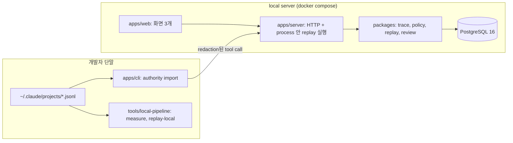
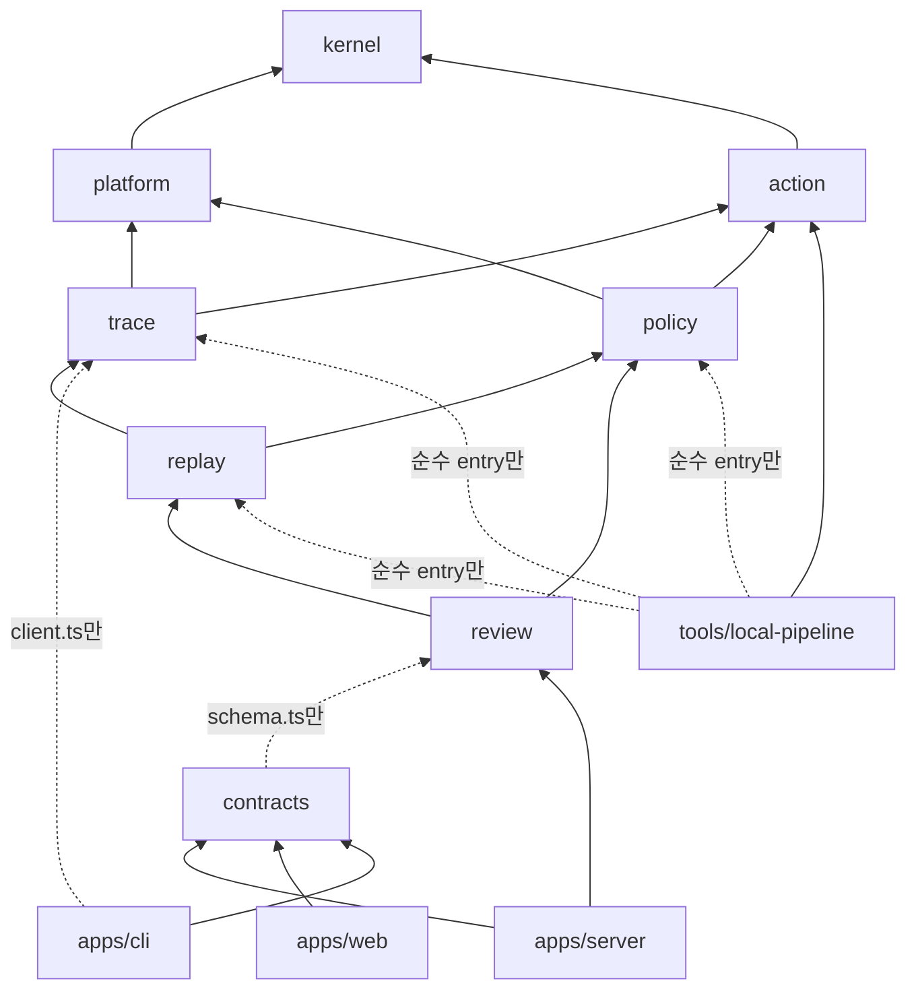
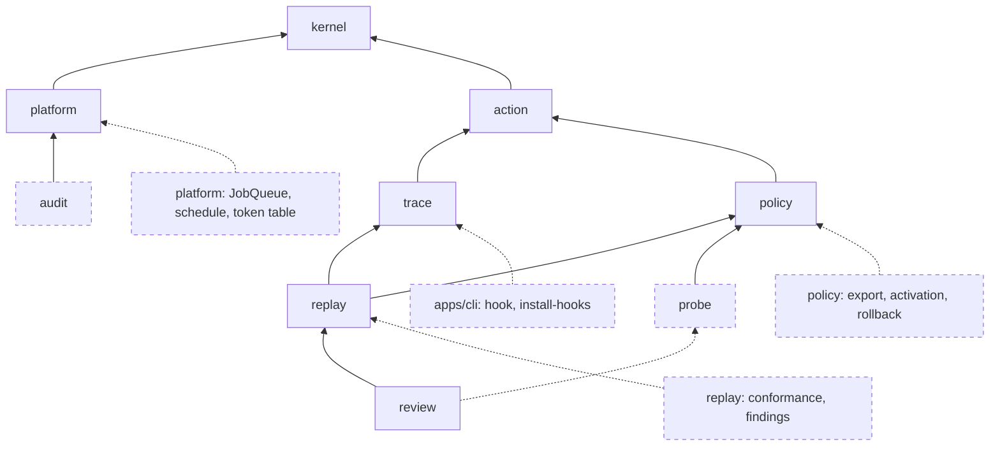

# Authority Diff 개정 메모: V1 cutline과 구현 준비

- 대상: `docs/design.md`(Authority Diff 설계서, 2026-09-21).
  이하 "설계서".
- 지위: 설계서는 Target Architecture로 남깁니다.
  첫 7일 구현(V1)의 범위, 순서, 계약은 이 메모가 정하고 둘이 다르면 V1에 한해 이 메모를 따릅니다.
- 독자: 통합과 판단을 맡는 사람, 그리고 모듈 단위로 구현하는 사람 또는 도구.
- 목적: 첫 구현 범위와 계약을 정의합니다.
- repo 위치: `docs/cutline.md`.

## 1. 최종 판단

Authority Diff 방향은 유지합니다.
바꾸는 것은 7일 범위입니다.

설계서 10.3의 Must ship 12개에는 서로 다른 검증 loop가 4개 들어 있었습니다.
shell 분류가 실제 기록에서 쓸 만한가, replay diff를 사람이 검토할 수 있는가, provider의 판정 분포를 믿을 수 있는가, runtime 관측이 명세와 맞는가.
구현 도구가 줄여 주는 것은 code 작성 시간이고 실제 기록을 보고 분류 오류를 고치고 diff를 다시 묶어 보는 시간은 줄지 않습니다.
7일 안에 끝까지 돌릴 수 있는 loop는 앞의 두 개입니다.

V1은 아래 한 줄만 증명합니다.

> 이 Authority Policy 변경을 적용하면 최근 실제 Agent 작업 기록의 어떤 action이 다른 effect를 받는가.

V1은 모델 호출 0건으로 완결됩니다.
계속할지는 핵심 journey 검증 시점에 아래 질문으로 판정합니다.

> 현실적인 정책 변경 하나로 실제 과거 action의 effect가 어떻게 달라지는지를 검토 가능한 크기로 보여 줄 수 있고, 조직장이 shell parsing이나 Claude Code 내부를 몰라도 그 의미를 이해하는가. 실제 기록에서 의도보다 넓어진 action이 발견되면 보너스이고, 없으면 그 사실을 그대로 보고합니다.

범위를 줄이면서 설계서의 결함 두 개와 표현 한 가지를 함께 고칩니다.

| 번호 | 고치는 곳 | 내용 |
| --- | --- | --- |
| R1 | 설계서 16.1 Diff Group signature와 severity | Zone을 하나만 담고 있었습니다. Environment Profile을 바꾸는 변경에서는 같은 action의 Zone이 baseline과 candidate에서 달라집니다. demo의 핵심 장면(`trustedRemotes = github.com/**`)에서 candidate Zone이 `trusted_remote`가 되어 severity가 `normal`로 떨어집니다. signature에 `fromZone`과 `toZone`을 넣고, severity는 baseline 쪽 Zone과 Reversibility로 판정합니다 |
| R2 | 설계서 13.3 Zone 판정 순서 | `trusted_remote`를 `public_remote`보다 먼저 검사했습니다. 조직이 공개 대상이라고 선언한 곳은 넓은 trusted pattern에 걸려도 `public_remote`여야 합니다. `public_remote`를 먼저 검사합니다 |
| R3 | replay 결과의 표현 전반 | "새로 자동 허용된다", "자동 실행된다"는 표현을 쓰지 않습니다. replay가 말하는 것은 "이 Authority Policy에서는 이 과거 action의 effect가 달라진다"까지입니다. Claude Code가 실제로 어떻게 동작할지는 conformance를 측정한 뒤에만 말할 수 있고, conformance는 V1에 없습니다 |

## 2. 유지할 설계

제품:

- control plane과 runtime gateway를 버리고 검토 도구로 좁힌 결정(설계서 1, 7, 8장, ADR-0001).
- 제품 경계(설계서 9장): 차단, 실시간 판정, Auto Mode와 sandbox 대체, 범용 보안 platform, 범용 observability, cross-runtime compiler를 하지 않습니다.
- 제품이 소유하는 것: 정규화한 Action, 권한 명세, historical replay, authority diff, decision evidence, 사람의 검토.
- persona(설계서 4장): 운영자는 Staff/Platform engineer, 결정권자는 개발 조직장.
- 폐기 기준을 미리 적어 두는 방식(설계서 40장).

architecture:

- modular monolith, package 단위 소유, entry point 경계, dependency-cruiser로 강제(설계서 19, 21장).
- `AgentAction -> Operation`, `analyzability`가 1급 결과, 인식하지 못한 입력을 안전한 쪽으로 분류하지 않음(ADR-0003).
- intent 수준 명세가 canonical이고 runtime matcher를 모사하지 않음(ADR-0002).
- 순서와 무관한 평가, `deny > ask > allow`, 기본 Effect `ask`(ADR-0004).
- Policy Version은 불변, `contentHash`로 식별.
  replay는 `inputsHash`와 `resultHash`로 재현(ADR-0007).
- 의미 판단 provider는 offline에서만, 실제 trace를 보내지 않음, provider abstraction(ADR-0005).
- naming 규칙(설계서 22장), TypeScript 규칙(23장), error 모양(28장), agent change rule(33.3).

## 4. Tier 1 / Tier 2 / Tier 3 scope table

판정 기준: 빼도 demo가 "이 정책을 적용하면 어떤 권한이 달라지는가"에 답하면 Tier 1이 아닙니다.

| 기능 | Tier | 이유 |
| --- | --- | --- |
| Claude Code transcript parse와 redaction(`trace/client.ts`) | 1 | 실제 기록이 없으면 thesis를 시험할 수 없음 |
| classifier(tree-sitter, Operation, `analyzability`) | 1 | 제품의 가장 큰 위험. classifier 측정의 대상 |
| local pipeline 도구(`measure`, `replay-local`). DB와 server 없이 memory에서 실행 | 1(신규) | 측정과 diff 검증을 plumbing 없이 돌림. 순수 함수 설계의 직접적인 이득 |
| Policy 문서, 불변 version, `contentHash`, 검증, 기본 template | 1 | replay의 입력 |
| `evaluateAction`, Zone(R2 반영), Reversibility | 1 | 핵심 |
| `version_diff` replay, `inputsHash`, `resultHash`, process 안에서 비동기 실행 | 1 | 핵심 |
| Diff Group: signature(R1), severity, target 요약, 평문 한 문장 | 1 | 검토 부담을 줄이는 장치. diff 검토 검증의 대상 |
| Change Review: Verdict, gate, 수락과 반려 | 1 | 필수 journey 7번 |
| Evidence report(Markdown)와 불변 decision record(hash 포함) | 1 | 필수 journey 8번. 조직장이 읽는 산출물 |
| 화면 3개: Activity Shape, Policy Version(JSON 편집 + 읽기 전용 rule 표), Change Review | 1 | journey에 필요한 최소 |
| PostgreSQL 저장, ingest API, `authority import`, 재분류 명령 | 1 | 검토 기록이 남아야 함. classifier는 이번 주 내내 바뀜 |
| label corpus C1 100건, 위험 corpus C2 60건, laundering rate CI 검사 | 1(축소) | "모르는 것을 안전으로 분류하지 않는다"를 증명 |
| invariant test I1~I8, I12, I13. E2E 1개 | 1(축소) | 15장 참조 |
| transcript의 `tool_result`에서 사람의 거절 여부 수집(`observedOutcome`) | 1(수집만) | parser가 어차피 읽는 값. 나중에 채우려면 재import가 필요. transcript 형식 확인이 안 되면 제외 |
| "사람이 거절했던 action이 allow가 됨" 표시 | 2 | 강한 신호지만 핵심 질문의 답은 아님 |
| sample에 직전 Mandate 문장 표시(`mandates` table) | 2 | 판정에 도움. 자유 문장의 redaction 부담이 있음 |
| rule 표 form editor | 2 | JSON 편집으로 journey가 성립 |
| 탐색적 semantic probe(Jev, Scenario 30~50개, 순위 표시만, gate와 무관) | 2 | 12장 참조 |
| 10배 복제 data로 replay 성능 측정 | 2 | 설계서 17장 추정의 실측 |
| hook, `runtime_observations`, Disposition, conformance replay, finding, 화면 | 3 | 핵심의 하류. R3으로 표현을 교정 |
| audit hash chain, `EventSink`, domain event, 검증 명령 | 3 | 불변 decision record로 대체 |
| Claude Code 설정 export | 3 | Compiler 방향. 검증하지 못한 vendor 의미론 |
| 활성화, rollback, `policy_activations`, `stale` | 3 | 수락이 배포로 읽히지 않게 함 |
| calibration 전체(golden set 200, Wilson threshold, ECE, Brier, provider 상태, 주간 schedule), LLM baseline adapter | 3 | 모델 평가 과제 |
| Scenario와 Precedent 화면, `precedent_conflict` blocker | 3 | probe가 가치를 보인 뒤 |
| pg-boss, `JobQueue`, `api_tokens`와 role, `idempotency_keys`, OpenAPI 생성, Prometheus metric | 3 | 지키는 invariant 없음 |
| 합성 조직 S1, workload 3종, RAR, fidelity | 3 | 실제 사용 없이는 합성 수치 |
| Codex adapter, runtime port | 3 | adapter 1개면 seam이 아님 |

## 5. MVP user journey

1. `authority import ~/.claude/projects`를 실행합니다.
   CLI가 transcript를 parse하고 secret literal을 치환한 뒤 local server로 보냅니다.
   server가 classify해서 저장합니다.
2. Activity Shape 화면에서 분석한 Action 수, Capability 분포, baseline 정책 기준 Zone 분포, `full` / `partial` / `none` 비율을 봅니다.
   추이 chart와 개인별 통계는 없습니다.
3. baseline version에서 draft를 만들고 JSON을 고칩니다.
   예: `push` + `trusted_remote`를 `ask`에서 `allow`로, `trustedRemotes`에 조직 저장소 pattern 추가.
4. Change Review를 만듭니다.
   draft가 고정되고 server가 같은 Action 집합에 두 version을 대입합니다.
5. 화면 상단에서 "변경된 Action 47건, Widening group 6개, critical 1개" 같은 요약을 봅니다.
   group마다 평문 한 문장, target 상위 목록, 건수가 나옵니다.
6. critical group을 엽니다.
   `trustedRemotes = github.com/**`라는 실수로 조직 밖 저장소로의 실제 과거 push가 `ask`에서 `allow`로 바뀐 것을 저장소 이름과 함께 확인합니다.
   이 장면의 Action이 실제 기록인지 `synthetic` fixture인지를 화면과 Evidence report가 표시합니다.
7. group마다 `expected`, `investigate`, `unexpected`를 기록합니다.
   판정이 없거나 `investigate`, `unexpected`인 Widening group이 남아 있으면 수락 버튼이 잠깁니다.
8. `unexpected`가 나왔으므로 반려하고 draft를 고쳐 새 review를 만들고 전부 `expected`가 된 뒤 "정책 변경 수락"을 누릅니다.
9. Evidence report를 내려받습니다.
   두 version의 `contentHash`, 기간, 분석한 Action 수와 `none` 비율, transition 표, group과 Verdict, 검토자와 시각, 그리고 아래 고정 문구가 들어갑니다.

> 이 기록은 정책 변경을 위 과거 기록에 비추어 검토했다는 사실을 남깁니다.
> Authority Diff는 정책을 배포하거나 강제하지 않았고, runtime이 이 정책대로 동작하는지는 측정하지 않았습니다.

용어는 "정책 변경 수락(Accept Policy Change)"과 "정책 변경 반려(Reject Policy Change)"로 정합니다.
"Approve Review"는 review 자체를 승인한다는 뜻으로 읽히고 "Mark Reviewed"는 수락과 반려를 구분하지 못합니다.
Policy Version 상태는 `draft -> in_review -> accepted | rejected`, 철회는 `in_review -> draft`입니다.
Policy의 baseline은 가장 최근 `accepted` version입니다.

## 6. MVP architecture

V1에서 구현하는 것만 그렸습니다.





설계서 대비 기반 결정의 변경:

| 항목 | 설계서 | V1 | 이유 |
| --- | --- | --- | --- |
| replay 실행 | pg-boss job | 같은 process 안의 비동기 함수. 상태는 `replay_runs.status`. 재시작 때 60초 넘게 `running`인 run은 `failed`로 바꾸고 같은 `inputsHash`로 다시 요청 | 1만 2천 Action에 1.2초 |
| 순수 entry point | `trace/client.ts` 하나 | `action/index.ts`, `trace/client.ts`, `policy/evaluate.ts`, `replay/diff.ts` | DB 없이 전체 계산을 돌리는 local pipeline이 측정과 diff 검증의 도구 |
| Action 식별자 | `act_` ULID + `actionKey` | `actionKey`(sha256)가 primary key | 재import와 local/server 양쪽에서 같은 식별자가 나와야 `resultHash`를 비교할 수 있음 |
| 인증 | token table, role 2종 | 환경 변수의 token 1개. 검토자 이름은 결정할 때 입력 | 단일 사용자 |
| HTTP | `@hono/zod-openapi` | Hono + `contracts`의 Zod schema 검증 | 생성물을 하나 줄임 |
| integration test DB | Testcontainers | docker compose의 PostgreSQL에 test 전용 database, run마다 global setup이 한 번 migration | 의존성 하나 제거 |
| 관측 | metric endpoint, audit | structured log만 | V1에서 지키는 invariant 없음 |

계약 변경(설계서 24, 25장 대비):

- `AgentAction`: `id`, `mandateId`, `toolInputHash` 제거. 식별자는 `actionKey`(ADR-0008).
  `toolInputHash`는 hook 관측 결합에만 쓰던 값이라 V1에서 쓰지 않는다.
- `Target.vcs_remote`: 원본 `remoteUrl` 대신 classifier가 소문자 `host/owner/repo`로 정규화한
  `remoteKey`를 쓴다. I/O 가능한 호출자가 `repoRemotes` 원본 URL을 채우고 classifier가 한 곳에서 정규화한다.
- `ResolveZone`: Target과 Capability를 따로 받지 않고 Operation 전체를 받는다.
  Environment Profile pattern은 전체 일치하는 고정 glob 문법이고 production marker만 flag 없는 정규식이다.
- `ParseTranscript`: 호출자가 transcript 파일 이름의 stem인 `sessionExternalId`와 줄 목록을 함께 넘긴다.
  줄 안의 session id는 쓰지 않는다.
- `Decision`: `policyVersionId` 제거. 순수 평가 함수는 문서만 받는다.
- `DiffGroup`: `id` 대신 `groupKey`. `zone` 대신 `fromZone`, `toZone`.
  `principalCount`, `mandateDependentCount`, `decidingRuleId` 제거.
- `ReplayRun`: `kind`와 `DecisionSource` 제거. 저장 계약은 `replay/schema.ts`가 소유한다: `ReplayRun`, `StoredDiffGroup`(`DiffGroup` + `replayRunId`), `StoredChangedAction`(`replayRunId`, `actionKey`, `groupKey`, `fromEffect`, `toEffect`).
- `PolicyVersionStatus`: `draft`, `in_review`, `accepted`, `rejected`.
- `PolicyRule.mandateException`: schemaVersion 1에서 제거합니다.
  V1 문서에는 V1이 평가하는 개념만 들어갑니다.
  자연어 Mandate 조건이 필요해지면 명시적인 schemaVersion 2 migration으로 추가합니다.
- `OperationDecision.isMandateDependent`, `Decision.isMandateDependent` 제거(설계서 24.4).
  `decidingRule` 선택은 ruleId 사전순만 씁니다(설계서 13.5의 "Mandate Exception이 없는 rule 우선" 조항 제거).
- `ChangeReview.status`: `computing`, `ready`, `accepted`, `rejected`, `failed`.
  probe와 stale 관련 field 제거.
- 신규 `review_decisions`(insert와 select만, trigger가 UPDATE, DELETE, TRUNCATE 차단): `changeReviewId`, `decision`, `note`, `reviewerName`, `decidedAt`, `baselineContentHash`, `candidateContentHash`, `replayInputsHash`, `replayResultHash`, `classifierVersion`, `verdictSnapshot`에 audit hash chain column `sequence`, `prevHash`, `hash`를 더한다(계약은 `docs/acr/0006-review-decision-hash-chain.md`).
- gate blocker: `replay_incomplete`, `replay_failed`, `widening_unreviewed`, `widening_investigate`, `widening_unexpected` 다섯 개.
- `kernel` port: `Clock`, `IdGenerator`, `Logger`, `TransactionRunner`만 남깁니다.

R1의 severity 규칙:

```text
critical = widening 이고 아래 중 하나
  - fromZone 이 credentials, agent_config, protected, public_remote, unknown_remote 중 하나
  - baseline 기준 reversibility 가 irreversible
  - 결정 Operation 의 analyzability 가 none
headline 예:
  "github.com/acme-oss/toolkit 등 저장소 2곳으로의 push 15건이 '확인 필요'에서 '허용'으로 바뀝니다.
   기준 정책에서는 신뢰하지 않는 원격이었고 변경안에서는 신뢰하는 원격으로 분류됩니다."
```

`headline`은 (Capability, Zone 변화, Effect 변화, target 요약)에서 고정 template으로 만듭니다.
모델을 쓰지 않습니다.

diff 검토 판정 전에는 두 계약을 조정할 수 있습니다. Target 종류별 `targetSummary.key` 생성 규칙과
Diff Group signature에 `program`을 넣을지 여부입니다. 이 둘은 판정 전 변경에 ACR이 필요 없지만,
PR 본문에 변경 전후 group 수와 이유를 적습니다. 판정을 통과하면 다른 `schema.ts` 계약과 같이 ACR 대상입니다.

## 7. Target architecture

점선이 V1에서 만들지 않는 부분입니다.



| 미룬 기능 | 나중에 붙는 지점 | core에 필요한 변경 |
| --- | --- | --- |
| conformance | `trace`에 `runtime_observations`, `replay`에 Decision Source `observed_runtime` | `replay_runs`에 `kind` column 추가(기본값 `version_diff`). diff 계산 함수는 Effect 쌍만 받으므로 그대로 |
| semantic probe | 새 package `probe`, `policy/prose.ts` entry, `review` gate에 blocker 추가 | PolicyDocument schemaVersion 2 migration(`mandateException` 추가, `Decision.isMandateDependent` 복원) |
| audit chain | 새 package `audit`, `kernel`에 `EventSink` port | use case 하나가 transaction 하나라서 기록 호출을 넣을 곳이 use case마다 한 군데 |
| 활성화, rollback | `policy`에 `policy_activations`, status 값 추가 | `accepted` 뒤에 상태를 덧붙임. 기존 전이는 그대로 |
| 설정 export | `policy/export-claude-code.ts` entry | 없음 |
| job queue | `platform`에 `JobQueue`, replay 실행 함수를 handler로 감쌈 | `runReplay(runId)` signature 유지 |
| 다인 조직 | `principal_id` column이 이미 있음 | group 집계에 count 추가 |
| Codex adapter | `trace/client.ts`에 parser 추가 | adapter가 2개가 되는 시점에 port 도입 |

미룬 module은 빈 package로 만들지 않습니다.
ADR과 이 표가 자리 예약입니다.

## 8. Module changes

| module | V1 | 설계서 대비 변경 | 따로 두어 지키는 invariant |
| --- | --- | --- | --- |
| `kernel` | 구현 | `EventSink`, `JobQueue` port 제거 | 공용 타입이 업무 package를 참조하지 않음 |
| `platform` | 구현(축소) | config, db, logger, clock, id만. pg-boss, http client, token table, 멱등 key 없음 | `process.env`와 DB driver를 만지는 곳이 한 군데 |
| `contracts` | 구현(축소) | ingest, policy, replay, review endpoint만 | server, web, CLI 세 client가 같은 계약을 compile 시점에 공유 |
| `action` | 구현(전부) | 없음 | classifier가 순수 함수. corpus와 property test로 검증 가능 |
| `trace` | 구현(축소) | observation, hook, `mandates` 없음. 재분류 추가 | redaction 전 문자열이 단말 밖으로 나가지 않음 |
| `policy` | 구현(축소) | 활성화, rollback, export, prose 없음. 순수 entry `evaluate.ts` 추가 | `draft`가 아닌 문서는 불변 |
| `replay` | 구현(축소) | `version_diff`만. 순수 entry `diff.ts` 추가. R1 반영 | replay 결과는 한 번 쓰고 바꾸지 않음. 사람의 판정을 모름 |
| `review` | 구현(축소) | probe blocker, stale 없음. report 생성과 `review_decisions` 추가 | 바뀌는 상태(Verdict, 결정)가 replay 결과와 섞이지 않음 |
| `probe` | Tier 2에 도달하면 최소 구현. 아니면 만들지 않음 | calibration, provider 상태, LLM baseline 없음 | 해당 없음 |
| `audit` | 만들지 않음 | `review_decisions`로 대체 | 해당 없음 |
| `tools/local-pipeline` | 구현(신규) | 설계서의 `tests/eval/corpus-shape.eval.ts`를 확장 | DB 없는 경로와 server 경로가 같은 `resultHash`를 냄 |

`review`를 `replay`에 합치는 안을 검토했고 합치지 않습니다.
replay table은 한 번 쓰고 바꾸지 않고 review table은 결정 전까지 바뀝니다.
둘을 섞으면 I6(같은 입력이면 같은 결과)을 package 단위로 말할 수 없게 됩니다.

## 11. 측정 기준

### classifier 측정 기준

`measure`가 출력해야 하는 값:

```text
sessions, actions, tool 분포, Bash 비율
analyzability full / partial / none: 전체 Action 기준, Bash만 기준, Operation 기준
  (Action의 analyzability = 그 Operation 중 가장 나쁜 값)
상위 program 30개, 복합 명령 비율(Operation 2개 이상), inline program 비율
parse_error 비율, transcript에서 parse하지 못한 줄의 비율
redaction 건수(kind별), 사람의 거절로 보이는 tool_result 수
classify 처리량(Action/초), none의 signal 상위 20개
```

| 조건 | 판정 |
| --- | --- |
| Action 2,000건 미만 또는 Bash Action 500건 미만 | 보류. 다른 단말과 과거 기록을 더 모읍니다. 실제 기록으로 시험할 수 없으면 V1의 주장이 성립하지 않습니다 |
| parse하지 못한 줄 5% 이상 | thesis 문제가 아닙니다. parser를 고치고 같은 날 다시 측정합니다 |
| `none`(전체 Action) 25% 이하, 아래 표본 검사 통과 | GO |
| `none` 25% 초과 40% 이하 | 조건부 GO. classifier 보강 1회(4시간, `none` signal 상위 5개만 대상) 뒤 diff 검토와 함께 다시 측정 |
| `none` 40% 초과 | 보강을 2회까지 합니다. 그래도 40%를 넘으면 NO-GO. 대안은 replay 대상을 Bash 외 tool과 인식된 `git`, network, package program으로 좁히고 제품의 주장을 "git과 network 권한의 diff"로 줄이는 것, 또는 중단 |
| 표본 검사: `full`로 분류된 Bash 50건을 사람이 확인. 45건 이상 정확 | 통과 |
| 같은 표본에서 쓰기, 전송, push, 삭제, 실행을 읽기로만 분류한 사례 | 1건이라도 나오면 고치고 C2에 추가한 뒤 진행. 3건 이상이면 고칠 때까지 NO-GO |

참고 기대치: 공개 측정에서 Bash 입력의 25.9%가 다른 언어 program을 포함했으므로 Bash만 보면 `none`이 26% 안팎일 가능성이 높습니다.
25%와 40%는 "diff의 대부분이 알 수 없음으로 채워지면 근거가 되지 못한다"는 판단을 미리 숫자로 고정한 값입니다.
측정 뒤에 기준을 바꾸지 않습니다.

### diff 검토 기준

입력:

- 정책 A: 기본 template + 본인 환경의 Environment Profile.
- 정책 B: `measure`에서 `push`, `install`, `fetch`, `send` 중 Action 수가 가장 많은 `ask` 조합을 `allow`로 바꾸는 변경.
- 정책 B′: B의 `trustedRemotes`를 `github.com/**`처럼 넓게 적은 실수.
- 예상 목록: replay 전에 적은 `replay-predictions.md`.

| 측정 | 통과 기준 |
| --- | --- |
| B에서 Effect가 바뀐 Action 수 | 10건 이상. 미만이면 현실적인 변경을 하나 더 시도. 두 번 다 10건 미만이면 "과거 기록이 권한 경계를 건드리지 않는다"는 뜻이므로 thesis를 다시 봅니다 |
| Widening group 수 | 25개 이하 |
| 압축 | 상위 10개 group이 바뀐 Action의 80% 이상을 포함 |
| 검토 시간 | `headline`, target 요약, group당 sample 3개 이하만 읽고 Widening group 전부를 10분 안에 판정 |
| 이해 가능성 | group마다 "무엇이, 어디로, 어떻게 바뀌는가"를 명령 원문 없이 말할 수 있음. 말할 수 없는 group이 3개 이상이면 실패 |
| 결정성 | 두 번 실행한 `resultHash`가 같음 |

보너스 관측(통과 기준 아님): B′에서 조직 밖 저장소나 host로 간 실제 과거 Action이 critical Widening으로 나타나는지, B에서 예상 목록에 없던 group이 있는지 기록합니다.
push 기록이 없으면 같은 B′로 `git clone`, `pnpm add github:...` 같은 `fetch`, `install` 기록을 봅니다.
나타나지 않으면 `replay-diff.md`에 "실제 기록에 예상 밖 widening 없음"이라고 그대로 적습니다.
이 관측을 얻으려고 정책을 조작하지 않습니다.

실패하면 signature 재설계를 한 번(반나절) 합니다.
조정 대상은 `program`을 signature에서 빼는 것과 target의 조직 단위를 넣는 것 두 가지입니다.
그 뒤에도 실패하면 서버와 영속 저장 구현을 시작하지 않고 thesis를 고치거나 접습니다.

### 핵심 journey 검증 기준

1. 합성이 아닌 실제 과거 Action의 Effect가 정책 변경으로 달라지는 장면(Widening group)이 화면에 나옵니다. 의도보다 넓은지는 Verdict로 사람이 판정하고, 실제 기록에 예상 밖 widening이 있었는지를 화면과 report가 명시합니다.
2. report 첫 화면에 명령 원문, label 없는 `ruleId`, 정규식이 없습니다.
   `analyzability` 같은 용어에는 평문 설명이 붙어 있습니다.
3. critical Widening group(실제 기록에 없으면 `synthetic` label이 붙은 fixture group)의 `headline`만 읽어도 무엇이(평문 Capability), 어디로(저장소와 host 이름), 어떻게(Effect 변화), 왜(Zone 재분류 또는 Rule 변경) 바뀌는지 알 수 있습니다.
4. 가능하면 shell을 모르는 사람 1명에게 첫 화면을 2분 보여 주고 "무엇이 바뀌고 왜 문제인가"를 말하게 합니다.
5. `curl`과 DB 조작 없이 journey를 완주합니다.

결과 등급(통과 기준 아님):

| 등급 | 조건 |
| --- | --- |
| 강 | 실제 기록에서 예상 목록에 없던 Widening이 발견됨 |
| 중 | 실제 기록의 Widening을 검토할 수 있었으나 전부 예상 범위 |
| 약 | critical Widening 장면을 synthetic fixture로만 시연 |

화면, Evidence report, README는 위 등급 중 해당하는 것만 적고, 등급보다 강한 표현을 쓰지 않습니다.
측정 전에는 등급을 단정하지 않고 이 표만 적습니다.

실패하면 기능을 더하지 않습니다.
하루를 `headline`, group 묶음, report 수정에만 쓰고 그래도 실패하면 thesis를 고치거나 접습니다.

## 12. Jev cutline

### 추가할 가치가 있는 최소 구현

- `packages/probe`: `DecisionProvider` port(설계서 14.3), `decision-provider.jev.ts`, `decision-provider.fixture.ts`.
  adapter 2개라 seam이 성립합니다.
- `policy/prose.ts`: 정책 문서를 산문으로 바꾸는 순수 함수.
- Scenario는 `tests/corpus/scenarios.json` 파일 하나입니다.
  사람이 30~50개를 쓰고 `expectedEffect`와 `targetRuleId`를 붙입니다.
  table, CRUD, 화면은 없습니다.
- CLI `authority probe --policy-version <id>`: 전체 Scenario를 돌려 `docs/evidence/probe-<contentHash>.md`를 만듭니다.
  margin 오름차순 표, 기대 Effect와 다른 항목 표시, 하위 5개에는 Rule 문장, Scenario 문장, `allow` / `ask` / `deny` 분포, `mandate_reading` 분포를 함께 적습니다.
  "독자에 따라 allow 0.41, ask 0.59로 읽힘"처럼 사람이 읽을 수 있는 설명이 결과물입니다.
- Evidence report에는 같은 `contentHash`의 probe 결과가 있을 때만 "참고: 정책 문장 해석 점검" 절이 붙습니다.
  gate blocker가 아닙니다.
- threshold, calibration, provider 상태, LLM baseline, schedule은 없습니다.
  순위만 보여 주고 자르는 기준을 두지 않습니다.
- 결과물 첫 줄에 "exploratory semantic-policy evaluation, n=<N>. 이 표본 수로는 일치율 95%를 주장할 수 없음(30/30이어도 Wilson 하한 0.887)"을 적습니다.
- test: 기록한 응답으로 돌리는 adapter contract test, probe 입력 타입에 trace 타입이 없다는 test.

### V1에서 완전히 빼는 조건

아래 중 하나라도 해당하면 뺍니다.
LLM baseline으로 대체하지 않습니다.

1. 핵심 journey 검증을 통과하지 못함.
2. 신뢰성 기준(laundering rate 0, E2E 통과)을 채우지 못함.
3. Tier 2 검토 시점에 Jev API access가 없음.
4. demo 정책에 시험할 자연어 조항이 없음(V1 문서의 자연어는 rationale뿐이고 그 문장이 한 가지로 읽힘).

빼더라도 narrative 7번은 성립합니다.
"의미 판단 AI를 offline probe로 한정했고 핵심이 모델 없이 완결돼서 V1에서는 뺐다"가 됩니다.

### 나중에 확장을 정당화하는 증거

- 탐색 실행에서 낮은 margin이나 기대와의 불일치 때문에 작성자가 정책 문장을 실제로 고친 사례가 3건 이상이고 고친 뒤 전체 재실행에서 해당 항목의 분포가 의도대로 움직이고 옆 항목이 나빠지지 않음.
- schemaVersion 2 이후, 실제 정책에 Mandate Exception이 2개 이상 쓰임.
- probe가 표시한 Scenario 중 1건 이상에서 두 번째 사람의 해석이 작성자와 실제로 다름.

이 세 가지가 확인되면 설계서 14~15장(DB 기반 Scenario와 Precedent, golden set 200개, Wilson threshold, provider 상태)을 구현합니다.

## 13. Removed implementation work

V1에서 작성하지 않는 code입니다.
agent가 이 목록의 code를 만들기 시작하면 중단시킵니다.

- [ ] `apps/cli`의 `hook`, `install-hooks`, spool.
- [ ] `runtime_observations` table, `POST /runtime-observations`, Disposition 도출.
- [ ] conformance replay, `conformance_findings`, `/conformance` 화면. 축소 conformance(`observed_runtime` Decision Source, Disposition 도출, finding 3종, 목록 전용 화면)는 ACR-0007로 구현했다(17장).
- [ ] `packages/audit`, `audit_events` table, `/audit` 화면. audit hash chain, trigger, `verify-audit` 명령은 `review_decisions` 위에 구현했다(17장).
- [ ] `EventSink` port, event envelope, `events.ts` entry point, event 이름 체계.
- [ ] `exportClaudeCodeSettings`, `GET /policy-versions/{id}/exports/claude-code`.
- [ ] `policy_activations`, `POST /policy-versions/{id}/activations`, rollback, `superseded`, `stale`.
- [ ] pg-boss, `JobQueue` port, in-memory queue adapter, 주기 작업.
- [ ] `api_tokens` table과 role, `idempotency_keys`와 `Idempotency-Key` 처리.
- [ ] `@hono/zod-openapi`, `openapi.json` 생성, `GET /metrics`, Prometheus metric.
- [ ] Testcontainers.
- [ ] `scenarios`, `probe_runs`, `probe_results`, `provider_calibrations` table과 API, `/scenarios` 화면.
- [ ] calibration 계산(Wilson threshold 산출, ECE, Brier, bin), provider 상태 기계, `decision-provider.llm-baseline.ts`.
- [ ] `DecisionSource` union, `replay_runs.kind`. `replay_runs.kind`(기본값 `version_diff`)는 축소 형태로 구현하고 `DecisionSource` union은 만들지 않았다(ACR-0007, 17장).
- [ ] 합성 조직 trace 생성기(S1), workload 3종, RAR과 fidelity 계산.
- [ ] rule 표 form editor(Tier 2 전까지), `/trace-imports` 화면, Overview의 기간 선택과 cell drill-down.
- [ ] Codex parser, `TraceSource` port.
- [ ] 보존 기간 삭제 job.
- [ ] Principal별 집계와 화면 표시.

## 14. Definition of Done - revised

완료는 제품 하나가 끝까지 도는 상태입니다.
Target Architecture의 완성이 아닙니다.

1. 깨끗한 환경에서 `docker compose up`과 `authority import`로 본인의 실제 transcript가 저장됩니다.
   canary secret test가 통과합니다.
2. Activity Shape 화면이 Action 수, Capability와 Zone 분포, `full` / `partial` / `none` 비율을 보여 줍니다.
3. draft를 JSON으로 고치고 검증합니다.
   `draft`가 아닌 version은 바뀌지 않습니다(I13).
4. Change Review가 같은 Action 집합에 두 version을 대입해 Diff Group을 만듭니다.
   같은 입력이면 `resultHash`가 같고(I6), `replay-local`의 값과도 같습니다.
5. Widening group마다 `headline`, target 요약, sample이 나오고 Verdict를 기록할 수 있습니다.
6. 판정이 끝나지 않은 Widening group이 있으면 수락되지 않습니다(I7).
7. 수락 또는 반려가 `review_decisions`에 hash와 함께 남고 Evidence report에 5장의 고정 문구가 들어갑니다.
8. demo에서 `github.com/**` 실수의 critical Widening 장면이 나옵니다. 실제 기록에서 나오면 그것을 쓰고, 나오지 않으면 `synthetic` label이 붙은 별도 danger fixture로 시연하며 실제 기록과 같은 review에 섞지 않습니다. 화면, Evidence report, README에 provenance, 실제 기록의 예상 밖 widening 유무, 결과 등급(강/중/약, 11장 핵심 journey 검증 기준)을 적고, 등급보다 강한 표현을 쓰지 않습니다.
9. `pnpm check`(typecheck, lint, 경계 규칙, unit과 property test, laundering rate 0)와 `pnpm test:e2e`가 CI에서 통과합니다.
10. `docs/evidence`에 실제 기록 측정, diff와 예상 목록, classifier benchmark(C1 100건), 검증 지표 표가 있습니다.
11. README에 한계가 적혀 있습니다.
    한 사람의 기록, 단일 runtime, 근사인 remote 해석, runtime 동작과의 일치를 측정하지 않았다는 점, demo에 synthetic fixture를 썼는지, 실제 기록의 예상 밖 widening 유무, 결과 등급(강/중/약, 11장 핵심 journey 검증 기준), 13장의 목록.

V1의 검증 지표(North Star 대신):

| 지표 | 값의 출처 |
| --- | --- |
| 분석 가능한 Action 비율(`full` + `partial`) | 초기 측정과 강화 뒤 재측정 |
| laundering rate | C2, CI |
| replay 결정성 | 두 번 실행, local과 server 비교 |
| 압축: 바뀐 Action 수 / Diff Group 수 | demo 변경 |
| 검토 시간(분) | replay 검토 stopwatch, journey 검증 시 재측정 |
| 예상 밖 Widening 수 | 예상 목록과의 차이 |
| classifier 정확도 | C1 100건, Capability별 precision과 recall |

제품 결과 가설은 "정책 문법만 읽는 대신 과거 행동 기록을 근거로 권한 정책 변경을 검토할 수 있다"입니다.
RAR은 설계서의 향후 지표로 남깁니다.

DoD가 아닌 것: Tier 2 전부, Tier 3 전부, provider 관련 어떤 결과도.

## 15. Architecture rules that must still be enforced

V1에서 agent의 이탈을 실제로 줄이는 규칙만 남깁니다.

dependency-cruiser(전부 `error`):

| rule | 내용 |
| --- | --- |
| `entrypoint-boundary-from-app` | `apps/*`, `tools/*`는 package의 root 파일만 import |
| `entrypoint-boundary-across-packages` | package는 다른 package의 root 파일만 import |
| `tests-through-entrypoints`, `tests-folder-is-private` | test는 entry point로만 접근 |
| `schema-imports-schema-only` | `schema.ts`는 `zod`, `kernel`, 다른 package의 `schema.ts`, 자기 package의 `lib/`만 import |
| `no-circular` | 순환 금지 |
| `package-layering` | 6장의 graph. `kernel: []`, `platform: [kernel]`, `action: [kernel]`, `trace: [kernel, action, platform]`, `policy: [kernel, action, platform]`, `replay: [kernel, action, policy, trace, platform]`, `review: [kernel, policy, replay, platform]`, `contracts: [kernel + 각 schema.ts]` |
| `domain-is-pure`, `app-has-no-infra` | 설계서 21.1과 동일 |
| `pure-entry-points` | `action/index.ts`, `trace/client.ts`, `policy/evaluate.ts`, `replay/diff.ts`, 모든 `schema.ts`에서 출발해 닿을 수 있는 파일에 `lib/infra`, `@authority/platform`, `drizzle-orm`, `postgres`가 없음(`reachable` 사용) |
| `web-only-contracts`, `cli-narrow`, `tools-narrow` | `apps/web`은 `contracts`와 `kernel/index.ts`만. `apps/cli`는 거기에 `trace/client.ts` 추가. `tools/local-pipeline`은 순수 entry와 `schema.ts`만 |
| `contracts-schema-only` | `packages/contracts/**`는 다른 package에서 `<pkg>/schema.ts`와 `@authority/kernel`만 import |

Oxlint(`error`, type-aware 규칙은 `--type-aware`로): `any` 금지, `as T` 금지와 불필요한 assertion 금지, `!` 금지, `no-floating-promises`, `no-misused-promises`, `require-await`, `switch-exhaustiveness-check`, `no-unsafe-assignment`, `no-unsafe-call`, `no-unsafe-member-access`, `no-unsafe-return`, `no-unsafe-argument`, default export 금지, `console` 금지(`apps/cli/src/output.ts`, `tools/*` 예외), `process.env` 금지(`node/no-process-env`, config 파일 두 곳 예외), `drizzle-orm`과 `postgres`는 `lib/infra`와 `platform`만(`no-restricted-imports`), `lib/domain`과 `lib/app`에서 `Date` 사용 금지(`no-restricted-globals: Date`, 설계서 23장 "Date는 infra 안에서만")와 `Math.random()` 금지(`no-restricted-properties`). Oxlint에 `no-restricted-syntax`가 없어 그 세 검사를 위 native 규칙으로 표현한다.

그대로 유지: TypeScript compiler 설정(설계서 23장), `Result` 규칙과 error code 모양(28장), naming(22장 중 파일, symbol, DB, HTTP), 생성물 직접 수정 금지, agent change rule(33.3), 계약 고정 뒤 `schema.ts` 변경은 ACR.

V1에서 내려놓는 규칙: event naming, metric naming, audit 규칙, `Idempotency-Key`, 파일 크기 lint.

invariant test:

| id | V1 |
| --- | --- |
| I1~I3 정책 평가(순서 무관, 단조성, 가장 제한적인 Operation) | 유지. policy |
| I4 classifier가 실패하지 않고 모르는 입력을 `read`로 분류하지 않음. 임의의 tool 이름에 대해 명시적 control tool 목록에 없으면 Operation이 1개 이상이고, 잘린 입력은 `none` Operation을 하나 이상 가짐. laundering rate 0 | 유지. action |
| I5 import 멱등 | 유지. trace |
| I6 replay 결정성. local과 server의 hash 일치 추가 | 유지, 강화. replay |
| I7 gate | 유지(blocker 5개). review |
| I8 canary secret이 DB와 log에 없음 | 유지(provider 요청 항목 제외). trace |
| I12 경계 규칙이 실제로 실패 | 유지. kernel과 root 설정 |
| I13 `draft`가 아닌 문서는 불변 | 유지. policy |
| I9, I11 | 제거(hook, audit 없음) |
| I10, I14 | probe를 할 때만 |

## 16. Repository scaffold contract

### 16.2 Scaffold 요구사항과 검증

repository scaffold의 요구사항과 검증 기준이다.

````text
# repo 골격, kernel, 경계 규칙

## 배경
Authority Diff는 Agent 권한 정책 변경을 과거 작업 기록에 대입해 diff를 만드는 modular monolith다.
이 문서는 업무 로직 없이 골격과 경계 규칙만 정의한다.
근거 문서는 docs/design.md 19~23장과 docs/cutline.md 6, 15장이다. 두 문서가 다르면 cutline.md를 따른다.

## 만들 것

1. pnpm workspace + Turborepo. Node 22, TypeScript, ESM 전용("type": "module").
   workspace glob: apps/*, packages/*, tools/*

2. root 파일: package.json, pnpm-workspace.yaml, turbo.json, tsconfig.base.json, .oxlintrc.json, .oxfmtrc.json,
   .dependency-cruiser.cjs, vitest.config.ts, .gitignore, .nvmrc, .git-blame-ignore-revs, .githooks/pre-commit, .github/workflows/ci.yml

3. tsconfig.base.json: strict, noUncheckedIndexedAccess, exactOptionalPropertyTypes, noImplicitOverride,
   noFallthroughCasesInSwitch, verbatimModuleSyntax, isolatedModules, module과 moduleResolution은 NodeNext.

4. packages/kernel (@authority/kernel). 모양: root에 entry point, lib/에 구현, tests/에 test.
   entry point는 두 개다.
   - index.ts (browser에서도 import 가능. node builtin을 import하지 않는다)
     type Result<T, E>, ok(), err()
     EffectSchema, type Effect = 'allow' | 'ask' | 'deny'
     IsoTimestampSchema: 밀리초 3자리로 끝나는 UTC ISO 8601 문자열(YYYY-MM-DDTHH:mm:ss.SSSZ), brand 'IsoTimestamp'
     Sha256Schema: 소문자 hex 64자
     prefixedId(prefix, brand): `<prefix>_` 뒤에 Crockford base32 26자를 검증하는 Zod schema를 반환
     interface AppError { code: string; message: string; isRetryable: boolean; details: Record<string, unknown> | null; cause: unknown | null }
     invariant(condition, message): asserts condition
     assertNever(value: never): never
     interface Clock { now(): IsoTimestamp }
     interface IdGenerator { next(prefix: string): string }
     interface Logger { debug, info, warn, error: (msg: string, fields?: Record<string, unknown>) => void }
   - hash.ts (node 전용)
     canonicalJson(value): string. object key는 사전순 정렬, 배열 순서는 유지, -0은 0으로 직렬화. undefined, sparse array, 비유한 number(NaN/Infinity), plain object가 아닌 값(Date, Map, class instance 등), bigint/function/symbol이면 invariant 실패
     sha256Hex(input: string): string
   test (tests/ 아래, entry point만 import):
     canonicalJson이 key 순서가 다른 두 object에 같은 문자열을 낸다
     sha256Hex("abc")가 ba7816bf8f01cfea414140de5dae2223b00361a396177a9cb410ff61f20015ad 이다
     prefixedId가 올바른 id를 통과시키고 prefix가 다르거나 길이가 다른 값을 거부한다
     ok, err가 판별 가능한 union을 만든다

5. .dependency-cruiser.cjs. 전부 severity error. package root는 `packages`이고, package의 root 파일만 public, subfolder는 전부 private이다.
   - entrypoint-boundary-from-app: apps/**, tools/** 는 packages/<pkg>/ 의 root 파일만 import
   - entrypoint-boundary-across-packages: package는 다른 package의 root 파일만 import. 자기 package 안은 자유
   - tests-through-entrypoints: packages/<pkg>/tests/** 는 어떤 package든 root 파일과 자기 tests/ fixture만 import
   - tests-folder-is-private: tests/ 는 test에서만 import
   - schema-imports-schema-only: packages/<pkg>/schema.ts 는 packages 아래에서 kernel, 다른 package의 schema.ts,
     자기 package의 lib/ 만 import
   - no-circular
   - package-layering: 아래 허용 목록에 없는 package 간 import 금지
       kernel: []
       platform: [kernel]
       action: [kernel]
       trace: [kernel, action, platform]
       policy: [kernel, action, platform]
       replay: [kernel, action, policy, trace, platform]
       review: [kernel, policy, replay, platform]
       contracts: [kernel, action, trace, policy, replay, review]
   - domain-is-pure: packages/*/lib/domain/** 는 lib/app, lib/infra, @authority/platform, node builtin, zod 외 third-party를 import할 수 없다
   - app-has-no-infra: packages/*/lib/app/** 는 lib/infra, @authority/platform, zod 외 third-party를 import할 수 없다
   - pure-entry-points: packages/action/index.ts, packages/trace/client.ts, packages/policy/evaluate.ts, packages/replay/diff.ts,
     packages/*/schema.ts 에서 출발해 닿을 수 있는 파일에 lib/infra, @authority/platform, drizzle-orm, postgres 가 없어야 한다.
     dependency-cruiser의 `reachable` 을 쓴다.
   - web-only-contracts: apps/web/** 는 @authority/contracts 와 @authority/kernel 의 index.ts 만 import
   - cli-narrow: apps/cli/** 는 @authority/contracts, @authority/kernel, packages/trace/client.ts 만 import
   - tools-narrow: tools/** 는 @authority/kernel, packages/action/index.ts, packages/trace/client.ts, packages/policy/evaluate.ts,
     packages/replay/diff.ts, 각 package의 schema.ts 만 import
   - contracts-schema-only: packages/contracts/** 는 다른 package에서 <pkg>/schema.ts 와 @authority/kernel 만 import.
     다른 package의 schema.ts 아닌 파일을 import하면 위반이다.
   아직 없는 package에 대한 rule도 경로 pattern으로 지금 작성한다.

6. .oxlintrc.json (Oxlint. type-aware 규칙은 oxlint-tsgolint로 `--type-aware`에서 동작). 전부 error.
   no-explicit-any, no-unsafe-assignment, no-unsafe-call, no-unsafe-member-access, no-unsafe-return,
   no-unsafe-argument, consistent-type-assertions(assertionStyle never, `as const` 허용),
   no-unnecessary-type-assertion, no-non-null-assertion, no-floating-promises, no-misused-promises,
   require-await, switch-exhaustiveness-check, default export 금지(설정 파일과 scripts 예외),
   no-console(apps/cli/src/output.ts 와 tools/** 예외),
   process.env 접근 금지(node/no-process-env, packages/platform/lib/infra/config.ts 와 apps/cli/src/config.ts 예외),
   drizzle-orm 과 postgres import 금지(no-restricted-imports, packages/*/lib/infra/** 와 packages/platform/** 예외),
   packages/*/lib/domain/** 과 packages/*/lib/app/** 에서 Date 사용 금지(no-restricted-globals: Date)와
   Math.random() 금지(no-restricted-properties). Oxlint에 no-restricted-syntax가 없어 그 세 검사를 native 규칙으로 표현한다.

7. scripts/prove-boundaries.ts 와 `pnpm lint:boundaries:prove`.
   위반 파일을 임시로 만들고, depcruise를 실행해 기대한 rule 이름으로 실패하는지 확인하고, 임시 파일을 지운다.
   8개: (a) kernel의 test가 자기 lib/ 를 직접 import -> tests-through-entrypoints
        (b) kernel의 lib/domain 파일이 node:fs 를 import -> domain-is-pure
        (c) 임시 package packages/zz-proof 가 packages/kernel/lib/ 를 import -> entrypoint-boundary-across-packages
        (d) 임시 packages/action/lib/domain/x.ts 가 @authority/platform 을 import -> package-layering 또는 domain-is-pure
        (e) 임시 packages/contracts/lib/x.ts 가 packages/policy/evaluate.ts (schema.ts 아닌 root 파일)를 import -> contracts-schema-only
        (f) 임시 packages/trace/client.ts 가 lib/client 경유로 lib/infra 에 전이 도달 -> pure-entry-points
        (g) 임시 tools/ 파일이 packages/kernel/lib/ 를 import -> entrypoint-boundary-from-app
        (h) 임시 schema.ts가 다른 package의 schema.ts 아닌 root 파일을 import -> schema-imports-schema-only
   하나라도 실패하지 않으면 script가 exit 1. 끝나면 작업 tree가 깨끗해야 한다.
   cruise 대상 목록(packages, apps, tools)은 scripts/boundary-roots.ts 한 곳에 정의하고 lint:boundaries와 이 script가 공유한다.

7b. scripts/prove-lint.ts 와 `pnpm lint:prove`. 같은 방식으로 위 lint 규칙 19건 각각이 기대한 Oxlint 규칙으로 실패하는지 증명한다.

8. root script: typecheck, lint, format, format:check, lint:prove, lint:boundaries, lint:boundaries:prove, test,
   check(= typecheck + lint + format:check + lint:boundaries + lint:prove + test).

9. CI: pnpm install --frozen-lockfile, pnpm check, pnpm lint:boundaries:prove.

## 만들지 않을 것
kernel 외의 package, apps, tools 안의 code, docker compose, DB 관련 설정, AGENTS.md 와 CONTEXT.md 의 내용.

## 허용 의존성
typescript, zod, vitest, oxlint, oxlint-tsgolint, oxfmt, lint-staged, dependency-cruiser, turbo, tsx, @types/node.
version은 설치 시점의 최신 stable. 이 목록 밖의 의존성이 필요하면 중단하고 보고한다.

설치 시점 예외(2026-09-21, ACR-0002로 기록. 새 의존성 추가나 규칙 약화 아님):
- `typescript`는 설치 시점 최신 stable 7.x로 정확히 고정한다. `dependency-cruiser`는 typescript 7을 지원하지 않으므로(`>=2.0.0 <7.0.0`) pnpm `packageExtensions`로 dependency-cruiser에만 typescript 6.0.3을 공급한다. root는 7.x, depcruise는 6.0.3으로 분석한다.
- lint/format을 ESLint에서 Oxlint로 옮긴다. typescript-eslint가 typescript 7에서 실행 예외로 종료하기 때문이다. type-aware 규칙은 oxlint-tsgolint가 담당한다. 제거: eslint, typescript-eslint, eslint-plugin-import-x, eslint-plugin-n.
- `vitest.workspace.ts` 대신 `vitest.config.ts`의 `test.projects`를 쓴다. `vitest@5`가 workspace 파일과 `--workspace` 플래그를 제거했다. `test.projects`가 그 후속 기능이다.

설치 시점 예외(2026-09-22, ACR-0003으로 기록. 새 승인이나 규칙 약화가 아니라 이미 승인된 예외의 기록이다):
- classifier가 실제 shell grammar로 Bash를 분해하려고 `packages/action`에 runtime 의존성 `web-tree-sitter`와 `tree-sitter-bash`, dev 의존성 `fast-check`를 추가한다. 세 의존성은 정확한 version으로 고정한다. 승인 근거, 정확한 pin, 대안은 ACR-0003에 있다.

## 완료 기준
- `pnpm install && pnpm check` 가 exit 0.
- `pnpm lint:boundaries:prove` 가 exit 0 이고 fixture마다 실패시킨 rule 이름을 출력한다.
- `git status` 가 깨끗하다.
- 보고: 만든 파일 목록, 설치한 의존성과 version, 이 요청과 다르게 한 부분과 이유.

## 중단 조건
- 목록 밖 의존성이 필요할 때.
- `reachable` 로 pure-entry-points 를 표현할 수 없을 때. rule을 약하게 만들지 말고 보고한다.
- rule, lint 설정을 완화해야 통과할 때.

## 17. 개정 1: 일요일 마감 범위 (2026-09-22 저녁)

일요일(09-27) 완료를 목표로 4장의 Tier 표와 13장의 제외 목록을 아래와 같이 고친다. 본문의 다른 절은 그대로다.

Tier 1로 올림(13장 제외 목록에서 삭제):
- CLI `hook`(PreToolUse, PermissionRequest, SessionEnd 관측 전용, exit 0, 400 ms), `install-hooks`, local spool. 근거: V3 fidelity는 달력 시간에 묶이므로 수집을 V1 구축 중에 시작해야 함.
- `runtime_observations` table, `POST /runtime-observations`, CLI `spool-flush`. 근거: 위 수집의 적재 경로.

Tier 2(수요일 Gate 2 통과 뒤 착수):
- V2 탐색적 probe: DecisionProvider port, Jev와 fixture adapter, `authority probe`, report 참고 절. threshold, calibration, gate 연동 없음.
- conformance replay(축소): `observed_runtime` Decision Source, finding 3종, finding 화면. Disposition에 `hook_approved`(plugin hook이 승인) 추가.
- audit hash chain(`review_decisions` 위에 prev_hash/hash, 검증 명령).

Tier 3 유지(일요일 이후 또는 영구): calibration platform, LLM baseline, 활성화와 rollback lifecycle, 설정 export, job queue, SSO와 다중 tenant, Codex adapter, 합성 조직 S1, RAR, publish 방향 분리(`docs/evidence/zone-limitations.md`).

수락(Accept)의 의미는 5장 그대로다. 관측을 수집해도 V1은 runtime 동작을 예측한다고 말하지 않는다(1장 R3).
````
