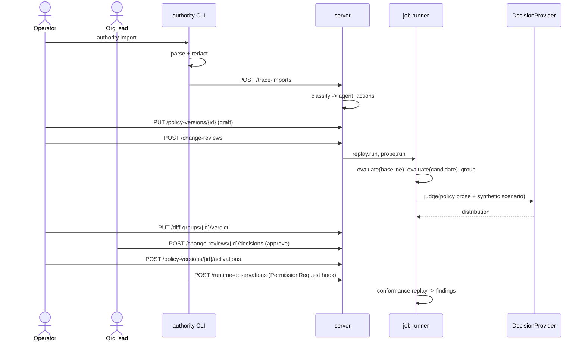
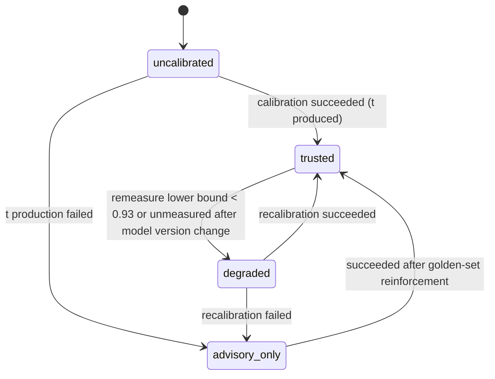
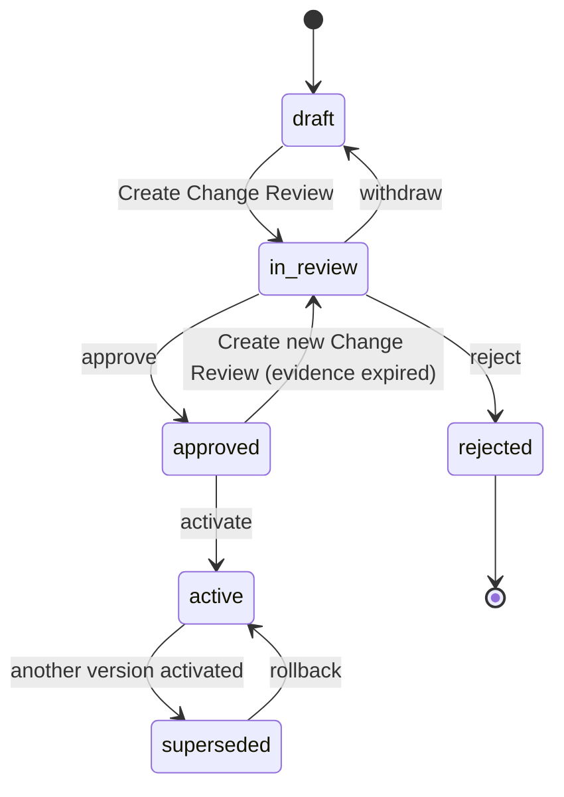
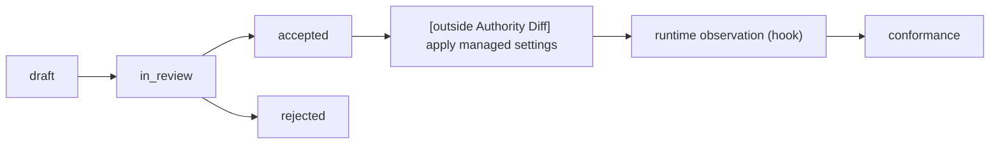
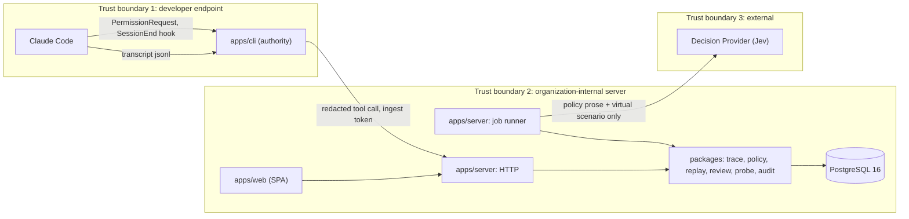

Sprint working document; internal labels in this file are kept as-is.

# Authority Diff design

Product design and implementation architecture for a product that builds approval evidence before applying Agent permission changes.

- Readers: the person who reviews and integrates the design, and the person or tool that implements one module at a time.
- Purpose: start implementation from this document alone, without newly deciding each module's location, names, contracts, or prohibitions.
- Kind: a combined explanatory document (chapters 1–17) and reference document (chapters 18–38).
- Written as of: 2026-09-21.
- Notation: places with weak evidence are written as "assumption not yet verified", and unknown values as `[needs confirmation: item]`.

## 1. One-line conclusion

Do not make the Authority Plane a control plane that intervenes on the Agent execution path.
Narrow it to a review tool that, before applying a permission-policy change, computes from real Agent work records what newly becomes allowed and what newly becomes blocked, and leaves that as approval evidence, and rename it Authority Diff.
Use Jev only as an offline probe that finds where a policy sentence can be read in two or more ways; do not use it to judge execution records.

## 2. What is wrong or weak in the current problem definition

I checked 5 reference articles and the TypeSafe official docs directly, and the 9 items below do not match the original thesis.

### 2.1 The premise "compile one policy to every runtime" is weak

Claude Code lists `allow` / `ask` / `deny` rules by tool name and argument pattern, and Codex CLI expresses the same with one `approval_policy` key plus an OS sandbox.
The two models have different units of expression, so converting one policy both ways leaves only the common denominator or changes the meaning.
There is a verification report that between Codex CLI 0.148.0 and 0.149.1 the `untrusted` value of `approval_policy` became a value that errors.
If the compile target's grammar changes at minor-version granularity, the compiler must keep chasing vendor changes.
Vendors have already solved distribution itself.
Claude Code settings have 5-level precedence with managed settings at the top, and `deny` can be added from any scope, but no scope can remove a `deny` added by another scope.

### 2.2 The name "Control Plane" presupposes execution-path intervention

If a 3rd-party service intervenes on every tool call, it must jointly own availability, latency, and security-product-level trust.
The reason for a 30–100 person organization to install a separate product that takes on that burden is weak.
Claude Code Auto Mode already occupies the same place.
Auto Mode evaluates three things on every tool call with a classifier (Sonnet 4.6) separate from the session model: scope departure, untrusted infrastructure, and prompt injection.
The runtime meaning judgment "is this action inside the work the user delegated" is being solved directly by the vendor, who holds more context.

### 2.3 Jev's `confidence` is not a value that means "0.95 is 95% correct"

In the TypeSafe docs, `confidence` is a statistic computed from the shape of a probability distribution.
The docs' 3-choice example approximates it as `(3 × max probability - 1) / 2`.
Applying the same formula to a 2-choice case, `confidence 0.95` corresponds to a max probability of 0.975.
Calibration must be measured against the max probability of `probabilities`, not `confidence`.
A `noul` answer has no `confidence` at all.
The vendor claim is monotonicity — "higher confidence, higher accuracy" — not a guarantee that per-bucket accuracy on our workload matches that value.
In one developer's experiment, the classification result stayed the same but splitting the policy sentence into several conditions dropped `confidence` from 0.91 to 0.28.
`confidence` reflects "how much the sentence is read as one thing" more than the probability of being correct.

### 2.4 You cannot read "AUTO ALLOW / ASK counts of the current policy" from past records

A Claude Code transcript (`~/.claude/projects/**/*.jsonl`) keeps `tool_use` and `tool_result` and does not keep whether an approval prompt appeared.
So the thesis's "CURRENT POLICY: AUTO ALLOW 7,931" is not a value read from past records; it must be a value computed by applying the baseline policy to the same records.
Whether the computed result matches actual runtime behavior must be measured separately, and this design measures it with `PermissionRequest` hook observations.
Assumption not yet verified: that transcripts do not keep whether a prompt was shown will be confirmed against real files in the initial measurement.

### 2.5 An Agent's shell input is a program, not a command

One developer measured 6,419 Bash calls in their own sessions: the median was 242 characters, and 11.0% were within 80 characters.
25.9% stuffed another language's program whole via heredoc or `python3 -c`, and of the remaining pure shell, 91.3% were compound commands.
An allowlist that looks only at the first word passed 13.2% more fragments than a judgment that looks at the whole fragment.
The same article's author rewrote the parser three times and still recorded 0.25% misclassification.
To claim that replay classifies a Bash action deterministically, "cannot analyze" must be a 1st-class result, and unanalyzable fragments must not be classified as read-only.

### 2.6 The base rate of dangerous events is close to 0

Another developer, before attaching a Jev runtime guard, scanned 4 months of 432 sessions and 5,887 unique Bash commands in 8 seconds, and all three shapes they meant to catch were 0.
In the same pass they never called Jev and found 2 misses in existing deterministic guards and blocked them with patterns.
A demo that shows "caught N dangerous actions" becomes a staging on synthetic data.
The meaningful value in real records is not attack-detection counts but "what kind of permission newly opens if we change the policy".

### 2.7 A 30–100 person organization does not buy a separate control plane

Organizations of this size typically standardize on 1–2 coding agents, so the utility of cross-runtime integration is not large.
The adoption path must have almost no install burden.
It should be at the level of reading existing logs with a CLI, bringing it up with docker compose once, and seeing the first result inside 1 hour.

### 2.8 Trace is data that is hard to send outside

Trace contains user prompts, code, paths, and sometimes secret literals.
When the earlier developer applied a filter that dropped lines that might be secrets, 78.7% (4,633) of all commands disappeared, and only 2 (0.03%) were clearly secret literals.
TypeSafe's privacy policy says personal data is stored and processed in the United States.
A design that sends trace to Jev stalls at the adoption step in domestic organizations.
Redaction must substitute literals, not drop lines, and the structure must not send real trace to a meaning-judgment model.

### 2.9 It is adjacent to earlier discarded directions

This topic is close to the earlier-discarded "rule-unit Agent Policy CI" and "harness-change gate".
Those two directions were folded because they overlapped existing tools or collapsed back into a personal developer tool.
To avoid the same result, the output must be an approval document the organization lead reads, not a developer's CI check, and the value must come from records of 2 or more principals.
This condition is in chapter 40's discard criteria.

## 3. Redefining the actual core problem

### 3.1 Judgment per candidate

| candidate | who, how often | on failure | current workaround and existing products | judgment |
| --- | --- | --- | --- | --- |
| A. cross-Agent permission setup | Agent operator, at adoption and version change | boundaries differ per runtime | hand-copy config files. vendor managed settings already solves distribution | not the core. a compiler is a structure that chases vendor grammar changes |
| B. organizational permission governance | organization lead, a few times a quarter | accountability unclear | verbal agreement, wiki docs | not a product feature; the decision the product serves |
| C. approval fatigue | every developer, daily | approval becomes ceremony and human judgment drops out | Auto Mode, sandbox auto-allow, `/less-permission-prompts` | a symptom. the vendor is attacking it directly, so a separate product overlaps |
| D. meaning interpretation of work scope | runtime, every tool call | executing an action that was not delegated | Auto Mode classifier | vendor territory at runtime. grounds exist only in offline policy checks |
| E. policy simulation, replay | operator and organization lead, every change | unintended permission widening is applied quietly | none. only a personal allowlist suggestion feature exists | the core mechanism |
| F. policy drift | operator, rare but high impact | the permission surface changes while the organization did nothing | `/status`, `claude auto-mode config` manual check | auxiliary. detectable as a byproduct of E |
| G. delegation decisions without evidence | organization lead, every time the autonomy range is widened | after an incident there is no record answering "why was this allowed" | none | the final problem definition. the combination of B + E + D(offline) + F |

Assumption not yet verified: search did not find a vendor feature or 3rd-party product that corresponds to E.
AI-gateway products deal with keys, budget, and rate limits at the LLM-request grain and did not look at tool-action permissions.

### 3.2 The redefined problem

The organization must keep widening Agents' autonomy range, but it makes those widening decisions without evidence.

- In Anthropic instrumentation, users approve 93% of approval prompts as-is.
  Because the approval procedure is already ceremony, pressure to widen the autonomy range keeps arising.
- The means to widen are provided by the vendor.
  Auto Mode, managed settings, and sandbox are those means.
- What is not provided is evidence for the decision.
  The organization lead approves without material that answers "what are our Agents actually doing now", "what newly becomes allowed if we apply this change", "where in the policy sentences can they be read two ways", and "after applying, does runtime move as the policy says".

Inconvenience in tool settings is a symptom; the cause is that there is no evidence to use for a delegation decision.

## 4. Primary Persona and JTBD

| role | who | relation to this product |
| --- | --- | --- |
| Primary user (operator) | Staff/Principal Engineer or Developer Productivity/Platform Lead who owns coding-agent adoption and setup. In a 30–100 person organization, 1 person holds the role without a dedicated team | draft the policy, run replay, judge diff groups |
| Decision maker and buyer | Head of Engineering (at this size, also the CTO) | read a Change Review summary in 5 minutes and approve or reject. the person who is accountable if an incident happens |
| Policy owner | Head of Engineering. joint signature if a security owner exists | the person who confirms the intent of policy sentences. sets expected results of scenarios |
| Affected developer | every developer who uses an Agent | install burden is 2 hooks and 1 CLI. no per-person ranking or surveillance screen |

Primary JTBD:

> When I must approve a change that widens Agent permissions, I want to confirm on one screen what that change newly allows in recent real work records and where the policy sentences are ambiguous, and leave an approval record with evidence.

If the interviewer is the Head of Engineering, it connects immediately to a scene they live.
On Team/Enterprise plans Auto Mode must be turned on by an administrator, and the person asked for that decision is the organization lead.

## 5. Why this is a problem now

- 2026-03-24 Claude Code Auto Mode announced, then expanded to Enterprise, API, and Max plans.
  Team/Enterprise requires an administrator to activate it, so widening the autonomy range became an organization-lead decision.
- 2026-06-05 Claude Code Desktop management policy unified with CLI/IDE, so organizations that did not explicitly turn it off became able to use bypass and auto mode by default.
  A case where the permission surface changed while the organization made no change.
- Part of the policy became natural language.
  The `autoMode` block writes four arrays in prose: `environment`, `allow`, `soft_deny`, `hard_deny`.
  Omitting `$defaults` from an array drops the default rules wholesale, and a developer-added `allow` can override the organization's `soft_deny`.
  Natural-language policy has no test harness.
- Runtime permission-judgment logic changes every week.
  The third week of 2026-09 Claude Code release includes fixes for several missed Bash permission checks and a 2.1.269 regression where long sessions started asking again for read-only git commands.
- Volume of behavior is growing.
  On material summarizing Anthropic's agentic-coding usage analysis, one prompt produces about 10 actions on average, and there are stretches that exceed 100.
  `[needs confirmation: source figure]`
  Dynamic workflows shipped with Opus 4.8 run hundreds of subagents in one session.
- The autonomy range widens as usage experience grows.
  In the same material the auto-approve rate rises from about 20% to 40% or more with usage experience.
  `[needs confirmation: source figure]`
- Organizations introducing a policy for the first time have no baseline to compare against.
  Past transcripts keep only that a tool call ran, not whether that run went through a human approval, so past runtime judgments cannot be reconstructed as a baseline.
  The first policy must be adopted by looking at "if we apply this policy to past behavior, what becomes needs-confirmation and deny", and adoption is not deployment or enforcement (ADR-0010).

## 6. What existing products solve and the remaining gap

| layer | representative products | what they solve | this product's stance |
| --- | --- | --- | --- |
| runtime permission rules and distribution | Claude Code permissions, managed settings. Codex approval, sandbox settings | rule evaluation, org-wide forced distribution | delegate. this product does not enforce rules |
| runtime meaning judgment | Claude Code Auto Mode classifier | per-tool-call scope departure, external send, injection judgment | delegate. do not occupy the same place |
| OS isolation | Seatbelt, bubblewrap, Landlock, seccomp | filesystem, network boundary | delegate. put here the boundary that works without interpreting shell strings |
| repository protection | GitHub rulesets, branch protection | protected-branch push, force-push block | delegate. this product only classifies as the `protected` zone |
| general-purpose policy engine | OPA/Rego, Cedar | rule evaluation in arbitrary domains | do not adopt. see chapter 34 ADR-0004 |
| identity and credentials | IAM, PAM, secret scanner | credential issue, revoke, leak detection | delegate. this product only classifies credential-path access |
| endpoint detection | EDR | process-level and above behavior detection | delegate |
| LLM request control | AI gateway | model access, budget, rate limit, request audit | no overlap. a layer that does not look at tool actions |
| Agent observation | Agent observability tools | trace, cost, latency | no overlap. a layer with no permission meaning |
| runtime guardrail | AI security platform | detect and block during execution | do not compete. the reason direction B was dropped |
| personal allowlist suggestion | Claude Code `/less-permission-prompts` | find read-only calls in a person's past transcript and suggest allowlist candidates | the closest feature. limited to personal, read-only, single runtime |

The remaining gap is three things.

1. There is no feature that, at organization grain, applies a permission-policy change before and after to real work records and compares.
2. There is no feature that checks whether natural-language policy sentences are read as intended and leaves that result as a regression.
3. There is no feature that contrasts the behavior runtime actually showed (auto-execute, prompt, block) with the organization's policy spec.

The layer this product owns is "permission spec, change evidence, conformance versus spec", and enforcement is entirely left to existing layers.

## 7. 3 different product directions

### 7.1 Direction A: Authority Compiler

- Concept: compile one intent-level policy to Claude Code managed settings and Codex settings, collect each endpoint's effective config, and display drift.
- Core workflow: write policy, compile, generate distribution files, collect per-endpoint effective config, display differences.
- What it solves: config duplication, inconsistent boundaries across runtimes.
- What it does not solve: the change's effect on real behavior, ambiguity of policy sentences.
- Differentiator: cross-vendor.
- Implementation difficulty: medium for the initial build, high maintenance cost.
  vendor config grammar changes every minor version.
- Demo quality: low.
  the output is config files.
- Product Engineer signal: weak.
  looks like a converter without problem discovery or metrics.
- Largest risk: overlaps vendor managed settings, and between two models with different expression units only the common denominator remains.

### 7.2 Direction B: Runtime Authority Gateway

- Concept: from the `PreToolUse` hook send every tool call to a central service and decide allow / ask / deny with deterministic rules and Jev.
- Core workflow: install hook, send tool call, return judgment, escalate to a person on low confidence.
- What it solves: approval fatigue, runtime meaning judgment.
- What it does not solve: evidence for which policy is right.
  it only makes one more judge.
- Differentiator: calibrated judgment and threshold.
- Implementation difficulty: high.
  must own availability, latency, and security verification together.
- Demo quality: high.
  a live blocking scene appears.
- Product Engineer signal: medium.
  the tech shows, but it is hard to answer "why use this when Auto Mode exists".
- Largest risk: overlaps the vendor head-on, and the base rate of detection targets in real records is close to 0.
- Latency calculation: if 1 developer produces 250 actions a day and each call costs 0.06 s hook startup + 0.45 s round-trip and Jev judgment, `250 × 0.51 = 128 s/day` is added to the execution path.
  With a frontier LLM (median 4.32 s), `250 × 4.38 = 1,095 s`, about 18 minutes.
  In this direction Jev's speed is decisive, but the direction itself is dropped for other reasons.

### 7.3 Direction C: Authority Diff

- Concept: `terraform plan` for a permission-policy change.
  Apply two policy versions to real work records, compute the difference, check interpretation stability of policy sentences with scenarios, and after apply contrast runtime observations with the spec.
- Core workflow: import trace, edit the policy draft, replay, judge newly allowed groups, scenario probe, approve and record, check runtime conformance.
- What it solves: delegation decisions without evidence, unintended permission widening, natural-language policy regression, spec versus runtime mismatch.
- What it does not solve: enforcement, blocking, real-time judgment, config distribution.
- Differentiator: outside the execution path so adoption risk is none, and real trace is not sent to a meaning-judgment model.
- Implementation difficulty: medium.
  the hardest part is the classifier that classifies a shell program into capabilities.
- Demo quality: high.
  can be demonstrated with one's own real Claude Code records.
- Product Engineer signal: strong.
  problem discovery, scope narrowing, metrics, backend design, and selective use of AI sit in one process.
- Largest risk: the vendor putting the same feature in a management console, and a high share of actions the classifier cannot analyze.

## 8. Chosen direction and why

Choose direction C.
No scores were assigned; the three directions were compared by how each answers the five criteria below.

| criterion | A. Compiler | B. Gateway | C. Diff |
| --- | --- | --- | --- |
| does the vendor already provide the same feature | provides (managed settings) | provides (Auto Mode) | not found |
| must we own execution-path availability | no | yes | no |
| can the hypothesis be verified on real data inside 7 days | needs several endpoints | no dangerous events so depends on synthetic data | possible early with own transcript |
| does it connect directly to the organization lead's decision | indirect | indirect | direct (the output is an approval document) |
| does the product stand without Jev | yes | no | yes (replay is entirely deterministic) |

Attach the minimum pieces of A and B onto C.

- From A: one export that emits only deterministic rules as a Claude Code settings fragment.
- From B: one hook observation that records only and does not intervene in judgment.

Also write the conditions under which a dropped direction becomes advantageous.

- If the organization runs 3 or more runtimes at once and vendor config grammar is stable, A's value rises.
- If the environment has a high base rate of adversarial input, such as an Agent that processes external input or a CI Agent, reconsider B.

## 9. Clear product boundary

### What it does

- Normalize Agent work records into runtime-independent `AgentAction`s and classify them into capabilities.
- Version an intent-level permission spec (`PolicyVersion`).
- Apply two specs to the same records, compute the difference, and group widened permissions for judgment.
- Apply policy sentences to scenarios, find where they can be read in two or more ways, and leave human-confirmed results as precedents.
- Contrast runtime-observed behavior with the spec and report mismatches.
- Leave approve, reject, activate, and rollback in an audit log that can detect tampering.

### What it does not do

- Does not block or approve tool calls.
- Does not distribute runtime settings to endpoints.
  it only creates export files; distribution is left to MDM or managed settings.
- Does not send execution records to a meaning-judgment model.
- Is not a product that detects secrets.
  redaction is a defense before storage.
- Does not evaluate or rank individual developers.
- Does not rebuild shell sandbox, IAM, or branch protection.

## 10. Product scope to finish inside 7 days

This MVP answers one question.

> If we apply this permission-policy change, of the behavior our Agents actually did in the last N days, what newly becomes auto-allowed and what newly becomes blocked.

### 10.1 Support scope

| item | decision |
| --- | --- |
| Agent runtime | Claude Code only. two input paths: transcript import and hook observation |
| action kinds | `Bash`, `Read`, `Edit`, `Write`, `MultiEdit`, `NotebookEdit`, `WebFetch`, `WebSearch`, `mcp__*` |
| capability | 11 kinds: `read`, `write`, `delete`, `execute`, `install`, `fetch`, `send`, `commit`, `push`, `rewrite`, `deploy` |
| required input | transcript directory, 1 policy document (default template provided), environment profile |
| meaning-judgment provider | 3 kinds: Jev, LLM baseline, fixture |
| deploy shape | 1 docker compose (server + PostgreSQL), 1 CLI |

### 10.2 Real, synthetic, mock distinction

| distinction | content |
| --- | --- |
| real | own Claude Code transcript import, classifier, policy eval, replay, Change Review, audit chain, hook observation, Jev API call (when access exists) |
| synthetic (show a `synthetic` label on screen and in reports) | trace generator mimicking a multi-person org, risk-action corpus, scenario template |
| mock | none. replace external deps with fixture adapters, but the demo uses the real adapter |
| deliberately deferred | Codex adapter, endpoint distribution, canary groups, multi-tenant, SSO, approver separation, meaning judgment in replay |

### 10.3 Must ship in 7 days

1. `authority import` reads Claude Code transcripts, redacts, and loads them on the server.
2. Classify actions into operation lists with tree-sitter-based shell analysis.
3. Policy version edit, validate, default template.
4. `version_diff` replay and diff groups.
5. Change Review screen, verdict, gate, approve and reject.
6. Scenario and precedent, probe run, Jev adapter and LLM baseline adapter.
7. Golden-set calibration and threshold, provider state transitions.
8. `PermissionRequest` and `SessionEnd` hooks, `conformance` replay and findings.
9. Audit hash chain and verify command.
10. Claude Code settings-fragment export (deterministic rules only).
11. 3 synthetic workloads and a benchmark report.
12. 1 core-journey E2E test and chapter 32 invariant tests.

### 10.4 Explicitly out of scope

- Blocking, approval proxy, real-time judgment.
- Codex CLI and other runtime adapters.
- Config distribution, collecting endpoint effective config.
- User accounts, SSO, role split, approver separation.
- Meaning judgment at the replay step (automatic judgment of mandate-scope exceedance).
- Notification integration (Slack, email).
- Multi-org, billing.

## 11. Core user workflow

1. The operator runs `authority import ~/.claude/projects` on a developer endpoint.
   After that the `SessionEnd` hook runs automatically per session.
2. The CLI parses the transcript, substitutes secret literals, and sends it to the server.
3. The server classifies tool calls into operation lists and stores them in `agent_actions`.
4. The operator checks action distribution by capability and zone against the current active policy on Authority Overview.
5. The operator makes a draft from the active version and edits rules.
   Example: "push to a trusted remote from ask to allow".
6. The operator creates a Change Review.
   The server runs a replay job and a probe job.
7. The operator judges each newly allowed group as one of `expected`, `investigate`, `unexpected`.
8. The operator checks scenarios that were read in two or more ways in the probe result and either fixes the policy sentence or confirms the expected result as a precedent.
9. When the gate's blockers become 0, the organization lead reads the summary and approves.
10. The operator activates the version and applies the export file to managed settings.
11. After that, conformance replay raises mismatches between runtime observations and the spec as findings.


## 12. Core screens and route structure

Route rule: resources are plural kebab-case, detail is `:id`, page component name is `<Resource><View>Page` (example: `ChangeReviewDetailPage`).

| route | page | the user's question |
| --- | --- | --- |
| `/` | `AuthorityOverviewPage` | what can our Agents do now, and what are they actually doing. If there is no Policy, Activity Overview answers "what shape is the imported behavior" |
| `/policies/:policyId/versions/:versionId` | `PolicyVersionEditorPage` | if I change this rule, what does the spec become |
| `/change-reviews/:reviewId` | `ChangeReviewDetailPage` | may I approve this change (or first adoption) |
| `/change-reviews/:reviewId/groups/:groupId` | `DiffGroupDetailPage` | what were this group's actions actually |
| `/scenarios` | `ScenarioListPage` | where in the policy sentences can they be read two ways |
| `/conformance` | `ConformanceFindingListPage` | is runtime moving as the spec says |

Auxiliary routes: `/trace-imports` (import history), `/audit` (audit events and chain verification state), `/login` (token input).

### 12.1 Authority Overview `/`

- Shown: active version number and activation time, capability × zone matrix (each cell has effect and action count for the last 14 days), `analyzability: none` share, unhandled conformance finding count, in-progress Change Review.
- Primary action: <!-- ko-product-output -->"변경 초안 만들기".
- Auxiliary action: click a cell to see that action list, change the window.
- empty: if there is no import, one line of CLI command and a button to apply the default template.
- loading: matrix skeleton.
  aggregation reads the latest replay-run result, so it displays inside 1 second.
- error: if there is no aggregation run or it failed, <!-- ko-product-output -->"집계 다시 실행" button and error code.
- Not shown: per-developer ranking, action-count trend chart, cost.
- Why it exists: answers the organization lead's first question "what is possible now" on one screen.
- Three appearances by Policy state (ADR-0010).
  If there is no Policy, Activity Overview (Session count, Action count, Capability and Target Kind distribution, Analyzability share, top programs, Remote Key hosts) and <!-- ko-product-output -->"첫 조직 정책 만들기".
  Effect and Zone are not computed because there is no Environment Profile.
  If there is only a draft and no accepted, the same Activity Overview below has <!-- ko-product-output -->"최초 정책 설정 계속하기" and the adoption preview (if first-adoption review finished, allow/ask/deny counts and shares when the proposed policy is applied).
  If there is an accepted, the matrix above and the change workflow.
  If there are 2 or more Policies, announce an unsupported state and automatically pick none of them.

### 12.2 Policy Version Editor

- Shown: rule table (capability, zone, condition, effect, mandate exception, rationale), environment profile, validation result, per-rule difference versus the base version.
- Primary action: <!-- ko-product-output -->"Change Review 생성".
- Auxiliary action: add and delete rules, run validation, JSON export and import.
- empty: if there are 0 rules, explanation that the default effect is `ask` and load template.
- loading: do not lock editing while saving; show save state only.
- error: on `If-Match` conflict, load the latest copy and show the difference.
  validation errors are shown on the rule row.
- Not shown: YAML text editor, Claude Code rule grammar.
- Why it exists: edit the spec at intent level, separated from runtime grammar.

### 12.3 Change Review Detail

- Shown: 3-line summary at the top (evaluated action count, widened action count and group count, narrowed action count).
  transition matrix (3×3).
  widening group list (severity, capability, zone, program, action count, session count, principal count, verdict).
  narrowing group list.
  probe summary (pass, conflict, ambiguous).
  gate blocker list.
- Primary action: group verdict.
  if blockers are 0, <!-- ko-product-output -->"승인".
- Auxiliary action: reject, waive probe (reason required), re-run replay.
- empty: if the difference is 0, show <!-- ko-product-output -->"행동 기록상 차이 없음" and the evaluated action count.
  approval is still possible in this case.
- loading: job progress (processed action count / total).
- error: on replay failure, error code and retry.
  if evidence is stale, the reason (baseline changed, window exceeded) and <!-- ko-product-output -->"새 review 생성".
- Not shown: unchanged action list, individual developer names.
- Why it exists: the product's central output.
  the organization lead reads only this screen's top summary and critical groups and decides.
- If Review Kind is `adoption` (first-adoption review), there is no baseline so there is no transition matrix and no severity.
  the top summary is evaluated action count and allow/ask/deny counts and shares, and below that the needs-confirmation group table and deny group table (Adoption Group: capability, zone, program composition, action count, session count, verdict).
  Verdict labels are intended restriction / hold / policy needs a fix, blockers are `adoption_unreviewed`, `adoption_investigate`, `adoption_unexpected`, and the primary action is <!-- ko-product-output -->"최초 정책 채택".
  After adoption, show the sentence <!-- ko-product-output -->"채택은 검토 기록이며 runtime 반영은 Authority Diff 밖" and do not say applied or active.

### 12.4 Diff Group Detail

- Shown: group signature, sample actions at most 10.
  each sample has redacted tool input, operation breakdown, each operation's zone and deciding rule, and the immediately preceding mandate sentence.
- Primary action: verdict and memo.
- Auxiliary action: make this group a scenario (the person writes the description themselves).
- empty: not applicable.
- loading: lazy load per sample.
- error: if the action was deleted after retention, show only signature and stats.
- Not shown: pre-redaction original text.
- Why it exists: to give an `investigate` verdict you must see the actual action.
- Adoption Group detail shows only the candidate decision and shows Program Summary (top programs and counts, distinct program count) as in-group evidence instead of a signature.
  Paths, command fragments, and ruleId live only inside the sample panel and the <!-- ko-product-output -->기술 세부 toggle.

### 12.5 Scenario List `/scenarios`

- Shown: scenario table (mandate sentence, action description, target rule, expected effect, recent judgment distribution, verdict).
  provider calibration panel (threshold, agreement lower bound, coverage, ECE, provider state).
- Primary action: confirm expected effect of `ambiguous` and `conflict` scenarios.
- Auxiliary action: author a scenario, generate from template, mark golden, re-run probe, run calibration.
- empty: bulk-generate-from-template button.
- loading: probe progress.
- error: on provider failure, `unevaluated` count and retry.
  if the provider is `degraded`, a banner.
- Not shown: the provider's raw `confidence`.
- Why it exists: the regression suite for natural-language policy.

### 12.6 Conformance Finding List `/conformance`

- Shown: finding table (kind: `violation`, `under_asked`, `over_asked`, capability, zone, runtime version, count, first and last time), hook observation coverage (session share), observation gap.
- Primary action: acknowledge a finding and memo.
- Auxiliary action: make a policy draft from a finding, filter by runtime version.
- empty: if there is no hook observation, the install command.
  if there is observation and findings are 0, show the evaluated action count.
- loading: table skeleton.
- error: if the observation gap exceeds 24 hours, display <!-- ko-product-output -->"관측 없음", not <!-- ko-product-output -->"이상 없음".
- Not shown: per-person finding counts.
- Why it exists: the only screen that confirms whether the prediction (replay) matches actual runtime.

## 13. Authority domain model

Do not use classic IAM's subject, resource, and action as-is.
A coding agent cannot enumerate resources in advance, and one tool call is a small program that exercises several permissions at once.
So the unit of permission is not a resource but "what kind of force is exercised where".

### 13.1 Glossary (`CONTEXT.md` draft)

`CONTEXT.md` is only a glossary and does not hold implementation detail.

**Principal**:
The person who delegated work to the Agent.
When stored, identified only as an HMAC value with salt.
_Avoid_: user, developer, owner

**Session**:
One Agent execution unit from start to end in one runtime.
In Claude Code, one transcript file.
_Avoid_: conversation, run

**Mandate**:
One piece of work the Principal delegated in natural language inside a Session.
Actions until the next Mandate belong to this Mandate.
_Avoid_: prompt, task, instruction, delegated authority

**Action**:
One tool call the Agent attempted to run.
Refers to the attempt itself, independent of whether it ran.
_Avoid_: command, event, tool use

**Operation**:
The smallest unit of a decomposed Action.
Exercises one Capability on one Target.
One Bash Action has several Operations.
_Avoid_: fragment, step, sub-command

**Capability**:
The kind of force an Operation exercises.
A fixed enum of 11 values.
_Avoid_: permission, action type, verb

**Target**:
The value, as read from the runtime, of what the Operation's effect reaches.
Path, host, VCS remote, package, MCP tool, and so on.
_Avoid_: resource, object

**Zone**:
A Target classified onto the organization's trust boundary.
A fixed enum of 8 values.
Computed from the Environment Profile and not stored.
_Avoid_: scope, boundary, trust level

**Environment Profile**:
The organization's declaration of facts needed to compute Zone.
Trusted hosts, credential paths, protected branches, and so on.
_Avoid_: config, trusted infrastructure, context

**Analyzability**:
How far the classifier confirmed the Operation's effect.
`full`, `partial`, `none`.
_Avoid_: opacity, confidence

**Reversibility**:
How far an Operation can be undone after it runs.
Decided by a table from Capability and Zone and not stored.
_Avoid_: risk, severity

**Effect**:
The result the spec assigns to an Operation or Action.
`allow`, `ask`, `deny`.
_Avoid_: decision (standalone use), verdict, permission

**Rule**:
A sentence that attaches one Effect to Capability, Zone, Reversibility, and Analyzability conditions.
Has at most 1 natural-language exception (Mandate Exception).
_Avoid_: policy (when referring to a single rule), statement

**Mandate Exception**:
A natural-language condition that, when the Rule's Effect is `ask`, becomes `allow` if the Mandate explicitly permits it.
_Avoid_: explicit authorization, override

**Policy**:
The vessel that holds the organization's permission spec.
A bundle of Versions.

**Policy Version**:
One immutable document.
Includes the Rule list and Environment Profile and is identified by content hash.
_Avoid_: revision, snapshot

**Decision**:
The evaluation result of applying one Policy Version to one Action.
Includes Effect and the grounding Rule.
Not stored; computed when needed.
_Avoid_: result, outcome

**Disposition**:
The behavior runtime actually showed for an Action.
`auto_executed`, `prompted`, `blocked`, `executed_prompt_unknown`.
_Avoid_: observed decision, runtime state

**Replay Run**:
1 run that applies a Decision Source to the same Action set.
`version_diff` compares two Policy Versions, `conformance` compares observed Disposition with a Policy Version, and `adoption` applies one candidate Policy Version with no baseline.

**Decision Source**:
The side that produces Effect in Replay.
A Policy Version or an observed Disposition.

**Diff Group**:
A unit that bundles Actions whose Effect changed under the same signature.
The unit a person judges.
_Avoid_: cluster, bucket

**Adoption Group**:
A bundle of Actions to which the candidate gave the same Effect (`ask` or `deny`) for the same Capability and Zone in an `adoption` Replay Run.
No program in the signature, and no severity.
_Avoid_: adoption cluster, ask bucket

**Program Summary**:
The top 10 programs of the signature Operation in an Adoption Group, with counts.
_Avoid_: top programs

**Widening / Narrowing**:
If the candidate's Effect is less restrictive than the baseline, Widening; if more restrictive, Narrowing.
_Avoid_: loosening, tightening, regression

**Verdict**:
The judgment a person gave a Diff Group or Adoption Group.
`expected`, `investigate`, `unexpected`.

**Change Review**:
The unit that decides whether to approve one Policy Version.
Bundles Replay Run, Probe Run, Verdict, and the approval record.
_Avoid_: approval request, PR

**Review Kind**:
The kind of Change Review.
`change` compares an accepted baseline with a candidate, and `adoption` single-evaluates one candidate when there is no accepted version.
The server sets it from whether an accepted version exists, not the request.
_Avoid_: review type, review mode

**Activity Overview**:
An activity summary aggregated from imported Actions only, with no Policy.
No Effect and no Zone.
_Avoid_: Activity Shape, dashboard

**Target Kind**:
A value that bundles Targets by kind in Activity Overview.
`workspace_path`, `other_path`, `vcs_remote`, `host`, `package`, `mcp`, `deploy_target`, `unknown`.
Decided from the Target itself without an Environment Profile.
_Avoid_: target type, resource kind

**Scenario**:
A virtual pair of a Mandate sentence and an Action description.
Tests interpretation of policy sentences.
_Avoid_: test case, example

**Precedent**:
A Scenario whose expected Effect a person confirmed.
The regression baseline of every subsequent Policy Version.
_Avoid_: golden case, fixture

**Probe Run**:
1 run that applies one Policy Version's prose expression to the whole Scenario set and obtains the Decision Provider's judgment distribution.

**Decision Provider**:
An external judge that answers a bounded question with a probability distribution.
Jev, LLM baseline, fixture.
_Avoid_: model, classifier, LLM

**Conformance Finding**:
A bundle of Actions whose observed Disposition disagrees with the active Policy Version's Effect.
_Avoid_: drift, incident, alert

Relations:

- A Session has several Mandates and a Mandate has several Actions.
- An Action has 0 or more Operations.
  An Action with 0 is excluded from evaluation.
- A Decision's Effect is the most restrictive value among per-Operation Effects.
- Precedent is a subset of Scenario.
- A Change Review references 1 Replay Run and 0–1 Probe Runs.

Collapsed concepts:

- DelegatedAuthority, ExplicitAuthorization, ImplicitTaskScope were reduced to two: Mandate and Mandate Exception.
- ExternalDisclosure, CredentialBoundary, ProductionImpact, and an Agent changing its own settings are all expressed as Zone values (`public_remote`/`unknown_remote`, `credentials`, `protected`, `agent_config`).
- SideEffect is included in Capability.
- Subject, Agent, HumanPrincipal are enough as Principal plus the Action's `runtime` field.
- Escalation is the same as Effect `ask`.

### 13.2 Capability

| Capability | meaning | recognition examples |
| --- | --- | --- |
| `read` | read without changing state | `cat`, `grep`, `ls`, `find` (no `-delete`, `-exec`), `git status`, `Read` tool |
| `write` | create, modify, move a file | `>`, `>>`, `tee`, `sed -i`, `mv`, `cp`, `chmod`, `Edit`, `Write` tool |
| `delete` | delete a file | `rm`, `rmdir`, `find -delete`, `git clean` |
| `execute` | run a program whose effects cannot be enumerated | unrecognized program, `python3 -c`, heredoc passed to an interpreter, `bash -c`, `eval`, `npm run`, `make`, `mcp__*` |
| `install` | add 3rd-party code | `pnpm add`, `pip install`, `cargo install`, `npx <pkg>` (`install` + `execute`) |
| `fetch` | bring in from outside | `curl`/`wget` GET, `git clone`, `git pull`, remote-to-local `scp`/`rsync`, `WebFetch`, `WebSearch` |
| `send` | send a payload outward | `curl -d`, `-F`, `-T`, `-X POST`, local-to-remote `scp`/`rsync`, `gh gist create`, `gh pr comment` |
| `commit` | change local VCS state | `git add`, `commit`, `merge`, `stash`, `tag` |
| `push` | publish or post an artifact | `git push`, `npm publish`, `docker push` |
| `rewrite` | overwrite history or work contents irreversibly | `git push --force`, `--force-with-lease`, `+refspec`, `git reset --hard`, `git branch -D` |
| `deploy` | apply to a running environment | `vercel`, `wrangler deploy`, `kubectl apply`, `terraform apply`, `helm upgrade` |

Classification rules:

- Make each simple command inside a pipeline, `&&`, `;`, subshell, `$(...)`, backtick, or process substitution into an Operation.
- Redirection adds a `write` Operation on the target path.
- Strip `sudo`, `env`, `time`, `nohup`, `timeout`, `xargs`, `find -exec` and classify the inner program.
- `bash -c '<string>'` parses the string again.
  Depth is up to 3; beyond that, `execute` + `none`.
- Passing inline code or a heredoc to an interpreter is classified `execute` + `none`.
  If a credential-path literal is found in the body, add a `read` (`partial`) on that path; if a URL literal is found, add a `send` (`partial`) on that host.
- If the Target contains a variable, Target is `unknown` and Analyzability is `partial`.
- A local Operation that does not name a Target (`pnpm test`, `make`, and so on) takes the current working directory as Target.
  A `cd` in the same command is reflected in the working directory of following fragments.
- If there is a parse-error node, classify the whole corresponding range as `execute` + `none`.
- In no case classify an unrecognized fragment as `read`.

### 13.3 Zone

Inspect the Target in the order below and use the first matching Zone.

| order | Zone | condition |
| --- | --- | --- |
| 1 | `credentials` | path matches `environment.credentialPaths` |
| 2 | `agent_config` | path matches `environment.agentConfigPaths` (`.claude/**`, `~/.claude/**`, `.codex/**`, `.mcp.json`, hook script) |
| 3 | `protected` | branch matches `protectedBranches` or the command matches `productionMarkers` |
| 4 | `workspace` | path is inside the Session's workspace root |
| 5 | `host` | any other local path |
| 6 | `trusted_remote` | host, remote URL, registry, MCP server matches `trustedRemotes` |
| 7 | `public_remote` | matches `publicRemotes` (public repository, publish to a public registry) |
| 8 | `unknown_remote` | every other remote target. also when Target is `unknown` and Capability is in the network family |

If Target is `unknown` and Capability is in the local family (`read`, `write`, `delete`, `execute`, `commit`), it is `host`.

### 13.4 Reversibility

| Capability | Zone | Reversibility |
| --- | --- | --- |
| `read`, `fetch`, `commit` | all | `reversible` |
| `write` | `workspace` | `reversible` |
| `write` | other | `recoverable` |
| `delete` | `workspace` | `recoverable` |
| `delete` | other | `irreversible` |
| `execute`, `install` | all | `recoverable` |
| `send`, `push` | `trusted_remote` | `recoverable` |
| `send`, `push` | `public_remote`, `unknown_remote`, `protected` | `irreversible` |
| `rewrite` | all | `irreversible` |
| `deploy` | `protected` | `irreversible` |
| `deploy` | other | `recoverable` |

Reversibility was made usable as a Rule condition to block the reading that "it can be undone with git" is approval evidence.

### 13.5 Evaluation rules

Do not depend on Rule order.

```text
evaluateOperation(op, version):
  zone          = resolveZone(op.target, version.environment)
  reversibility = REVERSIBILITY_TABLE[op.capability][zone]
  matched       = version.rules.filter(r => matches(r.match, op.capability, zone, reversibility, op.analyzability))
  effect        = any deny in matched  -> deny
                  any ask in matched   -> ask
                  any allow in matched -> allow
                  otherwise            -> ask            // defaultEffect
  decidingRule  = among matched, a rule whose effect is the same. prefer a rule with no Mandate Exception, then ruleId lexicographic. else null
  isMandateDependent = effect == ask and every ask rule among matched has a Mandate Exception

evaluateAction(action, version):
  if operations are empty, exclude from evaluation
  effect = the most restrictive value among per-operation effects (deny > ask > allow)
```

- An `allow` Rule grants permission and `ask` and `deny` Rules restrict.
  To narrow a wide `ask`, the conditions of that `ask` Rule must be narrowed directly.
- The default Effect is fixed as `ask` and cannot be changed in the document.
- Floor rules such as "if unanalyzable (`none`), at least `ask`" are not hidden in the engine; they sit as Rules in the default template.
  The user must be able to see and edit them.
- Mandate Exception is not evaluated in deterministic replay.
  Effect stays `ask` and only `isMandateDependent` is marked.
  If an `ask` Rule with no exception also matches, `ask` is kept even with an exception, so it is not marked.
- The Rule writing form is forced to "conservative default + 1 concrete exception".
  In the earlier experiment, a sentence split into several conditions kept the same judgment but dropped confidence from 0.91 to 0.28, and changing to the default-plus-1-exception form returned it to 0.91.
  Making rationale a required field is for the same reason.
  Adding 1 grounding sentence raised confidence from 0.28 to 0.86.

## 14. Where Jev is used and where it is not

### 14.1 Where it is used: Scenario Probe only

| question | answer |
| --- | --- |
| 1. why deterministic code is not enough | the inspection target is interpretation of natural-language sentences (Mandate, Mandate Exception, rationale). whether "handle it as you see fit" permits external posting cannot be judged by string rules |
| 2. why a frontier LLM is not needed | the needed output is a 3-choice probability distribution. a frontier LLM does not give a distribution directly so it must be approximated with 5 samples, which at 200 scenarios is `$0.31`, about 9 minutes. Jev is `$0.0076`, about 13 seconds. at this scale, though, the reason is receiving a distribution directly more than cost |
| 3. bounded choice | Q1 `effect`: `allow` / `ask` / `deny`. Q2 `mandate_reading`: `explicit` / `implied` / `not_authorized`. both questions are sent together in one request |
| 4. meaning of confidence | the provider's `confidence` value is not used. `pTop`, the max probability of the Q1 distribution, and `margin`, the gap between 1st and 2nd, are computed directly. `pTop` is interpreted as "how far this policy sentence is read as one thing by an independent reader" |
| 5. calibration measurement | on a golden set (200 or more) where a person confirmed expected Effect, compute per-`pTop`-bucket agreement, ECE (equal-mass 10 bin), and Brier score. stored per provider and per provider model version |
| 6. threshold | `thresholdTop`. produced from the golden set by the chapter 15 procedure. not inserted as a constant |
| 7. how the threshold is chosen | the smallest `t` such that the sample in the `pTop >= t` bucket is 80 or more and the Wilson 95% lower bound of agreement is 0.95 or more |
| 8. when below threshold | mark `ambiguous` and a person confirms expected Effect. do not escalate to a larger model. only show the LLM baseline judgment alongside |
| 9. when calibration changes | re-run the golden set when the provider model version changes or 1/week. if the lower bound falls below 0.93, change the provider state to `degraded` and require human confirmation on every Scenario |
| 10. if Jev cannot be used | finish the Probe Run as `partial` and leave those Scenarios `unevaluated`. can switch to the LLM baseline. replay and review are unaffected, and a probe waiver is left in audit with a reason |

In this place, no real trace goes out to Jev.
The values Jev receives are only the policy's prose expression and virtual Scenarios.

### 14.2 Where it is not used

| candidate | why not used | condition to reconsider |
| --- | --- | --- |
| real-time judgment of a tool call | overlaps Auto Mode, availability burden on the execution path, base rate close to 0 | environments with a high share of adversarial input, such as an Agent that processes external input |
| judging mandate-scope exceedance in replay | real Mandate and commands would have to be sent outside. there is no correct-answer label | when a provider can live inside the organization and 100 or more person-labeled exceedance cases have been collected |
| estimating meaning of unanalyzed shell fragments | replay results stop being reproducible. command originals go outside | none. reporting unanalyzable as-is is correct |
| computing Diff Group severity | decided by the Capability, Zone, Reversibility table | none |
| Scenario generation | template combination is enough. generation is assistant-layer work | if a type that templates cannot make is confirmed, generate with a frontier LLM and a person reviews |
| redaction | decided by pattern. a structure that sends a missed secret to a model is a contradiction | none |

### 14.3 provider abstraction

Only the concepts below leave the `probe` module.
Jev's `state`, `noul`, `confidence`, `criteria` stay inside the adapter.

```ts
export interface BoundedQuestion {
  readonly questionId: string;
  readonly instructions: string;
  readonly options: Readonly<Record<string, string>>; // option key -> rubric
}

export interface BoundedJudgment {
  readonly questionId: string;
  readonly choice: string;
  readonly distribution: Readonly<Record<string, number>>; // sums to 1 (tolerance 1e-6)
  readonly providerModel: string;                          // example: "jev-1.13.0"
  readonly latencyMs: number;
  readonly inputTokens: number | null;
}

export interface DecisionProvider {
  readonly providerId: ProviderId; // 'jev' | 'llm_baseline' | 'fixture'
  judge(input: {
    readonly context: string;                 // policy prose + scenario. trace forbidden
    readonly questions: readonly BoundedQuestion[];
    readonly signal: AbortSignal;
  }): Promise<Result<readonly BoundedJudgment[], ProbeError>>;
}
```

There are 3 adapters, so this seam is a real seam.
The LLM baseline adapter uses the vote share of 5 samples as the distribution.

## 15. threshold, calibration, escalation design

### 15.1 Calculation on sample size

The Wilson 95% lower bound of agreement, when errors are 0, is `n / (n + 3.8416)`.

| observation | lower bound |
| --- | --- |
| 30/30 (Weathernews PoC) | 0.887 |
| 22/22 (22 clear items from a personal experiment) | 0.851 |
| 73/73 | 0.950 |
| 119/120 | 0.954 |
| 118/120 | 0.941 |

To claim a lower bound of 0.95 you need 73 with 0 errors, 110 with 1, 142 with 2.
The two published experiments' figures are "all were correct", not "95% or more are correct".
The golden set is taken as 200 or more, and the hardening stage confirms whether 120 or more of them fall in the `pTop >= t` bucket.

### 15.2 Threshold production procedure

```text
input: golden set G = {(scenario, expectedEffect)}, provider p, model version v
1. judge the whole of G -> (pTop, judgedEffect)
2. inspect candidate t in {0.50, 0.55, ..., 0.95, 0.97, 0.99} ascending
3. B(t) = {pTop >= t}, n = |B(t)|, k = count in B(t) where judgedEffect == expectedEffect
4. adopt the first t with n >= 80 and wilsonLowerBound(k, n) >= 0.95 as thresholdTop
5. if none, thresholdTop = null, provider state = advisory_only
6. store coverage = n / |G|, ECE, Brier, per-bin (mean pTop, agreement, n) in provider_calibrations
```

### 15.3 Cost model

- 1 unnecessary human confirmation: about 1 minute.
- 1 missed ambiguity: incident investigation from the same sentence being read differently at runtime, at least 30 minutes.
  if it is an external send, it cannot be undone.
- The cost ratio is 30 times or more and judgment is an offline batch, so the threshold is set toward requiring more confirmation.
- Adopt even if coverage is below 0.4.
  A person confirming 120 of 200 takes about 2 hours, and once confirmed they remain as Precedents.

### 15.4 Scenario verdict

| condition | verdict | handling |
| --- | --- | --- |
| expected Effect present, `pTop >= t`, judgment agrees | `pass` | none |
| expected Effect present, judgment disagrees | `conflict` | gate blocker. fix the policy sentence or fix the expected Effect |
| `pTop < t` | `ambiguous` | warn if expected Effect exists, otherwise require confirmation |
| no expected Effect, `pTop >= t` | `suggested` | show the judged value as a suggestion. a person confirms in bulk |
| call failed | `unevaluated` | retry or waive |

If the policy is fixed in one place, re-run the whole Scenario set.
In the earlier experiment, fixing one item dropped the neighboring item's confidence from 0.62 to 0.39.

### 15.5 provider state



- `trusted`: automatically accept `pass` and `suggested`.
- `advisory_only`, `degraded`, `uncalibrated`: require human confirmation on every Scenario.
  the judgment distribution is shown as reference only.
- Leave a gap of rising at lower bound 0.95 and falling at 0.93 so the state does not flip repeatedly at the boundary.

Limit: the golden set's label is 1 policy owner's intent.
"Accuracy" is agreement with the owner's intent, not with an objective correct answer, and the product's purpose is also to confirm whether the owner's intent is conveyed in the sentence.

## 16. historical replay and policy rollout design

### 16.1 replay procedure

```text
runReplay(baseline, candidate, window):
  1. premise check: classifierVersion of actions in the window must equal the current value. if different, require a reclassify job first
  2. inputsHash = sha256(baselineRef, candidateRef, window, filters, classifierVersion, action count, last actionId)
  3. stream actions in (occurredAt, id) keyset batches of 5,000
  4. for each action, effectA = source(baseline), effectB = source(candidate)
     - policy_version source: evaluateAction
     - observed_runtime source: map disposition to effect
  5. accumulate matrix[capability][zone][source][effect], accumulate transitions[effectA][effectB]
  6. if effectA != effectB, record as a changed action and compute group signature
  7. per-group aggregate, severity, select at most 10 samples (most recent 5 + oldest 5)
  8. resultHash = sha256(sorted group aggregates + transitions)
```

- group signature: `(transition, capability, zone, program, decidingRuleId)`.
  Among Operations whose Effect changed, take the one that was most restrictive in the baseline as the basis.
- severity `critical`: Widening and Zone is one of `credentials`, `agent_config`, `protected`, `public_remote`, `unknown_remote`, or Reversibility is `irreversible`, or Analyzability is `none`.
  otherwise `normal`.
- Decisions are not stored.
  what is stored is aggregates, changed actions' (actionId, groupId, effectA, effectB), and samples.
- If a completed run with the same `inputsHash` exists, do not run again; return that run.

### 16.2 conformance replay

The same procedure with baseline `observed_runtime` and candidate the active Policy Version.

| Disposition | how derived | corresponding Effect |
| --- | --- | --- |
| `prompted` | a `PermissionRequest` observation in the same Session whose tool name and input hash match. or `tool_result` is a human rejection | `ask` |
| `auto_executed` | ran in a Session where the hook was installed and there is no `PermissionRequest` observation | `allow` |
| `blocked` | `tool_result` is the runtime's block message | `deny` |
| `executed_prompt_unknown` | ran in a Session that had no hook | exclude from comparison. except if the spec is `deny`, then `violation` |

| finding kind | condition | meaning |
| --- | --- | --- |
| `violation` | spec `deny`, actually ran | a forbidden behavior ran |
| `under_asked` | spec `ask`, Disposition `auto_executed` | runtime is looser than the spec. missing `$defaults`, an `ask` rule skipped in the sandbox, version regression shows up here |
| `over_asked` | spec `allow`, Disposition `prompted` | runtime is stricter than the spec. the measured value of approval fatigue |

### 16.3 Policy Version states



| transition | premise | actor | evidence required | rollback behavior |
| --- | --- | --- | --- | --- |
| `draft -> in_review` | document validation passed. no `in_review` version on the same Policy | admin | none. the document is immutable from this point | withdraw returns to `draft` |
| `in_review -> approved` | gate blocker 0 | admin (organization-lead token) | completed Replay Run, Probe Run or waiver reason, Verdict on every Widening group | not applicable |
| `in_review -> rejected` | reason entered | admin | reason | clone a new draft from this version |
| `approved -> active` | the review's baseline equals the current active. within 14 days after review approval | admin | approved Change Review id | the previous active becomes `superseded` |
| `superseded -> active` | a version that was active in the past. reason entered | admin | rollback reason | switch immediately with no new review. automatically run conformance replay |

SHADOW, CANARY, ENFORCE, MONITOR were not put as states.
This product does not enforce, so there is no ENFORCE, and observation is not a state but conformance replay that keeps running against the active version.
CANARY is the settings-distribution tool's job, so it is out of scope.

The V1 lifecycle (`docs/cutline.md` chapter 5, ADR-0010) uses only four states, without `approved`, `active`, `superseded`.



- The first version is made as `draft`, and if there is no accepted version the Change Review's kind becomes `adoption` (first-adoption review).
  One candidate is applied to past Actions with no baseline, and past runtime approval is not inferred.
- `accepted` is a review result, not deployment or enforcement.
  The step that applies it to runtime settings is outside Authority Diff, and Authority Diff does not store whether it was applied.
  Do not use accepted as active, applied, or enforced.
- After apply, runtime observation and conformance replay report differences between actual behavior and the accepted version as findings.

### 16.4 Change Review states and gate

Change Review states: `collecting_evidence -> ready -> approved | rejected`, and from a non-terminal state `stale`.

`stale` transition conditions: the active version differs from the review's baseline, or the end of the trace window is older than 14 days.

gate blocker codes:

| code | condition |
| --- | --- |
| `replay_incomplete` | Replay Run is not completed |
| `replay_failed` | Replay Run failed |
| `classifier_version_mismatch` | there is an action in the window that needs reclassification |
| `widening_unreviewed` | there is a Widening group with no Verdict |
| `widening_investigate` | there is a group left as `investigate` |
| `widening_unexpected` | there is an `unexpected` group. to approve, the policy must be fixed and a new review made |
| `adoption_unreviewed` | (kind `adoption`) there is an Adoption Group with no Verdict. every ask and deny group is in scope |
| `adoption_investigate` | (kind `adoption`) there is an Adoption Group left as `investigate` |
| `adoption_unexpected` | (kind `adoption`) there is an `unexpected` Adoption Group. to adopt, the policy must be fixed and a new review made |
| `probe_incomplete` | Probe Run is not completed and there is no waiver |
| `precedent_conflict` | there is a Precedent with `conflict` verdict |
| `evidence_stale` | the stale conditions above |

Narrowing groups are not blockers.
The summary shows count only.

### 16.5 First-adoption replay (`adoption`)

A single evaluation that applies one candidate when there is no accepted version (ADR-0010).

```text
runAdoption(candidate, window):
  1. premise check is the same as 16.1
  2. inputsHash = sha256('adoption', candidateContentHash, window, classifierVersion, action count, last actionKey)
  3. stream actions as in 16.1
  4. for each action, effect = evaluateAction(candidate). exclude if Operations are 0. do not use baseline or observed_runtime
  5. accumulate effectCounts[effect], analyzability, cells[capability][zone][effect]
  6. group only actions whose effect is ask or deny by signature (effect, capability, zone). allow is aggregated only
  7. per group: action count, session count, Program Summary (top 10), distinct program count, target summary (top 5), headline, sample. no severity
     sort deny → ask → action count descending → session count descending → groupKey
  8. resultHash = sha256(stats + group aggregates in groupKey order (headline excluded) + (actionKey, groupKey, effect) in actionKey order)
```

- Do not turn the transcript's observedOutcome (`executed`, `rejected_by_human`, `blocked_by_runtime`) into Effect.
  `executed` may have run after a human approved, so it cannot be a baseline.
- The reason program is not in the signature is that Rules do not look at program.
  One group must equal one Policy judgment so the Verdict "was this restriction intended" returns to the Policy.
  program is shown inside the group as Program Summary.
- If a completed run with the same `inputsHash` exists, do not run again; return that run.

## 17. Back-of-envelope calculation

### 17.1 Assumed organization

| item | value | basis |
| --- | --- | --- |
| engineers | 60 people | assumption |
| daily Agent users | 42 people (70%) | assumption |
| Mandates per 1 person | 25 / day | assumption |
| Actions per Mandate | 10 | mean from Anthropic analysis summary material. `[needs confirmation: source figure]` |
| storage size of 1 Action | 2 KB | estimate adding operation JSON and metadata to Bash-input median 242 characters, p90 1,323 characters |
| default-mode prompt share | 15% of Actions | assumption |
| prompt approval rate | 93% | Anthropic instrumentation |

### 17.2 Calculation

```text
Action           = 42 × 25 × 10            = 10,500 /day = 231,000 /month (22 days)
storage          = 10,500 × 2 KB           = 21 MB/day = 462 MB/month = 5.5 GB/year, about 8.2 GB/year including index
ingest throughput= 10,500 / (8h × 3600)    = 0.36 /s, peak 20× = 7.3 /s
approval prompt  = 10,500 × 0.15           = 1,575 /day (37.5 per 1 person)
click delay      = 1,575 × 8 s             = 3.5 hours/day (org total)
away-from-desk wait = 1,575 × 0.3 × 3 min  = 23.6 hours/day of Agent idle (30% occur while away, wait 3 min assumed)
classify         = 0.5 ms/each             -> 1 ten-thousand 2 thousand in 6 s, 23 ten-thousand /month in 116 s (1 time at import)
replay eval      = 50 µs/each × 2 version  -> 23 ten-thousand /month in 23 s, 1 ten-thousand 2 thousand in 1.2 s
replay read      = 231,000 × 600 B         = 139 MB
probe 1 run      = 200 scenario × 900 token = 180,000 token × $0.042/M = $0.0076, 12.5 s if 8 concurrent at 0.5 s
probe monthly cost = 14 runs (1/week + 10 reviews) × $0.0076 = $0.11, 2,800 calls
LLM baseline     = $0.00031/each × 200 = $0.062/run, 108 s. with 5-sample sampling $0.31/run, 540 s
model-call ratio = Action 231,000 : calls 2,800 = 82 : 1. replay judgment is 0 calls
```

### 17.3 Decisions from the calculation

- At ingest 0.36/s, peak 7/s, no message broker is needed.
  batch insert is enough.
- One import request is at most 1,000 Actions and classify takes 0.5 s, so it is handled synchronously.
- Replay takes tens of seconds at organization scale, so it runs as an async job and progress is shown.
- Probe is 200 external calls, so it runs as a job.
- 1/week calibration remeasure needs a periodic job.
  handled with a PostgreSQL-based job-queue schedule.
- At 20× growth (462 ten-thousand Actions /month, 164 GB /year) replay eval is 462 s.
  at that point put in (capability, target) signature memoization and monthly table partitions.
  not now.
- Event replay and event sourcing are not needed.
  `agent_actions` is an immutable fact table and replay results are reproduced from the input hash.
- Explaining the reason for choosing Jev as cost is wrong.
  at offline-probe scale the monthly cost gap between Jev and LLM is under 1 dollar.
## 18. Final architecture overview

### 18.1 Composition



### 18.2 Decisions

| item | decision | reason |
| --- | --- | --- |
| structure | modular monolith. pnpm workspace + Turborepo monorepo, deploy unit is 1 server | throughput 0.36/s. no problem that splitting services would solve |
| process | 1 Node 22 process runs HTTP and the job runner together. later separable with `AUTHORITY_SERVER_ROLE=all\|http\|worker` | minimize operational surface |
| database | PostgreSQL 16, Drizzle ORM, drizzle-kit migration | JSONB, `SKIP LOCKED` jobs, a single node is enough through 20× growth |
| job | pg-boss (PostgreSQL-based queue) behind a `JobQueue` port. tests use an in-memory adapter | retry, schedule, singleton key without a broker. 2 adapters so a real seam |
| HTTP | Hono + `@hono/zod-openapi`, REST JSON | three client kinds — CLI, hook, web — use the same contract. do not mix an RPC style |
| web | Vite + React + TanStack Router + TanStack Query. server serves the build as static | internal tools do not need SSR |
| CLI | Node single-file bundle (tsup) | hook startup inside 60 ms |
| shell analysis | `web-tree-sitter` + `tree-sitter-bash` WASM | parse that is robust to errors, no native build. assumption not yet verified: the WASM distribution and parse performance are confirmed in the initial spike |
| auth | 2 fixed bearer tokens (`admin`, `ingest`). store token hashes in the DB | single-tenant MVP. SSO is out of scope |
| deploy | docker compose (server + postgres). organization-internal VM or laptop | trace does not leave the organization |
| storage strategy | state tables are canonical. `agent_actions` is an append-only fact. audit is a separate hash chain | do not use event sourcing or CQRS. the state history to restore already remains as Policy Version immutable documents |

### 18.3 Sync and async paths

| path | method | budget |
| --- | --- | --- |
| trace import (at most 1,000 Actions) | sync. parse validate, re-check redaction, classify, insert | p99 1.5 s |
| receive runtime observation | sync batch insert | p99 200 ms |
| policy edit, validate, Verdict, approve | sync | p99 300 ms |
| replay, probe, calibration, reclassify | async job. state in DB, progress by polling | replay 1 ten-thousand 2 thousand inside 5 s |
| hook execution (endpoint) | sync but does not block Agent execution. append to a spool file then try to send inside 300 ms. `SessionEnd` import starts a separate background process and exits immediately | overall 400 ms, exit 0 even on failure |

### 18.4 transaction boundary

- One use case is one transaction.
- State change, audit-event record, and job enqueue are handled together in the same transaction.
  `[needs confirmation: how pg-boss connects an external transaction executor]`
- Do not write another module's table directly in the same transaction.
  When needed, the upper module (`review`) passes a transaction handle to a lower module's public function.

### 18.5 Deterministic and probabilistic regions

| what must be deterministic | where probabilistic AI may be used |
| --- | --- |
| transcript parse, redaction, classify, Zone computation, policy eval, replay, group and severity, gate, export, audit chain | Scenario Probe judgment distribution |

## 19. bounded context and module boundary

### 19.1 dependency graph


Arrows mean "depends on".
Arrows to `kernel`, and direct imports to a package that already has a path (example: `action` from `replay`), are omitted from the drawing.
`contracts` imports only every business package's `schema.ts`.
The exact allow list is 21.1's `ALLOW`, and every import not on it is forbidden.

### 19.2 module specification

| module | responsibility | owned concepts | owned tables | public interface | published events | allowed deps | forbidden | what does not leave the boundary |
| --- | --- | --- | --- | --- | --- | --- | --- | --- |
| `kernel` | shared minimum types | `Result`, branded id, `IsoTimestamp`, `Effect`, error base types, ports (`Clock`, `IdGenerator`, `Logger`, `TransactionRunner`, `EventSink`, `JobQueue`) | none | `index.ts` | none | none | every package | business concepts |
| `platform` | technical foundation | config, db client, logger, job queue, http client, clock, id implementations | `jobs` (owned by pg-boss), `api_tokens`, `idempotency_keys` | `index.ts`, `testing.ts` | none | `kernel` | business packages | `process.env`, driver objects |
| `action` | classify a tool call into Operations | Action, Operation, Capability, Target, Analyzability | none | `index.ts` (`createClassifier`, `CLASSIFIER_VERSION`, `CONTROL_TOOL_NAMES`), `schema.ts` | none | `kernel` | `platform`, all I/O | tree-sitter node, parser internals |
| `trace` | collect and query records | Session, Mandate, Principal, Disposition source data | `trace_imports`, `agent_sessions`, `mandates`, `agent_actions`, `runtime_observations` | `index.ts` (`importTrace`, `recordObservations`, `ActionReader`), `client.ts` (transcript parser, redactor), `schema.ts`, `events.ts` | `trace.import.completed`, `trace.observation.recorded` | `kernel`, `action`, `platform` | `policy`, `replay`, `review`, `probe` | original transcript format, pre-redaction strings |
| `policy` | permission spec and evaluation | Policy, Policy Version, Rule, Zone, Reversibility, Environment Profile, Decision | `policies`, `policy_versions`, `policy_activations` | `index.ts` (`evaluateAction`, version CRUD, `transitionVersion`, `exportClaudeCodeSettings`, `renderPolicyProse`), `schema.ts`, `events.ts` | `policy.version.*` | `kernel`, `action`, `platform` | `trace`, `replay`, `review`, `probe` | Claude Code rule grammar (exists only inside export output) |
| `replay` | compare two Decision Sources | Replay Run, Diff Group, Conformance Finding | `replay_runs`, `replay_diff_groups`, `replay_changed_actions`, `conformance_findings` | `index.ts` (`requestReplay`, `getReplayRun`, `listDiffGroups`, finding query), `schema.ts`, `events.ts` | `replay.run.*`, `conformance.finding.detected` | `kernel`, `action`, `policy`, `trace`, `platform` | `review`, `probe` | do not copy-store Action originals (reference by id only) |
| `probe` | check interpretation of policy sentences | Scenario, Precedent, Probe Run, Decision Provider, calibration | `scenarios`, `probe_runs`, `probe_results`, `provider_calibrations` | `index.ts` (scenario CRUD, `requestProbe`, `runCalibration`, provider state), `schema.ts`, `events.ts` | `probe.run.*`, `probe.provider.state_changed` | `kernel`, `action` (enum), `policy`, `platform` | `trace`, `replay`, `review` | Jev-specific fields (`state`, `noul`, `confidence`), API key |
| `review` | approval workflow | Change Review, Verdict, gate | `change_reviews`, `review_verdicts` | `index.ts` (`createChangeReview`, `setVerdict`, `decide`, `getGate`), `schema.ts`, `events.ts` | `review.change.*` | `kernel`, `policy`, `replay`, `probe`, `platform` | direct `trace` access | lower modules' tables |
| `audit` | records that can detect tampering | Audit Event, hash chain | `audit_events` | `index.ts` (`EventSink` implementation, `verifyChain`, query) | none | `kernel`, `platform` | every business package | payload interpretation (stored opaque) |
| `contracts` | HTTP contract | request/response DTO, error envelope | none | `index.ts` | none | `kernel`, each package's `schema.ts` | all infra code | none |

The only module that consumes events is `audit`.
Flow control between modules is handled by direct calls from an upper module and job enqueue, not event subscription.
There is no in-process pub/sub.

### 19.3 package internal structure

Every package has the same shape.

```text
packages/<name>/
  index.ts        public entry. create<Name>Module(deps) and public types
  schema.ts       public entry. Zod schema referenced by other packages and contracts (imports only zod, kernel, other packages' schema.ts)
  events.ts       public entry. names and payload schemas of published events
  client.ts       public entry. (trace only) pure code that runs on the endpoint
  testing.ts      public entry. fakes and builders used by other packages' tests
  lib/
    domain/       pure functions and values. no I/O, time, randomness, logging
    app/          use cases and ports
    infra/        port implementations. drizzle tables, external API clients
  tests/          tests and fixtures that import entry points only
```

Only files at the root are public; every subfolder is private.
When adding an entry point, add a file at the root; do not create an `index.ts` for re-export inside `lib/`.

## 20. repository and directory structure

A monorepo that uses a multi-package workspace.

```text
authority-diff/
  AGENTS.md                     agent shared rules. CLAUDE.md is a symlink of AGENTS.md
  CONTEXT.md                    glossary (13.1)
  package.json  pnpm-workspace.yaml  turbo.json  tsconfig.base.json
  eslint.config.js  .dependency-cruiser.cjs  docker-compose.yml
  apps/
    server/
      src/
        main.ts
        composition-root.ts     module assembly. create in dependency order
        http/
          app.ts
          middleware/           request-id, auth, idempotency, error-mapper
          routes/               1 file per resource: change-reviews.routes.ts
        jobs/                   job name to handler wiring: replay-run.job.ts
      tests/                    HTTP contract tests, job wiring tests
    web/
      src/
        main.tsx  router.tsx
        routes/                 file-based route: change-reviews.$reviewId.tsx
        features/<segment>/     screen-unit components, query hooks
        shared/                 ui primitive, api-client, format
      e2e/                      Playwright
    cli/
      src/
        main.ts
        commands/               import.command.ts, hook.command.ts, install-hooks.command.ts, verify-audit.command.ts
        spool/                  local hold on send failure
        output.ts               the only allowed console-output point
  packages/
    kernel/ platform/ contracts/ action/ trace/ policy/ replay/ probe/ review/ audit/
  tests/
    corpus/                     labeled command corpus, risk-action corpus, transcript fixtures
    workloads/                  synthetic trace generator and 3 workload definitions
    eval/                       classifier benchmark, calibration eval scripts (*.eval.ts)
  docs/
    design.md                   this document
    adr/                        0001-*.md
    evidence/                   day1-corpus.md, benchmark reports
  scripts/                      check-generated.ts, seed-demo.ts
  drizzle/                      generated migrations. direct edit forbidden
```

| directory | what goes in | what must not go in | import direction |
| --- | --- | --- | --- |
| `apps/server` | assembly, HTTP mapping, job wiring | business rules, SQL | every package's entry point |
| `apps/web` | screens | reimplementing business rules, server code | `contracts`, `kernel` |
| `apps/cli` | commands, spool, output | classify, policy eval | `contracts`, `kernel`, `trace/client.ts` |
| `packages/*` | module | accessing another package's `lib/` | 19.1 graph |
| `tests/*` | evaluation material and scripts that cross package boundaries | product code | package entry points |
| `drizzle/` | generated output | SQL written by a person | none |

## 21. architecture dependency rules

The enforcement means are one dependency-cruiser and one ESLint.
ArchUnitTS is not added.
If the source of boundary rules becomes two, you would have to re-judge which is right.
Both checks are bound into `pnpm check` (typecheck, lint, `lint:boundaries`, unit test) and are required in CI.

### 21.1 dependency-cruiser rule (`error`)

| rule name | content |
| --- | --- |
| `entrypoint-boundary-from-app` | `apps/*` imports only a package's root files |
| `entrypoint-boundary-across-packages` | a package imports only another package's root files. inside its own package is free |
| `tests-through-entrypoints` | `<pkg>/tests/**` imports only entry points of any package. own `lib/` is also forbidden |
| `tests-folder-is-private` | `tests/` fixtures are imported only from tests |
| `no-circular` | cycles forbidden |
| `package-layering` | package-to-package imports not on the 19.1 graph are forbidden. specified as a per-package allow list |
| `domain-is-pure` | `lib/domain/**` cannot import `lib/app`, `lib/infra`, `@authority/platform`, node builtins, or third-party other than `zod` |
| `app-has-no-infra` | `lib/app/**` cannot import `lib/infra`, `@authority/platform`, or third-party SDKs |
| `schema-entry-is-light` | `schema.ts` and files it depends on import only `zod`, `@authority/kernel`, and other packages' `schema.ts` |
| `client-entry-is-pure` | `trace/client.ts` and files it depends on cannot import `lib/infra`, `@authority/platform`, `drizzle-orm`, `postgres` |
| `web-only-contracts` | `apps/web` imports only `@authority/contracts`, `@authority/kernel` |
| `cli-narrow` | `apps/cli` imports only `@authority/contracts`, `@authority/kernel`, `@authority/trace/client` |

A procedure that proves the rules actually fail is in the root scaffold's completion conditions.
Deliberately insert a violating import, confirm failure, revert, then confirm pass.

`package-layering` excerpt:

```js
const ALLOW = {
  kernel: [],
  platform: ['kernel'],
  contracts: ['kernel', 'action', 'policy', 'trace', 'replay', 'probe', 'review'], // schema-entry-is-light restricts to schema.ts
  action: ['kernel'],
  trace: ['kernel', 'action', 'platform'],
  policy: ['kernel', 'action', 'platform'],
  replay: ['kernel', 'action', 'policy', 'trace', 'platform'],
  probe: ['kernel', 'action', 'policy', 'platform'],
  review: ['kernel', 'policy', 'replay', 'probe', 'platform'],
  audit: ['kernel', 'platform'],
};
const layering = Object.entries(ALLOW).map(([pkg, allowed]) => ({
  name: `package-layering-${pkg}`,
  severity: 'error',
  from: { path: `^packages/${pkg}/` },
  to: { path: '^packages/([^/]+)/', pathNot: `^packages/(${[pkg, ...allowed].join('|')})/` },
}));
```

### 21.2 ESLint restrictions (`error`)

| restriction | allowed location |
| --- | --- |
| `process.env` access | `packages/platform/lib/infra/config.ts`, `apps/cli/src/config.ts` |
| `drizzle-orm`, `postgres` import | `packages/*/lib/infra/**`, `packages/platform/**` |
| `pg-boss` import | `packages/platform/lib/infra/**` |
| `hono` import | `apps/server/**` |
| `fetch` and HTTP client use | `packages/platform/lib/infra/http-client.ts`. adapters receive this client injected |
| external SDK import | `packages/*/lib/infra/**` |
| `console.*` | `apps/cli/src/output.ts` |
| `new Date()`, `Date.now()`, `Math.random()`, `crypto.randomUUID()` | `packages/platform/lib/infra/**` |
| `web-tree-sitter` import | `packages/action/lib/**` |

### 21.3 database access rules

- Table definitions live only in the owning package's `lib/infra/tables.ts` and are not exported from the entry point.
  other packages have no means to import them.
- Foreign keys are only between tables of the same module.
  a cross-module reference is an id column with an index.
- Another module's data is read through that module's public function.
  `replay` reads with `trace`'s `ActionReader.streamActions`.
- `drizzle.config.ts` is the only exception and reads `packages/*/lib/infra/tables.ts` by glob.

## 22. naming convention overall

### 22.1 Files

Every file is kebab-case.

| kind | rule | example |
| --- | --- | --- |
| domain values, pure functions | noun or verb phrase, no suffix | `policy-version.ts`, `evaluate-action.ts`, `resolve-zone.ts` |
| use case | `<verb>-<noun>.use-case.ts` | `request-replay.use-case.ts` |
| port | `<noun>.port.ts` | `policy-version-repository.port.ts`, `decision-provider.port.ts` |
| adapter | `<port name>.<tech>.ts` | `policy-version-repository.drizzle.ts`, `decision-provider.jev.ts`, `decision-provider.llm-baseline.ts`, `trace-source.claude-code-transcript.ts` |
| fake | `<port name>.fake.ts` | `decision-provider.fake.ts` |
| Zod schema | entry is `schema.ts`, internals `<noun>.schema.ts` | `policy-document.schema.ts` |
| drizzle table | `tables.ts` | 1 per package |
| HTTP route | `<resource plural>.routes.ts` | `change-reviews.routes.ts` |
| job handler | `<job name>.job.ts` | `replay-run.job.ts` |
| CLI command | `<command>.command.ts` | `import.command.ts` |
| React page | `<route path>.tsx`, component is PascalCase | `ChangeReviewDetailPage` inside `change-reviews.$reviewId.tsx` |
| test | see 32.2 | `evaluate-action.prop.test.ts` |

### 22.2 TypeScript symbol

| kind | rule | example |
| --- | --- | --- |
| type, interface | PascalCase, no `I` prefix | `PolicyVersion`, `DiffGroup` |
| Zod schema | `<Type>Schema`, type is `z.infer` | `PolicyRuleSchema`, `type PolicyRule` |
| branded id | `<Entity>Id` | `PolicyVersionId`, `ActionId` |
| use case factory and function type | `create<Verb><Noun>UseCase`, type `<Verb><Noun>` | `createRequestReplayUseCase`, `RequestReplay` |
| use case input and output | `<Verb><Noun>Command`, `<Verb><Noun>Result` | `RequestReplayCommand` |
| pure domain function | starts with a verb | `evaluateAction`, `resolveZone`, `groupChangedActions` |
| port | role noun | `PolicyVersionRepository`, `DecisionProvider`, `ActionReader` |
| adapter factory | `create<Tech><Port>` | `createDrizzlePolicyVersionRepository`, `createJevDecisionProvider` |
| module factory | `create<Name>Module` | `createReplayModule` |
| event type | past-tense PascalCase | `PolicyVersionActivated` |
| error value | `<Module>Error` union, codes in chapter 28 | `PolicyError` |
| HTTP DTO | `<Verb><Resource>Request`, `<Resource>Response` | `CreateChangeReviewRequest`, `ChangeReviewResponse` |
| constant | SCREAMING_SNAKE_CASE | `CLASSIFIER_VERSION`, `REVERSIBILITY_TABLE` |
| boolean | `is`, `has`, `should` prefix | `isSidechain`, `hasHookCoverage` |

Do not use the names `Service`, `Manager`, `Helper`, `Util`.
Do not create classes.

### 22.3 database

| item | rule |
| --- | --- |
| table | snake_case plural: `policy_versions` |
| column | snake_case. PK is `id` (text, ULID with prefix) |
| foreign key column | `<singular entity>_id`: `policy_id` |
| index | `idx_<table>__<col>_<col>`, unique is `uq_<table>__<col>` |
| enum | `text` + `CHECK` constraint. do not use PostgreSQL enum types. values identical to the Zod enum |
| timestamp | `timestamptz`. `created_at`, `updated_at`, event-occurrence time `occurred_at`, storage time `recorded_at`, per-state `<state>_at` |
| boolean | `is_`, `has_` prefix |
| JSONB | only for immutable snapshots (policy document, operation list, aggregates) and opaque payloads. values needed for conditional search are split into columns |
| hash | `text`, sha256 hex lowercase 64 characters |

id prefixes: `pol_`, `pver_`, `pact_` (activation), `imp_`, `ses_`, `man_`, `act_`, `obs_`, `rpl_`, `dgrp_`, `cfnd_`, `rev_`, `scn_`, `prb_`, `pres_`, `cal_`, `evt_`, `tok_`.

### 22.4 HTTP API

| item | rule |
| --- | --- |
| base | `/api/v1` |
| resource | plural kebab-case: `/change-reviews` |
| action | do not make verb endpoints; express as creating a sub-resource: `POST /policy-versions/{id}/activations`, `POST /change-reviews/{id}/decisions` |
| versioning | `v1` in the URL. increment only on incompatible changes |
| query parameter | camelCase: `?windowFrom=...&cursor=...&limit=50` |
| pagination | cursor style. response `{ "items": [...], "nextCursor": "..." \| null }`, `limit` default 50, max 200 |
| body field | camelCase. absent values keep the field and use `null` rather than omitting it |
| error | envelope in 28.3 |
| idempotency | create POST uses `Idempotency-Key` header (ULID). retained 24 hours |

### 22.5 event

`<module>.<aggregate>.<past-tense verb>`, all lowercase snake_case pieces.
Examples: `trace.import.completed`, `policy.version.activated`, `replay.run.completed`, `review.change.approved`, `probe.provider.state_changed`, `conformance.finding.detected`.

### 22.6 environment variable

`AUTHORITY_<area>_<name>`.
Areas are `SERVER`, `DB`, `AUTH`, `TRACE`, `PROBE`, `JEV`, `LLM`, `LOG`, `CLI`.
The full list is chapter 29.

## 23. TypeScript coding constitution

Only points where architecture would drift or an agent often goes wrong are made into rules.

| topic | rule | enforcement |
| --- | --- | --- |
| compiler | `strict`, `noUncheckedIndexedAccess`, `exactOptionalPropertyTypes`, `noImplicitOverride`, `noFallthroughCasesInSwitch`, `verbatimModuleSyntax`. ESM only, Node 22 | `tsconfig.base.json` |
| `any` | forbidden | `no-explicit-any`, `no-unsafe-*` |
| type assertion | only `as const`, `satisfies` allowed. `as T` and non-null `!` forbidden. exception is `kernel/lib/brand.ts` | `consistent-type-assertions`, `no-non-null-assertion` |
| `unknown` | external input is received as `unknown` and used only after Zod parse | review |
| where schema is validated | HTTP request, env, JSONB read, external API response, CLI file input, job payload. not re-validated between internal functions | review |
| `null` and `undefined` | domain, DB, wire are `T \| null`. `undefined` is only for optional arguments and optional request-DTO fields, converted to `null` at the boundary | review |
| time | domain and wire are ISO 8601 UTC strings (`IsoTimestamp` brand). `Date` objects only inside infra. current time is the `Clock` port | 21.2 |
| id | ULID string with prefix. generation is the `IdGenerator` port | 21.2 |
| immutability | domain values are `readonly`. do not mutate inputs. mutating an accumulator variable inside a function is allowed | `prefer-readonly-parameter-types` (domain only) |
| size | warn at file 400 lines. if a use case exceeds 60 lines, split into a pure function | `max-lines` (warn), review |
| export | named export only. default export only in files the framework requires | `import/no-default-export` |
| barrel | re-export only from package-root entry points. `index.ts` inside `lib/` forbidden | depcruise, file-name lint |
| dependency injection | factory function that receives a deps object. container, decorator, singleton, module-level mutable state forbidden | review |
| construction | domain values are created with a Zod schema or `parse<Type>(input): Result<...>`. do not use `new` | review |
| side effect | only in `lib/infra` and `apps/*` | depcruise `domain-is-pure`, `app-has-no-infra` |
| async | await or return every promise | `no-floating-promises`, `no-misused-promises` |
| Result and exception | expected failures are `Result<T, E>`. exceptions are for defects only, caught once in HTTP middleware and the job runner and converted to `internal.unexpected`. infra adapters catch library exceptions and convert to module errors | review, chapter 28 |
| branching | unions are `switch` + `assertNever`. TS `enum` forbidden | `switch-exhaustiveness-check`, `no-restricted-syntax` |
| logging | `Logger` port. do not log in domain | 21.2 |
| config | `platform` parses `Config` once at start and passes the value down | 21.2 |
| feature flag | do not have them | none |
| generated code | `drizzle/`, `apps/server/openapi.json`, `apps/web/src/routeTree.gen.ts`. direct edit forbidden, regenerate with a script, CI checks freshness | `scripts/check-generated.ts` |
| hash | `kernel`'s canonical JSON (keys sorted) + sha256 | a single function |
| comments | write reasons only. 1–3 lines of TSDoc on entry-point exports stating invariants and errors. commented-out code forbidden. `TODO(<traceable reference>):` format required | review |

## 24. Core domain interfaces and Zod schemas

Only the parts fixed as contracts are written.
There are two version strategies.
A stored document (`PolicyDocument`) has a `schemaVersion` field and a classification result has `classifierVersion`.
Other schemas move with HTTP `v1`.

### 24.1 kernel

```ts
// packages/kernel/index.ts
export type Result<T, E> = { readonly ok: true; readonly value: T } | { readonly ok: false; readonly error: E };
export const EffectSchema = z.enum(['allow', 'ask', 'deny']);
export type Effect = z.infer<typeof EffectSchema>;
export const IsoTimestampSchema = z.string().datetime({ offset: false }).brand<'IsoTimestamp'>(); // UTC, ends with 'Z'
export const Sha256Schema = z.string().regex(/^[0-9a-f]{64}$/);
export const prefixedId = <P extends string, B extends string>(prefix: P, brand: B) =>
  z.string().regex(new RegExp(`^${prefix}_[0-9A-HJKMNP-TV-Z]{26}$`)).brand<B>();
```

### 24.2 action

```ts
// packages/action/schema.ts
export const RuntimeSchema = z.enum(['claude_code']); // add codex_cli together when adding the adapter
export const CapabilitySchema = z.enum([
  'read', 'write', 'delete', 'execute', 'install', 'fetch', 'send', 'commit', 'push', 'rewrite', 'deploy',
]);
export const AnalyzabilitySchema = z.enum(['full', 'partial', 'none']);

export const TargetSchema = z.discriminatedUnion('kind', [
  z.object({ kind: z.literal('path'), path: z.string(), isInsideWorkspace: z.boolean() }),
  z.object({ kind: z.literal('host'), host: z.string(), scheme: z.string().nullable() }),
  z.object({ kind: z.literal('vcs_remote'), remoteName: z.string().nullable(), remoteUrl: z.string().nullable(), branch: z.string().nullable() }),
  z.object({ kind: z.literal('package'), ecosystem: z.enum(['npm', 'pypi', 'cargo', 'go', 'system', 'other']), source: z.string().nullable() }),
  z.object({ kind: z.literal('mcp'), server: z.string(), tool: z.string() }),
  z.object({ kind: z.literal('deploy_target'), label: z.string().nullable() }),
  z.object({ kind: z.literal('unknown') }),
]);

export const OperationSchema = z.object({
  index: z.number().int().nonnegative(),
  capability: CapabilitySchema,
  target: TargetSchema,
  analyzability: AnalyzabilitySchema,
  program: z.string().nullable(),        // leading program name: "git", "curl", "python3"
  fragment: z.string().max(2000),        // redacted original fragment
  signals: z.array(z.string()),          // "embedded_program:python", "command_substitution", "parse_error", etc
});

export const ToolCallSchema = z.object({  // classify input. the unit the CLI sends
  toolUseId: z.string().nullable(),
  toolName: z.string(),
  toolInputRedacted: z.string().max(16000),
  isInputTruncated: z.boolean(),
  workspaceRoot: z.string().nullable(),
  gitBranch: z.string().nullable(),
  repoRemotes: z.record(z.string(), z.string()).nullable(), // remote name -> URL. approximate because it is the import-time value
});

// packages/action/index.ts — as-built contract and detailed rules are this file's TSDoc, grounds are ACR-0003
export const CLASSIFIER_VERSION: string;                    // bump when classification rules change
export const CONTROL_TOOL_NAMES: readonly string[];         // control-tool names that produce 0 Operations
// Load the WASM grammar once and return a sync ClassifyToolCall((call: ToolCall) => readonly Operation[]).
// The returned classifier is a pure function and does not fail. if unknown, execute + none.
export function createClassifier(): Promise<ClassifyToolCall>;
```

### 24.3 trace

```ts
// packages/trace/schema.ts
export const ObservedOutcomeSchema = z.enum(['executed', 'rejected_by_human', 'blocked_by_runtime', 'unknown']);

export const AgentActionSchema = z.object({
  id: ActionIdSchema,
  actionKey: Sha256Schema,               // sha256(runtime, sessionExternalId, toolUseId or (sequence, inputHash))
  runtime: RuntimeSchema,
  runtimeVersion: z.string().nullable(),
  sessionId: SessionIdSchema,
  mandateId: MandateIdSchema.nullable(),
  principalId: z.string(),               // HMAC value
  toolName: z.string(),
  toolInputRedacted: z.string(),
  toolInputHash: Sha256Schema,           // hash of the input before redaction. computed on the endpoint
  isInputTruncated: z.boolean(),
  isSidechain: z.boolean(),
  operations: z.array(OperationSchema),
  classifierVersion: z.string(),
  observedOutcome: ObservedOutcomeSchema,
  occurredAt: IsoTimestampSchema,
  recordedAt: IsoTimestampSchema,
});

export const RuntimeObservationSchema = z.object({
  id: ObservationIdSchema,
  runtime: RuntimeSchema,
  runtimeVersion: z.string().nullable(),
  sessionExternalId: z.string(),
  event: z.enum(['permission_request', 'session_end']),
  toolName: z.string().nullable(),
  toolInputHash: Sha256Schema.nullable(),
  principalId: z.string(),
  occurredAt: IsoTimestampSchema,
  recordedAt: IsoTimestampSchema,
});

export interface ActionReader {
  streamActions(query: { from: IsoTimestamp; to: IsoTimestamp; batchSize: number }): AsyncIterable<readonly AgentActionForReplay[]>;
  getActions(ids: readonly ActionId[]): Promise<readonly AgentAction[]>;
  countStaleClassifications(query: { from: IsoTimestamp; to: IsoTimestamp }): Promise<number>;
}
// AgentActionForReplay = id, sessionId, principalId, runtimeVersion, operations, observedOutcome, disposition, occurredAt
```

### 24.4 policy

```ts
// packages/policy/schema.ts
export const ZoneSchema = z.enum([
  'workspace', 'host', 'credentials', 'agent_config', 'trusted_remote', 'public_remote', 'unknown_remote', 'protected',
]);
export const ReversibilitySchema = z.enum(['reversible', 'recoverable', 'irreversible']);

export const RuleMatchSchema = z.object({
  capabilities: z.union([z.literal('*'), z.array(CapabilitySchema).min(1)]),
  zones: z.union([z.literal('*'), z.array(ZoneSchema).min(1)]),
  reversibility: z.array(ReversibilitySchema).min(1).nullable(),
  analyzability: z.array(AnalyzabilitySchema).min(1).nullable(),
});

export const PolicyRuleSchema = z.object({
  ruleId: z.string().regex(/^[a-z][a-z0-9_]{2,48}$/),      // unique inside the document
  match: RuleMatchSchema,
  effect: EffectSchema,
  mandateException: z.object({ clause: z.string().min(10).max(300) }).nullable(),
  rationale: z.string().min(10).max(500),
}).refine((r) => r.mandateException === null || r.effect === 'ask', 'mandateException only when effect is ask');

export const EnvironmentProfileSchema = z.object({
  credentialPaths: z.array(z.string()),     // glob
  agentConfigPaths: z.array(z.string()),    // glob
  trustedRemotes: z.array(z.string()),      // host, remote URL, registry, "mcp:<server>" pattern
  publicRemotes: z.array(z.string()),
  protectedBranches: z.array(z.string()),
  productionMarkers: z.array(z.string()),   // regex against command fragments
});

export const PolicyDocumentSchema = z.object({
  schemaVersion: z.literal(1),
  environment: EnvironmentProfileSchema,
  rules: z.array(PolicyRuleSchema).max(200),
});

export const PolicyVersionStatusSchema = z.enum(['draft', 'in_review', 'approved', 'active', 'superseded', 'rejected']);

export const PolicyVersionSchema = z.object({
  id: PolicyVersionIdSchema,
  policyId: PolicyIdSchema,
  versionNumber: z.number().int().positive(),
  status: PolicyVersionStatusSchema,
  document: PolicyDocumentSchema,
  contentHash: Sha256Schema,               // hash of canonical JSON(document)
  baseVersionId: PolicyVersionIdSchema.nullable(),
  createdBy: z.string(),
  createdAt: IsoTimestampSchema,
  updatedAt: IsoTimestampSchema,
});

export const OperationDecisionSchema = z.object({
  operationIndex: z.number().int().nonnegative(),
  zone: ZoneSchema,
  reversibility: ReversibilitySchema,
  matchedRuleIds: z.array(z.string()),
  decidingRuleId: z.string().nullable(),   // null means default effect
  effect: EffectSchema,
  isMandateDependent: z.boolean(),
});

export const DecisionSchema = z.object({   // thesis AuthorityDecision + DecisionEvidence
  policyVersionId: PolicyVersionIdSchema,
  effect: EffectSchema,
  decidingOperationIndex: z.number().int().nonnegative(),
  isMandateDependent: z.boolean(),
  operations: z.array(OperationDecisionSchema).min(1),
});

// packages/policy/index.ts
export function evaluateAction(operations: readonly Operation[], document: PolicyDocument): Decision | null; // null if there are no operations
```

### 24.5 replay

```ts
// packages/replay/schema.ts
export const DecisionSourceSchema = z.discriminatedUnion('kind', [
  z.object({ kind: z.literal('policy_version'), policyVersionId: PolicyVersionIdSchema }),
  z.object({ kind: z.literal('observed_runtime') }),
]);
export const DispositionSchema = z.enum(['auto_executed', 'prompted', 'blocked', 'executed_prompt_unknown']);

export const ReplayRunSchema = z.object({
  id: ReplayRunIdSchema,
  kind: z.enum(['version_diff', 'conformance']),
  baseline: DecisionSourceSchema,
  candidate: DecisionSourceSchema,
  windowFrom: IsoTimestampSchema,
  windowTo: IsoTimestampSchema,
  status: z.enum(['queued', 'running', 'completed', 'failed']),
  classifierVersion: z.string(),
  inputsHash: Sha256Schema,
  resultHash: Sha256Schema.nullable(),
  stats: ReplayStatsSchema.nullable(),   // totalActions, evaluatedActions, excludedActions, transitions, matrix, analyzabilityNoneShare
  errorCode: z.string().nullable(),
  requestedBy: z.string(),
  createdAt: IsoTimestampSchema,
  startedAt: IsoTimestampSchema.nullable(),
  completedAt: IsoTimestampSchema.nullable(),
});

export const DiffGroupSchema = z.object({  // thesis ReplayDecisionDiff
  id: DiffGroupIdSchema,
  replayRunId: ReplayRunIdSchema,
  direction: z.enum(['widening', 'narrowing']),
  fromEffect: EffectSchema,
  toEffect: EffectSchema,
  capability: CapabilitySchema,
  zone: ZoneSchema,
  program: z.string().nullable(),
  decidingRuleId: z.string().nullable(),
  severity: z.enum(['critical', 'normal']),
  actionCount: z.number().int().positive(),
  sessionCount: z.number().int().positive(),
  principalCount: z.number().int().positive(),
  mandateDependentCount: z.number().int().nonnegative(),
  analyzabilityNoneCount: z.number().int().nonnegative(),
  firstOccurredAt: IsoTimestampSchema,
  lastOccurredAt: IsoTimestampSchema,
  sampleActionIds: z.array(ActionIdSchema).max(10),
});

export const ConformanceFindingSchema = z.object({
  id: ConformanceFindingIdSchema,
  replayRunId: ReplayRunIdSchema,
  kind: z.enum(['violation', 'under_asked', 'over_asked']),
  capability: CapabilitySchema,
  zone: ZoneSchema,
  program: z.string().nullable(),
  runtimeVersion: z.string().nullable(),
  actionCount: z.number().int().positive(),
  firstOccurredAt: IsoTimestampSchema,
  lastOccurredAt: IsoTimestampSchema,
  status: z.enum(['open', 'acknowledged']),
  sampleActionIds: z.array(ActionIdSchema).max(10),
});
```

### 24.6 probe and review

```ts
// packages/probe/schema.ts
export const ScenarioSchema = z.object({
  id: ScenarioIdSchema,
  policyId: PolicyIdSchema,
  mandateText: z.string().min(3).max(500),
  actionDescription: z.string().min(10).max(500),
  capability: CapabilitySchema,
  zone: ZoneSchema,
  targetRuleId: z.string().nullable(),
  expectedEffect: EffectSchema.nullable(),
  status: z.enum(['candidate', 'confirmed', 'retired']),   // confirmed = Precedent
  origin: z.enum(['authored', 'template', 'from_group']),
  isGolden: z.boolean(),
  createdBy: z.string(),
  createdAt: IsoTimestampSchema,
  confirmedAt: IsoTimestampSchema.nullable(),
});

export const ProbeResultSchema = z.object({
  id: ProbeResultIdSchema,
  probeRunId: ProbeRunIdSchema,
  scenarioId: ScenarioIdSchema,
  judgedEffect: EffectSchema.nullable(),
  distribution: z.record(EffectSchema, z.number()).nullable(),
  pTop: z.number().min(0).max(1).nullable(),
  margin: z.number().min(0).max(1).nullable(),
  mandateReading: z.enum(['explicit', 'implied', 'not_authorized']).nullable(),
  verdict: z.enum(['pass', 'conflict', 'ambiguous', 'suggested', 'unevaluated']),
  latencyMs: z.number().int().nonnegative().nullable(),
});

export const ProviderCalibrationSchema = z.object({
  id: CalibrationIdSchema,
  providerId: z.enum(['jev', 'llm_baseline', 'fixture']),
  providerModel: z.string(),
  goldenSetSize: z.number().int().positive(),
  thresholdTop: z.number().min(0).max(1).nullable(),
  bucketSize: z.number().int().nonnegative(),
  agreement: z.number().min(0).max(1),
  wilsonLowerBound: z.number().min(0).max(1),
  coverage: z.number().min(0).max(1),
  ece: z.number().min(0).max(1),
  brier: z.number().min(0).max(2),
  bins: z.array(z.object({ meanPTop: z.number(), agreement: z.number(), count: z.number().int() })),
  state: z.enum(['uncalibrated', 'trusted', 'advisory_only', 'degraded']),
  computedAt: IsoTimestampSchema,
});

// packages/review/schema.ts
export const ChangeReviewSchema = z.object({
  id: ChangeReviewIdSchema,
  policyId: PolicyIdSchema,
  candidateVersionId: PolicyVersionIdSchema,
  candidateContentHash: Sha256Schema,
  baselineVersionId: PolicyVersionIdSchema,
  windowFrom: IsoTimestampSchema,
  windowTo: IsoTimestampSchema,
  replayRunId: ReplayRunIdSchema.nullable(),
  probeRunId: ProbeRunIdSchema.nullable(),
  isProbeWaived: z.boolean(),
  probeWaiverReason: z.string().nullable(),
  status: z.enum(['collecting_evidence', 'ready', 'approved', 'rejected', 'stale']),
  decidedBy: z.string().nullable(),
  decidedAt: IsoTimestampSchema.nullable(),
  decisionNote: z.string().nullable(),
  createdBy: z.string(),
  createdAt: IsoTimestampSchema,
});
export const VerdictSchema = z.enum(['expected', 'investigate', 'unexpected']);
export const GateSchema = z.object({
  isOpen: z.boolean(),
  blockers: z.array(z.object({ code: GateBlockerCodeSchema, count: z.number().int().positive() })),
});
```

Correspondence with thesis names: `AuthorityPolicy` = `Policy` + `PolicyDocument`, `AuthorityDecision` and `DecisionEvidence` = `Decision`, `ReplayDecisionDiff` = `DiffGroup`, `RuntimeState` = `RuntimeObservation` and `Disposition`.
## 25. database schema and ownership

| owning module | table | main columns | indexes, constraints |
| --- | --- | --- | --- |
| `platform` | `api_tokens` | `id`, `token_hash`, `role` (`admin`\|`ingest`), `actor_name`, `created_at`, `revoked_at` | `uq_api_tokens__token_hash` |
| `platform` | `idempotency_keys` | `key`, `route`, `request_hash`, `response_status`, `response_body` (jsonb), `created_at` | PK (`key`, `route`). delete after 24 hours |
| `trace` | `trace_imports` | `id`, `runtime`, `source` (`transcript`\|`hook`), `principal_id`, `accepted_count`, `duplicate_count`, `rejected_count`, `redaction_count`, `created_at` | `idx_trace_imports__created_at` |
| `trace` | `agent_sessions` | `id`, `runtime`, `runtime_version`, `session_external_id`, `principal_id`, `workspace_root`, `has_hook_coverage`, `started_at`, `ended_at` | `uq_agent_sessions__runtime_session_external_id` |
| `trace` | `mandates` | `id`, `session_id` (FK), `sequence`, `text_redacted` (nullable), `text_hash`, `occurred_at` | `uq_mandates__session_id_sequence` |
| `trace` | `agent_actions` | fields of 24.3. `operations` is jsonb | `uq_agent_actions__action_key`, `idx_agent_actions__occurred_at_id`, `idx_agent_actions__session_id`, `idx_agent_actions__classifier_version` |
| `trace` | `runtime_observations` | fields of 24.3, `observation_key` | `uq_runtime_observations__observation_key`, `idx_runtime_observations__session_external_id_tool_input_hash` |
| `policy` | `policies` | `id`, `name`, `created_at` | `uq_policies__name` |
| `policy` | `policy_versions` | fields of 24.4. `document` is jsonb | `uq_policy_versions__policy_id_version_number`, partial unique: 1 `status='active'` per policy, 1 `status='in_review'` |
| `policy` | `policy_activations` | `id`, `policy_version_id` (FK), `kind` (`activation`\|`rollback`), `change_review_id` (nullable), `reason`, `actor_name`, `created_at` | `idx_policy_activations__policy_version_id` |
| `replay` | `replay_runs` | fields of 24.5. `stats` is jsonb | `idx_replay_runs__inputs_hash`, `idx_replay_runs__status` |
| `replay` | `replay_diff_groups` | fields of 24.5 | `idx_replay_diff_groups__replay_run_id_direction_severity` |
| `replay` | `replay_changed_actions` | `replay_run_id` (FK), `action_id`, `diff_group_id` (FK), `from_effect`, `to_effect` | PK (`replay_run_id`, `action_id`) |
| `replay` | `conformance_findings` | fields of 24.5, `finding_key`, `acknowledged_by`, `acknowledged_at`, `note` | `uq_conformance_findings__finding_key` |
| `probe` | `scenarios` | fields of 24.6 | `idx_scenarios__policy_id_status` |
| `probe` | `probe_runs` | `id`, `policy_version_id`, `provider_id`, `provider_model`, `threshold_top`, `status`, `stats` (jsonb), timestamps | `idx_probe_runs__policy_version_id` |
| `probe` | `probe_results` | fields of 24.6. `distribution` is jsonb | `uq_probe_results__probe_run_id_scenario_id` |
| `probe` | `provider_calibrations` | fields of 24.6. `bins` is jsonb | `idx_provider_calibrations__provider_id_computed_at` |
| `review` | `change_reviews` | fields of 24.6 | `idx_change_reviews__policy_id_status` |
| `review` | `review_verdicts` | `change_review_id` (FK), `diff_group_id`, `verdict`, `note`, `actor_name`, `updated_at` | PK (`change_review_id`, `diff_group_id`) |
| `audit` | `audit_events` | `sequence` (bigserial), `id`, `name`, `version`, `occurred_at`, `actor_name`, `request_id`, `subject_type`, `subject_id`, `payload` (jsonb), `prev_hash`, `hash` | `uq_audit_events__sequence`. trigger that blocks UPDATE and DELETE |

Rules:

- `agent_actions`, `runtime_observations`, `audit_events`, `policy_activations` are append-only.
  the only exception is reclassification of `agent_actions` (`operations`, `classifier_version` update), and reclassification is also left in audit.
- `policy_versions.document` can be changed only when `status` is `draft`.
  the repository updates with `WHERE status = 'draft' AND content_hash = :expected`.
- Retention: `replay_changed_actions` is deleted after 90 days if the run is not bound to an approved review.
  `agent_actions`.`tool_input_redacted` is emptied after 180 days and operations remain.
- It is confirmed that `PermissionRequest` hook input has no `tool_use_id` (`PreToolUse` input does).
  so `permission_request` is paired with the immediately preceding `pre_tool_use` of the same (`session_external_id`, `tool_name`, `tool_input_hash`) and inherits that `action_key`.
  see ACR-0007 for the rule and grounds.

## 26. API contract

Use REST only.
Common: `Authorization: Bearer <token>`, responses are `application/json`, failures are the 28.3 envelope, every response has `X-Request-Id`.

### 26.1 ingest (role `ingest`)

| METHOD path | purpose | input | output | error | idempotency |
| --- | --- | --- | --- | --- | --- |
| `POST /trace-imports` | load 1 Session's tool-call bundle | `{ runtime, runtimeVersion, source, session: { sessionExternalId, workspaceRoot, gitBranch, repoRemotes, hasHookCoverage, startedAt, endedAt }, principalId, mandates: [{ sequence, textRedacted, textHash, occurredAt }], toolCalls: [ToolCall + { mandateSequence, observedOutcome, toolInputHash, isSidechain, occurredAt }] (max 1,000) }` | `201 { importId, acceptedCount, duplicateCount, rejectedCount }` | `trace.batch_too_large` (413), `validation.invalid_request` (422), `trace.redaction_missing` (422, secret pattern found on server re-check), `trace.import_rejected` (422, store rejected jsonb/text content) | naturally idempotent on `actionKey`. sending the same request again only increases `duplicateCount` |
| `POST /runtime-observations` | load a hook-observation batch | `{ runtime, runtimeVersion, principalId, observations: [{ sessionExternalId, event, toolName, toolInputHash, occurredAt }] (max 500) }` | `201 { acceptedCount, duplicateCount }` | `validation.invalid_request` | naturally idempotent on `observationKey` |

### 26.2 query and edit (role `admin`)

| METHOD path | purpose | input | output | error | idempotency |
| --- | --- | --- | --- | --- | --- |
| `GET /trace-imports` | import history | `cursor`, `limit` | page | none | not applicable |
| `GET /actions` | Action list | `windowFrom`, `windowTo`, `capability`, `analyzability`, `sessionId`, `cursor`, `limit` | page of `AgentActionResponse` | `validation.invalid_request` | not applicable |
| `GET /actions/{actionId}` | Action detail | `policyVersionId` (optional, includes Decision if present) | `AgentActionResponse` | `trace.action_not_found` (404) | not applicable |
| `GET /policies` / `POST /policies` | Policy list, create (includes 1 draft from template) | `{ name, template: 'default' \| 'empty' }` | list is a page, create is `201 CreatePolicyResponse { policy, initialVersion }` | `policy.name_conflict`, `policy.organization_policy_exists` (409) | `Idempotency-Key` |
| `GET /policies/{policyId}/versions` | version list | `cursor`, `limit` | page | `policy.not_found` (404) | not applicable |
| `POST /policies/{policyId}/versions` | create a draft from a base version | `{ baseVersionId }` | `201 PolicyVersionResponse` | `policy.version_not_found`, `policy.draft_exists` (409) | `Idempotency-Key` |
| `GET /policy-versions/{id}` | get version | none | `PolicyVersionResponse`, `ETag: contentHash` | `policy.version_not_found` | not applicable |
| `PUT /policy-versions/{id}` | replace draft document | `If-Match: <contentHash>`, `{ document }` | `PolicyVersionResponse` | `policy.version_not_draft` (409), `policy.content_conflict` (412), `policy.document_invalid` (422) | same document, same result |
| `POST /policy-versions/{id}/validations` | static check (unreachable rule, duplicate condition, missing rationale) | none | `{ isValid, issues: [{ ruleId, code, message }] }` | `policy.version_not_found` | pure |
| `GET /policy-versions/{id}/exports/claude-code` | generate a settings fragment | none | `{ settings, unmappedRules: [{ ruleId, reason, suggestedProse }] }` | `policy.version_not_found` | pure |
| `POST /policy-versions/{id}/activations` | activate or rollback | `{ kind: 'activation' \| 'rollback', changeReviewId \| null, reason }` | `201 PolicyActivationResponse` | `policy.transition_not_allowed` (409), `review.evidence_stale` (409) | `Idempotency-Key` |
| `POST /change-reviews` | create a review, run replay and probe jobs | `{ candidateVersionId, windowFrom, windowTo }` | `202 ChangeReviewResponse` | `policy.version_not_found`, `policy.transition_not_allowed`, `review.no_active_baseline` (409), `review.window_empty` (422) | `Idempotency-Key` |
| `GET /change-reviews/{id}` | status, summary, gate | none | `ChangeReviewResponse` + `{ replaySummary, probeSummary, gate }` | `review.not_found` | not applicable |
| `GET /change-reviews/{id}/diff-groups` | group list | `direction`, `severity`, `verdict`, `cursor`, `limit` | page of `DiffGroupResponse` (includes Verdict) | `review.not_found` | not applicable |
| `GET /diff-groups/{id}/samples` | sample Actions and both Decisions | none | `{ items: [{ action, baselineDecision, candidateDecision, mandateTextRedacted }] }` | `replay.group_not_found` | not applicable |
| `PUT /change-reviews/{id}/verdicts/{groupId}` | record a Verdict | `{ verdict, note }` | `VerdictResponse` | `review.not_open` (409), `replay.group_not_found` | idempotent because PUT |
| `POST /change-reviews/{id}/decisions` | approve, reject | `{ decision: 'approve' \| 'reject', note, probeWaiverReason \| null }` | `201 ChangeReviewResponse` | `review.gate_blocked` (409, includes blockers), `review.evidence_stale` (409), `review.not_open` | `Idempotency-Key` |
| `POST /replay-runs` | run an arbitrary replay, conformance | `{ kind, baseline, candidate, windowFrom, windowTo }` | `202 ReplayRunResponse` (`200` if a completed run with the same `inputsHash` exists) | `replay.source_invalid` (422), `replay.classifier_version_mismatch` (409) | naturally idempotent on `inputsHash` |
| `GET /replay-runs/{id}` | status and progress | none | `ReplayRunResponse` + `progress` | `replay.run_not_found` | not applicable |
| `GET /authority-map` | Overview aggregation | none (the window is carried by the run's `windowFrom`/`windowTo`) | latest run's matrix against the active version, or `{ run: null }` | none | not applicable |
| `GET /scenarios` / `POST /scenarios` | list, author | filter or `ScenarioInput` | page or `201` | `validation.invalid_request` | `Idempotency-Key` |
| `POST /scenario-batches` | bulk create from template | `{ policyVersionId, templateSet }` | `201 { createdCount }` | `policy.version_not_found` | `Idempotency-Key` |
| `PUT /scenarios/{id}` | confirm expected Effect, mark golden, retire | `{ expectedEffect, status, isGolden }` | `ScenarioResponse` | `probe.scenario_not_found` | idempotent because PUT |
| `POST /probe-runs` / `GET /probe-runs/{id}` / `GET /probe-runs/{id}/results` | run probe and results | `{ policyVersionId, providerId \| null }` | `202`, status, page | `probe.provider_unavailable` (503, retryable), `probe.no_scenarios` (422) | `Idempotency-Key` |
| `GET /providers/{providerId}/calibration` / `POST /providers/{providerId}/calibrations` | get latest calibration, remeasure | none | `ProviderCalibrationResponse`, `202` | `probe.golden_set_too_small` (422, under 200) | `Idempotency-Key` |
| `GET /conformance-findings` / `PUT /conformance-findings/{id}` | finding list, acknowledge | filter or `{ status, note }` | page, `ConformanceFindingResponse` | `replay.finding_not_found` | idempotent because PUT |
| `GET /audit-events` / `GET /audit-events/verification` | audit query, chain verify | `cursor` | page, `{ isIntact, checkedCount, firstBrokenSequence \| null }` | none | not applicable |

Endpoints that open without auth: `GET /healthz`, `GET /readyz`.
`GET /metrics` requires an `admin` token.

## 27. event naming and event schema

There is one envelope.

```ts
export const EventEnvelopeSchema = z.object({
  eventId: EventIdSchema,                 // evt_<ULID>
  name: z.string().regex(/^[a-z_]+\.[a-z_]+\.[a-z_]+$/),
  version: z.number().int().positive(),   // payload schema version. increment only on incompatible changes
  occurredAt: IsoTimestampSchema,
  actorName: z.string().nullable(),       // token's actor_name. null if a job published it
  requestId: z.string().nullable(),
  subject: z.object({ type: z.string(), id: z.string() }),
  payload: z.record(z.string(), z.unknown()),  // the publishing package's events.ts owns the schema
});
```

| event | publishing module | payload core fields | audit record |
| --- | --- | --- | --- |
| `trace.import.completed` | `trace` | `importId`, `acceptedCount`, `duplicateCount`, `redactionCount` | yes |
| `trace.action.reclassified` | `trace` | `fromClassifierVersion`, `toClassifierVersion`, `actionCount` | yes |
| `policy.version.created` | `policy` | `policyVersionId`, `baseVersionId`, `contentHash` | yes |
| `policy.version.updated` | `policy` | `policyVersionId`, `previousContentHash`, `contentHash` | yes |
| `policy.version.submitted` / `withdrawn` / `approved` / `rejected` | `policy` | `policyVersionId`, `changeReviewId` | yes |
| `policy.version.activated` | `policy` | `policyVersionId`, `supersededVersionId`, `kind`, `changeReviewId`, `reason`, `contentHash` | yes |
| `replay.run.completed` / `failed` | `replay` | `replayRunId`, `inputsHash`, `resultHash`, `errorCode` | yes |
| `conformance.finding.detected` | `replay` | `findingId`, `kind`, `capability`, `zone`, `actionCount` | yes |
| `conformance.finding.acknowledged` | `replay` | `findingId`, `note` | yes |
| `review.change.created` | `review` | `changeReviewId`, `candidateVersionId`, `baselineVersionId`, `candidateContentHash` | yes |
| `review.verdict.recorded` | `review` | `changeReviewId`, `diffGroupId`, `verdict` | yes |
| `review.change.approved` / `rejected` / `became_stale` | `review` | `changeReviewId`, `replayRunId`, `replayResultHash`, `probeRunId`, `isProbeWaived`, `probeWaiverReason` | yes |
| `probe.scenario.confirmed` | `probe` | `scenarioId`, `expectedEffect` | yes |
| `probe.run.completed` | `probe` | `probeRunId`, `providerId`, `providerModel`, `stats` | yes |
| `probe.provider.state_changed` | `probe` | `providerId`, `fromState`, `toState`, `wilsonLowerBound` | yes |

Events are recorded inside the use case's transaction with `EventSink.record(event, tx)`.
There is no separate event bus, subscription, or redelivery.

## 28. error taxonomy

### 28.1 Shape of the value

```ts
export interface AppError<C extends string = string> {
  readonly code: C;                       // '<module>.<snake_case_reason>'
  readonly message: string;               // a sentence that may be shown to the user. no internal identifiers or secrets
  readonly isRetryable: boolean;
  readonly details: Readonly<Record<string, unknown>> | null;
  readonly cause: unknown | null;         // left only in the log, not put on the response
}
```

### 28.2 Classification

| class | layer that creates it | code examples | HTTP | retry |
| --- | --- | --- | --- | --- |
| validation | HTTP boundary, schema parse | `validation.invalid_request`, `policy.document_invalid`, `probe.golden_set_too_small` | 422 | no |
| auth | HTTP middleware | `auth.token_missing` (401), `auth.token_invalid` (401), `auth.role_forbidden` (403) | 401, 403 | no |
| not_found | app | `policy.version_not_found`, `review.not_found`, `trace.action_not_found` | 404 | no |
| conflict | domain, app | `policy.version_not_draft`, `policy.transition_not_allowed`, `policy.draft_exists`, `review.gate_blocked`, `review.evidence_stale`, `review.not_open`, `replay.classifier_version_mismatch` | 409 | no |
| precondition | app | `policy.content_conflict` | 412 | possible after reading the latest copy |
| limit | HTTP boundary | `trace.batch_too_large` | 413 | possible by splitting the batch |
| dependency | infra adapter | `probe.provider_unavailable`, `probe.provider_rate_limited`, `probe.provider_response_invalid`, `platform.database_unavailable` | 503, 502 for abnormal provider responses | yes. only `provider_response_invalid` is no |
| internal | boundary catch | `internal.unexpected` | 500 | no |

Rules:

- The only errors that may cross a module boundary are codes declared on that module's `<Module>Error` union.
- An upper module either passes a lower module's error through or changes it to its own code.
  it does not parse the string message.
- `throw` is used only for defects.
  `throw new Error(...)` exists only inside `kernel`'s `invariant()` and `assertNever()`.
- Job-handler retry: if `isRetryable` is true, exponential backoff up to 5 times (start 2 seconds, cap 60 seconds).
  after that the run is recorded as `failed`.

### 28.3 HTTP error envelope

```json
{
  "error": {
    "code": "review.gate_blocked",
    "message": <!-- ko-product-output -->"판정하지 않은 widening group이 3개 있습니다.",
    "isRetryable": false,
    "details": { "blockers": [{ "code": "widening_unreviewed", "count": 3 }] },
    "requestId": "req_01J..."
  }
}
```

## 29. configuration and environment-variable rules

The two places that read `process.env` are `packages/platform/lib/infra/config.ts` and `apps/cli/src/config.ts`.
Both files parse with Zod and, on failure, print the missing variable names and then exit the process.
Secret values are wrapped in a `Secret<string>` wrapper inside `Config` so `toString` and JSON serialization become `[redacted]`.

| variable | default | description |
| --- | --- | --- |
| `AUTHORITY_SERVER_PORT` | `8787` | HTTP port |
| `AUTHORITY_SERVER_ROLE` | `all` | `all`, `http`, `worker` |
| `AUTHORITY_DB_URL` | none (required) | PostgreSQL connection string |
| `AUTHORITY_DB_POOL_MAX` | `10` | pool size |
| `AUTHORITY_AUTH_BOOTSTRAP_ADMIN_TOKEN` | none | register 1 admin token at first start. remove after registration |
| `AUTHORITY_TRACE_PRINCIPAL_SALT` | none (required) | Principal HMAC salt |
| `AUTHORITY_TRACE_STORE_MANDATE_TEXT` | `true` | if false, Mandate stores only hash and length |
| `AUTHORITY_TRACE_INPUT_MAX_CHARS` | `16000` | if exceeded, truncate and `isInputTruncated` |
| `AUTHORITY_PROBE_PROVIDER` | `fixture` | `jev`, `llm_baseline`, `fixture` |
| `AUTHORITY_PROBE_CONCURRENCY` | `8` | concurrent call count |
| `AUTHORITY_PROBE_TIMEOUT_MS` | `5000` | timeout per call |
| `AUTHORITY_JEV_API_KEY` | none | required when provider is `jev` |
| `AUTHORITY_JEV_BASE_URL` | `https://api.typesafe.ai` | |
| `AUTHORITY_JEV_MODEL` | `jev-latest` | record the response's actual version as `providerModel` |
| `AUTHORITY_LLM_API_KEY`, `AUTHORITY_LLM_MODEL` | none | required when provider is `llm_baseline` |
| `AUTHORITY_LOG_LEVEL` | `info` | |
| `AUTHORITY_CLI_SERVER_URL`, `AUTHORITY_CLI_INGEST_TOKEN` | none | CLI only. `~/.config/authority/config.json` takes precedence |
| `AUTHORITY_CLI_HOOK_BUDGET_MS` | `300` | hook send-attempt limit |

Threshold, gate criteria (14 days), and retention periods are constants in `packages/*/lib/domain`, not environment variables.
A value that affects approval evidence must not differ per deploy environment.

## 30. logging, audit, observability rules

### 30.1 structured log

One line of pino JSON.

```text
time, level, msg, service(server|cli), module, requestId, traceId, jobId, actorName,
policyId, policyVersionId, changeReviewId, replayRunId, probeRunId, actionId,
runtime, providerId, providerModel, effect, latencyMs, errorCode, isRetryable
```

- Do not put fields that do not apply.
- `traceId` continues from the HTTP request into the job.
  put `traceId` on the job payload.
- Where to log: HTTP middleware (1 line per request), job runner (start, end), infra adapter (1 line per external call), boundary catch.

What is not left in the log:

- tool input, `fragment`, Mandate sentences, Scenario sentences.
- token, API key, `Authorization` header, DB URL.
- ingest request body, provider request body.

Configure a redaction-path list on the `Logger` adapter (`*.token`, `*.apiKey`, `headers.authorization`, `*.toolInputRedacted`, `*.mandateText`) and confirm with a test that inserts a canary secret (chapter 32 I8).

### 30.2 metric

`GET /metrics` returns Prometheus text format.

| kind | name | label |
| --- | --- | --- |
| counter | `authority_http_requests_total` | `route`, `method`, `status` |
| counter | `authority_trace_actions_ingested_total` | `runtime`, `result` (`accepted`\|`duplicate`\|`rejected`) |
| counter | `authority_trace_redactions_total` | `kind` |
| counter | `authority_jobs_total` | `name`, `result` |
| counter | `authority_probe_provider_calls_total` | `provider`, `result` |
| counter | `authority_conformance_findings_total` | `kind` |
| histogram | `authority_http_request_duration_ms` | `route` |
| histogram | `authority_classify_duration_us` | `tool` |
| histogram | `authority_replay_duration_ms` | `kind` |
| histogram | `authority_probe_provider_latency_ms` | `provider` |
| gauge | `authority_observation_gap_seconds` | `runtime` |
| gauge | `authority_provider_wilson_lower_bound` | `provider` |
| gauge | `authority_analyzability_none_share` | none |

Do not use fields whose value kinds keep growing, such as `principalId` or `sessionId`, as labels.

### 30.3 audit log

| distinction | operational log | audit log |
| --- | --- | --- |
| purpose | find the cause of a failure | proof of "who allowed what on what evidence" |
| storage | stdout | `audit_events` table |
| mutability | may rotate, may delete | append-only, hash chain, UPDATE/DELETE trigger blocked |
| content | technical events | events whose audit record is "yes" in the chapter 27 table |

- `hash = sha256(prev_hash + canonicalJson({ id, name, version, occurredAt, actorName, subject, payload }))`.
- Put `replayResultHash` and `candidateContentHash` on the approval event's payload so the evidence at approval time can later be recomputed and compared.
- The `authority verify-audit` command and `GET /audit-events/verification` recompute the whole chain.
- Do not put tool input or Mandate sentences on the audit payload either.
  put only id and hash.

## 31. security, trust boundary, fallback design

### 31.1 Trust boundaries

| boundary | data that crosses | control |
| --- | --- | --- |
| Claude Code -> CLI (inside the endpoint) | transcript original, hook input | CLI only reads. transcript contents are treated only as data and not executed. file-size and line-length caps |
| CLI -> server | redacted tool input, Mandate sentences (hash only depending on config), HMAC'd Principal | TLS, `ingest` token is write-only. server re-checks secret patterns and rejects the batch if found |
| web -> server | policy, Verdict, approve | `admin` token, CSP, React default escape. `dangerouslySetInnerHTML` forbidden |
| server -> Decision Provider | policy prose, virtual Scenario | do not put strings that came from trace. even a `from_group` Scenario uses only a description a person wrote themselves |

Trace commands and Mandate sentences are attacker-controllable input.
Even if a malicious instruction or prompt injection sits in a repository, in this product that string is only displayed escaped on screen and does not go to model input or the execution path.
The Decision Provider's output is only a distribution over predetermined options, so a manipulated input can flip a choice but there is no path for data to leave.

### 31.2 fail-open and fail-closed

| target | policy | reason |
| --- | --- | --- |
| hook (`PermissionRequest`, `SessionEnd`) | fail-open. always exit 0, no output, spool if send fails inside 300 ms | a server failure must not stop the whole engineering organization. this hook does not take part in judgment |
| CLI import | retry then spool. resend on the next run | prevent record loss |
| Change Review approve | fail-closed. cannot approve if evidence is missing, expired, or failed | the product's reason to exist |
| probe | waivable fail-closed. a waiver is recorded in audit with a reason | an external dependency must not block approval indefinitely |
| export | fail-closed. Rules that cannot be converted are split into `unmappedRules` and not put in the settings fragment | do not quietly export a rule whose meaning changed |
| conformance | if there is no observation, <!-- ko-product-output -->"관측 없음", not <!-- ko-product-output -->"이상 없음" | do not read a quiet omission as healthy |
| default Effect per Action category | unknowns are `ask`. unanalyzable is `execute` + `none` | do not classify unknowns toward allow |

### 31.3 Failure list

| failure | detection | response |
| --- | --- | --- |
| duplicate event | `action_key`, `observation_key` unique constraints | ignore on insert and report as `duplicateCount` |
| missing event | compare Session `tool_use` count in the transcript with loaded count. `authority_observation_gap_seconds` | re-run import. show gap intervals on the conformance screen |
| logs whose order is reversed | do not use arrival order. sort is `occurred_at`, Mandate attribution is sequence in the transcript, observation join is hash | the same input yields the same final state regardless of arrival order (I5) |
| adapter error, transcript format change | share of lines that could not be parsed. if it exceeds 5%, reject the import with `trace.format_unrecognized`. record `runtimeVersion` | pin a contract test with real-file fixtures. a new format is adapter change after adding a fixture |
| stale policy evidence | the review's `stale` condition | require a new review |
| policy distributed to only some endpoints | conformance findings concentrate by `runtimeVersion` and whether the hook is installed | report as a finding. distribution itself is out of scope |
| mismatch between org policy and local settings | `under_asked` finding | make a draft from the finding or fix endpoint settings |
| Jev misjudgment | golden-set remeasure, `conflict` verdict | below-threshold and disagreement are confirmed by a person. probe does not affect replay results or runtime |
| calibration drift | remeasure 1/week, and on model-version change | provider `degraded`, require human confirmation on every Scenario |
| policy ambiguity | `ambiguous` verdict | fix the sentence or confirm a Precedent, then re-run the whole set |
| Agent modifies its own permission settings | `write` on the `agent_config` Zone. `critical` if Widening. if it ran, a conformance finding | `ask` in the default template, no Mandate Exception |
| hook removed | `has_hook_coverage` Session share falls, observation gap | conformance-screen warning |
| server failure | `/readyz`, hook spool size | endpoints are unaffected. resend spool after recovery |
| Jev failure | `probe.provider_unavailable`, 429/529 | exponential backoff 5 times, then `unevaluated`. switch to LLM baseline or waive |
| difference between replay and actual runtime behavior | replay fidelity (chapter 35): agreement of predicted `ask` vs actual `prompted` in Sessions that have the hook | show mismatch bundles as findings. fix the spec or endpoint settings |

### 31.4 5 core failures

**The classifier classifies a dangerous fragment as read-only**

- Detection: force laundering rate of the risk-action corpus (chapter 36) to 0 in CI.
  property test I4.
- Containment: unrecognized program, parse error, inline code are all `execute` + `none`.
- Fallback: the default template's `ask_unanalyzable` Rule.
- Recovery: fix classification rules, bump `CLASSIFIER_VERSION`, reclassify job, turn affected reviews `stale`.
- Audit evidence: `trace.action.reclassified`, the review's `classifierVersion`.

**A secret is stored on the server**

- Detection: server secret-pattern re-check, canary secret test (I8).
- Containment: reject the whole batch (`trace.redaction_missing`).
  no partial store.
- Fallback: the CLI replaces that tool call's input with `[redaction_failed]` and resends.
  the server cannot analyze this input so the Action remains `execute` + `none`.
- Recovery: add a redaction pattern then re-import.
- Audit evidence: `redactionCount` of `trace.import.completed`, `errorCode` of the reject log.

**Evidence differs after approval**

- Detection: at activation time, re-compare `candidateContentHash` and the baseline.
- Containment: refuse activation with `review.evidence_stale`.
- Fallback: none.
  a new review is the only path.
- Recovery: create a new review on the same version.
  reuse the replay result if `inputsHash` is the same.
- Audit evidence: `review.change.became_stale`, `replayResultHash` of the approval event.

**The hook delays or blocks Agent execution**

- Detection: hook-runtime histogram (recorded on the endpoint spool), contract test I9.
- Containment: send is capped at 300 ms, force-exit at overall 400 ms, always exit 0.
- Fallback: append only to the local spool file and exit.
- Recovery: the next `SessionEnd` or `authority import` sends the spool.
- Audit evidence: `source: hook` of `trace.import.completed`, spool-resend count.

**Audit log tampering**

- Detection: `verifyChain`, 1/week schedule and a manual command.
- Containment: UPDATE/DELETE trigger.
  the application's DB account is granted only INSERT, SELECT on `audit_events`.
- Fallback: none.
- Recovery: compare the interval after `firstBrokenSequence` with backup.
- Audit evidence: the chain itself.

## 32. testing architecture and critical invariants

### 32.1 Kinds and locations

| kind | target | location | run |
| --- | --- | --- | --- |
| unit | pure domain functions. access only through the entry point | `packages/<pkg>/tests/*.test.ts` | `pnpm test`, every commit |
| property | invariants of policy eval, classifier, replay | `packages/<pkg>/tests/*.prop.test.ts` (fast-check) | `pnpm test` |
| contract | apply the same test suite to every adapter of a port. runtime adapters use real transcript fixtures | `packages/<pkg>/tests/*.contract.test.ts` | `pnpm test`. external APIs replay recorded responses. real calls are `pnpm test:live` |
| integration | repository, job, HTTP contract. Testcontainers PostgreSQL 16 | `packages/<pkg>/tests/*.int.test.ts`, `apps/server/tests/*.int.test.ts` | `pnpm test:int`, every PR |
| E2E | 1 core journey and 2 failure screens | `apps/web/tests/e2e/*.spec.ts` (Playwright) | `pnpm test:e2e`, every PR |
| policy regression | Precedent set and labeled action set against the default template | `tests/corpus/precedents.json`, `packages/policy/tests/template-regression.test.ts` | `pnpm test` |
| evaluation | classifier benchmark, calibration | `tests/eval/*.eval.ts` | `pnpm eval`. store results under `docs/evidence/`. CI checks only laundering rate |

Tests are written only at agreed seams.
The seams are three: each package's entry point, the HTTP API, CLI commands.
depcruise blocks a test that imports a `lib/` internal function directly.
Expected values are not recomputed the same way as the implementation; they come from hand-checked literals or a labeled corpus.

### 32.2 critical invariants

The tests below must exist and pass before agent-made code is accepted.
Coverage figures are not used as a criterion.

| id | invariant | method |
| --- | --- | --- |
| I1 | policy eval is independent of Rule order | property: Decision is the same even if Rules are shuffled |
| I2 | adding an `ask` or `deny` Rule widens no Action, adding an `allow` Rule narrows no Action | property |
| I3 | an Action's Effect is the most restrictive value among Operation Effects | property + compound-command literals |
| I4 | the classifier does not fail and does not classify unrecognized input as `read` | property (arbitrary strings), laundering rate of the risk corpus = 0 |
| I5 | ingest is idempotent and independent of arrival order | integration: the same batch 2 times, a shuffled batch |
| I6 | the same `inputsHash` yields the same `resultHash` | integration: replay 2 times |
| I7 | if there is a blocker it is not approved, and if evidence expired it is not activated | state-machine unit + HTTP integration |
| I8 | a canary secret appears nowhere in the DB, logs, or provider requests | integration: search a dump of every table and collected logs |
| I9 | even if the server does not respond the hook exits 0 inside 400 ms | contract: run against a closed port |
| I10 | a Decision Provider distribution sums to 1 and an unrequested option is an error. the parser works even if a `noul` answer has no `confidence` | contract: common suite across every adapter |
| I11 | changing even a single audit row makes chain verification fail | integration |
| I12 | boundary rules actually fail | boundary proof script, reconfirm in CI with a violating fixture |
| I13 | the document of a Policy Version that is not `draft` does not change | integration |
| I14 | a provider request body has no string that came from trace | unit: the probe input-builder's input type has no trace type + I8 |

## 33. Implementation rules and agent settings

### 33.3 agent change rule

The implementer stops work and writes `docs/acr/NNNN-<slug>.md` (what, why, alternatives, affected packages) when any of the below becomes needed.
Proceed only after a person has approved.

1. A package-to-package import not on the 19.1 graph.
2. Adding or removing an entry-point file at the package root.
3. A change to `schema.ts`, `events.ts`, `packages/contracts`, `CONTEXT.md`.
4. Changing a table or column of a package not owned, a new table.
5. A new third-party dependency, a new environment variable.
6. A structure not in this document (class, DI container, event bus, cache, a new layer).
7. Editing a file outside owned paths.
   the exception is adding one registration line to an assembly file (`composition-root.ts`, `http/app.ts`, `jobs/index.ts`, `router.tsx`).
8. Relaxing a lint, depcruise, or test rule, and adding `eslint-disable`, `@ts-expect-error`.

Shared-type changes follow expand-contract order.
Add the new field as optional, move call sites, and delete the old field in the last ticket.

Ticket completion conditions are shared.
`pnpm check` and the relevant `test:int` pass, the invariant test from 32.2 that applies to that ticket exists, and if a new term was created there must be an ACR.

### 33.4 `AGENTS.md` draft

```md
# Authority Diff

A modular monolith that builds evidence for Agent permission-policy changes.

- Use only the words in `CONTEXT.md`. File, symbol, and table names use the same words.
- When you must fix structure, names, or contracts: read chapters 19–28 of `docs/design.md`.
- Before adding a package or importing another package: read chapter 21 of `docs/design.md`.
- When you would edit outside owned paths, or need a new dependency or a new structure: write an ACR using the procedure in `docs/design.md` 33.3.
- Write tests only at package entry points, the HTTP API, and CLI commands. Before writing: read chapter 32 of `docs/design.md`.
- Return expected failures as `Result`. Before adding an error code: read chapter 28 of `docs/design.md`.
- Before finishing work, run `pnpm check`.
- Update `drizzle/`, `openapi.json`, `routeTree.gen.ts` only with a script.
```

Do not restate in `AGENTS.md` content you would know by opening a file, such as `package.json` scripts or directory layout.

## 34. ADR list

These decisions are managed separately as `docs/adr/0001-0010.md`.

## 35. North Star and guardrail metrics

### 35.1 Why "Safe Autonomous Execution Rate" is not used

This product does not execute, so it cannot directly make an "execution rate".
There is also no correct-answer label for "safe".
Putting an unmeasurable value as the North Star leads to decorating the number.

### 35.2 North Star: Reviewed Autonomy Rate (RAR)

```text
RAR = (of Actions in the last 14 days, the count whose Effect is allow under a Policy Version activated after review)
      / (count of Actions in the last 14 days that are evaluation targets)
```

- `allow` of a version activated without review (initial template, rollback) is subtracted from the numerator.
- It rises as the organization widens the autonomy range with evidence.
- If even a single guardrail is off criterion, RAR is shown grey on screen together with the reason it is below criterion.

### 35.3 Classification

| class | metric | criterion |
| --- | --- | --- |
| safety guardrail | `violation` finding (unacknowledged) | 0 |
| safety guardrail | Widening group with no verdict among approved reviews | 0 (the gate forces it) |
| safety guardrail | share of `allow`ed Actions with `analyzability: none` | watch the trend. warn if it rises 10% or more around activation |
| safety guardrail | share of `under_asked` Actions after activation | under 1% |
| safety guardrail | provider Wilson lower bound | 0.93 or more |
| safety guardrail | observation gap | under 24 hours |
| safety guardrail | laundering rate (risk corpus) | 0 |
| user outcome | RAR | rising |
| user outcome | time to a change decision (median from draft create to approve) | under 1 day |
| user outcome | share of `over_asked` Actions | falling. the measured value of approval fatigue |
| user outcome | replay fidelity: agreement of predicted `ask` vs actual `prompted` in Sessions that have the hook | 0.8 or more |
| user outcome | confirmed Precedent count, share of activations with 0 `conflict` | rising, 100% |
| product activity | imported Session count, review count, replay count, probe count | for reference. do not take as a goal |
| performance | replay p95 (1 ten-thousand 2 thousand Actions), ingest p99, hook p99 | 5 s, 1.5 s, 400 ms |

## 36. Verification and benchmark plan

Verify without an enterprise customer.
Real data is one's own Claude Code transcript, organization scale is supplemented with synthetic data, and screens and reports are labeled `synthetic`.

### 36.1 data

| name | content | use |
| --- | --- | --- |
| R1 real records | all of own `~/.claude/projects`. measure counts early | classifier measurement, replay demo, fidelity |
| C1 label corpus | 200 stratified by Capability from R1 + 100 shapes reconstructed from public articles. a person labels Operations | classifier precision, recall |
| C2 risk corpus | 100 or more. combining credential read and send, a read inside `$(...)`, piping base64 to a shell, `requests.post` in inline Python, force push, modifying own settings, indirect variable reference | laundering rate |
| S1 synthetic org | 40 Principals, 30 days, about 30 ten-thousand Actions. mutate R1's distribution as a seed | performance, multi-person group aggregation |
| G1 golden set | 200 or more Scenarios. Mandate-expression variants (explicit, implied, delegated, while away) × Rule. a person labels | calibration |

### 36.2 3 contrasting workloads

| workload | composition | expected behavior |
| --- | --- | --- |
| W1 everyday development | R1 + S1, mainly read, edit, test run | 0 model calls. high `allow` share from deterministic Rules only. replay 1 ten-thousand 2 thousand inside 5 s |
| W2 ambiguous delegation | G1 and Rules that have a Mandate Exception | probe surfaces `ambiguous` and `conflict`. record verdict change before and after sentence edits |
| W3 risk actions | mix C2 into S1 at 1% | 0 classified as `allow`. shown as `critical` in Widening review |

If W1 starts needing Jev or complexity rises, reconsider the design.

### 36.3 benchmark

| item | method | report |
| --- | --- | --- |
| classifier | per-Capability precision, recall on C1. `none` share | table + misclassification list |
| laundering rate | share that became `allow` when C2 is evaluated with the default template | must be 0. CI check |
| replay performance | time by window size on S1 | compare chapter 17 estimate with measurement. if the order of magnitude differs, fix the estimate model |
| provider comparison | on G1, agreement, ECE, Brier, coverage, latency, cost of Jev, LLM baseline (5-sample sampling), keyword baseline | reliability table. report sample size and Wilson lower bound together |
| sentence-form effect | compare `pTop` distributions of the same Rule written as "list of conditions" vs "default + 1 exception" | whether the public experiment reproduces |
| fidelity | install the hook and measure 3 days of own usage records | agreement rate and mismatch types |

Limits are written in the report.
R1 and G1 are one person's data and labels were also done by one person.
Re-label some Scenarios on another day and report self-agreement together.

### 36.4 demo scenario

1. Start from the default template and show "unanalyzable program share" and per-Zone distribution on Overview.
2. Change "push and install to a trusted remote to allow" and make a review.
   Judge most as `expected`.
3. Leave a mistake that wrote Environment Profile `trustedRemotes` broadly as `github.com/**`.
   Show the scene where a push to a public fork appears as a Widening `critical` group and judging `unexpected` blocks approval.
4. Show the scene where a "finish it as you see fit" Scenario comes out `ambiguous` and, after fixing the Mandate Exception sentence, becomes `pass` on a full re-run.
5. Show approve, activate, and audit-chain verify.
6. Show an `over_asked` bundle on the conformance screen (commands the spec allows but runtime keeps asking).

## 38. Definition of Done

### Journey treated as complete

1. From a clean environment, Overview opens inside 5 minutes after `docker compose up`.
2. Load a real transcript with `authority import` and see Capability × Zone distribution on Overview.
3. Make a draft, change a Rule, and validate.
4. Make a Change Review and watch progress until replay and probe finish.
5. Judge Widening groups together with samples.
6. Confirm an `ambiguous` Scenario as a Precedent and re-run the whole set.
7. If there is a blocker, approval is blocked; if 0, it is approved.
8. Activate and receive the export file.
9. Hook observations arrive and results appear on the conformance screen.
10. `authority verify-audit` verifies the chain, and replaying again with the approval event's `replayResultHash` yields the same value.

### Conditions that must also be met

- `pnpm check`, `test:int`, `e2e` pass in CI.
- I1–I14 tests of 32.2 exist and pass.
- Under `docs/evidence/`, real-record measurement, classifier benchmark, provider comparison, replay performance, fidelity reports.
- 7 ADRs, `CONTEXT.md`, `AGENTS.md`.
- A limits list in the README (single runtime, one person's data, approximate remote resolution, unverified assumptions).

### What is not a completion condition

- Codex adapter, SSO, multi-tenant, notification integration, config distribution.
- Responsive screens and multiple languages.
- A real organization's usage case.
- The provider reaching `trusted` state.
  finishing as `advisory_only` and reporting the measurement is completion.

## 40. Falsification criteria for discarding this idea

| no | condition | when confirmed | action |
| --- | --- | --- | --- |
| 1 | in real records the `analyzability: none` share exceeds 40% and does not come down even after reinforcing the rules twice | initial measurement and hardening | replay diff fills with "unknown". discard or shrink to "a report of unanalyzable programs run outside the sandbox" |
| 2 | a realistic policy-change diff is 0 or exceeds 200, and even after changing the signature it does not bundle to an interpretable size | diff verification | discard. a diff a person cannot judge is not evidence |
| 3 | cannot make the risk corpus laundering rate 0 | hardening and close-out | cannot be used as approval evidence. shrink classifier scope to tool grain (excluding Bash) or discard |
| 4 | the vendor provides "policy-change simulation against organization transcripts" as a management feature | ongoing. check release notes | discard as a product. leave in the portfolio as a problem definition and measurement record |
| 5 | no provider produces a threshold on the golden set, and on a 30-Rule policy the actual gaps probe found are under 3 | Tier 2 review | remove probe from the product and keep only replay and conformance |
| 6 | replay fidelity is below 0.5 and the cause is a structural difference between spec and runtime | close-out stage | drop the word "prediction" and redefine around conformance. revisit ADR-0002 |
| 7 | the product's entire value comes from 1 Principal's records and nothing is added at 2 or more | journey verification and close-out | becomes the same as a personal allowlist tool. the same conclusion as an earlier discarded direction, so discard |
| 8 | the top summary the organization lead reads cannot be understood without Rule grammar or shell knowledge | journey verification | the output has collapsed back into a developer tool. redesign the summary and if that fails, discard |

## Appendix A. Default policy template

| ruleId | capabilities | zones | extra condition | effect | Mandate Exception | rationale |
| --- | --- | --- | --- | --- | --- | --- |
| `deny_credentials_access` | `*` | `credentials` | none | `deny` | none | if a credential is read or changed, every other boundary loses meaning |
| `deny_shared_history_rewrite` | `rewrite` | `trusted_remote`, `public_remote`, `unknown_remote`, `protected` | none | `deny` | none | overwriting shared history erases other people's work |
| `ask_agent_config_change` | `write`, `delete` | `agent_config` | none | `ask` | none | the words that delegate work do not include permission to change the Agent's own permission settings |
| `ask_irreversible_local` | `delete`, `rewrite`, `deploy` | `*` | reversibility: `irreversible` | `ask` | none | the fact that it can be undone with git is not approval evidence |
| `ask_unanalyzable` | `*` | `*` | analyzability: `none` | `ask` | none | a program whose effect was not confirmed is checked by a person. an organization that will leave it to the sandbox narrows this Rule |
| `ask_external_disclosure` | `send`, `push` | `public_remote`, `unknown_remote` | none | `ask` | when the Mandate names both the publish target and the publish act | external disclosure cannot be undone, and "handle it as you see fit" does not permit publishing |
| `ask_production_deploy` | `deploy` | `protected` | none | `ask` | none | a production deploy is always approved by a person |
| `allow_workspace_edit` | `read`, `write`, `commit` | `workspace` | none | `allow` | none | changes inside the workspace are tracked by version control |
| `allow_workspace_execute` | `execute` | `workspace` | analyzability: `full`, `partial` | `allow` | none | running tests and builds is everyday work |
| `allow_trusted_fetch` | `fetch`, `install` | `trusted_remote` | none | `allow` | none | bringing in from an approved registry and internal hosts |

Combinations not in the template (example: `push` + `trusted_remote`, `read` + `host`) follow the default Effect `ask`.
The demo change in 36.4 is, from this state, a change that widens `push` and `install` on `trusted_remote` to `allow`.

## Appendix B. References

- TypeSafe AI, Introducing System One Models & Jev (2026-09-15): https://typesafe.ai/blog/introducing-system-one-models-and-jev
- TypeSafe AI API reference: https://docs.typesafe.ai/api
- TypeSafe AI Confidence: https://docs.typesafe.ai/confidence
- Weathernews Tech Blog, Jev auto-approval PoC (2026-09-18): https://zenn.dev/weathernews/articles/jev-auto-approval-poc
- Zenn, a record of checking Claude Code approval rules with Jev (2026-09-19): https://zenn.dev/marycache/articles/20260918-jev-system-one
- Zenn, 5 organizational issues in Claude Code and Codex CLI permission design (2026-09-10): https://zenn.dev/kai_kou/articles/608-coding-agent-permission-boundary-design
- Zenn, measuring 6,419 shells an Agent ran (2026-09-19): https://zenn.dev/tsutomusaito/articles/agent-shell-command-shape-ja
- Zenn, Claude Code Auto Mode notes (published 2026-03-25, revised 2026-06-09): https://zenn.dev/akasara/articles/e7b047f018e791
- mattpocock/skills: https://github.com/mattpocock/skills
