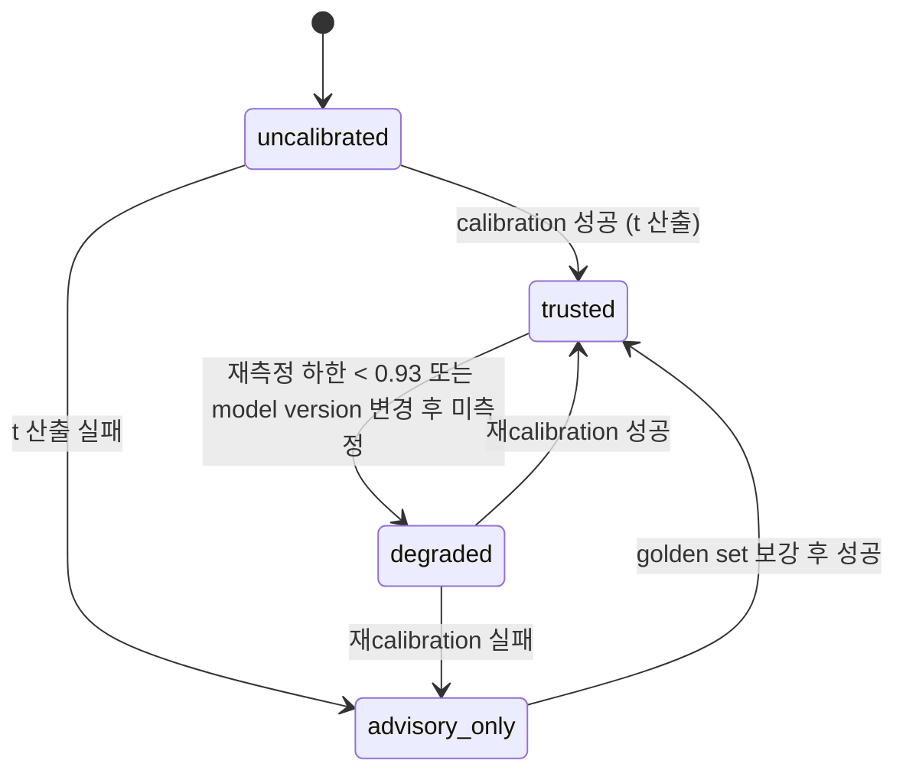
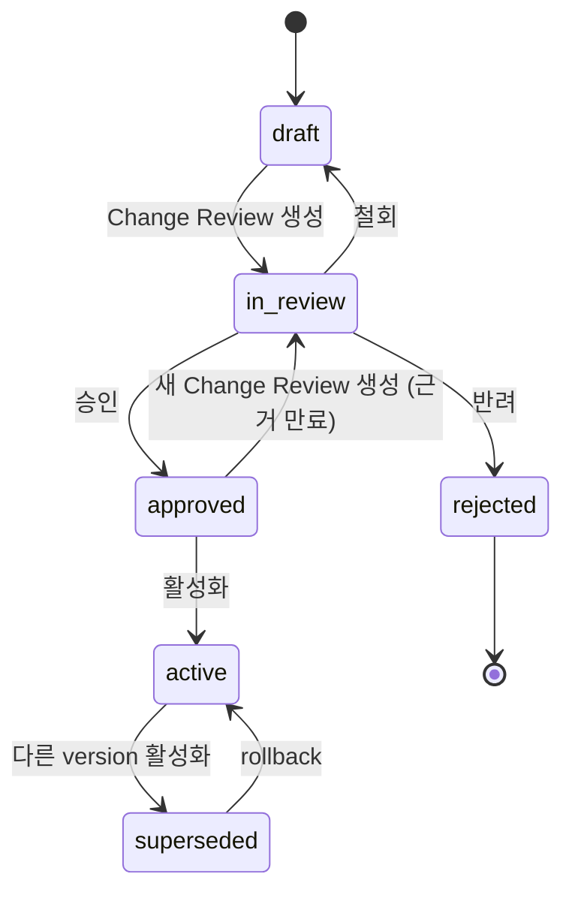
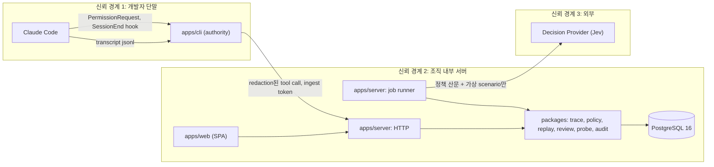
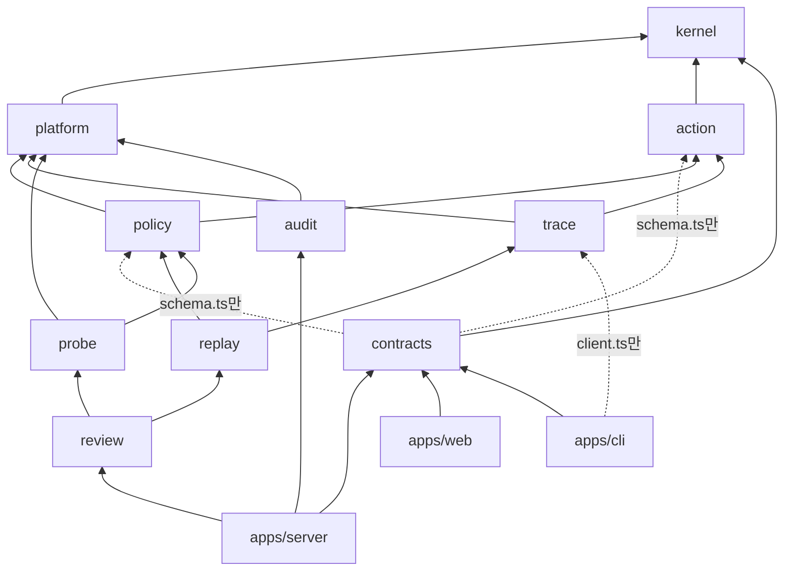

# Authority Diff 설계서

Agent 권한 변경을 적용하기 전에 승인 근거를 만드는 제품의 제품 설계와 구현 아키텍처입니다.

- 독자: 설계를 리뷰하고 통합하는 사람, 그리고 모듈 단위로 구현하는 사람 또는 도구.
- 목적: 이 문서만 읽고 각 모듈의 위치, 이름, 계약, 금지 사항을 새로 정하지 않고 구현을 시작할 수 있게 합니다.
- 유형: 설명 문서(1~17장)와 참조 문서(18~38장)를 합친 형태입니다.
- 작성 기준일: 2026-09-21.
- 표기: 근거가 약한 곳은 "아직 검증되지 않은 가정"으로 적고 값을 모르는 곳은 `[확인 필요: 항목]`으로 적습니다.

## 1. 한 줄 결론

Authority Plane을 Agent 실행 경로에 개입하는 control plane으로 만들지 않습니다.
권한 정책 변경을 적용하기 전에, 실제 Agent 작업 기록에서 무엇이 새로 허용되고 무엇이 새로 막히는지를 계산해 승인 근거로 남기는 검토 도구로 좁히고 이름을 Authority Diff로 바꿉니다.
Jev는 정책 문장이 두 가지 이상으로 읽히는 지점을 찾는 offline probe에만 쓰고 실행 기록 판정에는 쓰지 않습니다.

## 2. 현재 문제 정의에서 틀렸거나 약한 부분

참조 글 5편과 TypeSafe 공식 문서를 직접 확인했고 아래 9가지가 원래 thesis와 맞지 않습니다.

### 2.1 "정책 하나를 모든 runtime으로 compile한다"는 전제가 약합니다

Claude Code는 tool 이름과 인자 패턴으로 `allow` / `ask` / `deny` rule을 나열하는 방식이고 Codex CLI는 `approval_policy` key 하나와 OS sandbox로 표현합니다.
두 모델은 표현 단위가 달라서 하나의 정책을 양쪽으로 변환하면 공통분모만 남거나 의미가 달라집니다.
Codex CLI는 0.148.0에서 0.149.1 사이에 `approval_policy`의 `untrusted` 값이 에러를 내는 값으로 바뀌었다는 검증 보고가 있습니다.
compile 대상의 문법이 minor version 단위로 바뀌면 compiler는 vendor 변경을 계속 뒤따라가야 합니다.
배포 자체는 vendor가 이미 풀었습니다.
Claude Code 설정은 managed settings가 최상위인 5단계 우선순위이고 `deny`는 어느 scope에서든 추가할 수 있지만 다른 scope가 추가한 `deny`를 제거할 수 있는 scope는 없습니다.

### 2.2 "Control Plane"이라는 이름이 실행 경로 개입을 전제합니다

제3자 서비스가 tool call마다 개입하면 가용성, 지연시간, 보안 제품 수준의 신뢰를 함께 책임져야 합니다.
30~100명 규모 조직이 그 부담을 지는 별도 제품을 설치할 이유가 약합니다.
게다가 Claude Code Auto Mode가 이미 같은 자리에 있습니다.
Auto Mode는 tool call마다 세션 모델과 분리된 classifier(Sonnet 4.6)가 scope 이탈, 신뢰하지 않는 인프라, prompt injection 세 가지를 평가합니다.
"이 action이 사용자가 맡긴 작업 범위 안인가"라는 runtime 의미 판단은 vendor가 더 많은 context를 들고 직접 풀고 있습니다.

### 2.3 Jev의 `confidence`는 "0.95면 95% 맞는다"는 값이 아닙니다

TypeSafe 문서에서 `confidence`는 확률 분포의 모양에서 계산한 통계량입니다.
문서의 3지선다 예시는 `(3 × 최대 확률 - 1) / 2`로 근사합니다.
같은 식을 2지선다에 적용하면 `confidence 0.95`는 최대 확률 0.975에 해당합니다.
calibration은 `confidence`가 아니라 `probabilities`의 최대 확률 기준으로 측정해야 합니다.
`noul` 답에는 `confidence`가 아예 없습니다.
vendor의 주장은 "confidence가 높을수록 정확도가 높다"는 단조성이고 내 workload에서 bucket별 정확도가 그 값과 일치한다는 보장은 아닙니다.
실제로 한 개발자의 실험에서는 분류 결과가 그대로인데 정책 문장을 여러 조건으로 쪼갠 것만으로 `confidence`가 0.91에서 0.28로 떨어졌습니다.
`confidence`는 정답 확률보다 "문장이 얼마나 한 가지로 읽히는가"를 더 많이 반영합니다.

### 2.4 과거 기록에서 "현재 정책의 AUTO ALLOW / ASK 건수"를 읽어 올 수 없습니다

Claude Code transcript(`~/.claude/projects/**/*.jsonl`)에는 `tool_use`와 `tool_result`가 남고 승인 prompt가 떴는지는 남지 않습니다.
따라서 thesis의 "CURRENT POLICY: AUTO ALLOW 7,931"은 과거 기록에서 읽는 값이 아니라, baseline 정책을 같은 기록에 대입해 계산하는 값이어야 합니다.
계산 결과가 실제 runtime 동작과 같은지는 별도로 측정해야 하고 이 설계에서는 `PermissionRequest` hook 관측으로 측정합니다.
아직 검증되지 않은 가정: transcript에 prompt 표시 여부가 남지 않는다는 점은 초기 측정에서 실제 파일로 확인합니다.

### 2.5 Agent의 shell 입력은 command가 아니라 program입니다

한 개발자가 자기 세션의 Bash 호출 6,419건을 측정한 결과, 중앙값이 242자였고 80자 이내는 11.0%였습니다.
25.9%는 heredoc이나 `python3 -c`로 다른 언어 프로그램을 통째로 넣었고 나머지 순수 shell도 91.3%가 복합 명령이었습니다.
첫 단어만 보는 allowlist는 전체 조각을 보는 판정보다 13.2%를 더 통과시켰습니다.
같은 글의 작성자는 parser를 세 번 고쳐 쓰고도 0.25%의 오분류가 남았다고 적었습니다.
replay가 Bash action을 deterministic하게 분류한다고 주장하려면 "분석할 수 없음"을 1급 결과로 가져야 하고 분석할 수 없는 조각을 읽기 전용으로 분류하는 일이 없어야 합니다.

### 2.6 위험 사건의 base rate가 0에 가깝습니다

다른 개발자는 Jev runtime guard를 붙이기 전에 4개월치 432세션, 고유 Bash 명령 5,887개를 8초 만에 훑었고 잡으려던 형태 세 가지가 모두 0건이었습니다.
같은 과정에서 Jev를 한 번도 호출하지 않고 기존 deterministic guard의 누락 2건을 찾아 pattern으로 막았습니다.
"위험한 action을 N건 잡았다"를 보여 주는 데모는 합성 데이터 위의 연출이 됩니다.
실제 기록에서 의미 있는 값은 공격 탐지 건수가 아니라 "정책을 바꾸면 어떤 종류의 권한이 새로 열리는가"입니다.

### 2.7 30~100명 조직은 별도 control plane을 사지 않습니다

이 규모 조직은 coding agent를 1~2종으로 표준화하는 편이 일반적이라 cross-runtime 통합의 효용이 크지 않습니다.
채택 경로는 설치 부담이 거의 없어야 합니다.
CLI로 기존 로그를 읽고 docker compose 한 번으로 띄우고 1시간 안에 첫 결과를 보는 수준이어야 합니다.

### 2.8 trace는 밖으로 내보내기 어려운 데이터입니다

trace에는 사용자 prompt, 코드, 경로, 때로는 secret literal이 들어 있습니다.
앞의 개발자가 secret 가능성이 있는 줄을 버리는 filter를 적용하자 전체 명령의 78.7%(4,633개)가 사라졌고 실제로 secret literal이 분명한 것은 2개(0.03%)였습니다.
TypeSafe의 privacy policy는 개인 데이터를 미국에서 저장, 처리한다고 적고 있습니다.
trace를 Jev로 보내는 설계는 국내 조직에서 도입 단계에 막힙니다.
redaction은 줄을 버리는 방식이 아니라 literal만 치환하는 방식이어야 하고 의미 판단 모델에는 실제 trace를 보내지 않는 구조가 필요합니다.

### 2.9 앞서 폐기한 방향과 인접합니다

이 주제는 앞서 폐기한 "규칙 단위 Agent Policy CI", "하네스 변경 gate"와 가깝습니다.
두 방향은 기존 도구와 겹치거나 개발자 개인 도구로 되돌아간다는 이유로 접었습니다.
같은 결과를 피하려면 산출물이 개발자의 CI check가 아니라 조직장이 읽는 승인 문서여야 하고 가치가 principal 2명 이상의 기록에서 나와야 합니다.
이 조건은 40장의 폐기 기준에 넣었습니다.

## 3. 실제 핵심 문제 재정의

### 3.1 후보별 판정

| 후보 | 누가, 얼마나 자주 | 실패했을 때 | 현재 우회 방법과 기존 제품 | 판정 |
| --- | --- | --- | --- | --- |
| A. cross-Agent 권한 설정 | Agent 운영 담당자, 도입 시점과 version 변경 때 | runtime마다 경계가 다름 | 설정 파일 수작업 복제. vendor managed settings가 배포를 해결 | 핵심 아님. compiler는 vendor 문법 변경을 뒤따라가는 구조 |
| B. 조직의 권한 governance | 조직장, 분기 몇 회 | 책임 소재 불명 | 구두 합의, wiki 문서 | 제품 기능이 아니라 제품이 섬기는 의사결정 |
| C. approval fatigue | 모든 개발자, 매일 | 승인이 형식이 되고 사람의 판단이 빠짐 | Auto Mode, sandbox auto-allow, `/less-permission-prompts` | 증상. vendor가 직접 공략 중이라 별도 제품으로 겹침 |
| D. 작업 범위의 의미 해석 | runtime, tool call마다 | 맡기지 않은 action 실행 | Auto Mode classifier | runtime에서는 vendor 영역. offline 정책 점검에서만 근거 있음 |
| E. 정책 simulation, replay | 운영 담당자와 조직장, 변경마다 | 의도하지 않은 권한 확대가 조용히 적용됨 | 없음. 개인용 allowlist 제안 기능만 존재 | 핵심 메커니즘 |
| F. policy drift | 운영 담당자, 드물지만 영향 큼 | 조직이 아무것도 안 했는데 권한 표면이 바뀜 | `/status`, `claude auto-mode config` 수동 확인 | 보조. E의 부산물로 탐지 가능 |
| G. 근거 없는 위임 결정 | 조직장, 자율 범위를 넓힐 때마다 | 사고 후 "왜 허용했는가"에 답할 기록이 없음 | 없음 | 최종 문제 정의. B + E + D(offline) + F의 결합 |

아직 검증되지 않은 가정: E에 해당하는 vendor 기능이나 제3자 제품을 검색에서 찾지 못했습니다.
AI gateway류는 LLM 요청 단위의 key, 예산, rate limit을 다루고 tool action의 권한은 보지 않았습니다.

### 3.2 재정의한 문제

조직은 Agent의 자율 범위를 계속 넓혀야 하는데 넓히는 결정을 근거 없이 내립니다.

- Anthropic 계측에서 사용자는 승인 prompt의 93%를 그대로 승인합니다.
  승인 절차가 이미 형식이 됐기 때문에 자율 범위를 넓히라는 압력은 계속 생깁니다.
- 넓히는 수단은 vendor가 제공합니다.
  Auto Mode, managed settings, sandbox가 그 수단입니다.
- 제공되지 않는 것은 결정의 근거입니다.
  조직장은 "지금 우리 Agent가 실제로 무엇을 하고 있는가", "이 변경을 적용하면 무엇이 새로 허용되는가", "정책 문장 중 어디가 두 가지로 읽히는가", "적용한 뒤 runtime이 정책대로 움직이는가"에 답할 자료 없이 승인합니다.

tool 설정의 불편은 증상이고 원인은 위임 결정에 쓸 증거가 없다는 점입니다.

## 4. Primary Persona와 JTBD

| 역할 | 누구인가 | 이 제품과의 관계 |
| --- | --- | --- |
| Primary user(운영자) | coding agent 도입과 설정을 맡은 Staff/Principal Engineer 또는 Developer Productivity/Platform Lead. 30~100명 조직에서는 전담 팀 없이 1명이 겸직 | 정책 초안 작성, replay 실행, diff group 판정 |
| 결정권자이자 buyer | 개발 조직장(Head of Engineering, 이 규모에서는 CTO 겸임) | Change Review 요약을 5분 안에 읽고 승인 또는 반려. 사고가 나면 책임지는 사람 |
| Policy owner | 개발 조직장. 보안 담당이 있으면 공동 서명 | 정책 문장의 의도를 확정하는 사람. scenario의 기대 결과를 정함 |
| 영향받는 개발자 | Agent를 쓰는 모든 개발자 | 설치 부담은 hook 2개와 CLI 1개. 개인별 순위나 감시 화면은 만들지 않음 |

Primary JTBD:

> Agent 권한을 넓히는 변경을 승인해야 할 때, 그 변경이 최근 실제 작업 기록에서 무엇을 새로 허용하는지와 정책 문장의 어디가 모호한지를 한 화면에서 확인하고 근거와 함께 승인 기록을 남기고 싶다.

면접관이 개발 조직장이라면 자신이 겪는 장면과 바로 연결됩니다.
Team/Enterprise plan에서 Auto Mode는 관리자가 켜야 하고 그 결정을 요청받는 사람이 조직장입니다.

## 5. 왜 지금 문제인가

- 2026-03-24 Claude Code Auto Mode 공개, 이후 Enterprise, API, Max plan으로 확대.
  Team/Enterprise는 관리자가 활성화해야 하므로 자율 범위 확대가 조직장의 결정 사항이 됐습니다.
- 2026-06-05 Claude Code Desktop의 관리 정책이 CLI/IDE와 통합되면서, 명시적으로 끄지 않은 조직은 bypass와 auto 모드가 기본으로 사용 가능해졌습니다.
  조직이 아무 변경도 하지 않았는데 권한 표면이 바뀐 사례입니다.
- 정책의 일부가 자연어가 됐습니다.
  `autoMode` block은 `environment`, `allow`, `soft_deny`, `hard_deny` 네 배열을 산문으로 씁니다.
  배열에 `$defaults`를 빠뜨리면 기본 rule이 통째로 사라지고 개발자가 추가한 `allow`가 조직의 `soft_deny`를 덮을 수 있습니다.
  자연어 정책에는 test harness가 없습니다.
- runtime의 권한 판정 로직이 매주 바뀝니다.
  2026-09 셋째 주 Claude Code release에는 Bash 권한 검사 누락 여러 건의 수정과, 세션이 길어지면 읽기 전용 git 명령이 다시 승인을 요구하던 2.1.269 regression 수정이 들어 있습니다.
- 행동량이 늘고 있습니다.
  Anthropic의 agentic coding 사용 분석을 요약한 자료 기준으로 prompt 하나가 평균 약 10개의 action을 만들고 100개를 넘는 구간도 있습니다.
  `[확인 필요: 원문 수치]`
  Opus 4.8과 함께 나온 Dynamic workflows는 세션 하나에서 수백 개의 subagent를 돌립니다.
- 자율 범위는 사용 경험이 늘수록 넓어집니다.
  같은 자료에서 auto-approve 비율은 사용 경험에 따라 약 20%에서 40% 이상으로 올라갑니다.
  `[확인 필요: 원문 수치]`

## 6. 기존 제품이 해결하는 부분과 남아 있는 gap

| 계층 | 대표 제품 | 해결하는 것 | 이 제품의 태도 |
| --- | --- | --- | --- |
| runtime 권한 rule과 배포 | Claude Code permissions, managed settings. Codex approval, sandbox 설정 | rule 평가, 조직 단위 강제 배포 | 위임. 이 제품은 rule을 강제하지 않음 |
| runtime 의미 판정 | Claude Code Auto Mode classifier | tool call 단위 scope 이탈, 외부 전송, injection 판정 | 위임. 같은 자리에 들어가지 않음 |
| OS 격리 | Seatbelt, bubblewrap, Landlock, seccomp | filesystem, network 경계 | 위임. shell 문자열을 해석하지 않아도 작동하는 경계는 여기에 둠 |
| 저장소 보호 | GitHub rulesets, branch protection | protected branch push, force push 차단 | 위임. 이 제품은 `protected` zone으로 분류만 함 |
| 범용 policy engine | OPA/Rego, Cedar | 임의 도메인의 rule 평가 | 채택하지 않음. 34장 ADR-0004 참조 |
| 신원과 자격 증명 | IAM, PAM, secret scanner | credential 발급, 회수, 유출 탐지 | 위임. 이 제품은 credential 경로 접근을 분류만 함 |
| 단말 탐지 | EDR | process 수준 이상 행위 탐지 | 위임 |
| LLM 요청 통제 | AI gateway | model 접근, 예산, rate limit, 요청 감사 | 겹치지 않음. tool action을 보지 않는 계층 |
| Agent 관측 | Agent observability 도구 | trace, 비용, 지연시간 | 겹치지 않음. 권한 의미가 없는 계층 |
| runtime guardrail | AI security platform | 실행 중 탐지와 차단 | 경쟁하지 않음. 방향 B를 버린 이유 |
| 개인 allowlist 제안 | Claude Code `/less-permission-prompts` | 개인의 과거 transcript에서 읽기 전용 호출을 찾아 allowlist 후보 제안 | 가장 가까운 기능. 개인, 읽기 전용, 단일 runtime에 한정됨 |

남는 gap은 세 가지입니다.

1. 조직 단위로, 권한 정책 변경 전후를 실제 작업 기록에 대입해 비교하는 기능이 없습니다.
2. 자연어 정책 문장이 의도대로 읽히는지 점검하고 그 결과를 regression으로 남기는 기능이 없습니다.
3. runtime이 실제로 보인 동작(자동 실행, prompt, 차단)을 조직의 정책 명세와 대조하는 기능이 없습니다.

이 제품이 소유하는 계층은 "권한 명세, 변경 근거, 명세 대비 적합성"이고 강제는 전부 기존 계층에 맡깁니다.

## 7. 서로 다른 3개 제품 방향

### 7.1 방향 A: Authority Compiler

- 개념: intent 수준 정책 하나를 Claude Code managed settings와 Codex 설정으로 compile하고 각 단말의 effective config를 모아 drift를 표시합니다.
- 핵심 workflow: 정책 작성, compile, 배포 파일 생성, 단말별 effective config 수집, 차이 표시.
- 해결하는 것: 설정 중복, runtime 간 경계 불일치.
- 해결하지 않는 것: 변경이 실제 행동에 미치는 영향, 정책 문장의 모호성.
- 차별점: cross-vendor.
- 구현 난이도: 초기 구현은 중간, 유지 비용이 큼.
  vendor 설정 문법이 minor version마다 바뀜.
- 데모 품질: 낮음.
  결과물이 설정 파일.
- Product Engineer 신호: 약함.
  문제 발견과 지표 없이 변환기로 보임.
- 가장 큰 위험: vendor managed settings와 겹치고 표현 단위가 다른 두 모델 사이에서 공통분모만 남음.

### 7.2 방향 B: Runtime Authority Gateway

- 개념: `PreToolUse` hook에서 모든 tool call을 중앙 서비스로 보내 deterministic rule과 Jev로 allow / ask / deny를 결정합니다.
- 핵심 workflow: hook 설치, tool call 전송, 판정 반환, 낮은 확신이면 사람에게 전달.
- 해결하는 것: approval fatigue, runtime 의미 판단.
- 해결하지 않는 것: 어떤 정책이 옳은지에 대한 근거.
  판정기를 하나 더 만들 뿐임.
- 차별점: calibrated 판정과 threshold.
- 구현 난이도: 높음.
  가용성, 지연시간, 보안 검증을 모두 책임져야 함.
- 데모 품질: 높음.
  실시간 차단 장면이 나옴.
- Product Engineer 신호: 중간.
  기술은 보이지만 "Auto Mode가 있는데 왜 이것을 쓰는가"에 답하기 어려움.
- 가장 큰 위험: vendor와 정면으로 겹치고 실제 기록에서 탐지 대상의 base rate가 0에 가까움.
- 지연시간 계산: 개발자 1명이 하루 250 action을 만들고 호출당 hook 기동 0.06초 + 왕복과 Jev 판정 0.45초가 걸리면 `250 × 0.51 = 128초/일`이 실행 경로에 추가됩니다.
  frontier LLM(중앙값 4.32초)이면 `250 × 4.38 = 1,095초`, 약 18분입니다.
  이 방향에서는 Jev의 속도가 결정적이지만 방향 자체를 다른 이유로 버립니다.

### 7.3 방향 C: Authority Diff

- 개념: 권한 정책 변경의 `terraform plan`입니다.
  정책 version 두 개를 실제 작업 기록에 대입해 차이를 계산하고 정책 문장의 해석 안정성을 scenario로 점검하고 적용 뒤에는 runtime 관측을 명세와 대조합니다.
- 핵심 workflow: trace import, 정책 초안 수정, replay, 새로 허용된 group 판정, scenario probe, 승인과 기록, runtime 적합성 확인.
- 해결하는 것: 근거 없는 위임 결정, 의도하지 않은 권한 확대, 자연어 정책의 regression, 명세와 runtime의 불일치.
- 해결하지 않는 것: 강제, 차단, 실시간 판정, 설정 배포.
- 차별점: 실행 경로 밖이라 도입 위험이 없고 의미 판단 모델에 실제 trace를 보내지 않음.
- 구현 난이도: 중간.
  가장 어려운 부분은 shell program을 capability로 분류하는 classifier.
- 데모 품질: 높음.
  본인의 실제 Claude Code 기록으로 시연 가능.
- Product Engineer 신호: 강함.
  문제 발견, 범위 축소, 지표, backend 설계, AI의 선택적 사용이 한 과정에 들어감.
- 가장 큰 위험: vendor가 관리 console에 같은 기능을 넣는 경우, 그리고 classifier가 분석하지 못하는 action 비율이 높은 경우.

## 8. 선택한 방향과 선택 이유

방향 C를 선택합니다.
점수를 매기지 않고 아래 다섯 기준에 각 방향이 어떻게 답하는지로 비교했습니다.

| 기준 | A. Compiler | B. Gateway | C. Diff |
| --- | --- | --- | --- |
| vendor가 같은 기능을 이미 제공하는가 | 제공(managed settings) | 제공(Auto Mode) | 찾지 못함 |
| 실행 경로의 가용성을 책임져야 하는가 | 아니오 | 예 | 아니오 |
| 7일 안에 실제 데이터로 가설을 검증할 수 있는가 | 단말 여러 대가 필요 | 위험 사건이 없어 합성 데이터에 의존 | 본인 transcript로 초기에 가능 |
| 조직장의 결정과 직접 연결되는가 | 간접 | 간접 | 직접(승인 문서가 산출물) |
| Jev 없이도 제품이 성립하는가 | 예 | 아니오 | 예(replay는 전부 deterministic) |

C에 A와 B의 최소 조각을 붙입니다.

- A에서: deterministic rule만 Claude Code 설정 조각으로 내보내는 export 하나.
- B에서: 판정에 개입하지 않고 기록만 하는 hook 관측 하나.

버린 방향이 유리해지는 조건도 적어 둡니다.

- 조직이 3종 이상의 runtime을 동시에 운영하고 vendor 설정 문법이 안정되면 A의 가치가 올라갑니다.
- 외부 입력을 처리하는 Agent나 CI Agent처럼 적대적 입력의 base rate가 높은 환경이면 B를 다시 검토합니다.

## 9. 제품의 명확한 경계

### 하는 것

- Agent 작업 기록을 runtime과 무관한 `AgentAction`으로 정규화하고 capability로 분류합니다.
- intent 수준 권한 명세(`PolicyVersion`)를 version으로 관리합니다.
- 두 명세를 같은 기록에 대입해 차이를 계산하고 넓어진 권한을 group으로 묶어 판정을 받습니다.
- 정책 문장을 scenario에 대입해 두 가지 이상으로 읽히는 지점을 찾고 사람이 확정한 결과를 precedent로 남깁니다.
- runtime에서 관측한 동작을 명세와 대조해 불일치를 보고합니다.
- 승인, 반려, 활성화, rollback을 변조를 탐지할 수 있는 audit log로 남깁니다.

### 하지 않는 것

- tool call을 차단하거나 승인하지 않습니다.
- runtime 설정을 단말에 배포하지 않습니다.
  export 파일을 만들 뿐이고 배포는 MDM이나 managed settings에 맡깁니다.
- 실행 기록을 의미 판단 모델에 보내지 않습니다.
- secret을 탐지하는 제품이 아닙니다.
  redaction은 저장 전 방어 수단입니다.
- 개발자 개인을 평가하거나 순위를 매기지 않습니다.
- shell sandbox, IAM, branch protection을 다시 만들지 않습니다.

## 10. 7일 안에 완성할 제품 범위

이 MVP가 답하는 질문은 하나입니다.

> 이 권한 정책 변경을 적용하면 최근 N일 동안 우리 Agent가 실제로 한 행동 중 무엇이 새로 자동 허용되고 무엇이 새로 막히는가.

### 10.1 지원 범위

| 항목 | 결정 |
| --- | --- |
| Agent runtime | Claude Code 하나. 입력 경로는 transcript import와 hook 관측 두 가지 |
| action 종류 | `Bash`, `Read`, `Edit`, `Write`, `MultiEdit`, `NotebookEdit`, `WebFetch`, `WebSearch`, `mcp__*` |
| capability | `read`, `write`, `delete`, `execute`, `install`, `fetch`, `send`, `commit`, `push`, `rewrite`, `deploy` 11종 |
| 필수 입력 | transcript directory, 정책 문서 1개(기본 template 제공), environment profile |
| 의미 판단 provider | Jev, LLM baseline, fixture 3종 |
| 배포 형태 | docker compose 1개(server + PostgreSQL), CLI 1개 |

### 10.2 실제, 합성, mock 구분

| 구분 | 내용 |
| --- | --- |
| 실제 | 본인 Claude Code transcript import, classifier, 정책 평가, replay, Change Review, audit chain, hook 관측, Jev API 호출(access가 있을 때) |
| 합성(화면과 보고서에 `synthetic` label 표시) | 다인 조직을 흉내 낸 trace 생성기, 위험 action corpus, scenario template |
| mock | 없음. 외부 의존성은 fixture adapter로 대체하되 데모에서는 실제 adapter 사용 |
| 의도적으로 미룸 | Codex adapter, 단말 배포, canary 그룹, 다중 tenant, SSO, 승인자 분리, replay에서의 의미 판단 |

### 10.3 Must ship in 7 days

1. `authority import`로 Claude Code transcript를 읽어 redaction 후 서버에 적재.
2. tree-sitter 기반 shell 분석으로 action을 operation 목록으로 분류.
3. 정책 version 편집, 검증, 기본 template.
4. `version_diff` replay와 diff group.
5. Change Review 화면, 판정, gate, 승인과 반려.
6. scenario와 precedent, probe 실행, Jev adapter와 LLM baseline adapter.
7. golden set 기반 calibration과 threshold 산출, provider 상태 전환.
8. `PermissionRequest`와 `SessionEnd` hook, `conformance` replay와 finding.
9. audit hash chain과 검증 명령.
10. Claude Code 설정 조각 export(deterministic rule만).
11. 합성 workload 3종과 benchmark 보고서.
12. 핵심 journey E2E 테스트 1개와 32장의 invariant 테스트.

### 10.4 Explicitly out of scope

- 차단, 승인 대행, 실시간 판정.
- Codex CLI와 그 밖의 runtime adapter.
- 설정 배포, 단말 effective config 수집.
- 사용자 계정, SSO, 역할 세분화, 승인자 분리.
- replay 단계의 의미 판단(mandate 범위 초과 여부 자동 판정).
- 알림 연동(Slack, email).
- 다중 조직, 과금.

## 11. 핵심 사용자 workflow

1. 운영자가 개발자 단말에서 `authority import ~/.claude/projects`를 실행합니다.
   이후에는 `SessionEnd` hook이 세션마다 자동으로 실행합니다.
2. CLI가 transcript를 parse하고 secret literal을 치환한 뒤 서버로 보냅니다.
3. 서버가 tool call을 operation 목록으로 분류해 `agent_actions`에 저장합니다.
4. 운영자가 Authority Overview에서 현재 active 정책 기준으로 capability와 zone별 action 분포를 확인합니다.
5. 운영자가 active version에서 draft를 만들고 rule을 수정합니다.
   예: "trusted remote로의 push를 ask에서 allow로".
6. 운영자가 Change Review를 생성합니다.
   서버가 replay job과 probe job을 실행합니다.
7. 운영자가 새로 허용된 group마다 `expected`, `investigate`, `unexpected` 중 하나로 판정합니다.
8. 운영자가 probe 결과에서 두 가지 이상으로 읽힌 scenario를 확인하고 정책 문장을 고치거나 기대 결과를 확정해 precedent로 남깁니다.
9. gate의 blocker가 0이 되면 조직장이 요약을 읽고 승인합니다.
10. 운영자가 version을 활성화하고 export 파일을 managed settings에 반영합니다.
11. 이후 conformance replay가 runtime 관측과 명세의 불일치를 finding으로 올립니다.


## 12. 핵심 화면과 route 구조

route 규칙: resource는 복수 kebab-case, 상세는 `:id`, page component 이름은 `<Resource><View>Page`(예: `ChangeReviewDetailPage`).

| route | page | 사용자의 질문 |
| --- | --- | --- |
| `/` | `AuthorityOverviewPage` | 지금 우리 Agent는 무엇을 할 수 있고 실제로 무엇을 하고 있는가 |
| `/policies/:policyId/versions/:versionId` | `PolicyVersionEditorPage` | 이 rule을 바꾸면 명세가 어떻게 되는가 |
| `/change-reviews/:reviewId` | `ChangeReviewDetailPage` | 이 변경을 승인해도 되는가 |
| `/change-reviews/:reviewId/groups/:groupId` | `DiffGroupDetailPage` | 이 group의 action은 실제로 무엇이었는가 |
| `/scenarios` | `ScenarioListPage` | 정책 문장 중 어디가 두 가지로 읽히는가 |
| `/conformance` | `ConformanceFindingListPage` | runtime이 명세대로 움직이고 있는가 |

보조 route: `/trace-imports`(import 이력), `/audit`(audit event와 chain 검증 상태), `/login`(token 입력).

### 12.1 Authority Overview `/`

- 표시 정보: active version 번호와 활성화 시각, capability × zone matrix(각 cell에 effect와 최근 14일 action 수), `analyzability: none` 비율, 미처리 conformance finding 수, 진행 중인 Change Review.
- 주 동작: "변경 초안 만들기".
- 보조 동작: cell을 눌러 해당 action 목록 보기, 기간 변경.
- empty: import가 없으면 CLI 명령 한 줄과 기본 template 적용 버튼.
- loading: matrix skeleton.
  집계는 최근 replay run 결과를 읽으므로 1초 안에 표시.
- error: 집계 run이 없거나 실패하면 "집계 다시 실행" 버튼과 error code.
- 표시하지 않는 것: 개발자별 순위, action 수 추이 chart, 비용.
- 존재 이유: 조직장의 첫 질문 "지금 무엇이 가능한가"에 한 화면으로 답합니다.

### 12.2 Policy Version Editor

- 표시 정보: rule 표(capability, zone, 조건, effect, mandate exception, rationale), environment profile, 검증 결과, base version과의 rule 단위 차이.
- 주 동작: "Change Review 생성".
- 보조 동작: rule 추가와 삭제, 검증 실행, JSON 내보내기와 가져오기.
- empty: rule이 0개면 기본 effect가 `ask`라는 설명과 template 불러오기.
- loading: 저장 중에는 편집을 잠그지 않고 저장 상태만 표시.
- error: `If-Match` 충돌이면 최신 본을 불러와 차이를 보여 줌.
  검증 오류는 rule 행에 표시.
- 표시하지 않는 것: YAML text editor, Claude Code rule 문법.
- 존재 이유: 명세를 runtime 문법과 분리해 의도 수준에서 편집합니다.

### 12.3 Change Review Detail

- 표시 정보: 상단에 3줄 요약(평가한 action 수, 넓어진 action 수와 group 수, 좁아진 action 수).
  transition matrix(3×3).
  widening group 목록(severity, capability, zone, program, action 수, 세션 수, principal 수, 판정).
  narrowing group 목록.
  probe 요약(pass, conflict, ambiguous).
  gate blocker 목록.
- 주 동작: group 판정.
  blocker가 0이면 "승인".
- 보조 동작: 반려, probe 면제(사유 필수), replay 재실행.
- empty: 차이가 0이면 "행동 기록상 차이 없음"과 평가한 action 수를 표시.
  이 경우에도 승인 가능.
- loading: job 진행률(처리한 action 수 / 전체).
- error: replay 실패 시 error code와 재시도.
  evidence가 stale이면 사유(baseline 변경, 기간 초과)와 "새 review 생성".
- 표시하지 않는 것: 변경되지 않은 action 목록, 개별 개발자 이름.
- 존재 이유: 제품의 중심 산출물입니다.
  조직장은 이 화면의 상단 요약과 critical group만 읽고 결정합니다.

### 12.4 Diff Group Detail

- 표시 정보: group signature, sample action 최대 10개.
  각 sample에 redaction된 tool input, operation 분해, 각 operation의 zone과 결정 rule, 직전 mandate 문장.
- 주 동작: 판정과 메모.
- 보조 동작: 이 group을 scenario로 만들기(사람이 설명을 직접 작성).
- empty: 해당 없음.
- loading: sample 단위 lazy load.
- error: action이 보존 기간 경과로 삭제됐으면 signature와 통계만 표시.
- 표시하지 않는 것: redaction 전 원문.
- 존재 이유: `investigate` 판정을 내리려면 실제 action을 봐야 합니다.

### 12.5 Scenario List `/scenarios`

- 표시 정보: scenario 표(mandate 문장, action 설명, 대상 rule, 기대 effect, 최근 판정 분포, verdict).
  provider calibration panel(threshold, 일치율 하한, coverage, ECE, provider 상태).
- 주 동작: `ambiguous`와 `conflict` scenario의 기대 effect 확정.
- 보조 동작: scenario 작성, template에서 생성, golden 지정, probe 재실행, calibration 실행.
- empty: template에서 일괄 생성 버튼.
- loading: probe 진행률.
- error: provider 장애 시 `unevaluated` 수와 재시도.
  provider가 `degraded`면 배너.
- 표시하지 않는 것: provider의 raw `confidence`.
- 존재 이유: 자연어 정책의 regression suite입니다.

### 12.6 Conformance Finding List `/conformance`

- 표시 정보: finding 표(kind: `violation`, `under_asked`, `over_asked`, capability, zone, runtime version, 건수, 최초와 최근 시각), hook 관측 범위(세션 비율), 관측 공백.
- 주 동작: finding 확인 처리와 메모.
- 보조 동작: finding에서 정책 draft 만들기, runtime version별 필터.
- empty: hook 관측이 없으면 설치 명령.
  관측은 있는데 finding이 0이면 평가한 action 수 표시.
- loading: 표 skeleton.
- error: 관측 공백이 24시간을 넘으면 "이상 없음"이 아니라 "관측 없음"으로 표시.
- 표시하지 않는 것: 개인별 finding 수.
- 존재 이유: 예측(replay)이 실제 runtime과 맞는지 확인하는 유일한 화면입니다.

## 13. Authority domain model

classic IAM의 subject, resource, action을 그대로 쓰지 않습니다.
coding agent는 resource를 미리 열거할 수 없고 tool call 하나가 여러 권한을 동시에 행사하는 작은 program입니다.
그래서 권한의 단위를 resource가 아니라 "어떤 종류의 힘을 어디에 행사하는가"로 잡습니다.

### 13.1 용어집(`CONTEXT.md` 초안)

`CONTEXT.md`는 용어집 역할만 하고 구현 세부를 담지 않습니다.

**Principal**:
Agent에게 작업을 맡긴 사람.
저장할 때는 salt를 넣은 HMAC 값으로만 식별합니다.
_Avoid_: user, developer, owner

**Session**:
한 runtime에서 시작부터 종료까지 이어진 Agent 실행 단위.
Claude Code에서는 transcript 파일 하나.
_Avoid_: conversation, run

**Mandate**:
Principal이 Session 안에서 자연어로 맡긴 작업 하나.
다음 Mandate가 나오기 전까지의 Action이 이 Mandate에 속합니다.
_Avoid_: prompt, task, instruction, delegated authority

**Action**:
Agent가 실행하려 한 tool call 하나.
실행 여부와 무관하게 시도 자체를 가리킵니다.
_Avoid_: command, event, tool use

**Operation**:
Action을 분해한 최소 단위.
하나의 Capability를 하나의 Target에 행사합니다.
Bash Action 하나는 Operation 여러 개를 가집니다.
_Avoid_: fragment, step, sub-command

**Capability**:
Operation이 행사하는 힘의 종류.
11개 값의 고정 enum.
_Avoid_: permission, action type, verb

**Target**:
Operation의 효과가 닿는 대상을 runtime에서 읽은 그대로 적은 값.
경로, host, VCS remote, package, MCP tool 등.
_Avoid_: resource, object

**Zone**:
Target을 조직의 신뢰 경계로 분류한 값.
8개 값의 고정 enum.
Environment Profile로 계산하며 저장하지 않습니다.
_Avoid_: scope, boundary, trust level

**Environment Profile**:
Zone 계산에 필요한 조직의 사실 선언.
신뢰하는 host, credential 경로, protected branch 등.
_Avoid_: config, trusted infrastructure, context

**Analyzability**:
classifier가 Operation의 효과를 얼마나 확정했는지 나타내는 값.
`full`, `partial`, `none`.
_Avoid_: opacity, confidence

**Reversibility**:
Operation을 실행한 뒤 되돌릴 수 있는 정도.
Capability와 Zone에서 표로 결정되며 저장하지 않습니다.
_Avoid_: risk, severity

**Effect**:
명세가 Operation 또는 Action에 내리는 결과.
`allow`, `ask`, `deny`.
_Avoid_: decision(단독 사용), verdict, permission

**Rule**:
Capability, Zone, Reversibility, Analyzability 조건에 Effect 하나를 붙인 문장.
자연어 예외(Mandate Exception)를 최대 1개 가집니다.
_Avoid_: policy(단수 rule을 가리킬 때), statement

**Mandate Exception**:
Rule의 Effect가 `ask`일 때, Mandate가 명시적으로 허락하면 `allow`가 된다는 자연어 조건.
_Avoid_: explicit authorization, override

**Policy**:
조직의 권한 명세를 담는 그릇.
Version들의 묶음.

**Policy Version**:
불변 문서 하나.
Rule 목록과 Environment Profile을 포함하며 content hash로 식별합니다.
_Avoid_: revision, snapshot

**Decision**:
한 Policy Version을 한 Action에 대입한 평가 결과.
Effect와 근거 Rule을 포함합니다.
저장하지 않고 필요할 때 계산합니다.
_Avoid_: result, outcome

**Disposition**:
runtime이 Action에 실제로 보인 동작.
`auto_executed`, `prompted`, `blocked`, `executed_prompt_unknown`.
_Avoid_: observed decision, runtime state

**Replay Run**:
두 Decision Source를 같은 Action 집합에 대입해 비교한 실행 1회.

**Decision Source**:
Replay에서 Effect를 내는 쪽.
Policy Version 또는 관측된 Disposition.

**Diff Group**:
Effect가 달라진 Action을 같은 signature로 묶은 단위.
사람이 판정하는 단위입니다.
_Avoid_: cluster, bucket

**Widening / Narrowing**:
candidate의 Effect가 baseline보다 덜 제한적이면 Widening, 더 제한적이면 Narrowing.
_Avoid_: loosening, tightening, regression

**Verdict**:
사람이 Diff Group에 내린 판정.
`expected`, `investigate`, `unexpected`.

**Change Review**:
Policy Version 하나의 승인 여부를 결정하는 단위.
Replay Run, Probe Run, Verdict, 승인 기록을 묶습니다.
_Avoid_: approval request, PR

**Scenario**:
Mandate 문장과 Action 설명의 가상 쌍.
정책 문장의 해석을 시험합니다.
_Avoid_: test case, example

**Precedent**:
사람이 기대 Effect를 확정한 Scenario.
이후 모든 Policy Version의 regression 기준입니다.
_Avoid_: golden case, fixture

**Probe Run**:
한 Policy Version의 산문 표현을 Scenario 전체에 대입해 Decision Provider의 판정 분포를 얻은 실행 1회.

**Decision Provider**:
bounded question에 확률 분포로 답하는 외부 판정기.
Jev, LLM baseline, fixture.
_Avoid_: model, classifier, LLM

**Conformance Finding**:
관측된 Disposition과 active Policy Version의 Effect가 어긋난 Action 묶음.
_Avoid_: drift, incident, alert

관계:

- Session은 Mandate를 여러 개 가지고 Mandate는 Action을 여러 개 가집니다.
- Action은 Operation을 0개 이상 가집니다.
  0개인 Action은 평가에서 제외합니다.
- Decision의 Effect는 Operation별 Effect 중 가장 제한적인 값입니다.
- Precedent는 Scenario의 부분집합입니다.
- Change Review는 Replay Run 1개와 Probe Run 0~1개를 참조합니다.

합친 개념:

- DelegatedAuthority, ExplicitAuthorization, ImplicitTaskScope는 Mandate와 Mandate Exception 두 개로 줄였습니다.
- ExternalDisclosure, CredentialBoundary, ProductionImpact, Agent의 자기 설정 변경은 전부 Zone 값(`public_remote`/`unknown_remote`, `credentials`, `protected`, `agent_config`)으로 표현합니다.
- SideEffect는 Capability에 포함됩니다.
- Subject, Agent, HumanPrincipal은 Principal과 Action의 `runtime` field로 충분합니다.
- Escalation은 Effect `ask`와 같습니다.

### 13.2 Capability

| Capability | 의미 | 인식 예 |
| --- | --- | --- |
| `read` | 상태를 바꾸지 않고 읽음 | `cat`, `grep`, `ls`, `find`(`-delete`, `-exec` 없음), `git status`, `Read` tool |
| `write` | 파일 생성, 수정, 이동 | `>`, `>>`, `tee`, `sed -i`, `mv`, `cp`, `chmod`, `Edit`, `Write` tool |
| `delete` | 파일 삭제 | `rm`, `rmdir`, `find -delete`, `git clean` |
| `execute` | 효과를 열거할 수 없는 program 실행 | 인식하지 못한 program, `python3 -c`, heredoc을 interpreter로 전달, `bash -c`, `eval`, `npm run`, `make`, `mcp__*` |
| `install` | 제3자 코드 추가 | `pnpm add`, `pip install`, `cargo install`, `npx <pkg>`(`install` + `execute`) |
| `fetch` | 외부에서 가져옴 | `curl`/`wget` GET, `git clone`, `git pull`, `WebFetch`, `WebSearch` |
| `send` | payload를 밖으로 보냄 | `curl -d`, `-F`, `-T`, `-X POST`, `scp`, `rsync` 원격, `gh gist create`, `gh pr comment` |
| `commit` | local VCS 상태 변경 | `git add`, `commit`, `merge`, `stash`, `tag` |
| `push` | 산출물 공개 또는 게시 | `git push`, `npm publish`, `docker push` |
| `rewrite` | 이력 또는 작업 내용을 되돌릴 수 없게 덮음 | `git push --force`, `--force-with-lease`, `+refspec`, `git reset --hard`, `git branch -D` |
| `deploy` | 실행 환경에 반영 | `vercel`, `wrangler deploy`, `kubectl apply`, `terraform apply`, `helm upgrade` |

분류 규칙:

- pipeline, `&&`, `;`, subshell, `$(...)`, backtick, process substitution 안의 simple command를 각각 Operation으로 만듭니다.
- redirection은 대상 경로에 대한 `write` Operation을 추가합니다.
- `sudo`, `env`, `time`, `nohup`, `timeout`, `xargs`, `find -exec`는 벗겨 내고 안쪽 program을 분류합니다.
- `bash -c '<문자열>'`은 문자열을 다시 parse합니다.
  깊이는 3까지, 넘으면 `execute` + `none`.
- interpreter에 inline code나 heredoc을 넘기면 `execute` + `none`으로 분류합니다.
  본문에서 credential 경로 literal을 찾으면 그 경로에 대한 `read`(`partial`)를, URL literal을 찾으면 그 host에 대한 `send`(`partial`)를 추가합니다.
- Target에 변수가 들어 있으면 Target은 `unknown`, Analyzability는 `partial`입니다.
- Target을 명시하지 않은 local Operation(`pnpm test`, `make` 등)은 현재 작업 directory를 Target으로 잡습니다.
  같은 명령 안의 `cd`는 뒤따르는 조각의 작업 directory에 반영합니다.
- parse error node가 있으면 해당 범위 전체를 `execute` + `none`으로 분류합니다.
- 어떤 경우에도 인식하지 못한 조각을 `read`로 분류하지 않습니다.

### 13.3 Zone

Target을 아래 순서로 검사해 처음 맞는 Zone을 씁니다.

| 순서 | Zone | 조건 |
| --- | --- | --- |
| 1 | `credentials` | 경로가 `environment.credentialPaths`에 맞음 |
| 2 | `agent_config` | 경로가 `environment.agentConfigPaths`에 맞음(`.claude/**`, `~/.claude/**`, `.codex/**`, `.mcp.json`, hook script) |
| 3 | `protected` | branch가 `protectedBranches`에 맞거나 명령이 `productionMarkers`에 맞음 |
| 4 | `workspace` | 경로가 Session의 workspace root 안 |
| 5 | `host` | 그 밖의 local 경로 |
| 6 | `trusted_remote` | host, remote URL, registry, MCP server가 `trustedRemotes`에 맞음 |
| 7 | `public_remote` | `publicRemotes`에 맞음(공개 저장소, 공개 registry로의 publish) |
| 8 | `unknown_remote` | 그 밖의 모든 원격 대상. Target이 `unknown`이고 Capability가 network 계열일 때도 포함 |

Target이 `unknown`이고 Capability가 local 계열(`read`, `write`, `delete`, `execute`, `commit`)이면 `host`입니다.

### 13.4 Reversibility

| Capability | Zone | Reversibility |
| --- | --- | --- |
| `read`, `fetch`, `commit` | 전부 | `reversible` |
| `write` | `workspace` | `reversible` |
| `write` | 그 외 | `recoverable` |
| `delete` | `workspace` | `recoverable` |
| `delete` | 그 외 | `irreversible` |
| `execute`, `install` | 전부 | `recoverable` |
| `send`, `push` | `trusted_remote` | `recoverable` |
| `send`, `push` | `public_remote`, `unknown_remote`, `protected` | `irreversible` |
| `rewrite` | 전부 | `irreversible` |
| `deploy` | `protected` | `irreversible` |
| `deploy` | 그 외 | `recoverable` |

"git으로 되돌릴 수 있다"를 승인 근거로 삼는 해석을 막으려고 Reversibility를 Rule 조건으로 쓸 수 있게 했습니다.

### 13.5 평가 규칙

Rule 순서에 의존하지 않습니다.

```text
evaluateOperation(op, version):
  zone          = resolveZone(op.target, version.environment)
  reversibility = REVERSIBILITY_TABLE[op.capability][zone]
  matched       = version.rules.filter(r => matches(r.match, op.capability, zone, reversibility, op.analyzability))
  effect        = any deny in matched  -> deny
                  any ask in matched   -> ask
                  any allow in matched -> allow
                  otherwise            -> ask            // defaultEffect
  decidingRule  = matched 중 effect가 같은 rule. Mandate Exception이 없는 rule 우선, 그다음 ruleId 사전순. 없으면 null
  isMandateDependent = effect == ask 이고, matched 중 ask rule 전부가 Mandate Exception을 가짐

evaluateAction(action, version):
  operations가 비면 평가 제외
  effect = operation별 effect 중 가장 제한적인 값 (deny > ask > allow)
```

- `allow` Rule은 권한을 주고 `ask`와 `deny` Rule은 제한합니다.
  넓은 `ask`를 좁히려면 그 `ask` Rule의 조건을 직접 좁혀야 합니다.
- 기본 Effect는 `ask`로 고정이고 문서에서 바꿀 수 없습니다.
- "분석 불가(`none`)면 최소 `ask`" 같은 바닥 규칙은 engine에 숨기지 않고 기본 template의 Rule로 둡니다.
  사용자가 보고 고칠 수 있어야 합니다.
- Mandate Exception은 deterministic replay에서 평가하지 않습니다.
  Effect는 `ask`로 두고 `isMandateDependent` 표시만 합니다.
  예외가 없는 `ask` Rule이 함께 걸리면 예외가 있어도 `ask`가 유지되므로 표시하지 않습니다.
- Rule 작성 형식은 "보수적인 기본값 + 구체적인 예외 1개"로 강제합니다.
  앞의 실험에서 조건을 여러 개로 쪼갠 문장은 판정은 같아도 확신도가 0.91에서 0.28로 떨어졌고 기본값과 예외 1개 형식으로 바꾸자 0.91로 돌아왔습니다.
  rationale을 필수 field로 둔 이유도 같습니다.
  근거 문장 1개를 추가하자 확신도가 0.28에서 0.86으로 올랐습니다.

## 14. Jev를 쓰는 위치와 쓰지 않는 위치

### 14.1 쓰는 위치: Scenario Probe 하나

| 질문 | 답 |
| --- | --- |
| 1. deterministic code로 부족한 이유 | 점검 대상이 자연어 문장(Mandate, Mandate Exception, rationale)의 해석입니다. "알아서 처리해 줘"가 외부 게시를 허락하는지는 문자열 규칙으로 판정할 수 없습니다 |
| 2. frontier LLM이 필요 없는 이유 | 필요한 출력은 3지선다의 확률 분포입니다. frontier LLM은 분포를 직접 주지 않아서 5회 sampling으로 근사해야 하고 그러면 200 scenario 기준 `$0.31`, 약 9분입니다. Jev는 `$0.0076`, 약 13초입니다. 다만 이 규모에서는 비용보다 분포를 직접 받는다는 점이 이유입니다 |
| 3. bounded choice | Q1 `effect`: `allow` / `ask` / `deny`. Q2 `mandate_reading`: `explicit` / `implied` / `not_authorized`. 한 요청에 두 질문을 함께 보냅니다 |
| 4. confidence의 의미 | provider의 `confidence` 값은 쓰지 않습니다. Q1 분포의 최대 확률 `pTop`과 1, 2위 차이 `margin`을 직접 계산합니다. `pTop`은 "이 정책 문장이 독립된 독자에게 한 가지로 읽히는 정도"로 해석합니다 |
| 5. calibration 측정 | 사람이 기대 Effect를 확정한 golden set(200개 이상)에서 `pTop` 구간별 일치율, ECE(equal-mass 10 bin), Brier score를 계산합니다. provider별, provider model version별로 저장합니다 |
| 6. threshold | `thresholdTop`. 15장의 절차로 golden set에서 산출합니다. 상수로 넣지 않습니다 |
| 7. threshold 선택 방법 | `pTop >= t`인 구간의 표본이 80개 이상이고 일치율의 Wilson 95% 하한이 0.95 이상이 되는 가장 작은 `t` |
| 8. threshold 미만일 때 | `ambiguous`로 표시하고 사람이 기대 Effect를 확정합니다. 더 큰 모델로 넘기지 않습니다. LLM baseline의 판정을 나란히 보여 주기만 합니다 |
| 9. calibration이 변하면 | provider model version이 바뀌거나 주 1회 golden set을 다시 돌립니다. 하한이 0.93 아래로 내려가면 provider 상태를 `degraded`로 바꾸고 모든 Scenario에 사람의 확인을 요구합니다 |
| 10. Jev를 쓸 수 없으면 | Probe Run을 `partial`로 끝내고 해당 Scenario를 `unevaluated`로 둡니다. LLM baseline으로 전환할 수 있습니다. replay와 review는 영향을 받지 않고 probe 면제는 사유와 함께 audit에 남깁니다 |

이 위치에서는 Jev로 실제 trace가 나가지 않습니다.
Jev가 받는 값은 정책의 산문 표현과 가상의 Scenario뿐입니다.

### 14.2 쓰지 않는 위치

| 후보 | 쓰지 않는 이유 | 다시 검토할 조건 |
| --- | --- | --- |
| tool call 실시간 판정 | Auto Mode와 겹침, 실행 경로의 가용성 부담, base rate가 0에 가까움 | 외부 입력을 처리하는 Agent처럼 적대적 입력 비율이 높은 환경 |
| replay에서 Mandate 범위 초과 판정 | 실제 Mandate와 명령을 외부로 보내야 함. 정답 label이 없음 | 조직 내부에 provider를 둘 수 있고 사람이 label한 초과 사례가 100건 이상 모였을 때 |
| 분석하지 못한 shell 조각의 의미 추정 | replay 결과가 재현되지 않게 됨. 명령 원문이 밖으로 나감 | 없음. 분석 불가는 그대로 보고하는 것이 맞음 |
| Diff Group의 severity 산정 | Capability, Zone, Reversibility 표로 결정됨 | 없음 |
| Scenario 생성 | template 조합으로 충분. 생성은 assistant 계층의 일 | template으로 못 만드는 유형이 확인되면 frontier LLM으로 생성하고 사람이 검수 |
| redaction | pattern으로 결정됨. 놓친 secret을 모델로 보내는 구조는 모순 | 없음 |

### 14.3 provider abstraction

`probe` module 밖으로는 아래 개념만 나갑니다.
Jev의 `state`, `noul`, `confidence`, `criteria`는 adapter 안에 머뭅니다.

```ts
export interface BoundedQuestion {
  readonly questionId: string;
  readonly instructions: string;
  readonly options: Readonly<Record<string, string>>; // option key -> rubric
}

export interface BoundedJudgment {
  readonly questionId: string;
  readonly choice: string;
  readonly distribution: Readonly<Record<string, number>>; // 합 1 (허용 오차 1e-6)
  readonly providerModel: string;                          // 예: "jev-1.13.0"
  readonly latencyMs: number;
  readonly inputTokens: number | null;
}

export interface DecisionProvider {
  readonly providerId: ProviderId; // 'jev' | 'llm_baseline' | 'fixture'
  judge(input: {
    readonly context: string;                 // 정책 산문 + scenario. trace 금지
    readonly questions: readonly BoundedQuestion[];
    readonly signal: AbortSignal;
  }): Promise<Result<readonly BoundedJudgment[], ProbeError>>;
}
```

adapter가 3개이므로 이 seam은 실제 seam입니다.
LLM baseline adapter는 5회 sampling의 득표 비율을 분포로 씁니다.

## 15. threshold, calibration, escalation 설계

### 15.1 표본 수에 대한 계산

일치율의 Wilson 95% 하한은 오류가 0건일 때 `n / (n + 3.8416)`입니다.

| 관측 | 하한 |
| --- | --- |
| 30/30 (Weathernews PoC) | 0.887 |
| 22/22 (개인 실험의 명확한 22문항) | 0.851 |
| 73/73 | 0.950 |
| 119/120 | 0.954 |
| 118/120 | 0.941 |

하한 0.95를 주장하려면 오류 0건에 73개, 1건에 110개, 2건에 142개가 필요합니다.
공개된 두 실험의 수치는 "전부 맞았다"이지 "95% 이상 맞는다"가 아닙니다.
golden set은 200개 이상으로 잡고 그중 120개 이상이 `pTop >= t` 구간에 들어오는지를 강화 단계에서 확인합니다.

### 15.2 threshold 산출 절차

```text
입력: golden set G = {(scenario, expectedEffect)}, provider p, model version v
1. G 전체를 judge -> (pTop, judgedEffect)
2. 후보 t를 {0.50, 0.55, ..., 0.95, 0.97, 0.99}에서 오름차순으로 검사
3. B(t) = {pTop >= t}, n = |B(t)|, k = B(t)에서 judgedEffect == expectedEffect인 수
4. n >= 80 이고 wilsonLowerBound(k, n) >= 0.95 인 첫 t를 thresholdTop으로 채택
5. 없으면 thresholdTop = null, provider 상태 = advisory_only
6. coverage = n / |G|, ECE, Brier, bin별 (평균 pTop, 일치율, n)을 provider_calibrations에 저장
```

### 15.3 비용 모델

- 불필요한 사람 확인 1건: 약 1분.
- 놓친 모호성 1건: runtime에서 같은 문장이 다르게 해석돼 생기는 사고 조사 최소 30분.
  외부 전송이면 되돌릴 수 없음.
- 비용 비가 30배 이상이고 판정이 offline batch이므로 threshold는 확인을 더 요구하는 쪽으로 둡니다.
- coverage가 0.4 미만이어도 채택합니다.
  200개 중 120개를 사람이 확인하는 데 약 2시간이고 한 번 확정하면 Precedent로 남습니다.

### 15.4 Scenario verdict

| 조건 | verdict | 처리 |
| --- | --- | --- |
| 기대 Effect 있음, `pTop >= t`, 판정 일치 | `pass` | 없음 |
| 기대 Effect 있음, 판정 불일치 | `conflict` | gate blocker. 정책 문장을 고치거나 기대 Effect를 고침 |
| `pTop < t` | `ambiguous` | 기대 Effect가 있으면 경고, 없으면 확정 요구 |
| 기대 Effect 없음, `pTop >= t` | `suggested` | 판정값을 제안으로 표시. 사람이 일괄 확정 |
| 호출 실패 | `unevaluated` | 재시도 또는 면제 |

정책을 한 곳 고치면 Scenario 전체를 다시 돌립니다.
앞의 실험에서 한 항목을 고치자 옆 항목의 확신도가 0.62에서 0.39로 떨어졌습니다.

### 15.5 provider 상태



- `trusted`: `pass`와 `suggested`를 자동으로 인정합니다.
- `advisory_only`, `degraded`, `uncalibrated`: 모든 Scenario에 사람의 확인을 요구합니다.
  판정 분포는 참고로만 보여 줍니다.
- 하한 0.95로 올라가고 0.93으로 내려가는 간격을 둬서 경계에서 상태가 반복해 바뀌지 않게 합니다.

한계: golden set의 label은 policy owner 1명의 의도입니다.
"정확도"는 객관적 정답과의 일치가 아니라 owner의 의도와의 일치이고 제품의 목적도 owner의 의도가 문장으로 전달되는지 확인하는 데 있습니다.

## 16. historical replay와 policy rollout 설계

### 16.1 replay 절차

```text
runReplay(baseline, candidate, window):
  1. 전제 검사: window 안 action의 classifierVersion이 현재 값과 같아야 함. 다르면 reclassify job을 먼저 요구
  2. inputsHash = sha256(baselineRef, candidateRef, window, filters, classifierVersion, action 수, 마지막 actionId)
  3. action을 (occurredAt, id) keyset으로 5,000개씩 stream
  4. 각 action에 effectA = source(baseline), effectB = source(candidate)
     - policy_version source: evaluateAction
     - observed_runtime source: disposition을 effect로 mapping
  5. matrix[capability][zone][source][effect] 누적, transitions[effectA][effectB] 누적
  6. effectA != effectB 이면 changed action으로 기록하고 group signature 계산
  7. group별 집계, severity 산정, sample 최대 10개 선택(가장 최근 5개 + 가장 오래된 5개)
  8. resultHash = sha256(정렬한 group 집계 + transitions)
```

- group signature: `(transition, capability, zone, program, decidingRuleId)`.
  Effect가 바뀐 Operation 중 baseline에서 가장 제한적이던 것을 기준으로 잡습니다.
- severity `critical`: Widening이면서 Zone이 `credentials`, `agent_config`, `protected`, `public_remote`, `unknown_remote` 중 하나이거나, Reversibility가 `irreversible`이거나, Analyzability가 `none`인 경우.
  나머지는 `normal`.
- Decision은 저장하지 않습니다.
  저장하는 것은 집계, changed action의 (actionId, groupId, effectA, effectB), sample입니다.
- 같은 `inputsHash`의 완료된 run이 있으면 새로 돌리지 않고 그 run을 반환합니다.

### 16.2 conformance replay

baseline을 `observed_runtime`, candidate를 active Policy Version으로 둔 같은 절차입니다.

| Disposition | 도출 방법 | 대응 Effect |
| --- | --- | --- |
| `prompted` | 같은 Session에서 tool 이름과 input hash가 일치하는 `PermissionRequest` 관측이 있음. 또는 `tool_result`가 사람의 거절 | `ask` |
| `auto_executed` | hook이 설치된 Session에서 실행됐고 `PermissionRequest` 관측이 없음 | `allow` |
| `blocked` | `tool_result`가 runtime의 차단 메시지 | `deny` |
| `executed_prompt_unknown` | hook이 없던 Session에서 실행됨 | 비교 제외. 단 명세가 `deny`면 `violation` |

| finding kind | 조건 | 의미 |
| --- | --- | --- |
| `violation` | 명세 `deny`, 실제 실행됨 | 금지한 행동이 실행됨 |
| `under_asked` | 명세 `ask`, Disposition `auto_executed` | runtime이 명세보다 느슨함. `$defaults` 누락, sandbox에서 건너뛴 `ask` rule, version regression이 여기서 드러남 |
| `over_asked` | 명세 `allow`, Disposition `prompted` | runtime이 명세보다 엄격함. approval fatigue의 측정값 |

### 16.3 Policy Version 상태



| 전이 | 전제 조건 | 실행 주체 | 필요한 근거 | rollback 동작 |
| --- | --- | --- | --- | --- |
| `draft -> in_review` | 문서 검증 통과. 같은 Policy에 `in_review` version 없음 | admin | 없음. 이 시점부터 문서 불변 | 철회하면 `draft`로 복귀 |
| `in_review -> approved` | gate blocker 0 | admin(조직장 token) | 완료된 Replay Run, Probe Run 또는 면제 사유, 모든 Widening group의 Verdict | 해당 없음 |
| `in_review -> rejected` | 사유 입력 | admin | 사유 | 새 draft를 이 version에서 복제 |
| `approved -> active` | review의 baseline이 현재 active와 같음. review 승인 후 14일 이내 | admin | 승인된 Change Review id | 직전 active가 `superseded`로 |
| `superseded -> active` | 과거에 active였던 version. 사유 입력 | admin | rollback 사유 | 새 review 없이 즉시 전환. conformance replay를 자동 실행 |

SHADOW, CANARY, ENFORCE, MONITOR는 상태로 두지 않았습니다.
이 제품은 강제하지 않으므로 ENFORCE가 없고 관측은 상태가 아니라 active version에 계속 돌아가는 conformance replay입니다.
CANARY는 설정 배포 도구의 일이라 범위 밖입니다.

### 16.4 Change Review 상태와 gate

Change Review 상태: `collecting_evidence -> ready -> approved | rejected`, 그리고 비종결 상태에서 `stale`.

`stale` 전환 조건: active version이 review의 baseline과 달라짐, 또는 trace window의 끝이 14일보다 오래됨.

gate blocker code:

| code | 조건 |
| --- | --- |
| `replay_incomplete` | Replay Run이 완료되지 않음 |
| `replay_failed` | Replay Run 실패 |
| `classifier_version_mismatch` | window 안에 재분류가 필요한 action이 있음 |
| `widening_unreviewed` | Verdict가 없는 Widening group이 있음 |
| `widening_investigate` | `investigate`로 남은 group이 있음 |
| `widening_unexpected` | `unexpected` group이 있음. 승인하려면 정책을 고쳐 새 review를 만들어야 함 |
| `probe_incomplete` | Probe Run이 완료되지 않았고 면제도 없음 |
| `precedent_conflict` | `conflict` verdict의 Precedent가 있음 |
| `evidence_stale` | 위 stale 조건 |

Narrowing group은 blocker가 아닙니다.
요약에 건수만 표시합니다.

## 17. 백오브엔벨로프 계산

### 17.1 가정한 조직

| 항목 | 값 | 근거 |
| --- | --- | --- |
| 엔지니어 | 60명 | 가정 |
| 일일 Agent 사용자 | 42명(70%) | 가정 |
| 1인당 Mandate | 25건/일 | 가정 |
| Mandate당 Action | 10건 | Anthropic 분석 요약 자료의 평균값. `[확인 필요: 원문 수치]` |
| Action 1건 저장 크기 | 2 KB | Bash 입력 중앙값 242자, p90 1,323자에 operation JSON과 metadata를 더한 추정 |
| 기본 모드 prompt 비율 | Action의 15% | 가정 |
| prompt 승인율 | 93% | Anthropic 계측 |

### 17.2 계산

```text
Action           = 42 × 25 × 10            = 10,500 건/일 = 231,000 건/월(22일)
저장             = 10,500 × 2 KB           = 21 MB/일 = 462 MB/월 = 5.5 GB/년, index 포함 약 8.2 GB/년
ingest 처리량    = 10,500 / (8h × 3600)    = 0.36 건/초, peak 20배 = 7.3 건/초
승인 prompt      = 10,500 × 0.15           = 1,575 건/일 (1인당 37.5건)
클릭 지연        = 1,575 × 8초             = 3.5 시간/일 (조직 합계)
자리 비움 대기   = 1,575 × 0.3 × 3분       = 23.6 시간/일의 Agent 유휴 (30%가 부재 중 발생, 대기 3분 가정)
classify         = 0.5 ms/건               -> 1만 2천 건 6초, 월 23만 건 116초 (import 시 1회)
replay 평가      = 50 µs/건 × 2 version    -> 월 23만 건 23초, 1만 2천 건 1.2초
replay 읽기      = 231,000 × 600 B         = 139 MB
probe 1회        = 200 scenario × 900 token = 180,000 token × $0.042/M = $0.0076, 동시 8개에 0.5초면 12.5초
probe 월 비용    = 14회(주 1회 + review 10회) × $0.0076 = $0.11, 호출 2,800건
LLM baseline     = $0.00031/건 × 200 = $0.062/회, 108초. 5회 sampling이면 $0.31/회, 540초
모델 호출 비율   = Action 231,000 : 호출 2,800 = 82 : 1. replay 판정은 호출 0건
```

### 17.3 계산에서 나온 결정

- ingest 0.36건/초, peak 7건/초에는 message broker가 필요 없습니다.
  batch insert로 충분합니다.
- import 요청 하나는 최대 1,000 Action이고 classify에 0.5초가 걸리므로 동기 처리합니다.
- replay는 조직 규모에서 수십 초가 걸리므로 비동기 job으로 돌리고 진행률을 표시합니다.
- probe는 외부 호출 200건이라 job으로 돌립니다.
- 주 1회 calibration 재측정에 주기 작업이 필요합니다.
  PostgreSQL 기반 job queue의 schedule로 처리합니다.
- 20배 성장(월 462만 Action, 연 164 GB)에서 replay 평가는 462초입니다.
  이 시점에 (capability, target) signature 단위 memoization과 월 단위 table partition을 넣습니다.
  지금은 넣지 않습니다.
- event replay와 event sourcing은 필요 없습니다.
  `agent_actions`가 불변 fact table이고 replay 결과는 입력 hash로 재현됩니다.
- Jev를 고르는 이유를 비용으로 설명하면 틀립니다.
  offline probe 규모에서 Jev와 LLM의 월 비용 차이는 1달러 미만입니다.

## 18. 최종 architecture overview

### 18.1 구성



### 18.2 결정

| 항목 | 결정 | 이유 |
| --- | --- | --- |
| 구조 | modular monolith. pnpm workspace + Turborepo monorepo, deploy 단위는 server 1개 | 처리량 0.36건/초. 서비스 분리가 풀어 줄 문제가 없음 |
| process | Node 22 process 1개가 HTTP와 job runner를 함께 실행. `AUTHORITY_SERVER_ROLE=all\|http\|worker`로 나중에 분리 가능 | 운영 대상 최소화 |
| database | PostgreSQL 16, Drizzle ORM, drizzle-kit migration | JSONB, `SKIP LOCKED` 기반 job, 20배 성장까지 단일 node로 충분 |
| job | pg-boss(PostgreSQL 기반 queue)를 `JobQueue` port 뒤에 둠. test는 in-memory adapter | broker 없이 retry, schedule, singleton key 확보. adapter 2개라 실제 seam |
| HTTP | Hono + `@hono/zod-openapi`, REST JSON | CLI, hook, web 세 종류의 client가 같은 계약을 씀. RPC 방식은 섞지 않음 |
| web | Vite + React + TanStack Router + TanStack Query. build 결과를 server가 정적 제공 | 내부 도구에 SSR이 필요 없음 |
| CLI | Node 단일 파일 bundle(tsup) | hook 기동 시간 60 ms 이내 |
| shell 분석 | `web-tree-sitter` + `tree-sitter-bash` WASM | 오류에 강한 parse, native build 불필요. 아직 검증되지 않은 가정: WASM 배포본과 parse 성능은 초기 spike에서 확인 |
| 인증 | 고정 bearer token 2종(`admin`, `ingest`). token hash를 DB에 저장 | single tenant MVP. SSO는 범위 밖 |
| 배포 | docker compose(server + postgres). 조직 내부 VM 또는 laptop | trace가 조직 밖으로 나가지 않음 |
| 저장 전략 | 상태 table이 canonical. `agent_actions`는 append-only fact. audit은 별도 hash chain | event sourcing, CQRS는 쓰지 않음. 복원할 상태 이력이 Policy Version의 불변 문서로 이미 남음 |

### 18.3 동기와 비동기 경로

| 경로 | 방식 | 예산 |
| --- | --- | --- |
| trace import(최대 1,000 Action) | 동기. parse 검증, redaction 재확인, classify, insert | p99 1.5초 |
| runtime observation 수신 | 동기 batch insert | p99 200 ms |
| 정책 편집, 검증, Verdict, 승인 | 동기 | p99 300 ms |
| replay, probe, calibration, reclassify | 비동기 job. 상태는 DB, 진행률은 polling | replay 1만 2천 건 5초 이내 |
| hook 실행(단말) | 동기지만 Agent 실행을 막지 않음. spool 파일에 append 후 300 ms 안에 전송 시도. `SessionEnd`의 import는 분리된 background process로 시작하고 즉시 종료 | 전체 400 ms, 실패해도 exit 0 |

### 18.4 transaction 경계

- use case 하나가 transaction 하나입니다.
- 같은 transaction 안에서 상태 변경, audit event 기록, job enqueue를 함께 처리합니다.
  `[확인 필요: pg-boss의 외부 transaction executor 연결 방식]`
- 다른 module의 table을 같은 transaction에서 직접 쓰지 않습니다.
  필요한 경우 상위 module(`review`)이 하위 module의 public 함수에 transaction handle을 넘깁니다.

### 18.5 deterministic과 확률적 영역

| deterministic이어야 하는 것 | 확률적 AI를 써도 되는 것 |
| --- | --- |
| transcript parse, redaction, classify, Zone 계산, 정책 평가, replay, group과 severity, gate, export, audit chain | Scenario Probe의 판정 분포 |

## 19. bounded context와 module 경계

### 19.1 dependency graph



화살표는 "의존한다"입니다.
`kernel`로 가는 화살표와, 이미 경로가 있는 package로의 직접 import(예: `replay`에서 `action`)는 그림에서 생략했습니다.
`contracts`는 모든 업무 package의 `schema.ts`만 import합니다.
정확한 허용 목록은 21.1의 `ALLOW`이고 거기에 없는 import는 전부 금지입니다.

### 19.2 module 명세

| module | 책임 | 소유 개념 | 소유 table | public interface | 발행 event | 허용 의존 | 금지 | 경계 밖으로 내보내지 않는 것 |
| --- | --- | --- | --- | --- | --- | --- | --- | --- |
| `kernel` | 공용 최소 타입 | `Result`, branded id, `IsoTimestamp`, `Effect`, error 기본형, port(`Clock`, `IdGenerator`, `Logger`, `TransactionRunner`, `EventSink`, `JobQueue`) | 없음 | `index.ts` | 없음 | 없음 | 모든 package | 업무 개념 |
| `platform` | 기술 기반 | config, db client, logger, job queue, http client, clock, id 구현 | `jobs`(pg-boss 소유), `api_tokens`, `idempotency_keys` | `index.ts`, `testing.ts` | 없음 | `kernel` | 업무 package | `process.env`, driver 객체 |
| `action` | tool call을 Operation으로 분류 | Action, Operation, Capability, Target, Analyzability | 없음 | `index.ts`(`createClassifier`, `CLASSIFIER_VERSION`, `CONTROL_TOOL_NAMES`), `schema.ts` | 없음 | `kernel` | `platform`, I/O 전부 | tree-sitter node, parser 내부 구조 |
| `trace` | 기록 수집과 조회 | Session, Mandate, Principal, Disposition 원자료 | `trace_imports`, `agent_sessions`, `mandates`, `agent_actions`, `runtime_observations` | `index.ts`(`importTrace`, `recordObservations`, `ActionReader`), `client.ts`(transcript parser, redactor), `schema.ts`, `events.ts` | `trace.import.completed`, `trace.observation.recorded` | `kernel`, `action`, `platform` | `policy`, `replay`, `review`, `probe` | transcript 원문 형식, redaction 전 문자열 |
| `policy` | 권한 명세와 평가 | Policy, Policy Version, Rule, Zone, Reversibility, Environment Profile, Decision | `policies`, `policy_versions`, `policy_activations` | `index.ts`(`evaluateAction`, version CRUD, `transitionVersion`, `exportClaudeCodeSettings`, `renderPolicyProse`), `schema.ts`, `events.ts` | `policy.version.*` | `kernel`, `action`, `platform` | `trace`, `replay`, `review`, `probe` | Claude Code rule 문법(export 결과물 안에만 존재) |
| `replay` | 두 Decision Source 비교 | Replay Run, Diff Group, Conformance Finding | `replay_runs`, `replay_diff_groups`, `replay_changed_actions`, `conformance_findings` | `index.ts`(`requestReplay`, `getReplayRun`, `listDiffGroups`, finding 조회), `schema.ts`, `events.ts` | `replay.run.*`, `conformance.finding.detected` | `kernel`, `action`, `policy`, `trace`, `platform` | `review`, `probe` | Action 원문을 복제 저장하지 않음(id만 참조) |
| `probe` | 정책 문장 해석 점검 | Scenario, Precedent, Probe Run, Decision Provider, calibration | `scenarios`, `probe_runs`, `probe_results`, `provider_calibrations` | `index.ts`(scenario CRUD, `requestProbe`, `runCalibration`, provider 상태), `schema.ts`, `events.ts` | `probe.run.*`, `probe.provider.state_changed` | `kernel`, `action`(enum), `policy`, `platform` | `trace`, `replay`, `review` | Jev 고유 field(`state`, `noul`, `confidence`), API key |
| `review` | 승인 workflow | Change Review, Verdict, gate | `change_reviews`, `review_verdicts` | `index.ts`(`createChangeReview`, `setVerdict`, `decide`, `getGate`), `schema.ts`, `events.ts` | `review.change.*` | `kernel`, `policy`, `replay`, `probe`, `platform` | `trace` 직접 접근 | 하위 module의 table |
| `audit` | 변조 탐지가 가능한 기록 | Audit Event, hash chain | `audit_events` | `index.ts`(`EventSink` 구현, `verifyChain`, 조회) | 없음 | `kernel`, `platform` | 업무 package 전부 | payload 해석(opaque로 저장) |
| `contracts` | HTTP 계약 | request/response DTO, error envelope | 없음 | `index.ts` | 없음 | `kernel`, 각 package의 `schema.ts` | infra 코드 전부 | 없음 |

event를 소비하는 module은 `audit` 하나입니다.
module 간 흐름 제어는 event 구독이 아니라 상위 module의 직접 호출과 job enqueue로 처리합니다.
in-process pub/sub은 두지 않습니다.

### 19.3 package 내부 구조

모든 package는 같은 모양입니다.

```text
packages/<name>/
  index.ts        public entry. create<Name>Module(deps)와 공개 타입
  schema.ts       public entry. 다른 package와 contracts가 참조하는 Zod schema (zod, kernel, 타 package의 schema.ts만 import)
  events.ts       public entry. 발행하는 event의 이름과 payload schema
  client.ts       public entry. (trace만) 단말에서 도는 순수 코드
  testing.ts      public entry. 다른 package의 test가 쓰는 fake와 builder
  lib/
    domain/       순수 함수와 값. I/O, 시간, 난수, logging 없음
    app/          use case와 port
    infra/        port 구현. drizzle table, 외부 API client
  tests/          entry point만 import하는 test와 fixture
```

root의 파일만 public이고 subfolder는 전부 private입니다.
entry point를 늘릴 때는 root에 파일을 추가하고 `lib/` 안에는 re-export용 `index.ts`를 만들지 않습니다.

## 20. repository와 directory 구조

multi-package workspace를 쓰는 monorepo입니다.

```text
authority-diff/
  AGENTS.md                     agent 공통 규칙. CLAUDE.md는 AGENTS.md의 symlink
  CONTEXT.md                    용어집 (13.1)
  package.json  pnpm-workspace.yaml  turbo.json  tsconfig.base.json
  eslint.config.js  .dependency-cruiser.cjs  docker-compose.yml
  apps/
    server/
      src/
        main.ts
        composition-root.ts     module 조립. 의존 순서대로 생성
        http/
          app.ts
          middleware/           request-id, auth, idempotency, error-mapper
          routes/               resource당 파일 1개: change-reviews.routes.ts
        jobs/                   job 이름과 handler 연결: replay-run.job.ts
      tests/                    HTTP 계약 test, job 연결 test
    web/
      src/
        main.tsx  router.tsx
        routes/                 file-based route: change-reviews.$reviewId.tsx
        features/<segment>/     화면 단위 component, query hook
        shared/                 ui primitive, api-client, format
      e2e/                      Playwright
    cli/
      src/
        main.ts
        commands/               import.command.ts, hook.command.ts, install-hooks.command.ts, verify-audit.command.ts
        spool/                  전송 실패 시 local 보관
        output.ts               console 출력 유일 허용 지점
  packages/
    kernel/ platform/ contracts/ action/ trace/ policy/ replay/ probe/ review/ audit/
  tests/
    corpus/                     label된 command corpus, 위험 action corpus, transcript fixture
    workloads/                  합성 trace 생성기와 workload 3종 정의
    eval/                       classifier benchmark, calibration 평가 script (*.eval.ts)
  docs/
    design.md                   이 문서
    adr/                        0001-*.md
    evidence/                   day1-corpus.md, benchmark 보고서
  scripts/                      check-generated.ts, seed-demo.ts
  drizzle/                      생성된 migration. 직접 수정 금지
```

| directory | 들어가는 것 | 들어가면 안 되는 것 | import 방향 |
| --- | --- | --- | --- |
| `apps/server` | 조립, HTTP 변환, job 연결 | 업무 규칙, SQL | 모든 package의 entry point |
| `apps/web` | 화면 | 업무 규칙 재구현, server 코드 | `contracts`, `kernel` |
| `apps/cli` | 명령, spool, 출력 | classify, 정책 평가 | `contracts`, `kernel`, `trace/client.ts` |
| `packages/*` | module | 다른 package의 `lib/` 접근 | 19.1 graph |
| `tests/*` | package 경계를 넘는 평가 자료와 script | 제품 코드 | package entry point |
| `drizzle/` | 생성물 | 사람이 쓴 SQL | 없음 |

## 21. architecture dependency rules

강제 수단은 dependency-cruiser 하나와 ESLint 하나입니다.
ArchUnitTS는 추가하지 않습니다.
경계 규칙의 출처가 둘이 되면 어느 쪽이 맞는지 다시 판단해야 합니다.
두 검사는 `pnpm check`(typecheck, lint, `lint:boundaries`, unit test)에 묶여 있고 CI에서 필수입니다.

### 21.1 dependency-cruiser rule(`error`)

| rule 이름 | 내용 |
| --- | --- |
| `entrypoint-boundary-from-app` | `apps/*`는 package의 root 파일만 import |
| `entrypoint-boundary-across-packages` | package는 다른 package의 root 파일만 import. 자기 package 안은 자유 |
| `tests-through-entrypoints` | `<pkg>/tests/**`는 어떤 package든 entry point만 import. 자기 `lib/`도 금지 |
| `tests-folder-is-private` | `tests/` fixture는 test에서만 import |
| `no-circular` | 순환 금지 |
| `package-layering` | 19.1 graph에 없는 package 간 import 금지. package별 허용 목록으로 기술 |
| `domain-is-pure` | `lib/domain/**`는 `lib/app`, `lib/infra`, `@authority/platform`, node builtin, `zod` 외 third-party를 import할 수 없음 |
| `app-has-no-infra` | `lib/app/**`는 `lib/infra`, `@authority/platform`, third-party SDK를 import할 수 없음 |
| `schema-entry-is-light` | `schema.ts`와 그 의존 파일은 `zod`, `@authority/kernel`, 다른 package의 `schema.ts`만 import |
| `client-entry-is-pure` | `trace/client.ts`와 그 의존 파일은 `lib/infra`, `@authority/platform`, `drizzle-orm`, `postgres`를 import할 수 없음 |
| `web-only-contracts` | `apps/web`은 `@authority/contracts`, `@authority/kernel`만 import |
| `cli-narrow` | `apps/cli`는 `@authority/contracts`, `@authority/kernel`, `@authority/trace/client`만 import |

규칙이 실제로 실패하는지 증명하는 절차를 root scaffold의 완료 조건에 넣습니다.
위반 import를 일부러 넣어 실패를 확인하고 되돌린 뒤 통과를 확인합니다.

`package-layering` 발췌:

```js
const ALLOW = {
  kernel: [],
  platform: ['kernel'],
  contracts: ['kernel', 'action', 'policy', 'trace', 'replay', 'probe', 'review'], // schema-entry-is-light가 schema.ts로 제한
  action: ['kernel'],
  trace: ['kernel', 'action', 'platform'],
  policy: ['kernel', 'action', 'platform'],
  replay: ['kernel', 'action', 'policy', 'trace', 'platform'],
  probe: ['kernel', 'action', 'policy', 'platform'],
  review: ['kernel', 'policy', 'replay', 'probe', 'platform'],
  audit: ['kernel', 'platform'],
};
const layering = Object.entries(ALLOW).map(([pkg, allowed]) => ({
  name: `package-layering-${pkg}`,
  severity: 'error',
  from: { path: `^packages/${pkg}/` },
  to: { path: '^packages/([^/]+)/', pathNot: `^packages/(${[pkg, ...allowed].join('|')})/` },
}));
```

### 21.2 ESLint 제한(`error`)

| 제한 | 허용 위치 |
| --- | --- |
| `process.env` 접근 | `packages/platform/lib/infra/config.ts`, `apps/cli/src/config.ts` |
| `drizzle-orm`, `postgres` import | `packages/*/lib/infra/**`, `packages/platform/**` |
| `pg-boss` import | `packages/platform/lib/infra/**` |
| `hono` import | `apps/server/**` |
| `fetch`와 HTTP client 사용 | `packages/platform/lib/infra/http-client.ts`. adapter는 이 client를 주입받음 |
| 외부 SDK import | `packages/*/lib/infra/**` |
| `console.*` | `apps/cli/src/output.ts` |
| `new Date()`, `Date.now()`, `Math.random()`, `crypto.randomUUID()` | `packages/platform/lib/infra/**` |
| `web-tree-sitter` import | `packages/action/lib/**` |

### 21.3 database 접근 규칙

- table 정의는 소유 package의 `lib/infra/tables.ts`에만 있고 entry point로 내보내지 않습니다.
  다른 package는 import할 수단이 없습니다.
- foreign key는 같은 module의 table 사이에만 겁니다.
  module을 넘는 참조는 index를 건 id column입니다.
- 다른 module의 data는 그 module의 public 함수로 읽습니다.
  `replay`는 `trace`의 `ActionReader.streamActions`로 읽습니다.
- `drizzle.config.ts`만 예외로 `packages/*/lib/infra/tables.ts`를 glob으로 읽습니다.

## 22. naming convention 전체

### 22.1 파일

모든 파일은 kebab-case입니다.

| 종류 | 규칙 | 예 |
| --- | --- | --- |
| domain 값, 순수 함수 | 명사 또는 동사구, suffix 없음 | `policy-version.ts`, `evaluate-action.ts`, `resolve-zone.ts` |
| use case | `<verb>-<noun>.use-case.ts` | `request-replay.use-case.ts` |
| port | `<noun>.port.ts` | `policy-version-repository.port.ts`, `decision-provider.port.ts` |
| adapter | `<port 이름>.<기술>.ts` | `policy-version-repository.drizzle.ts`, `decision-provider.jev.ts`, `decision-provider.llm-baseline.ts`, `trace-source.claude-code-transcript.ts` |
| fake | `<port 이름>.fake.ts` | `decision-provider.fake.ts` |
| Zod schema | entry는 `schema.ts`, 내부는 `<noun>.schema.ts` | `policy-document.schema.ts` |
| drizzle table | `tables.ts` | package당 1개 |
| HTTP route | `<resource 복수>.routes.ts` | `change-reviews.routes.ts` |
| job handler | `<job 이름>.job.ts` | `replay-run.job.ts` |
| CLI 명령 | `<명령>.command.ts` | `import.command.ts` |
| React page | `<route 경로>.tsx`, component는 PascalCase | `change-reviews.$reviewId.tsx` 안의 `ChangeReviewDetailPage` |
| test | 32.2 참조 | `evaluate-action.prop.test.ts` |

### 22.2 TypeScript symbol

| 종류 | 규칙 | 예 |
| --- | --- | --- |
| type, interface | PascalCase, `I` 접두사 없음 | `PolicyVersion`, `DiffGroup` |
| Zod schema | `<Type>Schema`, 타입은 `z.infer` | `PolicyRuleSchema`, `type PolicyRule` |
| branded id | `<Entity>Id` | `PolicyVersionId`, `ActionId` |
| use case factory와 함수 타입 | `create<Verb><Noun>UseCase`, 타입 `<Verb><Noun>` | `createRequestReplayUseCase`, `RequestReplay` |
| use case 입력과 출력 | `<Verb><Noun>Command`, `<Verb><Noun>Result` | `RequestReplayCommand` |
| 순수 domain 함수 | 동사로 시작 | `evaluateAction`, `resolveZone`, `groupChangedActions` |
| port | 역할 명사 | `PolicyVersionRepository`, `DecisionProvider`, `ActionReader` |
| adapter factory | `create<기술><Port>` | `createDrizzlePolicyVersionRepository`, `createJevDecisionProvider` |
| module factory | `create<Name>Module` | `createReplayModule` |
| event 타입 | 과거형 PascalCase | `PolicyVersionActivated` |
| error 값 | `<Module>Error` union, code는 28장 | `PolicyError` |
| HTTP DTO | `<Verb><Resource>Request`, `<Resource>Response` | `CreateChangeReviewRequest`, `ChangeReviewResponse` |
| 상수 | SCREAMING_SNAKE_CASE | `CLASSIFIER_VERSION`, `REVERSIBILITY_TABLE` |
| boolean | `is`, `has`, `should` 접두사 | `isSidechain`, `hasHookCoverage` |

`Service`, `Manager`, `Helper`, `Util`이라는 이름은 쓰지 않습니다.
class는 만들지 않습니다.

### 22.3 database

| 항목 | 규칙 |
| --- | --- |
| table | snake_case 복수형: `policy_versions` |
| column | snake_case. PK는 `id`(text, prefix가 붙은 ULID) |
| foreign key column | `<단수 entity>_id`: `policy_id` |
| index | `idx_<table>__<col>_<col>`, unique는 `uq_<table>__<col>` |
| enum | `text` + `CHECK` 제약. PostgreSQL enum 타입은 쓰지 않음. 값은 Zod enum과 동일 |
| timestamp | `timestamptz`. `created_at`, `updated_at`, 사건 발생 시각 `occurred_at`, 저장 시각 `recorded_at`, 상태별 `<state>_at` |
| boolean | `is_`, `has_` 접두사 |
| JSONB | 불변 snapshot(정책 문서, operation 목록, 집계)과 opaque payload에만 사용. 조건 검색이 필요한 값은 column으로 분리 |
| hash | `text`, sha256 hex 소문자 64자 |

id prefix: `pol_`, `pver_`, `pact_`(activation), `imp_`, `ses_`, `man_`, `act_`, `obs_`, `rpl_`, `dgrp_`, `cfnd_`, `rev_`, `scn_`, `prb_`, `pres_`, `cal_`, `evt_`, `tok_`.

### 22.4 HTTP API

| 항목 | 규칙 |
| --- | --- |
| base | `/api/v1` |
| resource | 복수 kebab-case: `/change-reviews` |
| 동작 | 동사 endpoint를 만들지 않고 하위 resource 생성으로 표현: `POST /policy-versions/{id}/activations`, `POST /change-reviews/{id}/decisions` |
| versioning | URL의 `v1`. 호환되지 않는 변경에만 증가 |
| query parameter | camelCase: `?windowFrom=...&cursor=...&limit=50` |
| pagination | cursor 방식. 응답 `{ "items": [...], "nextCursor": "..." \| null }`, `limit` 기본 50, 최대 200 |
| body field | camelCase. 없는 값은 field를 빼지 않고 `null` |
| error | 28.3의 envelope |
| 멱등성 | 생성 POST는 `Idempotency-Key` header(ULID). 24시간 보관 |

### 22.5 event

`<module>.<aggregate>.<과거형 동사>`, 전부 소문자 snake_case 조각.
예: `trace.import.completed`, `policy.version.activated`, `replay.run.completed`, `review.change.approved`, `probe.provider.state_changed`, `conformance.finding.detected`.

### 22.6 environment variable

`AUTHORITY_<영역>_<이름>`.
영역은 `SERVER`, `DB`, `AUTH`, `TRACE`, `PROBE`, `JEV`, `LLM`, `LOG`, `CLI`.
전체 목록은 29장.

## 23. TypeScript coding constitution

architecture가 흐트러지거나 agent가 자주 틀리는 지점만 규칙으로 둡니다.

| 주제 | 규칙 | 강제 수단 |
| --- | --- | --- |
| compiler | `strict`, `noUncheckedIndexedAccess`, `exactOptionalPropertyTypes`, `noImplicitOverride`, `noFallthroughCasesInSwitch`, `verbatimModuleSyntax`. ESM 전용, Node 22 | `tsconfig.base.json` |
| `any` | 금지 | `no-explicit-any`, `no-unsafe-*` |
| type assertion | `as const`, `satisfies`만 허용. `as T`와 non-null `!` 금지. 예외는 `kernel/lib/brand.ts` | `consistent-type-assertions`, `no-non-null-assertion` |
| `unknown` | 외부 입력은 `unknown`으로 받고 Zod parse를 거친 뒤에만 사용 | review |
| schema 검증 위치 | HTTP request, env, JSONB 읽기, 외부 API 응답, CLI 파일 입력, job payload. 내부 함수 사이에서는 다시 검증하지 않음 | review |
| `null`과 `undefined` | domain, DB, wire는 `T \| null`. `undefined`는 선택 인자와 request DTO의 선택 field에만 쓰고 경계에서 `null`로 바꿈 | review |
| 시각 | domain과 wire는 ISO 8601 UTC 문자열(`IsoTimestamp` brand). `Date` 객체는 infra 안에서만. 현재 시각은 `Clock` port | 21.2 |
| id | prefix가 붙은 ULID 문자열. 생성은 `IdGenerator` port | 21.2 |
| 불변성 | domain 값은 `readonly`. 입력을 변경하지 않음. 함수 안 누적 변수의 변경은 허용 | `prefer-readonly-parameter-types`(domain만) |
| 크기 | 파일 400줄에서 경고. use case가 60줄을 넘으면 순수 함수로 분리 | `max-lines`(warn), review |
| export | named export만. default export는 framework가 요구하는 파일에만 | `import/no-default-export` |
| barrel | package root의 entry point만 re-export 가능. `lib/` 안의 `index.ts` 금지 | depcruise, file 이름 lint |
| 의존성 주입 | deps 객체를 받는 factory 함수. container, decorator, singleton, module 수준 가변 상태 금지 | review |
| 생성 | domain 값은 Zod schema 또는 `parse<Type>(input): Result<...>`로 생성. `new` 사용 안 함 | review |
| side effect | `lib/infra`와 `apps/*`에만 | depcruise `domain-is-pure`, `app-has-no-infra` |
| async | 모든 promise를 await하거나 반환 | `no-floating-promises`, `no-misused-promises` |
| Result와 exception | 예상 가능한 실패는 `Result<T, E>`. exception은 결함에만 쓰고 HTTP middleware와 job runner에서 한 번 잡아 `internal.unexpected`로 변환. infra adapter는 library exception을 잡아 module error로 변환 | review, 28장 |
| 분기 | union은 `switch` + `assertNever`. TS `enum` 금지 | `switch-exhaustiveness-check`, `no-restricted-syntax` |
| logging | `Logger` port. domain에서는 log하지 않음 | 21.2 |
| 설정 | `platform`이 시작 시 한 번 parse한 `Config` 값을 아래로 전달 | 21.2 |
| feature flag | 두지 않음 | 없음 |
| 생성 코드 | `drizzle/`, `apps/server/openapi.json`, `apps/web/src/routeTree.gen.ts`. 직접 수정 금지, script로 재생성, CI가 최신 여부 검사 | `scripts/check-generated.ts` |
| hash | `kernel`의 canonical JSON(key 정렬) + sha256 | 단일 함수 |
| 주석 | 이유만 적음. entry point의 export에는 invariant와 error를 적은 TSDoc 1~3줄. 주석 처리한 코드 금지. `TODO(<추적 가능한 참조>):` 형식 필수 | review |

## 24. 핵심 domain interface와 Zod schema

계약으로 고정하는 부분만 적습니다.
version 전략은 두 가지입니다.
저장되는 문서(`PolicyDocument`)는 `schemaVersion` field를 가지고 분류 결과는 `classifierVersion`을 가집니다.
그 밖의 schema는 HTTP `v1`과 함께 움직입니다.

### 24.1 kernel

```ts
// packages/kernel/index.ts
export type Result<T, E> = { readonly ok: true; readonly value: T } | { readonly ok: false; readonly error: E };
export const EffectSchema = z.enum(['allow', 'ask', 'deny']);
export type Effect = z.infer<typeof EffectSchema>;
export const IsoTimestampSchema = z.string().datetime({ offset: false }).brand<'IsoTimestamp'>(); // UTC, 'Z'로 끝남
export const Sha256Schema = z.string().regex(/^[0-9a-f]{64}$/);
export const prefixedId = <P extends string, B extends string>(prefix: P, brand: B) =>
  z.string().regex(new RegExp(`^${prefix}_[0-9A-HJKMNP-TV-Z]{26}$`)).brand<B>();
```

### 24.2 action

```ts
// packages/action/schema.ts
export const RuntimeSchema = z.enum(['claude_code']); // codex_cli는 adapter를 추가할 때 함께 추가
export const CapabilitySchema = z.enum([
  'read', 'write', 'delete', 'execute', 'install', 'fetch', 'send', 'commit', 'push', 'rewrite', 'deploy',
]);
export const AnalyzabilitySchema = z.enum(['full', 'partial', 'none']);

export const TargetSchema = z.discriminatedUnion('kind', [
  z.object({ kind: z.literal('path'), path: z.string(), isInsideWorkspace: z.boolean() }),
  z.object({ kind: z.literal('host'), host: z.string(), scheme: z.string().nullable() }),
  z.object({ kind: z.literal('vcs_remote'), remoteName: z.string().nullable(), remoteUrl: z.string().nullable(), branch: z.string().nullable() }),
  z.object({ kind: z.literal('package'), ecosystem: z.enum(['npm', 'pypi', 'cargo', 'go', 'system', 'other']), source: z.string().nullable() }),
  z.object({ kind: z.literal('mcp'), server: z.string(), tool: z.string() }),
  z.object({ kind: z.literal('deploy_target'), label: z.string().nullable() }),
  z.object({ kind: z.literal('unknown') }),
]);

export const OperationSchema = z.object({
  index: z.number().int().nonnegative(),
  capability: CapabilitySchema,
  target: TargetSchema,
  analyzability: AnalyzabilitySchema,
  program: z.string().nullable(),        // 선두 program 이름: "git", "curl", "python3"
  fragment: z.string().max(2000),        // redaction된 원문 조각
  signals: z.array(z.string()),          // "embedded_program:python", "command_substitution", "parse_error" 등
});

export const ToolCallSchema = z.object({  // classify 입력. CLI가 보내는 단위
  toolUseId: z.string().nullable(),
  toolName: z.string(),
  toolInputRedacted: z.string().max(16000),
  isInputTruncated: z.boolean(),
  workspaceRoot: z.string().nullable(),
  gitBranch: z.string().nullable(),
  repoRemotes: z.record(z.string(), z.string()).nullable(), // remote 이름 -> URL. import 시점 값이라 근사치
});

// packages/action/index.ts — as-built 계약과 상세 규칙은 이 파일의 TSDoc, 근거는 ACR-0003
export const CLASSIFIER_VERSION: string;                    // 분류 규칙이 바뀌면 올림
export const CONTROL_TOOL_NAMES: readonly string[];         // Operation 0개를 내는 control tool 이름
// WASM grammar를 한 번 load하고 동기 ClassifyToolCall((call: ToolCall) => readonly Operation[])을 돌려준다.
// 반환된 classifier는 순수 함수이고 실패하지 않는다. 모르면 execute + none.
export function createClassifier(): Promise<ClassifyToolCall>;
```

### 24.3 trace

```ts
// packages/trace/schema.ts
export const ObservedOutcomeSchema = z.enum(['executed', 'rejected_by_human', 'blocked_by_runtime', 'unknown']);

export const AgentActionSchema = z.object({
  id: ActionIdSchema,
  actionKey: Sha256Schema,               // sha256(runtime, sessionExternalId, toolUseId 또는 (순번, inputHash))
  runtime: RuntimeSchema,
  runtimeVersion: z.string().nullable(),
  sessionId: SessionIdSchema,
  mandateId: MandateIdSchema.nullable(),
  principalId: z.string(),               // HMAC 값
  toolName: z.string(),
  toolInputRedacted: z.string(),
  toolInputHash: Sha256Schema,           // redaction 전 입력의 hash. 단말에서 계산
  isInputTruncated: z.boolean(),
  isSidechain: z.boolean(),
  operations: z.array(OperationSchema),
  classifierVersion: z.string(),
  observedOutcome: ObservedOutcomeSchema,
  occurredAt: IsoTimestampSchema,
  recordedAt: IsoTimestampSchema,
});

export const RuntimeObservationSchema = z.object({
  id: ObservationIdSchema,
  runtime: RuntimeSchema,
  runtimeVersion: z.string().nullable(),
  sessionExternalId: z.string(),
  event: z.enum(['permission_request', 'session_end']),
  toolName: z.string().nullable(),
  toolInputHash: Sha256Schema.nullable(),
  principalId: z.string(),
  occurredAt: IsoTimestampSchema,
  recordedAt: IsoTimestampSchema,
});

export interface ActionReader {
  streamActions(query: { from: IsoTimestamp; to: IsoTimestamp; batchSize: number }): AsyncIterable<readonly AgentActionForReplay[]>;
  getActions(ids: readonly ActionId[]): Promise<readonly AgentAction[]>;
  countStaleClassifications(query: { from: IsoTimestamp; to: IsoTimestamp }): Promise<number>;
}
// AgentActionForReplay = id, sessionId, principalId, runtimeVersion, operations, observedOutcome, disposition, occurredAt
```

### 24.4 policy

```ts
// packages/policy/schema.ts
export const ZoneSchema = z.enum([
  'workspace', 'host', 'credentials', 'agent_config', 'trusted_remote', 'public_remote', 'unknown_remote', 'protected',
]);
export const ReversibilitySchema = z.enum(['reversible', 'recoverable', 'irreversible']);

export const RuleMatchSchema = z.object({
  capabilities: z.union([z.literal('*'), z.array(CapabilitySchema).min(1)]),
  zones: z.union([z.literal('*'), z.array(ZoneSchema).min(1)]),
  reversibility: z.array(ReversibilitySchema).min(1).nullable(),
  analyzability: z.array(AnalyzabilitySchema).min(1).nullable(),
});

export const PolicyRuleSchema = z.object({
  ruleId: z.string().regex(/^[a-z][a-z0-9_]{2,48}$/),      // 문서 안에서 유일
  match: RuleMatchSchema,
  effect: EffectSchema,
  mandateException: z.object({ clause: z.string().min(10).max(300) }).nullable(),
  rationale: z.string().min(10).max(500),
}).refine((r) => r.mandateException === null || r.effect === 'ask', 'mandateException은 effect가 ask일 때만');

export const EnvironmentProfileSchema = z.object({
  credentialPaths: z.array(z.string()),     // glob
  agentConfigPaths: z.array(z.string()),    // glob
  trustedRemotes: z.array(z.string()),      // host, remote URL, registry, "mcp:<server>" pattern
  publicRemotes: z.array(z.string()),
  protectedBranches: z.array(z.string()),
  productionMarkers: z.array(z.string()),   // 명령 조각에 대한 정규식
});

export const PolicyDocumentSchema = z.object({
  schemaVersion: z.literal(1),
  environment: EnvironmentProfileSchema,
  rules: z.array(PolicyRuleSchema).max(200),
});

export const PolicyVersionStatusSchema = z.enum(['draft', 'in_review', 'approved', 'active', 'superseded', 'rejected']);

export const PolicyVersionSchema = z.object({
  id: PolicyVersionIdSchema,
  policyId: PolicyIdSchema,
  versionNumber: z.number().int().positive(),
  status: PolicyVersionStatusSchema,
  document: PolicyDocumentSchema,
  contentHash: Sha256Schema,               // canonical JSON(document)의 hash
  baseVersionId: PolicyVersionIdSchema.nullable(),
  createdBy: z.string(),
  createdAt: IsoTimestampSchema,
  updatedAt: IsoTimestampSchema,
});

export const OperationDecisionSchema = z.object({
  operationIndex: z.number().int().nonnegative(),
  zone: ZoneSchema,
  reversibility: ReversibilitySchema,
  matchedRuleIds: z.array(z.string()),
  decidingRuleId: z.string().nullable(),   // null이면 기본 effect
  effect: EffectSchema,
  isMandateDependent: z.boolean(),
});

export const DecisionSchema = z.object({   // thesis의 AuthorityDecision + DecisionEvidence
  policyVersionId: PolicyVersionIdSchema,
  effect: EffectSchema,
  decidingOperationIndex: z.number().int().nonnegative(),
  isMandateDependent: z.boolean(),
  operations: z.array(OperationDecisionSchema).min(1),
});

// packages/policy/index.ts
export function evaluateAction(operations: readonly Operation[], document: PolicyDocument): Decision | null; // operation이 없으면 null
```

### 24.5 replay

```ts
// packages/replay/schema.ts
export const DecisionSourceSchema = z.discriminatedUnion('kind', [
  z.object({ kind: z.literal('policy_version'), policyVersionId: PolicyVersionIdSchema }),
  z.object({ kind: z.literal('observed_runtime') }),
]);
export const DispositionSchema = z.enum(['auto_executed', 'prompted', 'blocked', 'executed_prompt_unknown']);

export const ReplayRunSchema = z.object({
  id: ReplayRunIdSchema,
  kind: z.enum(['version_diff', 'conformance']),
  baseline: DecisionSourceSchema,
  candidate: DecisionSourceSchema,
  windowFrom: IsoTimestampSchema,
  windowTo: IsoTimestampSchema,
  status: z.enum(['queued', 'running', 'completed', 'failed']),
  classifierVersion: z.string(),
  inputsHash: Sha256Schema,
  resultHash: Sha256Schema.nullable(),
  stats: ReplayStatsSchema.nullable(),   // totalActions, evaluatedActions, excludedActions, transitions, matrix, analyzabilityNoneShare
  errorCode: z.string().nullable(),
  requestedBy: z.string(),
  createdAt: IsoTimestampSchema,
  startedAt: IsoTimestampSchema.nullable(),
  completedAt: IsoTimestampSchema.nullable(),
});

export const DiffGroupSchema = z.object({  // thesis의 ReplayDecisionDiff
  id: DiffGroupIdSchema,
  replayRunId: ReplayRunIdSchema,
  direction: z.enum(['widening', 'narrowing']),
  fromEffect: EffectSchema,
  toEffect: EffectSchema,
  capability: CapabilitySchema,
  zone: ZoneSchema,
  program: z.string().nullable(),
  decidingRuleId: z.string().nullable(),
  severity: z.enum(['critical', 'normal']),
  actionCount: z.number().int().positive(),
  sessionCount: z.number().int().positive(),
  principalCount: z.number().int().positive(),
  mandateDependentCount: z.number().int().nonnegative(),
  analyzabilityNoneCount: z.number().int().nonnegative(),
  firstOccurredAt: IsoTimestampSchema,
  lastOccurredAt: IsoTimestampSchema,
  sampleActionIds: z.array(ActionIdSchema).max(10),
});

export const ConformanceFindingSchema = z.object({
  id: ConformanceFindingIdSchema,
  replayRunId: ReplayRunIdSchema,
  kind: z.enum(['violation', 'under_asked', 'over_asked']),
  capability: CapabilitySchema,
  zone: ZoneSchema,
  program: z.string().nullable(),
  runtimeVersion: z.string().nullable(),
  actionCount: z.number().int().positive(),
  firstOccurredAt: IsoTimestampSchema,
  lastOccurredAt: IsoTimestampSchema,
  status: z.enum(['open', 'acknowledged']),
  sampleActionIds: z.array(ActionIdSchema).max(10),
});
```

### 24.6 probe와 review

```ts
// packages/probe/schema.ts
export const ScenarioSchema = z.object({
  id: ScenarioIdSchema,
  policyId: PolicyIdSchema,
  mandateText: z.string().min(3).max(500),
  actionDescription: z.string().min(10).max(500),
  capability: CapabilitySchema,
  zone: ZoneSchema,
  targetRuleId: z.string().nullable(),
  expectedEffect: EffectSchema.nullable(),
  status: z.enum(['candidate', 'confirmed', 'retired']),   // confirmed = Precedent
  origin: z.enum(['authored', 'template', 'from_group']),
  isGolden: z.boolean(),
  createdBy: z.string(),
  createdAt: IsoTimestampSchema,
  confirmedAt: IsoTimestampSchema.nullable(),
});

export const ProbeResultSchema = z.object({
  id: ProbeResultIdSchema,
  probeRunId: ProbeRunIdSchema,
  scenarioId: ScenarioIdSchema,
  judgedEffect: EffectSchema.nullable(),
  distribution: z.record(EffectSchema, z.number()).nullable(),
  pTop: z.number().min(0).max(1).nullable(),
  margin: z.number().min(0).max(1).nullable(),
  mandateReading: z.enum(['explicit', 'implied', 'not_authorized']).nullable(),
  verdict: z.enum(['pass', 'conflict', 'ambiguous', 'suggested', 'unevaluated']),
  latencyMs: z.number().int().nonnegative().nullable(),
});

export const ProviderCalibrationSchema = z.object({
  id: CalibrationIdSchema,
  providerId: z.enum(['jev', 'llm_baseline', 'fixture']),
  providerModel: z.string(),
  goldenSetSize: z.number().int().positive(),
  thresholdTop: z.number().min(0).max(1).nullable(),
  bucketSize: z.number().int().nonnegative(),
  agreement: z.number().min(0).max(1),
  wilsonLowerBound: z.number().min(0).max(1),
  coverage: z.number().min(0).max(1),
  ece: z.number().min(0).max(1),
  brier: z.number().min(0).max(2),
  bins: z.array(z.object({ meanPTop: z.number(), agreement: z.number(), count: z.number().int() })),
  state: z.enum(['uncalibrated', 'trusted', 'advisory_only', 'degraded']),
  computedAt: IsoTimestampSchema,
});

// packages/review/schema.ts
export const ChangeReviewSchema = z.object({
  id: ChangeReviewIdSchema,
  policyId: PolicyIdSchema,
  candidateVersionId: PolicyVersionIdSchema,
  candidateContentHash: Sha256Schema,
  baselineVersionId: PolicyVersionIdSchema,
  windowFrom: IsoTimestampSchema,
  windowTo: IsoTimestampSchema,
  replayRunId: ReplayRunIdSchema.nullable(),
  probeRunId: ProbeRunIdSchema.nullable(),
  isProbeWaived: z.boolean(),
  probeWaiverReason: z.string().nullable(),
  status: z.enum(['collecting_evidence', 'ready', 'approved', 'rejected', 'stale']),
  decidedBy: z.string().nullable(),
  decidedAt: IsoTimestampSchema.nullable(),
  decisionNote: z.string().nullable(),
  createdBy: z.string(),
  createdAt: IsoTimestampSchema,
});
export const VerdictSchema = z.enum(['expected', 'investigate', 'unexpected']);
export const GateSchema = z.object({
  isOpen: z.boolean(),
  blockers: z.array(z.object({ code: GateBlockerCodeSchema, count: z.number().int().positive() })),
});
```

thesis의 이름과 대응: `AuthorityPolicy` = `Policy` + `PolicyDocument`, `AuthorityDecision`과 `DecisionEvidence` = `Decision`, `ReplayDecisionDiff` = `DiffGroup`, `RuntimeState` = `RuntimeObservation`과 `Disposition`.

## 25. database schema와 ownership

| 소유 module | table | 주요 column | index, 제약 |
| --- | --- | --- | --- |
| `platform` | `api_tokens` | `id`, `token_hash`, `role`(`admin`\|`ingest`), `actor_name`, `created_at`, `revoked_at` | `uq_api_tokens__token_hash` |
| `platform` | `idempotency_keys` | `key`, `route`, `request_hash`, `response_status`, `response_body`(jsonb), `created_at` | PK(`key`, `route`). 24시간 뒤 삭제 |
| `trace` | `trace_imports` | `id`, `runtime`, `source`(`transcript`\|`hook`), `principal_id`, `accepted_count`, `duplicate_count`, `rejected_count`, `redaction_count`, `created_at` | `idx_trace_imports__created_at` |
| `trace` | `agent_sessions` | `id`, `runtime`, `runtime_version`, `session_external_id`, `principal_id`, `workspace_root`, `has_hook_coverage`, `started_at`, `ended_at` | `uq_agent_sessions__runtime_session_external_id` |
| `trace` | `mandates` | `id`, `session_id`(FK), `sequence`, `text_redacted`(nullable), `text_hash`, `occurred_at` | `uq_mandates__session_id_sequence` |
| `trace` | `agent_actions` | 24.3의 field. `operations`는 jsonb | `uq_agent_actions__action_key`, `idx_agent_actions__occurred_at_id`, `idx_agent_actions__session_id`, `idx_agent_actions__classifier_version` |
| `trace` | `runtime_observations` | 24.3의 field, `observation_key` | `uq_runtime_observations__observation_key`, `idx_runtime_observations__session_external_id_tool_input_hash` |
| `policy` | `policies` | `id`, `name`, `created_at` | `uq_policies__name` |
| `policy` | `policy_versions` | 24.4의 field. `document`는 jsonb | `uq_policy_versions__policy_id_version_number`, 부분 unique: policy당 `status='active'` 1개, `status='in_review'` 1개 |
| `policy` | `policy_activations` | `id`, `policy_version_id`(FK), `kind`(`activation`\|`rollback`), `change_review_id`(nullable), `reason`, `actor_name`, `created_at` | `idx_policy_activations__policy_version_id` |
| `replay` | `replay_runs` | 24.5의 field. `stats`는 jsonb | `idx_replay_runs__inputs_hash`, `idx_replay_runs__status` |
| `replay` | `replay_diff_groups` | 24.5의 field | `idx_replay_diff_groups__replay_run_id_direction_severity` |
| `replay` | `replay_changed_actions` | `replay_run_id`(FK), `action_id`, `diff_group_id`(FK), `from_effect`, `to_effect` | PK(`replay_run_id`, `action_id`) |
| `replay` | `conformance_findings` | 24.5의 field, `finding_key`, `acknowledged_by`, `acknowledged_at`, `note` | `uq_conformance_findings__finding_key` |
| `probe` | `scenarios` | 24.6의 field | `idx_scenarios__policy_id_status` |
| `probe` | `probe_runs` | `id`, `policy_version_id`, `provider_id`, `provider_model`, `threshold_top`, `status`, `stats`(jsonb), 시각 | `idx_probe_runs__policy_version_id` |
| `probe` | `probe_results` | 24.6의 field. `distribution`은 jsonb | `uq_probe_results__probe_run_id_scenario_id` |
| `probe` | `provider_calibrations` | 24.6의 field. `bins`는 jsonb | `idx_provider_calibrations__provider_id_computed_at` |
| `review` | `change_reviews` | 24.6의 field | `idx_change_reviews__policy_id_status` |
| `review` | `review_verdicts` | `change_review_id`(FK), `diff_group_id`, `verdict`, `note`, `actor_name`, `updated_at` | PK(`change_review_id`, `diff_group_id`) |
| `audit` | `audit_events` | `sequence`(bigserial), `id`, `name`, `version`, `occurred_at`, `actor_name`, `request_id`, `subject_type`, `subject_id`, `payload`(jsonb), `prev_hash`, `hash` | `uq_audit_events__sequence`. UPDATE와 DELETE를 막는 trigger |

규칙:

- `agent_actions`, `runtime_observations`, `audit_events`, `policy_activations`는 append-only입니다.
  예외는 `agent_actions`의 재분류(`operations`, `classifier_version` 갱신)뿐이고 재분류도 audit에 남깁니다.
- `policy_versions.document`는 `status`가 `draft`일 때만 바꿀 수 있습니다.
  repository가 `WHERE status = 'draft' AND content_hash = :expected`로 갱신합니다.
- 보존: `replay_changed_actions`는 승인된 review에 묶이지 않은 run이면 90일 뒤 삭제합니다.
  `agent_actions`의 `tool_input_redacted`는 180일 뒤 비우고 operation은 남깁니다.
- 아직 검증되지 않은 가정: `tool_use_id`가 `PermissionRequest` hook 입력에 들어 있는지 확인하지 못했습니다.
  그래서 관측과 Action의 결합 key를 (`session_external_id`, `tool_name`, `tool_input_hash`)로 잡았습니다.

## 26. API contract

REST 하나만 씁니다.
공통 사항: `Authorization: Bearer <token>`, 응답은 `application/json`, 실패는 28.3의 envelope, 모든 응답에 `X-Request-Id`.

### 26.1 ingest(role `ingest`)

| METHOD path | 목적 | 입력 | 출력 | error | 멱등성 |
| --- | --- | --- | --- | --- | --- |
| `POST /trace-imports` | Session 1개의 tool call 묶음 적재 | `{ runtime, runtimeVersion, source, session: { sessionExternalId, workspaceRoot, gitBranch, repoRemotes, hasHookCoverage, startedAt, endedAt }, principalId, mandates: [{ sequence, textRedacted, textHash, occurredAt }], toolCalls: [ToolCall + { mandateSequence, observedOutcome, toolInputHash, isSidechain, occurredAt }] (최대 1,000) }` | `201 { importId, acceptedCount, duplicateCount, rejectedCount }` | `trace.batch_too_large`(413), `validation.invalid_request`(422), `trace.redaction_missing`(422, 서버 재검사에서 secret pattern 발견) | `actionKey`로 자연 멱등. 같은 요청을 다시 보내면 `duplicateCount`만 증가 |
| `POST /runtime-observations` | hook 관측 batch 적재 | `{ runtime, runtimeVersion, principalId, observations: [{ sessionExternalId, event, toolName, toolInputHash, occurredAt }] (최대 500) }` | `201 { acceptedCount, duplicateCount }` | `validation.invalid_request` | `observationKey`로 자연 멱등 |

### 26.2 조회와 편집(role `admin`)

| METHOD path | 목적 | 입력 | 출력 | error | 멱등성 |
| --- | --- | --- | --- | --- | --- |
| `GET /trace-imports` | import 이력 | `cursor`, `limit` | page | 없음 | 해당 없음 |
| `GET /actions` | Action 목록 | `windowFrom`, `windowTo`, `capability`, `analyzability`, `sessionId`, `cursor`, `limit` | page of `AgentActionResponse` | `validation.invalid_request` | 해당 없음 |
| `GET /actions/{actionId}` | Action 상세 | `policyVersionId`(선택, 있으면 Decision 포함) | `AgentActionResponse` | `trace.action_not_found`(404) | 해당 없음 |
| `GET /policies` / `POST /policies` | Policy 목록, 생성(template으로 draft 1개 포함) | `{ name, template: 'default' \| 'empty' }` | `PolicyResponse` | `policy.name_conflict`(409) | `Idempotency-Key` |
| `GET /policies/{policyId}/versions` | version 목록 | `cursor`, `limit` | page | `policy.not_found`(404) | 해당 없음 |
| `POST /policies/{policyId}/versions` | base version에서 draft 생성 | `{ baseVersionId }` | `201 PolicyVersionResponse` | `policy.version_not_found`, `policy.draft_exists`(409) | `Idempotency-Key` |
| `GET /policy-versions/{id}` | version 조회 | 없음 | `PolicyVersionResponse`, `ETag: contentHash` | `policy.version_not_found` | 해당 없음 |
| `PUT /policy-versions/{id}` | draft 문서 교체 | `If-Match: <contentHash>`, `{ document }` | `PolicyVersionResponse` | `policy.version_not_draft`(409), `policy.content_conflict`(412), `policy.document_invalid`(422) | 같은 문서면 같은 결과 |
| `POST /policy-versions/{id}/validations` | 정적 검사(도달 불가 rule, 중복 조건, rationale 누락) | 없음 | `{ isValid, issues: [{ ruleId, code, message }] }` | `policy.version_not_found` | 순수 |
| `GET /policy-versions/{id}/exports/claude-code` | 설정 조각 생성 | 없음 | `{ settings, unmappedRules: [{ ruleId, reason, suggestedProse }] }` | `policy.version_not_found` | 순수 |
| `POST /policy-versions/{id}/activations` | 활성화 또는 rollback | `{ kind: 'activation' \| 'rollback', changeReviewId \| null, reason }` | `201 PolicyActivationResponse` | `policy.transition_not_allowed`(409), `review.evidence_stale`(409) | `Idempotency-Key` |
| `POST /change-reviews` | review 생성, replay와 probe job 실행 | `{ candidateVersionId, windowFrom, windowTo }` | `202 ChangeReviewResponse` | `policy.version_not_found`, `policy.transition_not_allowed`, `review.no_active_baseline`(409), `review.window_empty`(422) | `Idempotency-Key` |
| `GET /change-reviews/{id}` | 상태, 요약, gate | 없음 | `ChangeReviewResponse` + `{ replaySummary, probeSummary, gate }` | `review.not_found` | 해당 없음 |
| `GET /change-reviews/{id}/diff-groups` | group 목록 | `direction`, `severity`, `verdict`, `cursor`, `limit` | page of `DiffGroupResponse`(Verdict 포함) | `review.not_found` | 해당 없음 |
| `GET /diff-groups/{id}/samples` | sample Action과 양쪽 Decision | 없음 | `{ items: [{ action, baselineDecision, candidateDecision, mandateTextRedacted }] }` | `replay.group_not_found` | 해당 없음 |
| `PUT /change-reviews/{id}/verdicts/{groupId}` | Verdict 기록 | `{ verdict, note }` | `VerdictResponse` | `review.not_open`(409), `replay.group_not_found` | PUT이라 멱등 |
| `POST /change-reviews/{id}/decisions` | 승인, 반려 | `{ decision: 'approve' \| 'reject', note, probeWaiverReason \| null }` | `201 ChangeReviewResponse` | `review.gate_blocked`(409, blocker 포함), `review.evidence_stale`(409), `review.not_open` | `Idempotency-Key` |
| `POST /replay-runs` | 임의 replay, conformance 실행 | `{ kind, baseline, candidate, windowFrom, windowTo }` | `202 ReplayRunResponse`(같은 `inputsHash`의 완료 run이 있으면 `200`) | `replay.source_invalid`(422), `replay.classifier_version_mismatch`(409) | `inputsHash`로 자연 멱등 |
| `GET /replay-runs/{id}` | 상태와 진행률 | 없음 | `ReplayRunResponse` + `progress` | `replay.run_not_found` | 해당 없음 |
| `GET /authority-map` | Overview용 집계 | 없음(기간은 run의 `windowFrom`/`windowTo`가 실음) | active version 기준 최신 run의 matrix, 없으면 `{ run: null }` | 없음 | 해당 없음 |
| `GET /scenarios` / `POST /scenarios` | 목록, 작성 | filter 또는 `ScenarioInput` | page 또는 `201` | `validation.invalid_request` | `Idempotency-Key` |
| `POST /scenario-batches` | template에서 일괄 생성 | `{ policyVersionId, templateSet }` | `201 { createdCount }` | `policy.version_not_found` | `Idempotency-Key` |
| `PUT /scenarios/{id}` | 기대 Effect 확정, golden 지정, 폐기 | `{ expectedEffect, status, isGolden }` | `ScenarioResponse` | `probe.scenario_not_found` | PUT이라 멱등 |
| `POST /probe-runs` / `GET /probe-runs/{id}` / `GET /probe-runs/{id}/results` | probe 실행과 결과 | `{ policyVersionId, providerId \| null }` | `202`, 상태, page | `probe.provider_unavailable`(503, retryable), `probe.no_scenarios`(422) | `Idempotency-Key` |
| `GET /providers/{providerId}/calibration` / `POST /providers/{providerId}/calibrations` | 최신 calibration 조회, 재측정 | 없음 | `ProviderCalibrationResponse`, `202` | `probe.golden_set_too_small`(422, 200개 미만) | `Idempotency-Key` |
| `GET /conformance-findings` / `PUT /conformance-findings/{id}` | finding 목록, 확인 처리 | filter 또는 `{ status, note }` | page, `ConformanceFindingResponse` | `replay.finding_not_found` | PUT이라 멱등 |
| `GET /audit-events` / `GET /audit-events/verification` | audit 조회, chain 검증 | `cursor` | page, `{ isIntact, checkedCount, firstBrokenSequence \| null }` | 없음 | 해당 없음 |

인증 없이 열리는 endpoint: `GET /healthz`, `GET /readyz`.
`GET /metrics`는 `admin` token이 필요합니다.

## 27. event naming과 event schema

envelope은 하나입니다.

```ts
export const EventEnvelopeSchema = z.object({
  eventId: EventIdSchema,                 // evt_<ULID>
  name: z.string().regex(/^[a-z_]+\.[a-z_]+\.[a-z_]+$/),
  version: z.number().int().positive(),   // payload schema version. 호환되지 않는 변경에만 증가
  occurredAt: IsoTimestampSchema,
  actorName: z.string().nullable(),       // token의 actor_name. job이 발행하면 null
  requestId: z.string().nullable(),
  subject: z.object({ type: z.string(), id: z.string() }),
  payload: z.record(z.string(), z.unknown()),  // 발행 package의 events.ts가 schema를 소유
});
```

| event | 발행 module | payload 핵심 field | audit 기록 |
| --- | --- | --- | --- |
| `trace.import.completed` | `trace` | `importId`, `acceptedCount`, `duplicateCount`, `redactionCount` | 예 |
| `trace.action.reclassified` | `trace` | `fromClassifierVersion`, `toClassifierVersion`, `actionCount` | 예 |
| `policy.version.created` | `policy` | `policyVersionId`, `baseVersionId`, `contentHash` | 예 |
| `policy.version.updated` | `policy` | `policyVersionId`, `previousContentHash`, `contentHash` | 예 |
| `policy.version.submitted` / `withdrawn` / `approved` / `rejected` | `policy` | `policyVersionId`, `changeReviewId` | 예 |
| `policy.version.activated` | `policy` | `policyVersionId`, `supersededVersionId`, `kind`, `changeReviewId`, `reason`, `contentHash` | 예 |
| `replay.run.completed` / `failed` | `replay` | `replayRunId`, `inputsHash`, `resultHash`, `errorCode` | 예 |
| `conformance.finding.detected` | `replay` | `findingId`, `kind`, `capability`, `zone`, `actionCount` | 예 |
| `conformance.finding.acknowledged` | `replay` | `findingId`, `note` | 예 |
| `review.change.created` | `review` | `changeReviewId`, `candidateVersionId`, `baselineVersionId`, `candidateContentHash` | 예 |
| `review.verdict.recorded` | `review` | `changeReviewId`, `diffGroupId`, `verdict` | 예 |
| `review.change.approved` / `rejected` / `became_stale` | `review` | `changeReviewId`, `replayRunId`, `replayResultHash`, `probeRunId`, `isProbeWaived`, `probeWaiverReason` | 예 |
| `probe.scenario.confirmed` | `probe` | `scenarioId`, `expectedEffect` | 예 |
| `probe.run.completed` | `probe` | `probeRunId`, `providerId`, `providerModel`, `stats` | 예 |
| `probe.provider.state_changed` | `probe` | `providerId`, `fromState`, `toState`, `wilsonLowerBound` | 예 |

event는 use case의 transaction 안에서 `EventSink.record(event, tx)`로 기록합니다.
별도의 event bus, 구독, 재전송은 없습니다.

## 28. error taxonomy

### 28.1 값의 모양

```ts
export interface AppError<C extends string = string> {
  readonly code: C;                       // '<module>.<snake_case_reason>'
  readonly message: string;               // 사용자에게 보여도 되는 문장. 내부 식별자와 secret 금지
  readonly isRetryable: boolean;
  readonly details: Readonly<Record<string, unknown>> | null;
  readonly cause: unknown | null;         // log에만 남기고 응답에는 싣지 않음
}
```

### 28.2 분류

| 분류 | 만드는 계층 | code 예 | HTTP | retry |
| --- | --- | --- | --- | --- |
| validation | HTTP 경계, schema parse | `validation.invalid_request`, `policy.document_invalid`, `probe.golden_set_too_small` | 422 | 아니오 |
| auth | HTTP middleware | `auth.token_missing`(401), `auth.token_invalid`(401), `auth.role_forbidden`(403) | 401, 403 | 아니오 |
| not_found | app | `policy.version_not_found`, `review.not_found`, `trace.action_not_found` | 404 | 아니오 |
| conflict | domain, app | `policy.version_not_draft`, `policy.transition_not_allowed`, `policy.draft_exists`, `review.gate_blocked`, `review.evidence_stale`, `review.not_open`, `replay.classifier_version_mismatch` | 409 | 아니오 |
| precondition | app | `policy.content_conflict` | 412 | 최신 본을 읽은 뒤 가능 |
| limit | HTTP 경계 | `trace.batch_too_large` | 413 | batch를 나눠서 가능 |
| dependency | infra adapter | `probe.provider_unavailable`, `probe.provider_rate_limited`, `probe.provider_response_invalid`, `platform.database_unavailable` | 503, provider 응답 이상은 502 | 예. `provider_response_invalid`만 아니오 |
| internal | 경계의 catch | `internal.unexpected` | 500 | 아니오 |

규칙:

- module 경계를 넘을 수 있는 error는 그 module의 `<Module>Error` union에 선언한 code뿐입니다.
- 상위 module은 하위 module의 error를 그대로 통과시키거나 자기 code로 바꿉니다.
  문자열 message를 parse하지 않습니다.
- `throw`는 결함에만 씁니다.
  `throw new Error(...)`는 `kernel`의 `invariant()`와 `assertNever()` 안에만 있습니다.
- job handler의 retry: `isRetryable`이 true면 지수 backoff로 최대 5회(2초 시작, 상한 60초).
  그 뒤에는 run을 `failed`로 기록합니다.

### 28.3 HTTP error envelope

```json
{
  "error": {
    "code": "review.gate_blocked",
    "message": "판정하지 않은 widening group이 3개 있습니다.",
    "isRetryable": false,
    "details": { "blockers": [{ "code": "widening_unreviewed", "count": 3 }] },
    "requestId": "req_01J..."
  }
}
```

## 29. configuration과 environment variable 규칙

`process.env`를 읽는 곳은 `packages/platform/lib/infra/config.ts`와 `apps/cli/src/config.ts` 두 곳입니다.
두 파일 모두 Zod로 parse하고 실패하면 빠진 변수 이름을 출력한 뒤 process를 종료합니다.
secret 값은 `Config` 안에서 `Secret<string>` wrapper로 감싸 `toString`과 JSON 직렬화 결과가 `[redacted]`가 되게 합니다.

| 변수 | 기본값 | 설명 |
| --- | --- | --- |
| `AUTHORITY_SERVER_PORT` | `8787` | HTTP port |
| `AUTHORITY_SERVER_ROLE` | `all` | `all`, `http`, `worker` |
| `AUTHORITY_DB_URL` | 없음(필수) | PostgreSQL 연결 문자열 |
| `AUTHORITY_DB_POOL_MAX` | `10` | pool 크기 |
| `AUTHORITY_AUTH_BOOTSTRAP_ADMIN_TOKEN` | 없음 | 최초 기동 시 admin token 1개 등록. 등록 후 제거 |
| `AUTHORITY_TRACE_PRINCIPAL_SALT` | 없음(필수) | Principal HMAC salt |
| `AUTHORITY_TRACE_STORE_MANDATE_TEXT` | `true` | false면 Mandate는 hash와 길이만 저장 |
| `AUTHORITY_TRACE_INPUT_MAX_CHARS` | `16000` | 넘으면 자르고 `isInputTruncated` |
| `AUTHORITY_PROBE_PROVIDER` | `fixture` | `jev`, `llm_baseline`, `fixture` |
| `AUTHORITY_PROBE_CONCURRENCY` | `8` | 동시 호출 수 |
| `AUTHORITY_PROBE_TIMEOUT_MS` | `5000` | 호출당 timeout |
| `AUTHORITY_JEV_API_KEY` | 없음 | provider가 `jev`일 때 필수 |
| `AUTHORITY_JEV_BASE_URL` | `https://api.typesafe.ai` | |
| `AUTHORITY_JEV_MODEL` | `jev-latest` | 응답의 실제 version을 `providerModel`로 기록 |
| `AUTHORITY_LLM_API_KEY`, `AUTHORITY_LLM_MODEL` | 없음 | provider가 `llm_baseline`일 때 필수 |
| `AUTHORITY_LOG_LEVEL` | `info` | |
| `AUTHORITY_CLI_SERVER_URL`, `AUTHORITY_CLI_INGEST_TOKEN` | 없음 | CLI 전용. `~/.config/authority/config.json`이 우선 |
| `AUTHORITY_CLI_HOOK_BUDGET_MS` | `300` | hook의 전송 시도 제한 |

threshold, gate 기준(14일), 보존 기간은 환경 변수가 아니라 `packages/*/lib/domain`의 상수로 둡니다.
승인 근거에 영향을 주는 값이 배포 환경마다 달라지면 안 됩니다.

## 30. logging, audit, observability 규칙

### 30.1 structured log

pino JSON 한 줄입니다.

```text
time, level, msg, service(server|cli), module, requestId, traceId, jobId, actorName,
policyId, policyVersionId, changeReviewId, replayRunId, probeRunId, actionId,
runtime, providerId, providerModel, effect, latencyMs, errorCode, isRetryable
```

- 해당 없는 field는 넣지 않습니다.
- `traceId`는 HTTP 요청에서 job으로 이어집니다.
  job payload에 `traceId`를 싣습니다.
- log하는 위치: HTTP middleware(요청 1줄), job runner(시작, 종료), infra adapter(외부 호출 1줄), 경계의 catch.

log에 남기지 않는 것:

- tool input, `fragment`, Mandate 문장, Scenario 문장.
- token, API key, `Authorization` header, DB URL.
- ingest request body, provider request body.

`Logger` adapter에 redaction 경로 목록(`*.token`, `*.apiKey`, `headers.authorization`, `*.toolInputRedacted`, `*.mandateText`)을 설정하고 canary secret을 넣은 test로 확인합니다(32장 I8).

### 30.2 metric

`GET /metrics`가 Prometheus text 형식으로 반환합니다.

| 종류 | 이름 | label |
| --- | --- | --- |
| counter | `authority_http_requests_total` | `route`, `method`, `status` |
| counter | `authority_trace_actions_ingested_total` | `runtime`, `result`(`accepted`\|`duplicate`\|`rejected`) |
| counter | `authority_trace_redactions_total` | `kind` |
| counter | `authority_jobs_total` | `name`, `result` |
| counter | `authority_probe_provider_calls_total` | `provider`, `result` |
| counter | `authority_conformance_findings_total` | `kind` |
| histogram | `authority_http_request_duration_ms` | `route` |
| histogram | `authority_classify_duration_us` | `tool` |
| histogram | `authority_replay_duration_ms` | `kind` |
| histogram | `authority_probe_provider_latency_ms` | `provider` |
| gauge | `authority_observation_gap_seconds` | `runtime` |
| gauge | `authority_provider_wilson_lower_bound` | `provider` |
| gauge | `authority_analyzability_none_share` | 없음 |

label에 `principalId`, `sessionId`처럼 값의 종류가 계속 늘어나는 field는 쓰지 않습니다.

### 30.3 audit log

| 구분 | operational log | audit log |
| --- | --- | --- |
| 목적 | 장애 원인 파악 | "누가 어떤 근거로 무엇을 허용했는가"의 증명 |
| 저장 | stdout | `audit_events` table |
| 변경 가능성 | 회전, 삭제 가능 | append-only, hash chain, UPDATE/DELETE trigger 차단 |
| 내용 | 기술 사건 | 27장 표에서 audit 기록이 "예"인 event |

- `hash = sha256(prev_hash + canonicalJson({ id, name, version, occurredAt, actorName, subject, payload }))`.
- 승인 event의 payload에 `replayResultHash`와 `candidateContentHash`를 넣어, 승인 당시의 근거를 나중에 재계산해 대조할 수 있게 합니다.
- `authority verify-audit` 명령과 `GET /audit-events/verification`이 chain 전체를 다시 계산합니다.
- audit payload에도 tool input과 Mandate 문장은 넣지 않습니다.
  id와 hash만 넣습니다.

## 31. security, trust boundary, fallback 설계

### 31.1 신뢰 경계

| 경계 | 넘어가는 data | 통제 |
| --- | --- | --- |
| Claude Code -> CLI(단말 안) | transcript 원문, hook 입력 | CLI는 읽기만 함. transcript 내용은 data로만 취급하고 실행하지 않음. 파일 크기와 줄 길이 상한 |
| CLI -> server | redaction된 tool input, Mandate 문장(설정에 따라 hash만), HMAC한 Principal | TLS, `ingest` token은 쓰기 전용. server가 secret pattern을 다시 검사하고 발견하면 batch 거부 |
| web -> server | 정책, Verdict, 승인 | `admin` token, CSP, React 기본 escape. `dangerouslySetInnerHTML` 금지 |
| server -> Decision Provider | 정책 산문, 가상 Scenario | trace에서 온 문자열은 넣지 않음. `from_group` Scenario도 사람이 직접 쓴 설명만 사용 |

trace의 명령과 Mandate 문장은 공격자가 조작할 수 있는 입력입니다.
저장소 안의 악의적 지시나 prompt injection이 들어 있어도, 이 제품에서 그 문자열은 화면에 escape되어 표시될 뿐 모델 입력이나 실행 경로로 가지 않습니다.
Decision Provider의 출력은 미리 정한 선택지의 분포뿐이라, 입력이 조작돼도 선택이 뒤집힐 수는 있지만 data가 밖으로 나갈 통로는 없습니다.

### 31.2 fail-open과 fail-closed

| 대상 | 방침 | 이유 |
| --- | --- | --- |
| hook(`PermissionRequest`, `SessionEnd`) | fail-open. 항상 exit 0, 출력 없음, 300 ms 안에 전송 실패 시 spool | server 장애가 개발 조직 전체를 세우면 안 됨. 이 hook은 판정에 관여하지 않음 |
| CLI import | 재시도 후 spool. 다음 실행 때 재전송 | 기록 유실 방지 |
| Change Review 승인 | fail-closed. 근거가 없거나 만료됐거나 실패했으면 승인 불가 | 제품의 존재 이유 |
| probe | 면제 가능한 fail-closed. 면제는 사유와 함께 audit에 기록 | 외부 의존성이 승인을 무기한 막으면 안 됨 |
| export | fail-closed. 변환할 수 없는 Rule은 `unmappedRules`로 분리하고 설정 조각에 넣지 않음 | 의미가 달라진 rule을 조용히 내보내지 않음 |
| conformance | 관측이 없으면 "이상 없음"이 아니라 "관측 없음" | 조용한 누락을 정상으로 읽지 않음 |
| Action category별 기본 Effect | 모르는 것은 `ask`. 분석 불가는 `execute` + `none` | 모르는 것을 허용으로 분류하지 않음 |

### 31.3 실패 목록

| 실패 | 탐지 | 대응 |
| --- | --- | --- |
| 중복 event | `action_key`, `observation_key` unique 제약 | insert 시 무시하고 `duplicateCount`로 보고 |
| 누락 event | Session별 transcript의 `tool_use` 수와 적재 수 비교. `authority_observation_gap_seconds` | import 재실행. 공백 구간을 conformance 화면에 표시 |
| 순서가 뒤바뀐 log | 도착 순서를 쓰지 않음. 정렬은 `occurred_at`, Mandate 귀속은 transcript 안의 순번, 관측 결합은 hash | 같은 입력이면 도착 순서와 무관하게 같은 최종 상태(I5) |
| adapter 오류, transcript 형식 변경 | parse하지 못한 줄 비율. 5%를 넘으면 `trace.format_unrecognized`로 import 거부. `runtimeVersion` 기록 | 실제 파일 fixture로 contract test 고정. 새 형식은 fixture 추가 후 adapter 수정 |
| 오래된 정책 근거 | review의 `stale` 조건 | 새 review 요구 |
| 정책이 일부 단말에만 배포됨 | conformance finding이 `runtimeVersion`, hook 설치 여부별로 몰림 | finding으로 보고. 배포 자체는 범위 밖 |
| 조직 정책과 local 설정의 불일치 | `under_asked` finding | finding에서 draft 생성 또는 단말 설정 수정 |
| Jev 오판정 | golden set 재측정, `conflict` verdict | threshold 미만과 불일치는 사람이 확정. probe는 replay 결과와 runtime에 영향을 주지 않음 |
| calibration drift | 주 1회, model version 변경 시 재측정 | provider `degraded`, 전 Scenario에 사람의 확인 요구 |
| 정책 모호성 | `ambiguous` verdict | 문장 수정 또는 Precedent 확정 후 전체 재실행 |
| Agent가 자기 권한 설정을 수정 | `agent_config` Zone의 `write`. Widening이면 `critical`. 실행됐으면 conformance finding | 기본 template에서 `ask`, Mandate Exception 없음 |
| hook이 제거됨 | `has_hook_coverage` Session 비율 하락, 관측 공백 | conformance 화면 경고 |
| server 장애 | `/readyz`, hook spool 크기 | 단말은 영향 없음. 복구 후 spool 재전송 |
| Jev 장애 | `probe.provider_unavailable`, 429/529 | 지수 backoff 5회, 이후 `unevaluated`. LLM baseline 전환 또는 면제 |
| replay와 실제 runtime 동작의 차이 | replay fidelity(35장): hook이 있는 Session에서 baseline 예측 `ask`와 실제 `prompted`의 일치율 | 불일치 묶음을 finding으로 표시. 명세 또는 단말 설정을 수정 |

### 31.4 핵심 실패 5건

**classifier가 위험한 조각을 읽기 전용으로 분류**

- Detection: 위험 action corpus의 laundering rate(36장)를 CI에서 0으로 강제.
  property test I4.
- Containment: 인식하지 못한 program, parse error, inline code는 전부 `execute` + `none`.
- Fallback: 기본 template의 `ask_unanalyzable` Rule.
- Recovery: 분류 규칙 수정, `CLASSIFIER_VERSION` 증가, reclassify job, 영향받은 review를 `stale`로 전환.
- Audit evidence: `trace.action.reclassified`, review의 `classifierVersion`.

**secret이 server에 저장됨**

- Detection: server의 secret pattern 재검사, canary secret test(I8).
- Containment: 해당 batch 전체 거부(`trace.redaction_missing`).
  부분 저장 없음.
- Fallback: CLI가 해당 tool call의 input을 `[redaction_failed]`로 바꿔 재전송.
  server는 이 입력을 분석하지 못하므로 Action은 `execute` + `none`으로 남음.
- Recovery: redaction pattern 추가 후 재import.
- Audit evidence: `trace.import.completed`의 `redactionCount`, 거부 log의 `errorCode`.

**승인 뒤 근거가 달라짐**

- Detection: 활성화 시점에 `candidateContentHash`와 baseline을 다시 대조.
- Containment: `review.evidence_stale`로 활성화 거부.
- Fallback: 없음.
  새 review가 유일한 경로.
- Recovery: 같은 version으로 새 review 생성.
  같은 `inputsHash`면 replay 결과를 재사용.
- Audit evidence: `review.change.became_stale`, 승인 event의 `replayResultHash`.

**hook이 Agent 실행을 지연시키거나 막음**

- Detection: hook 실행 시간 histogram(단말 spool에 기록), contract test I9.
- Containment: 전송은 300 ms 제한, 전체 400 ms에서 강제 종료, 항상 exit 0.
- Fallback: local spool 파일에 append만 하고 종료.
- Recovery: 다음 `SessionEnd` 또는 `authority import`가 spool을 전송.
- Audit evidence: `trace.import.completed`의 `source: hook`, spool 재전송 건수.

**audit log 변조**

- Detection: `verifyChain`, 주 1회 schedule과 수동 명령.
- Containment: UPDATE/DELETE trigger.
  application의 DB 계정에는 `audit_events`의 INSERT, SELECT 권한만 부여.
- Fallback: 없음.
- Recovery: `firstBrokenSequence` 이후 구간을 backup과 대조.
- Audit evidence: chain 자체.

## 32. testing architecture와 critical invariants

### 32.1 종류와 위치

| 종류 | 대상 | 위치 | 실행 |
| --- | --- | --- | --- |
| unit | 순수 domain 함수. entry point로만 접근 | `packages/<pkg>/tests/*.test.ts` | `pnpm test`, 매 commit |
| property | 정책 평가, classifier, replay의 불변식 | `packages/<pkg>/tests/*.prop.test.ts`(fast-check) | `pnpm test` |
| contract | 같은 test suite를 port의 모든 adapter에 적용. runtime adapter는 실제 transcript fixture | `packages/<pkg>/tests/*.contract.test.ts` | `pnpm test`. 외부 API는 기록한 응답으로 재생. 실제 호출은 `pnpm test:live` |
| integration | repository, job, HTTP 계약. Testcontainers PostgreSQL 16 | `packages/<pkg>/tests/*.int.test.ts`, `apps/server/tests/*.int.test.ts` | `pnpm test:int`, PR마다 |
| E2E | 핵심 journey 1개와 실패 화면 2개 | `apps/web/e2e/*.e2e.ts`(Playwright) | `pnpm e2e`, PR마다 |
| policy regression | 기본 template에 대한 Precedent 집합과 label된 action 집합 | `tests/corpus/precedents.json`, `packages/policy/tests/template-regression.test.ts` | `pnpm test` |
| evaluation | classifier benchmark, calibration | `tests/eval/*.eval.ts` | `pnpm eval`. 결과를 `docs/evidence/`에 저장. CI에서는 laundering rate만 검사 |

test는 합의한 seam에서만 작성합니다.
seam은 각 package의 entry point, HTTP API, CLI 명령 세 가지입니다.
`lib/` 내부 함수를 직접 import하는 test는 depcruise가 막습니다.
기대값은 구현과 같은 방식으로 다시 계산하지 않고 손으로 확인한 literal이나 label된 corpus에서 가져옵니다.

### 32.2 critical invariants

agent가 만든 code를 받기 전에 아래 test가 있어야 하고 통과해야 합니다.
coverage 수치는 기준으로 쓰지 않습니다.

| id | 불변식 | 방법 |
| --- | --- | --- |
| I1 | 정책 평가는 Rule 순서와 무관 | property: Rule을 섞어도 Decision이 같음 |
| I2 | `ask`나 `deny` Rule을 추가하면 어떤 Action도 넓어지지 않고 `allow` Rule을 추가하면 어떤 Action도 좁아지지 않음 | property |
| I3 | Action의 Effect는 Operation Effect 중 가장 제한적인 값 | property + 복합 명령 literal |
| I4 | classifier는 실패하지 않고 인식하지 못한 입력을 `read`로 분류하지 않음 | property(임의 문자열), 위험 corpus의 laundering rate = 0 |
| I5 | ingest는 멱등이고 도착 순서와 무관 | integration: 같은 batch 2회, 순서를 섞은 batch |
| I6 | 같은 `inputsHash`면 같은 `resultHash` | integration: replay 2회 |
| I7 | blocker가 있으면 승인되지 않고 근거가 만료되면 활성화되지 않음 | 상태 기계 unit + HTTP integration |
| I8 | canary secret이 DB, log, provider 요청 어디에도 나타나지 않음 | integration: 전 table dump와 수집한 log를 검색 |
| I9 | server가 응답하지 않아도 hook은 400 ms 안에 exit 0 | contract: 닫힌 port를 대상으로 실행 |
| I10 | Decision Provider의 분포 합은 1이고 요청하지 않은 선택지가 오면 error. `noul` 답에 `confidence`가 없어도 parser가 동작 | contract: 전 adapter 공통 suite |
| I11 | audit row를 하나라도 바꾸면 chain 검증이 실패 | integration |
| I12 | 경계 규칙이 실제로 실패함 | boundary proof script, CI에서 위반 fixture로 재확인 |
| I13 | `draft`가 아닌 Policy Version의 문서는 바뀌지 않음 | integration |
| I14 | provider 요청 본문에 trace에서 온 문자열이 없음 | unit: probe 입력 생성 함수의 입력 타입에 trace 타입이 없음 + I8 |

## 33. 구현 규칙과 agent 설정

### 33.3 agent change rule

구현자는 아래 중 하나가 필요해지면 작업을 중단하고 `docs/acr/NNNN-<slug>.md`(무엇을, 왜, 대안, 영향받는 package)를 작성합니다.
사람이 승인한 뒤에만 진행합니다.

1. 19.1 graph에 없는 package 간 import.
2. package root의 entry point 파일 추가 또는 제거.
3. `schema.ts`, `events.ts`, `packages/contracts`, `CONTEXT.md`의 변경.
4. 소유하지 않은 package의 table 또는 column 변경, 새 table.
5. 새 third-party 의존성, 새 environment variable.
6. 이 문서에 없는 구조(class, DI container, event bus, cache, 새 계층).
7. 소유 경로 밖의 파일 수정.
   예외는 조립 파일(`composition-root.ts`, `http/app.ts`, `jobs/index.ts`, `router.tsx`)에 등록 한 줄을 추가하는 경우.
8. lint, depcruise, test 규칙의 완화와 `eslint-disable`, `@ts-expect-error` 추가.

공유 타입 변경은 expand-contract 순서로 합니다.
새 field를 선택 field로 추가하고 사용처를 옮기고 마지막 ticket에서 옛 field를 지웁니다.

ticket 완료 조건은 공통입니다.
`pnpm check`와 해당 범위의 `test:int`가 통과하고 32.2에서 그 ticket에 해당하는 invariant test가 있고 새 용어를 만들었다면 ACR이 있어야 합니다.

### 33.4 `AGENTS.md` 초안

```md
# Authority Diff

Agent 권한 정책 변경의 근거를 만드는 modular monolith.

- 용어는 `CONTEXT.md`의 단어만 쓴다. 파일, symbol, table 이름도 같은 단어를 쓴다.
- 구조, 이름, 계약을 정해야 할 때: `docs/design.md`의 19~28장을 읽는다.
- package를 추가하거나 다른 package를 import하기 전: `docs/design.md` 21장을 읽는다.
- 소유 경로 밖을 고쳐야 하거나 새 의존성, 새 구조가 필요할 때: `docs/design.md` 33.3의 절차로 ACR을 쓴다.
- test는 package entry point, HTTP API, CLI 명령에서만 작성한다. 작성 전: `docs/design.md` 32장을 읽는다.
- 예상 가능한 실패는 `Result`로 반환한다. error code 추가 전: `docs/design.md` 28장을 읽는다.
- 작업을 끝내기 전 `pnpm check`를 실행한다.
- `drizzle/`, `openapi.json`, `routeTree.gen.ts`는 script로만 갱신한다.
```

`package.json` script, directory 배치처럼 파일을 열면 알 수 있는 내용은 `AGENTS.md`에 다시 적지 않습니다.

## 34. ADR 목록

이 결정들은 `docs/adr/0001-0007.md`로 분리해 관리합니다.

## 35. North Star와 guardrail metrics

### 35.1 "Safe Autonomous Execution Rate"를 쓰지 않는 이유

이 제품은 실행하지 않으므로 "실행률"을 직접 만들지 못합니다.
"safe"의 정답 label도 없습니다.
측정할 수 없는 값을 North Star로 두면 숫자를 꾸미게 됩니다.

### 35.2 North Star: Reviewed Autonomy Rate(RAR)

```text
RAR = (최근 14일 Action 중, 검토를 거쳐 활성화된 Policy Version에서 Effect가 allow인 Action 수)
      / (최근 14일 평가 대상 Action 수)
```

- 검토 없이 활성화된 version(최초 template, rollback)의 `allow`는 분자에서 뺍니다.
- 조직이 근거를 갖고 자율 범위를 넓힐수록 오릅니다.
- guardrail이 하나라도 기준을 벗어나면 RAR을 화면에 회색으로 표시하고 기준 미달 사유를 함께 보여 줍니다.

### 35.3 분류

| 구분 | 지표 | 기준 |
| --- | --- | --- |
| safety guardrail | `violation` finding(미확인) | 0 |
| safety guardrail | 승인된 review 중 판정 없는 Widening group | 0(gate가 강제) |
| safety guardrail | `allow`된 Action 중 `analyzability: none` 비율 | 추이 관찰. 활성화 전후로 10% 이상 오르면 경고 |
| safety guardrail | 활성화 뒤 `under_asked` Action 비율 | 1% 미만 |
| safety guardrail | provider Wilson 하한 | 0.93 이상 |
| safety guardrail | 관측 공백 | 24시간 미만 |
| safety guardrail | laundering rate(위험 corpus) | 0 |
| user outcome | RAR | 상승 |
| user outcome | 변경 결정 소요 시간(draft 생성부터 승인까지 중앙값) | 1일 미만 |
| user outcome | `over_asked` Action 비율 | 하락. approval fatigue의 측정값 |
| user outcome | replay fidelity: hook이 있는 Session에서 예측 `ask`와 실제 `prompted`의 일치율 | 0.8 이상 |
| user outcome | 확정된 Precedent 수, `conflict`가 0인 활성화 비율 | 상승, 100% |
| product activity | import한 Session 수, review 수, replay 수, probe 수 | 참고용. 목표로 삼지 않음 |
| 성능 | replay p95(1만 2천 Action), ingest p99, hook p99 | 5초, 1.5초, 400 ms |

## 36. 검증과 benchmark 계획

대기업 고객 없이 검증합니다.
실제 data는 본인의 Claude Code transcript이고 조직 규모는 합성 data로 보완하며 화면과 보고서에 `synthetic`이라고 표시합니다.

### 36.1 data

| 이름 | 내용 | 용도 |
| --- | --- | --- |
| R1 실제 기록 | 본인 `~/.claude/projects` 전체. 초기에 건수 측정 | classifier 측정, replay 시연, fidelity |
| C1 label corpus | R1에서 Capability별로 층화 추출한 200건 + 공개 글에서 재구성한 형태 100건. 사람이 Operation을 label | classifier precision, recall |
| C2 위험 corpus | 100건 이상. credential 읽기와 전송의 결합, `$(...)` 안의 읽기, base64를 shell로 pipe, inline Python의 `requests.post`, force push, 자기 설정 수정, 변수 간접 참조 | laundering rate |
| S1 합성 조직 | Principal 40명, 30일, 약 30만 Action. R1의 분포를 seed로 변형 | 성능, 다인 group 집계 |
| G1 golden set | Scenario 200개 이상. Mandate 표현 변형(명시, 암시, 위임, 부재 중) × Rule. 사람이 label | calibration |

### 36.2 대비되는 workload 3종

| workload | 구성 | 기대 동작 |
| --- | --- | --- |
| W1 일상 개발 | R1 + S1의 읽기, 편집, test 실행 위주 | 모델 호출 0건. deterministic Rule만으로 `allow` 비율이 높음. replay 1만 2천 건 5초 이내 |
| W2 모호한 위임 | G1과 Mandate Exception이 있는 Rule | probe가 `ambiguous`와 `conflict`를 드러냄. 문장 수정 전후의 verdict 변화를 기록 |
| W3 위험 action | C2를 S1에 1% 섞음 | `allow`로 분류되는 건수 0. Widening review에서 `critical`로 표시 |

W1에서 Jev가 필요해지거나 복잡도가 오르면 설계를 다시 검토합니다.

### 36.3 benchmark

| 항목 | 방법 | 보고 |
| --- | --- | --- |
| classifier | C1에 대한 Capability별 precision, recall. `none` 비율 | 표 + 오분류 목록 |
| laundering rate | C2를 기본 template로 평가했을 때 `allow`가 된 비율 | 0이어야 함. CI 검사 |
| replay 성능 | S1에서 window 크기별 소요 시간 | 17장 추정과 실측 비교. 자릿수가 다르면 추정 모델을 고침 |
| provider 비교 | G1에서 Jev, LLM baseline(5회 sampling), keyword baseline의 일치율, ECE, Brier, coverage, 지연시간, 비용 | reliability 표. 표본 수와 Wilson 하한을 함께 표기 |
| 문장 형식 효과 | 같은 Rule을 "조건 나열"과 "기본값 + 예외 1개"로 써서 `pTop` 분포 비교 | 공개 실험의 재현 여부 |
| fidelity | hook을 설치하고 3일간 본인 사용 기록으로 측정 | 일치율과 불일치 유형 |

한계는 보고서에 적습니다.
R1과 G1은 한 사람의 data이고 label도 한 사람이 했습니다.
일부 Scenario를 다른 날 다시 label해 자기 일치율을 함께 보고합니다.

### 36.4 demo scenario

1. 기본 template로 시작해 Overview에서 "분석 불가 program 비율"과 Zone별 분포를 보여 줍니다.
2. "trusted remote로의 push와 install을 allow로" 변경하고 review를 만듭니다.
   대부분 `expected`로 판정합니다.
3. Environment Profile의 `trustedRemotes`를 `github.com/**`로 넓게 적은 실수를 넣어 둡니다.
   공개 fork로의 push가 Widening `critical` group으로 나타나고 `unexpected`로 판정해 승인이 막히는 장면을 보여 줍니다.
4. "알아서 마무리해 줘" Scenario가 `ambiguous`로 나오고 Mandate Exception 문장을 고친 뒤 전체 재실행에서 `pass`가 되는 장면을 보여 줍니다.
5. 승인, 활성화, audit chain 검증을 보여 줍니다.
6. conformance 화면에서 `over_asked` 묶음(명세는 allow인데 runtime이 계속 묻는 명령)을 보여 줍니다.

## 38. Definition of Done

### 완료로 보는 journey

1. 깨끗한 환경에서 `docker compose up` 후 5분 안에 Overview가 열립니다.
2. `authority import`로 실제 transcript를 적재하고 Overview에서 Capability × Zone 분포를 봅니다.
3. draft를 만들어 Rule을 바꾸고 검증합니다.
4. Change Review를 만들고 replay와 probe가 끝날 때까지 진행률을 봅니다.
5. Widening group을 sample과 함께 판정합니다.
6. `ambiguous` Scenario를 확정해 Precedent로 남기고 전체를 다시 돌립니다.
7. blocker가 있으면 승인이 막히고 0이면 승인됩니다.
8. 활성화하고 export 파일을 받습니다.
9. hook 관측이 들어오고 conformance 화면에 결과가 나옵니다.
10. `authority verify-audit`이 chain을 검증하고 승인 event의 `replayResultHash`로 replay를 다시 돌려 같은 값을 얻습니다.

### 함께 충족해야 하는 조건

- `pnpm check`, `test:int`, `e2e`가 CI에서 통과.
- 32.2의 I1~I14 test 존재와 통과.
- `docs/evidence/`에 실제 기록 측정, classifier benchmark, provider 비교, replay 성능, fidelity 보고서.
- ADR 7건, `CONTEXT.md`, `AGENTS.md`.
- README에 한계 목록(단일 runtime, 한 사람의 data, 근사인 remote 해석, 검증하지 못한 가정).

### 완료 조건이 아닌 것

- Codex adapter, SSO, 다중 tenant, 알림 연동, 설정 배포.
- 화면의 반응형 대응과 다국어.
- 실제 조직의 사용 사례.
- provider가 `trusted` 상태에 도달하는 것.
  `advisory_only`로 끝나도 측정 결과를 보고하면 완료입니다.

## 40. 이 아이디어를 폐기해야 하는 falsification criteria

| 번호 | 조건 | 확인 시점 | 조치 |
| --- | --- | --- | --- |
| 1 | 실제 기록에서 `analyzability: none` 비율이 40%를 넘고 규칙을 두 차례 보강해도 내려가지 않음 | 초기 측정과 강화 | replay diff가 "알 수 없음"으로 채워짐. 폐기하거나 "sandbox 밖에서 실행된 분석 불가 program 보고서"로 축소 |
| 2 | 현실적인 정책 변경의 diff가 0개이거나 200개를 넘고 signature를 바꿔도 해석 가능한 크기로 묶이지 않음 | diff 검증 | 폐기. 사람이 판정할 수 없는 diff는 근거가 되지 못함 |
| 3 | 위험 corpus의 laundering rate를 0으로 만들지 못함 | 강화와 마감 | 승인 근거로 쓸 수 없음. classifier 범위를 tool 단위(Bash 제외)로 줄이거나 폐기 |
| 4 | vendor가 관리 기능으로 "조직 transcript에 대한 정책 변경 simulation"을 제공 | 상시. release note 확인 | 제품으로서는 폐기. portfolio에는 문제 정의와 측정 기록으로 남김 |
| 5 | 어떤 provider도 golden set에서 threshold를 산출하지 못하고 30개 Rule 정책에서 probe가 찾은 실제 공백이 3건 미만 | Tier 2 검토 | probe를 제품에서 제거하고 replay와 conformance만 유지 |
| 6 | replay fidelity가 0.5 아래이고 원인이 명세와 runtime의 구조적 차이 | 마감 단계 | "예측"이라는 표현을 버리고 conformance 중심으로 재정의. ADR-0002 재검토 |
| 7 | Principal 1명의 기록만으로 제품 가치가 전부 나오고 2명 이상일 때 추가되는 것이 없음 | journey 검증과 마감 | 개인용 allowlist 도구와 같아짐. 앞서 폐기한 방향과 같은 결론이므로 폐기 |
| 8 | 조직장이 읽는 상단 요약이 Rule 문법이나 shell 지식 없이는 이해되지 않음 | journey 검증 | 산출물이 개발자 도구로 되돌아간 것. 요약을 다시 설계하고 안 되면 폐기 |

## 부록 A. 기본 정책 template

| ruleId | capabilities | zones | 추가 조건 | effect | Mandate Exception | rationale |
| --- | --- | --- | --- | --- | --- | --- |
| `deny_credentials_access` | `*` | `credentials` | 없음 | `deny` | 없음 | credential을 읽거나 바꾸면 다른 모든 경계가 의미를 잃습니다 |
| `deny_shared_history_rewrite` | `rewrite` | `trusted_remote`, `public_remote`, `unknown_remote`, `protected` | 없음 | `deny` | 없음 | 공유 이력을 덮으면 다른 사람의 작업이 사라집니다 |
| `ask_agent_config_change` | `write`, `delete` | `agent_config` | 없음 | `ask` | 없음 | 작업을 맡기는 말에는 Agent 자신의 권한 설정을 바꾸는 허락이 들어 있지 않습니다 |
| `ask_irreversible_local` | `delete`, `rewrite`, `deploy` | `*` | reversibility: `irreversible` | `ask` | 없음 | git으로 되돌릴 수 있다는 사실은 승인 근거가 아닙니다 |
| `ask_unanalyzable` | `*` | `*` | analyzability: `none` | `ask` | 없음 | 효과를 확정하지 못한 program은 사람이 확인합니다. sandbox에 맡길 조직은 이 Rule을 좁힙니다 |
| `ask_external_disclosure` | `send`, `push` | `public_remote`, `unknown_remote` | 없음 | `ask` | Mandate가 게시 대상과 게시 행위를 함께 명시한 경우 | 외부 공개는 되돌릴 수 없고 "알아서 처리"는 공개를 허락하지 않습니다 |
| `ask_production_deploy` | `deploy` | `protected` | 없음 | `ask` | 없음 | production 배포는 항상 사람이 승인합니다 |
| `allow_workspace_edit` | `read`, `write`, `commit` | `workspace` | 없음 | `allow` | 없음 | workspace 안의 변경은 version control로 추적됩니다 |
| `allow_workspace_execute` | `execute` | `workspace` | analyzability: `full`, `partial` | `allow` | 없음 | test와 build 실행은 일상 작업입니다 |
| `allow_trusted_fetch` | `fetch`, `install` | `trusted_remote` | 없음 | `allow` | 없음 | 승인한 registry와 내부 host에서 가져오는 행동입니다 |

template에 없는 조합(예: `push` + `trusted_remote`, `read` + `host`)은 기본 Effect `ask`를 따릅니다.
36.4의 demo 변경은 이 상태에서 `push`와 `install`의 `trusted_remote`를 `allow`로 넓히는 변경입니다.

## 부록 B. 참고 자료

- TypeSafe AI, Introducing System One Models & Jev (2026-09-15): https://typesafe.ai/blog/introducing-system-one-models-and-jev
- TypeSafe AI API reference: https://docs.typesafe.ai/api
- TypeSafe AI Confidence: https://docs.typesafe.ai/confidence
- Weathernews Tech Blog, Jev auto-approval PoC (2026-09-18): https://zenn.dev/weathernews/articles/jev-auto-approval-poc
- Zenn, Jev로 Claude Code 결재 규정을 점검한 기록 (2026-09-19): https://zenn.dev/marycache/articles/20260918-jev-system-one
- Zenn, Claude Code와 Codex CLI 권한 설계의 조직 논점 5가지 (2026-09-10): https://zenn.dev/kai_kou/articles/608-coding-agent-permission-boundary-design
- Zenn, Agent가 실행한 shell 6,419건 측정 (2026-09-19): https://zenn.dev/tsutomusaito/articles/agent-shell-command-shape-ja
- Zenn, Claude Code Auto Mode 정리 (2026-03-25 공개, 2026-06-09 개정): https://zenn.dev/akasara/articles/e7b047f018e791
- mattpocock/skills: https://github.com/mattpocock/skills
